# Oops! ...we did it again

_Solution Guide_

## Overview

In this challenge, competitors will identify persistent malware based on traits that identify it, and then remove that malware from the system. They will then decrypt files that the malware had encrypted on the compromised system.

> **Note:** You will need to configure an address on the eth1 interface of the Kali system in order to reach the Internet websites or the compromised system at 64.100.100.100.

## Question 1

_What is the IP address associated with the website that hosted the unique malware package that was downloaded only once over the network?_

For this question, we will find an SSL key, use it to decrypt malware traffic, and extract the malware in question from the packet capture provided for the challenge.

The challenge instructions mention a persistent environment variable. A good first place to look is the `.bashrc` file on the compromised system to inspect it for any persistent environment variables.

You can view the file in the terminal with `less ~/.bashrc`.

At the bottom of the file will be a persistent environment setting to write the ssl keys to `/var/opt/sslkeys`.

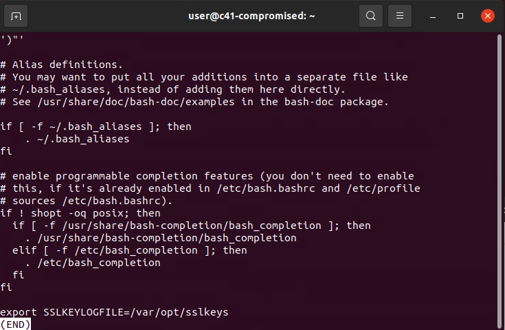

Browse or change directories to `/var/opt` and check the contents. There will be a file named `sslkeys.2022.09.09`, which corresponds with the date the packet capture was taken. You can view this file to see that it contains several keys.

You'll need this file on your Kali system to import into Wireshark, so `scp` the file over after giving your second network interface an address on the `64.100.100.100/24` network.

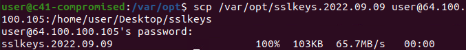

With the sslkey file in hand, go back to the Kali system and retrieve the packet capture file from https://challenge.us/files.

With the capture open in Wireshark, you could start by filtering for just TLS traffic, since we know the target traffic exists in TLS traffic based on the challenge instructions. Exporting the TLS traffic only to a new capture file will reduce the amount of chaff in the resulting file for easier analysis, though this is entirely optional.

To import the ssl keys for decryption, go to Edit -> Preferences -> expand Protocols and then click on TLS. On this options screen, point to the sslkeys file you retrieved from the compromised system. The hint to this feature is in the pre-shared key reference in the guide. The top Internet search results for this topic will demonstrate how to use such a file with Wireshark.

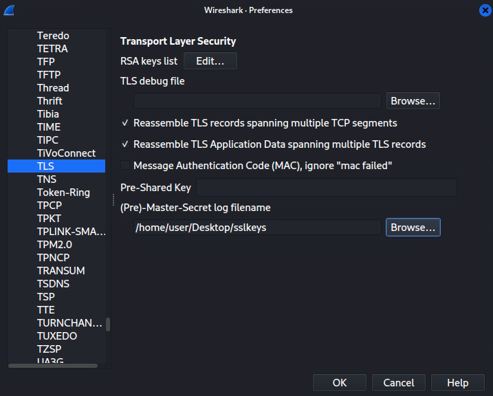

After clicking OK, the TLS traffic will be decrypted, and HTTP requests will now be visible in plain text. You are looking for a unique file download, one that was only retrieved once, and its source.

The simplest method for looking at the requested files is to go to File -> Export Objects -> HTTP, which are now visible due to the decryption process.

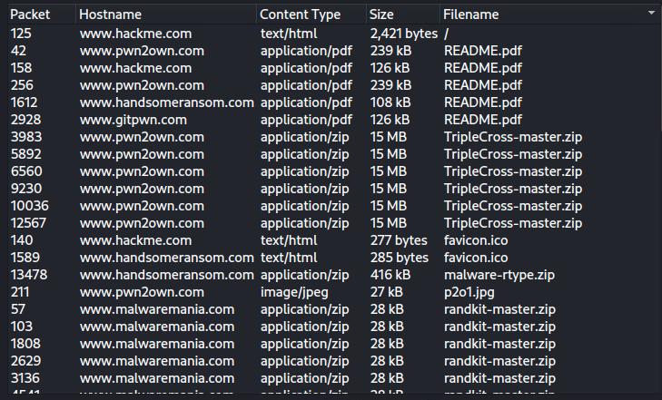

There will be several zip files downloaded throughout the capture with suspicious names as well as other files, such as PDFs. Only once will a file named malware-rtype.zip be requested. Note the domain/site name and then return to the packet capture to obtain the IP address of this domain/site for question 1.

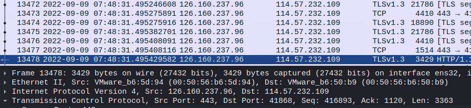

In this example, the source IP of the https/tls response is 126.160.237.96.

## Question 2

_What is the type and version/variant of the rootkit found on the compromised system?_

This question requires the competitor to use the provided malware variant sheet to cross reference malware behaviors to find the specific version of the malware installed on the compromised machine.

You can actually browse to this IP to see the site in question, and even retrieve the same file there. Note that the IP and the specific site used will be randomized for each deployment.

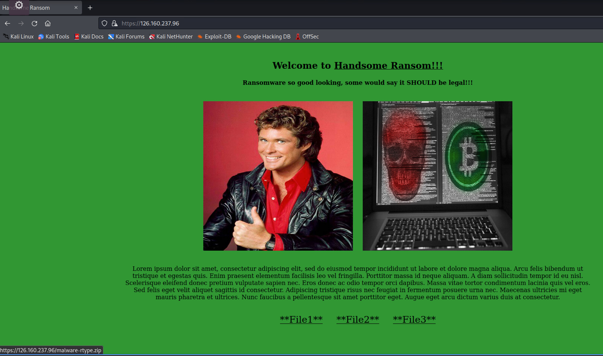

You can also extract the malware zip from the exported HTTP objects and save the zip to your local system for further analysis.

Looking into the zip, you will see the malware is a rootkit named Reptile. There is a README and other files present. You can use this name to find the rootkit files on the compromised system. Within these files is a hidden .config file that lists the unique port used for this variant of the rootkit.

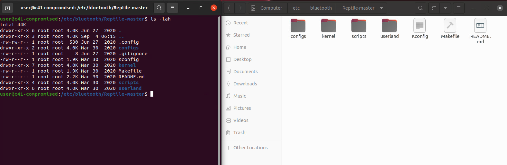

The Reptile-master directory will always be extracted somewhere in the /etc directory files, and while the name of the folder itself has been obfuscated, the same contents can be found with a simple filename search in the file explorer window, though you may have to try a few different options to find a unique file.

Once you find the hidden config file (.config) in the directory (using ls -lah for example), you will be able to determine the exact make and variant of the malware/rootkit from the list provided at https://challenge.us/files.

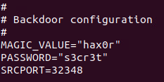

The type will always be the Reptile type, but the port will determine the variant in use. These answers combined are the submission for question 2.

## Question 3

_What is the token string provided by the challenge server for successfully removing the malware?_

This question requires the competitor to fully remove the malware from the compromised system, including removing a persistence mechanism.

The grading page at https://challenge.us will tell players exactly what must be done in order to receive credit for recovering from and mitigating this malware's presence.

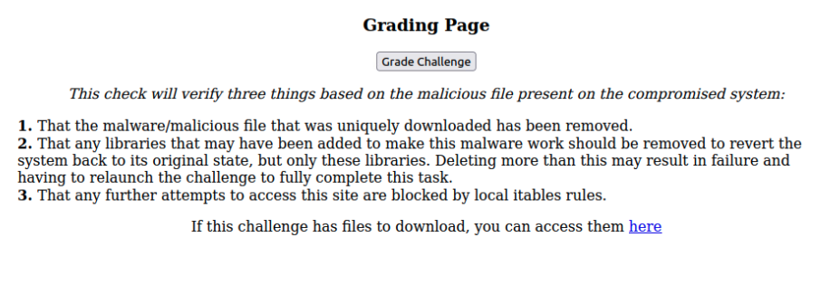

Players must remove the rootkit folder from the system, remove any libraries that may have been added for this rootkit to work, and then block access to the offending site.

Simply deleting the Reptile-master obfuscated folder from the /etc/xxxx directory of the system to complete task 1 would suffice, however, there is a service being run that will copy an obfuscated backup of the rootkit zip back to the same directory. You will also need the information from the README file to complete task 2, so it is a good idea to check that first, or retrieve a copy on your Kali system.

In order to remove the persistence, do the following:

  - Find the service file that is running with a somewhat obvious name, though this service is used as a timer, not a running service.

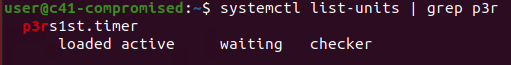

 - Therefore, you will have to search the contents of /etc/systemd/system to find the timer, the associated service file, and what it is doing.

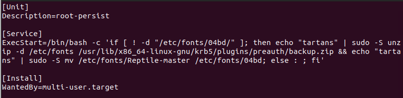

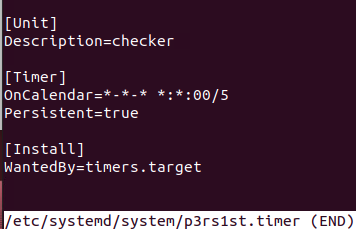

 - Optionally, stop/disable/remove the service, as it could put a lock on the backup zip itself.

 - Finally, find the backup zip in
"/usr/lib/x86_64-linux-gnu/krb5/plugins/preauth" and also remove it.

This will allow you to pass the check. You cannot pass the check until both copies have been removed.

Next, look into the README file of the rootkit, either on the system, or by viewing the copy of the files on your Kali system (either by downloading it from the site, or extracting it from the pcap).

The noted libraries are build-essential, libncurses-dev, and linux-headers-\$(uname -r). Simply remove this with apt: `sudo apt remove build-essential libncurses-dev linux-headers-$(uname -r)`.

Note that the grading check will validate that you have only removed these libraries and not others. If you remove too many, the check will fail, and you may have to relaunch the challenge in order to fully complete this task. Optionally, players may remove the "make" library as well, but this will still keep the total number of libraries within the threshold total of 1500, which can be checked with `sudo apt list --installed | wc -l`.

If you fail to delete all three of these specific libraries, the check will also fail.

Lastly, create an IP tables rule to block access to this site: `sudo iptables -A OUTPUT -d 126.160.237.96 -j DROP`. You could also add a corresponding input rule or other rules that would achieve the same result. You cannot simply turn off networking or change the IP address of the system, as this will cause the check to fail.

Once all tasks have been completed, the grading page will provide the token for submission.

## Question 4

_What is the flag/token recovered from the decrypted contents of the ransomware encrypted files?_

This question will have the competitor use the ransomware's decryption program and a key file in order to decrypt the files that were encrypted by the malware.

On the compromised system there are files on the Desktop, one of which is a ransom notice. The others are not legible in their current form. The notice points you to a website to pay the ransom in order to recover the decryption key and encryption program used.

The website seems to be asking you to pay, and the information you need is only available once you do. However, viewing the page source shows that the program and the decryption key may have been exposed.

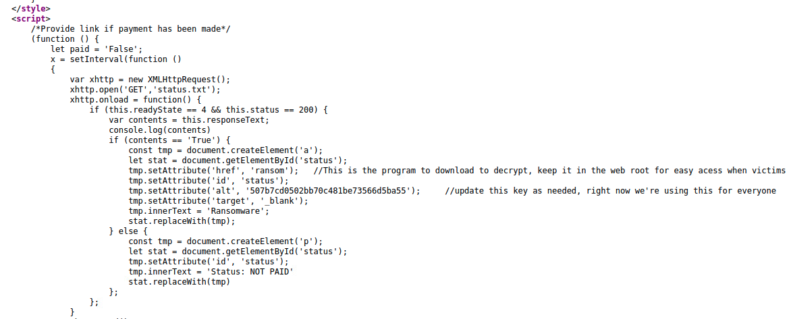

Browsing to https://105.217.108.5/ransom will get you the program used to decrypt the files. The decryption key file will also be listed in the page source code. The key file contains 100 possible keys and the required key is randomized on each deployment and inserted into the overall list. Copy the contents of the ransom script to a file on your local system and ensure it has permissions to execute (e.g. a file named "decrypt").

You can use this program however you see fit, either by using it as is and passing each possible decryption key/password into a file named "pwd" or by simply running the same commands as to what is in the program.

To run the script as is, place the encrypted files into a directory of their own (else you risk running the decryption process against every file in the locally run directory), add the decryption key/password into a file named "pwd" in the same working directory as the program or script and run the following command:

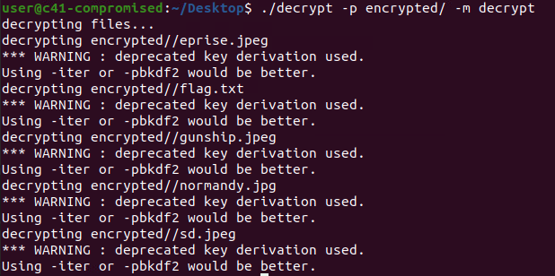

You will need to script adding all possible keys to the pwd file and then attempt to decrypt the files on the compromised system's desktop.

```
#!/bin/bash
file=decryptioncodes
while IFS= read -r line
do
        printf "%s\n" "$line" > pwd
	./decrypt.sh -p encrypted/ -m decrypt
	mv decrypted/flag.txt  output/flag-$line.txt
done < "$file"

cat output/flag-* >> allfiles
```

The above script would iterate over each line or code in the decryptioncodes file and attempt to decrypt the files in encrypted/ with that key. After each attempt is made, the resulting file is moved to an "output" folder. Once all decryption codes have been attempted, one final command will combine these output files into a single file. Since only one of these decryption processes would have produced results, the contents of the "allfiles" file would be the token for submission. Additionally, the only resulting flag-$line file with a non-zero size would also contain the token.

Once the files have been decrypted the text file will include the flag for the final submission.

## Appendix

Answer combinations based on index value retrieved at deployment are as follows:

  |Index Value  | Web/Site IP   |   Malware Variant/Port|
  |-------------|---------------|-----------------------|
  |1             |79.120.250.109   |Epsilon/32348|
  |2             |126.160.237.96   |Rho/33596|
  |3             |87.188.4.219     |Phi/15004|
  |4             |116.128.127.86   |Sigma/26470|
  |5             |93.159.88.4      |Theta/41902|


The rootkit files will always be downloaded to one of the following directories at random:

/etc/cups
/etc/Bluetooth
/etc/calendar
/etc/fonts
/etc/hp
/etc/ghostscript
/etc/firefox
