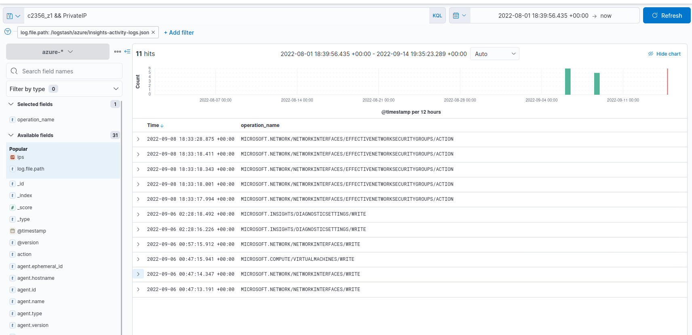

# Revelations are Found in Clouds

_Solution Guide_

## Overview

This solution guide covers the walk-through and is organized by submission question.

## Answer Quick Reference

The correct answers are provided here for your convenience.

1. Larry Jones  
2. spaceshipdata  
3. 10.0.0.6  
4. 12


## Getting Started

1. Login to the `sof-elk` VM, create a directory and mount the provided ISO image to that directory.

```bash
sudo mkdir /mnt/evidence
sudo mount /dev/cdrom /mnt/evidence
```

2. In order to ingest logs into the `sof-elk` tools (e.g., logstash, kibana, etc.), you must consolidate the json log files into a single log file for ingesting. 

```bash
find /mnt/evidence/insights-activity-logs -type f -name "*.json" -exec cat {} + > insights-activity-logs.json
find /mnt/evidence/insights-logs-auditlogs -type f -name "*.json" -exec cat {} + > insights-logs-auditlogs.json
find /mnt/evidence/insights-logs-signinlogs -type f -name "*.json" -exec cat {} + > insights-logs-signinlogs.json
find /mnt/evidence/insights-logs-storageread -type f -name "*.json" -exec cat {} + > insights-logs-storageread.json
find /mnt/evidence/insights-logs-storagewrite -type f -name "*.json" -exec cat {} + > insights-logs-storagewrite.json
```

3. Import logs into logstash by copying them to the logstash directory.

```bash
cp ~/*.json /logstash/azure/.
```

4. You can check to see if the logs were loaded into logstash successfully by using the following command: 

```bash
sof-elk_clear.py -i list
```

The output of this command will show how many log entries are currently loaded. (The number should increase after you import more logs).

---
## Question 1

_A user's credentials may have been compromised. What is the name of that user?_

1. After logs are imported, visit Kibana from the `cloud-analyst` VM by navigating to `http://sof-elk:5601` in a web browser. Click on the 3 bars in the top right of the web page, and select `Discover`. Use the dropdown to select viewing `azure-*` logs and adjust the date range in the top right to view all of the Azure logs. 


2. Apply a filter to only see `signin` logs (click the blue `+` button next to the appropriate log name).


3. From the `Available Fields` list, select `source_ip` and `authentication_details.succeeded`. Doing so will allow you to only see the fields we are interested in. 


4. Viewing these filtered logs, we can see many failed login attempts from the IP address `172.58.190.159` followed by a successful login attempt.  This shows the attacker performing a password spraying attack, then finding credentials to an account.  Keep note of the attacker's IP address.


5. Expand the details from the successful login to find that the user Larry Jones was compromised.


Submit the answer `Larry Jones` for Part 1.

--- 
## Question 2

_What is the name of the blob container from which the unauthorized user using stolen credentials downloaded a file?_

1. Clear all filters and selected fields from the previous step. To view logs related to downloading from Blob Storage, use the same process as before to filter logs from the `insights-logs-storageread.json` file.  
2. Select the `ips`, `property_accountname`, and `operation_name` fields. These fields will show the ip addresses, blob container name, and type of operation, respectively.   
3. You can further filter the logs to only show those generated by the attacker's IP address by using a Kibana Query Language (KQL) filter in the top bar: `ips: 172.58.190.159`.


The `GetBlob` operation is logged when downloading files from the blob container. Based on these logs, the storage account from which the user downloaded a file is `spaceships`. The Blob Container where the file was downloaded from is inside of that storage account and can be found by looking at the URI log property. In this case, the URI property looks like this: 

```
https://spaceships.blob.core.windows.net:443/spaceshipdata/important.zip?sv=2021-06-08&ss=bqtf&srt=sco&sp=rwdlacuptfxiy&se=2022-09-07T01:01:16Z&sig=XXXXX&_=1662483677168
```

`spaceshipdata` is the blob container from which the file was downloaded. 

Submit the answer `spaceshipdata` for Part 2. 

---
## Question 3

_What is the private IP address of the Linux virtual machine that was created most recently in the subscription?_

1. Clear all filters and selected fields from the previous step. To view logs related to virtual machine creation, use the same process as before to filter logs from the `insights-activity-logs.json` file. Use the KQL search bar to search for `Linux`. The logs show operations related to VMs where the log entry contains the word "Linux." 


2. Expand the details for the most recent log operation of `MICROSOFT.COMPUTE/VIRTUALMACHINES/WRITE` - this is a VM creation event.  The `response_body` field will show all of the details related to the VM. Copy the networkInterface Id (highlighted in blue) - `c2356_z1`


3. Update the search query to search for : `c2356_z1 &&  PrivateIP`. This will show only logs related to that NetworkInterface which also contain the word `PrivateIP`.  



4. The 2nd log from the bottom will contain the Private IP address of the VM in the `response_body` field. 


Submit the answer `10.0.0.6` as the answer for Part 3. 

---
## Question 4

_Based on the Azure netflow logs, how many times did an SSH flow with the attacker's IP address as the destination begin?_

For this question we can avoid importing the netflow logs into sof-elk. The Azure netflow logs in `/mnt/evidence/insights-logs-networksecuritygroupflowevent/` will contain the netflow records of interest. This file is formatted as a single line of json. Using knowledge of [Azure Netflow Tuples](https://docs.microsoft.com/en-us/azure/network-watcher/network-watcher-nsg-flow-logging-overview), we can craft a one-line command that will find the number of tuples which denote the beginning of an SSH flow with the attacker's IP address. 

    The one-liner below will:   
    1. List files which contain flow tuples matching these conditions:  Attacker's IP address, port 22, TCP traffic, Outbound Flow, Traffic Allowed, Flow Beginning.
    2. Display the contents of the files containing matches.
    3. Convert the single line of json into json "pretty print." This allows us to have 1 pattern match per line in the file.
    4. Search for the pattern again and display the lines which match.
    5. Count the number of matches that was found. 

```bash
grep -l -r -P "172\.58\.190\.159.*22,T,O,A,B" /mnt/evidence | xargs cat | python3 -m json.tool | grep -P "172\.58\.190\.159.*22,T,O,A,B" | wc -l
```

The output of this command will show that 12 flows destined for SSH on the attacker's IP address began. 

Submit `12` as the answer for Part 4. 
