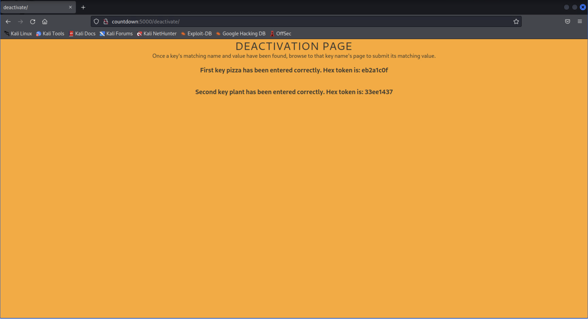

# Tick, Tock Mr. Wick

*Solution Guide*

## Overview

For this challenge there are three (3) tasks that need to be completed to solve the challenge within a certain timeframe to earn the maximum amount of points available.

Before attempting to find the keys needed to deactivate the countdown, you need to find the hidden pages within the site. Use the tool `nikto`. The command is:

```bash
nikto -h countdown:5000
```

Once it finishes, it will show that some pages have been found and also explain that the "robots.txt" file contains entries which should be viewed manually. This file is normally found on many sites, and can be viewed by running the command:

```bash
curl countdown:5000/robots.txt
``` 

Doing this will show that the site has been configured to allow all User-agents to look at the pages `/deactivate/`, `/connect/`, `/authorized/access/only/`, and `/app/status/`. This should be the first steps to working towards finding the deactivating keys.

## Task 1: Authorized Access Only key (Question 1)

*What is the 8 character hex string given for submitting the first key?*

Begin by browsing to the page `countdown:5000/authorized/access/only`. It will give you a page saying that the requested access has came from an unauthorized source. It also states that the authorized link can be found on the `%2Finternal%2Fuse%2Fonly%2f` page. The `%2F` should be a hint that the URL is encoded, which should lead you to browse to the page: `countdown:5000/internal/use/only/`.


This page shows you two small strings, one being `Mod of the day` and the other being `Chosen remainder`. This is a hint that you will need to submit a number somehow that when modded by the value shown will give you the remainder amount shown.


The next hint is the title of the page that is shown on the browser tab. The title is shown as `Infinite URL Builder: Locked`. Attempt to add values to the end of the url and see what the outcome is.


After some testing, you should find that the number you are entering to be modded is being based on the length of the URL added after `/internal/use/only/`. This is why its called the `infinite URL Builder` because the URL can be any length, but it just needs to satisfy the math equation in order to unlock the page. 

For example:

Mod of the day: 21
Chosen remainder: 18
URL entered: countdown:5000/internal/use/only/this/is/a/example/url/string/entry/solution/key

If done correctly, a page will show with a link saying `AUTHORIZED ACCESS ONLY` which will then take you to the `countdown:5000/authorized/access/only` page but it will now be showing the first key name and value. 


Enter the found key name into the url like so, `countdown:5000/deactivate/*KEYNAME1*/` and it will take you to a page where you can submit the value you found. Once entered correctly, it will redirect you back to the main deactivation page.


Once the key has been submitted and deactivated, you can find the hex token to be submitted for points here `http://countdown:5000` and here `http://challenge.us`.


## Task 2: Form POST SSTI (Question 2)

*What is the 8 character hex string given for submitting the second key?*

You should look to browse to the URL found previously, `http://countdown:5000/app/status/`. This page will give a brief message about the running application and then state that you can `Enter 'data' field value to get information about application`. 


Since there is no text box available, the next thought should be to attempt a POST using the field 'data' with an accompanying value. If you attempt to POST a value using URL parameters, you'll see that it will have no effect on the page. The next thing you should try is to do a Form POST, this can be done with Curl.

The page states you can get information about the application, that should be a hint that you can run an SSTI (Server Side Template Injection) to pull info from the running application within this POST.

You will find that the application is limited to what information can be pulled, but if you used the following command you can get the basic configuration:

```bash
curl -X POST -F "data={{config}}" http://countdown:5000/app/status/
```

This will dump out all the current apps configuration, and if you look you will find there is an entry that contains the information regarding the second key. 


Using the same format as before, go to the second keys page (`countdown:5000/deactivate/*KEYNAME2*`) and enter its value to deactivate it.


Once the key has been submitted and deactivated, you can find the hex token to be submitted for points on the `http://countdown:5000` page as well as on the grading site at `http://challenge.us`.



## Task 3: Online FTP share (Question 3)

*What is the 8 character hex string given for submitting the third key?*

For the last part, you will need to browse to the page `countdown:5000/connect`. This page will have a text box and a string asking for you to input a hostname for you to connect to their FTP share. If you do a scan of the network you will find there is another host named `countdownBackup`. 


Once you enter the discovered hostname you will be re-directed to another page that will have a list of files available on the FTP share. On that page you will see multiple files are clickable and available for download, except for one. 


In order to get this file, you will need to do some analyzing of the HTML page and altering of the URL. If you look at the source code of the page, you will see each hyperlink contains a URL redirect where it adds `/**file**` to the URL in order to retrieve it. 


You can then use this same method to get the file that is currently unavailable. Below is an example of the URL:

`http://countdown:5000/connect/**file**` -- Where **file** is the name of the file you want to download.


If done correctly, you will have the key name (which is the name of the file) and then the value (which is within the file you downloaded).


You can submit the key name and value using the same method as previously noted to fully deactivate the timer.


Once the key has been submitted and deactivated, you can find the hex token to be submitted for points on `http://countdown:5000` and at `http://challenge.us`.


## Getting Time Tokens (Remaining questions)

Once all three keys have been entered, browse to `http://challenge.us` and, depending on how fast you completed the challenge you will be given your hex tokens to submit for points. Here is a reminder on how that's measured: 

| Completion Time  | # of Tokens Earned  |  % of Overall Challenge Score Added   |
|-------------|-----------|-------------|
|  75 minutes or less | 4 | 20% (5% each) |
|  76-90 minutes | 3 | 15% (5% each) |
|  91-105 minutes | 2 | 10% (5% each) |
|  106-120 minutes | 1 | 5% |
|  more than 120 minutes  | 0 | 0% |


