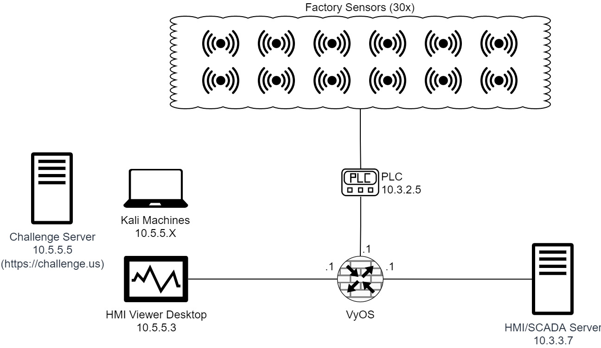

# Made in America

It is time to put your red team and blue team skills to the test for our red, white, and blue. Attack and protect this factory. 

**NICE Work Roles** 

- [Cyber Operator](https://niccs.cisa.gov/workforce-development/nice-framework/work-roles/cyber-operator)
- [Vulnerability Assessment Analyst](https://niccs.cisa.gov/workforce-development/nice-framework/work-roles/vulnerability-assessment-analyst)

**NICE Tasks**

- [T0567](https://niccs.cisa.gov/workforce-development/nice-framework/tasks/t0567) - Analyze target operational architecture for ways to gain access.
- [T0696](https://niccs.cisa.gov/workforce-development/nice-framework/tasks/t0696) - Exploit network devices, security devices, and/or terminals or environments using various methods or tools.
- [T0724](https://niccs.cisa.gov/workforce-development/nice-framework/tasks/t0724) - Identify potential points of strength and vulnerability within a network.

## IMPORTANT

This challenge does not have any downloadable artifacts. You may complete this challenge in the hosted environment.

## Background

You have been deployed to a critical manufacturing plant. This factory builds laptops. Intel states that this factory is a high-target for adversaries. You must hack your way into viewing the Human Machine Interface (HMI) and turn off nine (9) Programmable Logic Controller (PLC) values to shut down the factory assembly line. Once you do, you must restore the PLC values and secure/protect the factory with the VyOS Firewall to ensure others cannot perform the same righteous attack.

## Topology

## Getting Started

- **Question 1:** Hack your way into the trusted network and view the HMI web console at `http://10.3.3.7:80/scada`.
- **Question 2:** Turn off the PLC power for Stages 2 through 10. Check the status of this task at `https://challenge.us` from a gamespace resource. 
- **Question 3:** Restore all PLC power and ensure no unauthorized devices can manipulate PLC values. Only the HMI Server is authorized to do this! Do not lock the HMI server out. Check the status of this task at `https://challenge.us` from a gamespace resource

The status of Tasks 2 and 3 can be checked by visiting `https://challenge.us` from a gamespace resource.  It may take up to 60 seconds to receive grading results. 

## Note
**The `10.5.55.0/24` network is used for grading.** Any alterations or interference of this network is unauthorized and will result in the inability to award points for this challenge. Your VyOS VM is not attached to this network and VyOS firewall rules will not impact grading.

## Challenge Questions

1. View the HMI web console. What is the name of the ninth stage? (E.g., the name of the first stage is Circuit Board Printing)  
2. What is Token 2 provided from https://challenge.us?  
3. What is Token 3 provided from https://challenge.us?
