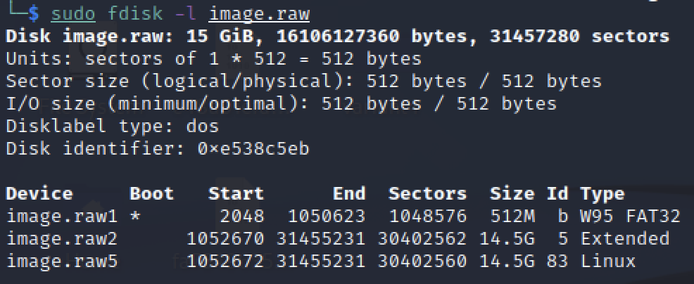
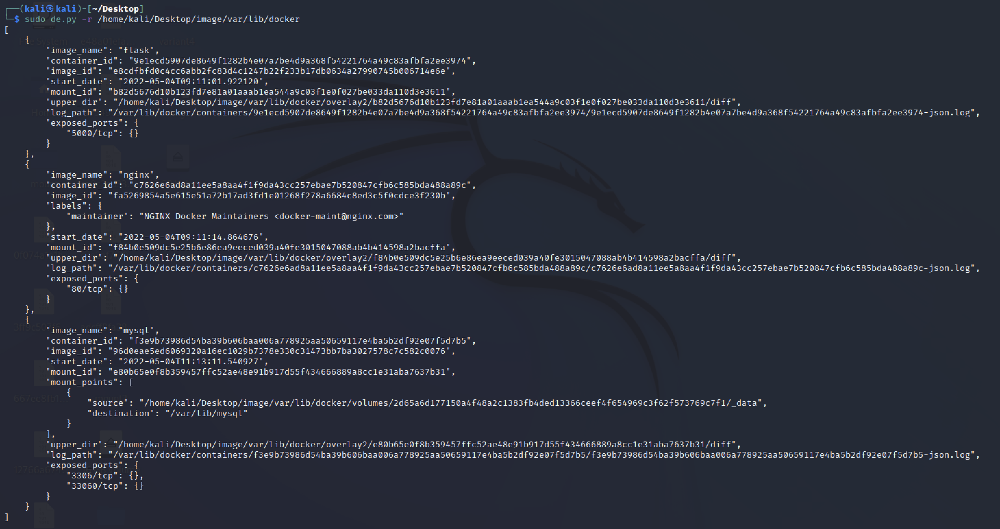
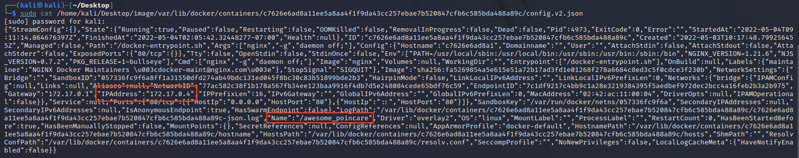
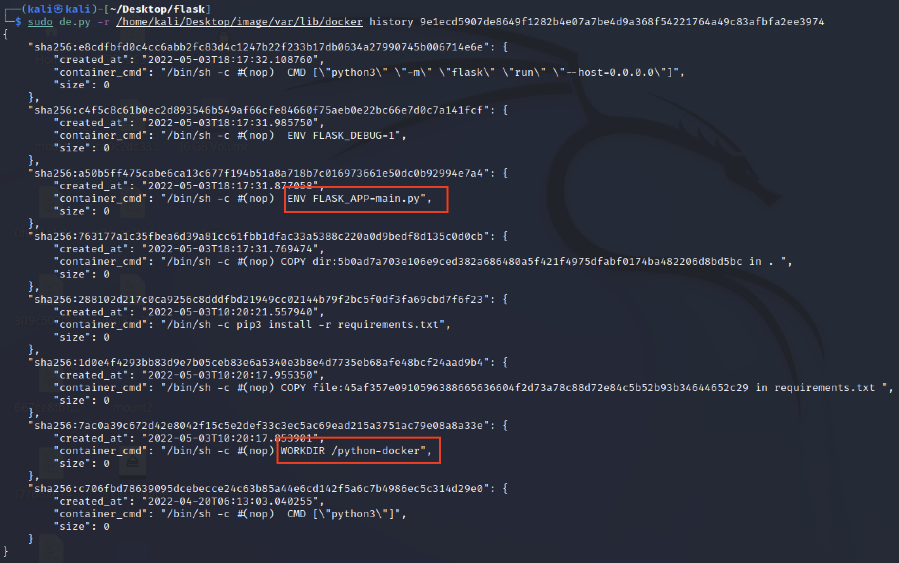
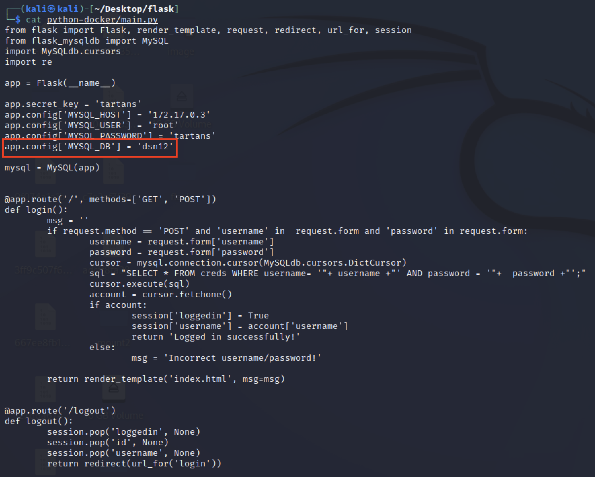
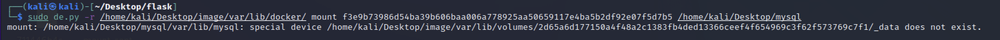
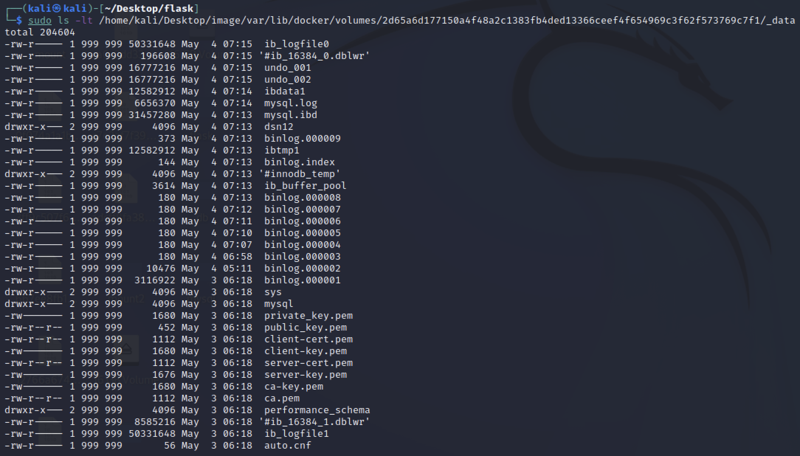
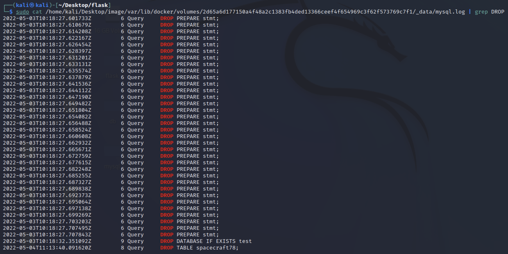
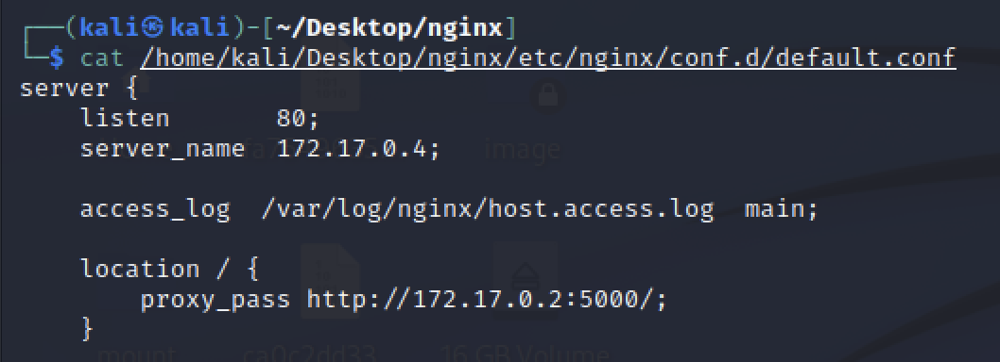
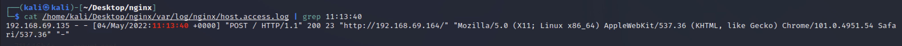

# Docking Ship

_Solution Guide_

## Overview

In this challenge, we will analyze the forensic image to determine why the spacecraft and antennas are unable to communicate with each other. There are four possible variants for this challenge. This solution guide covers the walk-through for variant #1, organized by submission question. The steps used to solve all variants will be similar, but the answers will vary.

## Getting Started

The following commands will help you get started with the challenge.

Unzip the forensic image:

```
bash
sudo unzip /media/cdrom0/image.raw.zip -d ~/
```

Verify the partitions on the image:

```
bash 
sudo fdisk -l image.raw
```



Please note that the Linux partition begins at 1052672 sector. To find the byte offset of this sector, multiple it by 512. Byte offset will be 538968064.
 
Mount the image:

```
bash
mkdir /home/user/Desktop/image
sudo mount -o offset=538968064 image.raw /home/user/Desktop/image 
ls /home/user/Desktop/image
```

As you may have noticed from the questions, there are docker containers present in the image. We will use the `docker explorer` tool to analyze the image. The docker artifacts on a Linux system are present in `/var/lib/docker/` folder.

You may run the following command to see all different options available with docker-explorer:

```
bash
sudo de.py -h
```

## Question 1

_What are the first eight characters of the container ID of flask container?_

To find the container ID, run the following command:

```
bash
sudo de.py -r /home/user/Desktop/image/var/lib/docker/
```

 

As can be seen in the screenshot, there are three containers running on the system. The `container_id` of the flask container can be found here.

## Question 2

_What is the name of nginx container?_

To find the name of the nginx container, grab the container_id of the nginx container from the previous screenshot, and then navigate to that container in the file system.

```
bash
sudo cat /home/user/Desktop/image/var/lib/docker/containers/c7626e6ad8a11ee5a8aa4f1f9da43cc257ebae7b520847cfb6c585bda488a89c/config.v2.json
```

 

Name of the container is highlighted in the above screenshot. The IP address of the container is also highlighted.

## Question 3

_What is the name of the database that the flask app connects to?_

To answer this question, let's mount the flask container:

```
bash
mkdir /home/user/Desktop/flask
sudo de.py -r /home/user/Desktop/image/var/lib/docker/ mount 9e1ecd5907de8649f1282b4e07a7be4d9a368f54221764a49c83afbfa2ee3974 /home/user/Desktop/flask
```

The guid in the above command is the container id for flask container.

Navigate to the mounted location:

```
bash
cd /home/user/Desktop/flask
ls
```

In order to figure out where is the flask app within this mounted location, let's review the history of the container:

```
bash
sudo de.py -r /home/user/Desktop/image/var/lib/docker history 9e1ecd5907de8649f1282b4e07a7be4d9a368f54221764a49c83afbfa2ee3974
```

 

From the above screenshot we can see that the flask app is `main.py` in `/python-docker` folder.

Let's view the `main.py` script:

```
bash
cat /home/user/Desktop/flask/python-docker/main.py
```

  

From the screenshot we can see the database name that the app connects to.

## Question 4

_What is the name of the table that was deleted through SQL injection?_

For this question, let's analyze database logs.

Mount the database container:

```
bash
mkdir /home/user/Desktop/mysql
sudo de.py -r /home/user/Desktop/image/var/lib/docker/ mount f3e9b73986d54ba39b606baa006a778925aa50659117e4ba5b2df92e07f5d7b5 /home/user/Desktop/mysql
```

  

You'll notice that it throws an error. The problem is it is missing the folder `docker` in the path that it is try to mount. 

Let's manually navigate to that folder by adding docker in the path:

```
bash
sudo ls -lt /home/user/Desktop/image/var/lib/docker/volumes/2d65a6d177150a4f48a2c1383fb4ded13366ceef4f654969c3f62f573769c7f1/_data
```

 

`mysql.log` is the file that we need to review.

Review the file:

```
bash
sudo cat /home/user/Desktop/image/var/lib/docker/volumes/2d65a6d177150a4f48a2c1383fb4ded13366ceef4f654969c3f62f573769c7f1/_data/mysql.log
```

You'll notice that the log file is huge.

In order to find the info that we are looking for we can filter the log file. In mysql, the command to delete a table is `DROP TABLE <tablename>`. So, let's grep for the keyword `DROP`. 

```
bash
sudo cat /home/user/Desktop/image/var/lib/docker/volumes/2d65a6d177150a4f48a2c1383fb4ded13366ceef4f654969c3f62f573769c7f1/_data/mysql.log | grep DROP
```

 

In the output, you'll notice only one table that was deleted. It starts with `spacecraft`. Also, make note of the time when the table was deleted as this will be needed for Question 6. 

## Question 5

_How many records were present in the deleted table?_

To find the numbers of records present in the deleted table, we can grep the same log file for the `insert` keyword as the mysql command for adding records to the table is:

 `insert into <tablename> values (value1, value2, ...)`

```
bash
sudo cat /home/user/Desktop/image/var/lib/docker/volumes/2d65a6d177150a4f48a2c1383fb4ded13366ceef4f654969c3f62f573769c7f1/_data/mysql.log | grep insert
```

 

The answer is 6.

## Question 6

_What is the user agent string of the web request that resulted in deletion of the table?_

To answer this question, we can review the nginx reverse proxy logs. To do so, mount the nginx container:

```
bash
mkdir /home/user/Desktop/nginx
sudo de.py -r /home/user/Desktop/image/var/lib/docker/ mount c7626e6ad8a11ee5a8aa4f1f9da43cc257ebae7b520847cfb6c585bda488a89c /home/user/Desktop/nginx
```

The default location for nginx configuration file is `/etc/nginx/conf.d/default.conf`. Let's review that file.

```
bash
cat /home/user/Desktop/nginx/etc/nginx/conf.d/default.conf
```

     

As seen here the log file is saved at `/var/log/nginx/host.access.log`

Review the log file:

```
bash
cat /home/user/Desktop/nginx/var/log/nginx/host.access.log
```

In the log file you'll notice sqlmap being used. sqlmap is a tool used for SQL injection. In this log file, search for the web request that came at the time stamp you found in question 4.

```
bash
cat /home/user/Desktop/nginx/var/log/nginx/host.access.log | grep <ENTER TIMESTAMP>
```

 

As seen in the screenshot, the request came from 192.168.69.135 and the user-agent is `Mozilla/5.0 (X11; Linux x86_64) AppleWebKit/537.36 (KHTML, like Gecko) Chrome/101.0.4951.54 Safari/537.36`
