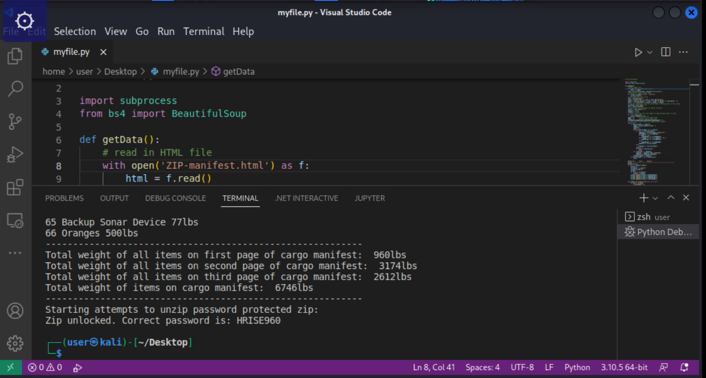
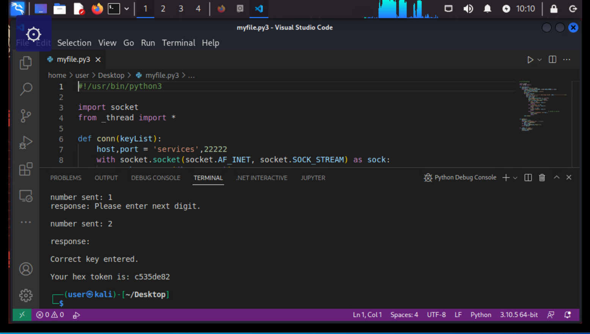
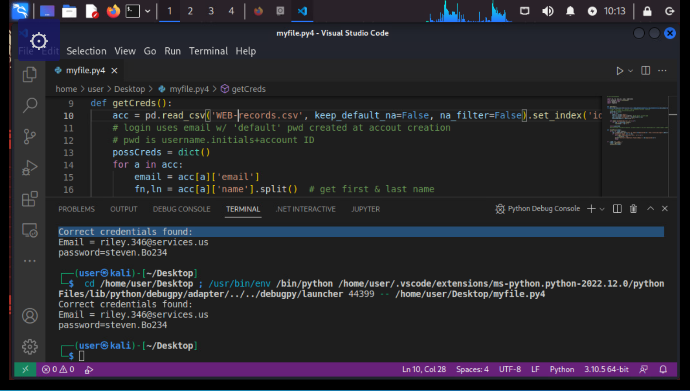

# Look at me, I'm the Captain Now

*Solution Guide*

## Overview

There are five tasks that must be completed to get all points available. The walk-through in this solution guide is organized by task/question. Gain access to the following services/files to answer the questions:

- Zip file
- TCP server
- Website 
- SMB share
- FTP server

Once you complete each task, you are presented with a token in the form of an 8-digit hex string. Below are methods that can be used to complete each task, organized by question.

Get started by visiting `https://challenge.us` inside of the challenge environment to download all required files. Analyze these documents and begin to work on extracting the credentials. 

## Question 1

*What is the 8-digit hex string extracted from the zip file?*

The `plans` file explains that the zip file passwords were generated by the attacker by using a specific method against the `manifest.html` document. The manifest document contains a list of items on the ship along with their total weight. The method they used to create the password was:

>...You will need to get the total weight of items on page 1, page 2, and page 3 separately. From there determine the total weight of all these added together. Then choose a random cargo item on the list, and get its initials. With this information, the password will then be created by concatenating the initials of the item chosen along with one (1) of the four (4) weights found.

Since you don't know what combination of initials + weight was used, you will need to generate all possible combinations and test them against the zip file. 

An example solution that handles the whole process (generating the password list and brute forcing the zip file password) is provided in the script [zipcreds.py](./solution_scripts/zipCreds.py).

The script begins by reading in all the data from the HTML page and discarding all unimportant strings. Isolate each item and store its initials. Get each item's weight and begin adding their values as mentioned to get the four (4) different values. Next, concatenate all possibilities of each items initials + one (1) of the weights mentioned until all password possibilities are created and stored in a list. This can be seen in the `getData()` function. 

The password list is saved and passed to the `bruteForce()` function that loops and attempts to unlock the zip using each password. It quits when the correct password is found. The file within the zip contains a token hex string.



## Question 2

*What is the 8-digit hex string from accessing the TCP server?*

The `plans` file explains that the TCP server's new keys were generated by using a specific method against the `encodedKeys.txt` document. The original document contained a list of rotating keys that were to be used by the TCP server. The method they used to create the password was:

>...set the TCP Servers accepted key to a random key in the list. Once done, take all the keys and encode them using any format you see fit. Once done, concatenate all the strings together. Its a big list of keys so even if they figure it out it'll take them a while to re-gain access.

Once you analyze the `encodedKeys.txt` file, you should find that each key was converted to either `hex` or `oct`. From here you will need to convert each key using the correct method and try each one. 

As an example solution, there are two (2) Python scripts provided that handle the process: [tcpKeyDecoder.py](./solution_scripts/tcpKeyDecoder.py) and [TCPClient.py](./solution_scripts/TCPClient.py).

1. The [tcpKeyDecoder.py](./solution_scripts/tcpKeyDecoder.py) script handles reading in a string of encoded keys, separating them, and then decoding them using the correct corresponding function. Once all keys are decoded, they are written to a new file `decodedKeys.txt` which will be used in the [TCPClient.py](./solution_scripts/TCPClient.py) script.
2. The [TCPClient.py](./solution_scripts/TCPClient.py) script handles the connection to the TCP Server. It reads the `decodedKeys.txt` file to get all possible keys. The server expects keys to be submitted one (1) digit at a time, so the [TCPClient.py](./solution_scripts/TCPClient.py) connects to the server and begins looping over each key submitting it in the correct format. 

Once it finds the correct key, the server will respond with the token for this challenge and the script will print it. 



## Question 3

*What is the 8-digit hex string from accessing the website?*

The `plans` file explains that the website's new credentials were generated by the attacker by using a specific method against the `records.csv` document. The original document contained a list of all accepted user accounts. The method they used to create the password was:

>...choose a random account from the list. This account's email will be the username of our new account. For the password, take the username of the selected account, concatenate a '.' followed by their initials. Finally, concatenate their account ID to the end of it.

Since the account chosen is unknown, and the list of users is large, create a Python script to handle parsing and creating all the possible credentials. An example can be viewed in the provided file [websiteCreds.py](./solution_scripts/websiteCreds.py).

This script reads in the CSV file, as a dictionary object, with each user stored as an entry and the ID as the index. It loops over all entries and concatenates the required information. All possible creds are stored in the file `possCreds.txt` as a backup. The credentials are then used in a loop that runs a `curl` to the websites login page and iterates over all the possible credentials found--storing the output of the websites response. 

Once the correct credentials are found, they are written to a new file `correctCreds.txt` and printed to terminal. You can browse to the website via Firefox. If you login using the credentials found, you are taken to a page that contains the token for this question.



## Question 4

*What is the 8-digit hex string from accessing the SMB share?*

The `plans` file explains that the SMB server's new credentials were generated by the attacker by using a specific method against the `shipInfo.txt` document. The method they used to create the password was:

>**Username:** Grab the first four(4) letters of any of the section names in the document. From here, concatenate the value of the highest number + lowest number found in that same sections information.
>
>**Password:** Grab the last four(4) letters of any of the section names in the document. From here, concatenate one(1) number found in the document to it. The choice of number is up to you.`

Due to the size of the document, create a Python script to handle parsing and creating a list of all the possible credentials. An example is provided in the file: [smbCreds.py](./solution_scripts/smbCreds.py).

This script reads the document into a dictionary and iterates over it to check if a section name is found. If a section name is found, it stores all the following strings as one (1) until another section name appears. Once another section name is found, it stores the current section with all of its following text into a new dictionary. 

Once all the information is stored in the new dictionary, a new loop starts that iterates over every word in each section and stores all the values of numbers found. The code does all the math required for each section as it goes and stores all the possibilities. Once completed, it loops through all the numbers found and stores them in their own list.

Using the information now stored, it concatenates all possible credential combinations and writes into the file `possCreds.txt` in a special format that is used by the program `medusa` to brute force the login and find the correct credentials.

Below is an example bash command that will connect you. You will need to substitute the username into the command and follow up with the password found.

```bash
    smbclient //services/admin -U *username*
```
Once you log into the SMB share using the credentials, you will find a file that contains the token for this task. 


## Question 5

*What is the 8-digit hex string from accessing the FTP server?*

The `plans` file explains that the FTP server's new credentials were generated by the attacker from data contained in the `crew.xlsx` document. The method they used to create the password was:

>Select a random position/role. Next, select the longest word in any one of the descriptions that exist. It can be the longest word from the Captains description, or the longest word from the Stewards description, its your call. Lastly, add together the number of crew members per department and then subtract the number of members that the department has of the role/position you selected. Once done, concatenate them all together and you have your new password. 

An example Python script that handles parsing the data from the multiple sheets and creates all the possible credentials can be viewed in the provided file [ftpCreds.py](./solution_scripts/ftpCreds.py).

This script reads in each sheet from the XLSX file as its own dictionary object. It iterates over the first sheet's info, pulls out all the position names, and documents the longest word found in each position's description. 

Next, it iterates over the second sheet's data getting the total number of crew members on board.

Lastly, it loops over all the possible positions and concatenates every possible combination of words with the value of the total crew minus (-) the crew for the department of the position/role chosen.


When complete, it stores all the possible credentials into a file, then begins brute forcing FTP using `hydra` against the file containing all the possible credentials. The command used to brute force using the credentials file is: 

```bash
hydra -t 32 -C possCreds.txt services ftp 
```

Once the correct credential set is found, use them to connect to the FTP site and you will find the `flag.txt` file that contains the token for this task.

```bash
ftp services
<enter username>
<enter password>
get flag.txt
exit
cat flag.txt
```
