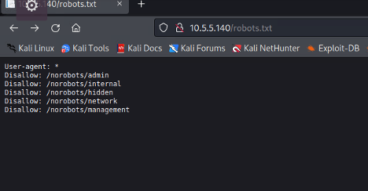
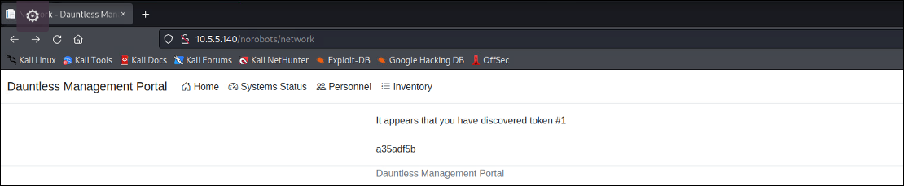
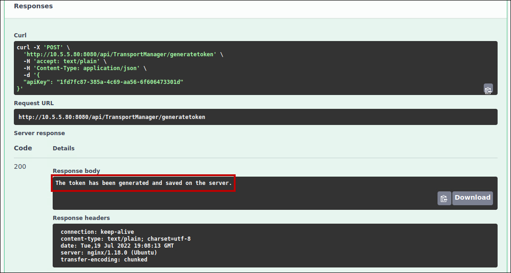

# Now You're Thinking with Portals!

_Solution Guide_

## Overview

_Portals_ is an infinity-style challenge—a random solution is generated during challenge deployment. This solution guide covers the walk-through of how to solve it, organized by submission token. The steps used to solve all challenge instances are similar, but the answers will vary.

To begin the challenge, browse to `http://thedauntless.us` from the provided Kali machine and login with the credentials shown below.

**username:** rwilco

**password:** sanitation

## Token 1

To retrieve Token 1, you need to find the correct path, listed in the **robots.txt** file. Browse to the Dauntless Management Portal web server at `10.5.5.140` and review the **robots.txt** file. Notice that there are five hidden folders.



When reviewing these folders, you'll find the first token in `10.5.5.140/norobots/network`:



## Token 2

Token 2 is obtained through a SQL injection attack on the personnel page: `10.5.5.140/Home/Personnel`.

In the search box, enter: `' or 1=1;` . Token 2 is shown at the top of the page.


Scrolling down the page, you will see this record: **Emily Sherman** | **esherman** | **CreateUser**. Note that this is the only user displayed in bold and the only user with the CreateUser role. This is a hint that getting access to this account could be useful later in the challenge.


## Token 3

To obtain Token 3, you need to change the value of the `showChallengeToken` query string parameter. Navigate to the **Inventory** page and note the URL: 

`http://thedauntless.us/Home/Inventory?itemCount=0&searchEnabled=True&paramCount=50&showChallengeToken=False&shipName=dauntless`


Looking at the query string parameters, users might be interested in the obviously named parameter `showChallengeToken`. Change the value of `showChallengeToken=False` to `showChallengeToken=True`. Token #3 is now visible.


## Token 4

To obtain Token 4, users will need to perform a series of steps to create a new user account with admin privileges.

First, we need to crack the password of the **Emily Sherman** (esherman) account found above in the Token 2 section.  Using **Hydra** is one way to do this.

1. Log out of the Dauntless Management Portal. We will attempt to crack the password for the **esherman** account which has **CreateUser** permissions in the management portal.
2. Find the login type by opening the Firefox DevTools on the management portal page (select **Application Menu**, **More tools**, **Web Developer Tools**).
3. In the **Developer Tools** frame, select the **Network** tab.
4. Attempt to login. Note the site uses the `POST` method to send the credentials.


5. Next, with the `POST` selected in DevTools, click **Resend** (on the right) then **Edit and Resend**. This opens a new request. Under the **New Request** pane, scroll until you see the **Request Body**.  This shows the format of the Username and Password being sent in the request.
6. The final piece of information you need is the error that an invalid login returns, which is: `Invalid login credentials`.
7. The command you will use for Hydra to brute force the password using this information is:

```bash
sudo hydra -l esherman -P /media/cdrom0/wordlist.txt 10.5.5.140 http-post-form "/Home/Login:Username=esherman&Password=^PASS^:Invalid login credentials"
```

You can use the `-t` *n* switch on the command to make it run faster where *n* is number of threads.  `-t 64` is the max value and will cut down the time to under a minute.

> **Note:** The `-P /media/cdrom0/wordlist.txt` portion of the command corresponds to the provided password list the challenge description alluded to having been used in the development process.


8. Log into the management portal with the username `esherman` and the password `undaunted`. You will now see a **Wiki** tab indicating there is an API on the same network somewhere. As `esherman`, the *only* user who can create accounts on the management portal, use Burp to create a *new* user with administrator privileges.
9. Open **Burp Suite** and enable **Manual proxy configurations** in Firefox's Connection Settings.
10. Navigate to the **Personnel** tab in the management portal. Click **Create User**, enter the new user information, and click **Create**. Examine the **Proxy** tab in Burp Suite, you will see the post request includes the value `IsAdmin=false`. Edit the `IsAdmin=false` parameter to make it `IsAdmin=true`. Click **Forward**.

If the new admin account is created successfully, then Token 4 is displayed.


## Token 5

We now have a user with admin privileges and we know there is an API on the network. The next step is to find the API and call the correct methods to retrieve Token 5.

1. Perform an **nmap** scan to find the API: `sudo nmap -A 10.5.5.0-255`. The results indicate `5432` and `8080` are running on `10.5.5.80`.
2. Navigate to `10.5.5.80:8080`. This brings up a **TMPAdminAPI** swagger page.


3. Generate the API Key next.  Use the `getapikey` method and enter your newly created admin credentials from the Token #4 section.


4. Retrieve the API Key that is returned in the **Response body**.
5. Using the API Key, run the `generatetoken` method.  This returns "*The token has been generated and saved on the server."* in the **Response body**.



6. Lastly, we want to retrieve the token. Execute the `requestchallengetoken` method. This will return the last remaining token, Token 5, in the **Response body**.
