# Somebody Let Me In

_Solution Guide_

## Overview

The goal of this challenge is to regain access to a locked part of the spaceship.

When deploying a hosted version of this challenge, ports, keys, IPs, and answers are randomly generated for each deployment. This guide provides the steps to solve the challenge and the answers for the artifacts provided in the [challenge directory](./challenge).

Teams can use a variety of methods to find the hosts on the network such as nmap, ping, arping, and even Ettercap. You will need to assign a valid IP address to any Tully/Kali system within the environment. Addresses within the .251-.254 range of each network are safe from conflicts; or, something like 133.45.150.0/16 should work for accessing all three networks, though scans may require a smaller subnet mask.

Examples scripts to find hosts might be: `nmap 133.45.151.0/24`, `nmap 133.45.152.0/24`, or `nmap 133.45.153.0/24`

Additionally, a simple looping ping script would work: `for i in {1..255}; do ping 133.45.151.$i; done`

Once each host is discovered, you should ping each to update the arp table (optional).

> **Note:** The system name was changed in the final version of the challenge to Tully. Any references to pc4-c08-kali-mitm in the screenshots can be swapped for the newer named systems.

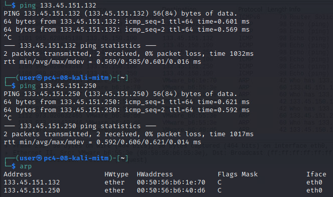

Eventually, you will be able to populate the full network mapping (FOB IPs below are shown only as examples and will be randomized in each gamespace, though the receiver systems always end in .250).

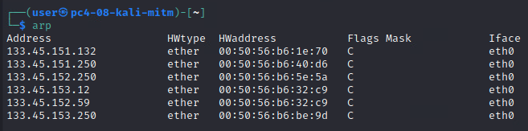

If players reboot their system, they will need to repopulate this table, or record the MAC/IP pairs offline.

**Arpspoof each host or use a tool like Ettercap**

To intercept one channel, use arpspoof to spoof both ends of the conversation in two separate terminals:

```
sudo arpspoof -i eth0 -t 133.45.151.132 133.45.151.250
sudo arpspoof -i eth0 -t 133.45.151.250 133.45.151.132
```

After completing both commands, you will see captured traffic between the hosts (ICMP used here only as an example).

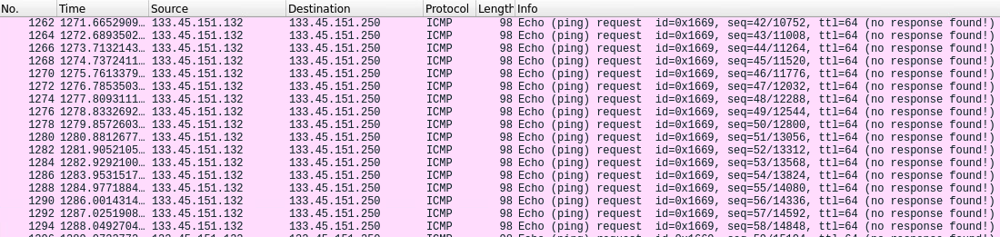

In order to complete the process, make sure you enable ipv4 forwarding on Kali. You will need to do this on each player system, but only once.

```
sudo sysctl -w net.ipv4.ip_forward=1
```

You'll now see that traffic is being forwarded and replied to successfully.

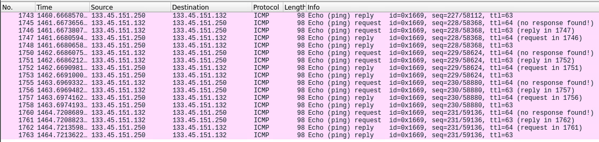

You are now effectively acting as a man in the middle for all traffic on this channel, able to sniff, and even capture and modify data as it transmits.

Alternatively, those familiar with Ettercap may be able to use that tool to do the same as the above spoofing.

"Nmap'ing" each server will also indicate what port is listening for incoming connections.

>**Note:** Names were added to each server/lock mechanism upon connection to provide hints to the solution for each lock.

The walk-through part of this solution guide is organized by solving each of the three questions.

## Question 1

_What is the hex code for unlocking the first door mechanism?_

**Answer:** `34dbfd17967e` (the receiver will be listening on port 25490 on 133.45.151.250 and expect a key of 184303)

All teams need to do for this lock is watch for the traffic coming from the first FOB on the 133.45.151.0/24 network. The FOB will transmit the key in plaintext every 30-90 seconds.

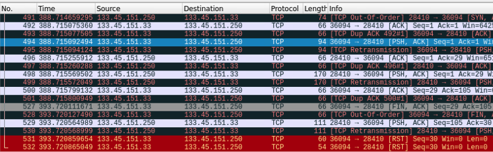

Within this traffic, one of the messages sent to the server will display a key value, a 6 digit code.

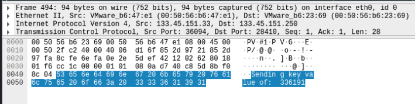

Also pay attention to the destination port for the server, which in this case is 28410. The port for lock \#1 will always fall between 20,000 and 39,999 but will be chosen at random. This is also discoverable with a more in depth port scan, but you need to find the traffic anyway.

Connect to the server at the specified port and submit the code retrieved from the traffic, entering one digit at a time. Providing the correct key code will produce the flag for lock \#1, which is also randomized for each gamespace.

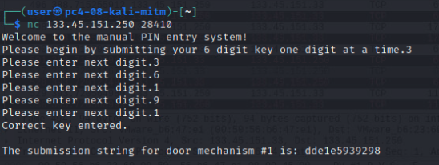

## Question 2

_What is the hex code for unlocking the second door mechanism?_

**Answer:** `37cac465a937` (the receiver will be listening on port 28216 on 133.45.152.250 and expect a key sequence of 364764 556893 602702 912521 749644 215285 895790 981308 326878 532705)

Following a similar process as above, spoof the two systems found on the 133.45.152.0/24 network. Scan and spoof both ends like before. If doing this on a different Kali system you must also enable ipv4 forwarding. If doing this from the same Kali system,  ensure that no other spoofing is taking place from a previous task.

For this lock, a sequence of keys will be sent that iterate through the entire list of 10 keys before starting over. The set of 10 keys are chosen at random, and a seed value will also determine what the first key to be sent will be.

Participants will have to do one of the following things:

- Intercept the traffic, stop it, capture the current key and use it on the server before the key changes (may not always work because any attempt to enter a key advances the expected key, so the two could get out of sequence).

- Watch and wait for the entire sequence of keys to repeat itself, which can take anywhere from 5-10 minutes, and then use the next key in the sequence after you see the previous key being used.

- Intercept the client/sender traffic and force the server to reply to yourself with the expected keys and then use the next one in the sequence.

Participants won't know that 10 keys are in use or that they are being rotated through and repeated until they see the full pattern a few times. The steps for sniffing the keys and entering them is identical as in lock \#1.

In the network traffic coming from the client/sender you will see similar traffic as before, but the key will change with each connection made. Note the timestamps on the packets below as one comes after the other. You can build the key table by watching the keys comes cross the wire, though it will take time as the FOB bounces around and sends a signal (keys are sent randomly at 30-90 second intervals, therefore on average it might take 10 minutes to see all keys).

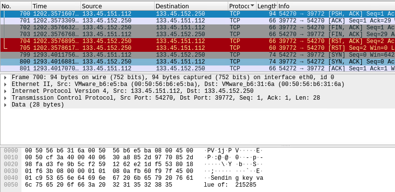

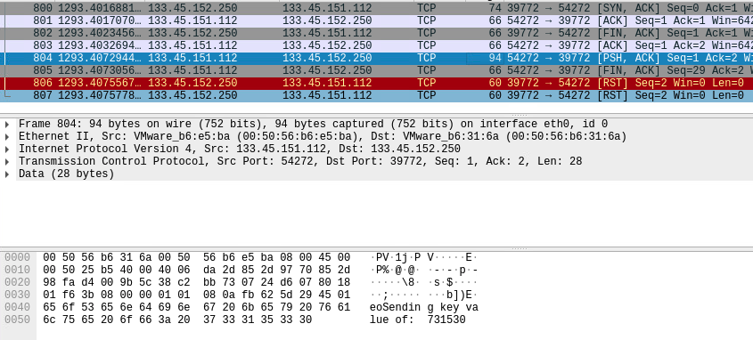

Also pay attention to the destination port for the server, which in this case is 39772. The port for lock \#2 will always fall between 15,000 and 34,999 but will be chosen at random. This is also discoverable with a more in-depth port scan, but you need to find the traffic anyway.

The server does respond with the last expected key in the sequence, letting you generate a table of the keys used and in what order. However, these replies will not be sent back to the client because the FOB sends the codes in full, not one digit at a time, as the backup system requires.

The alternative is to connect to the server yourself, which provides an identical prompt as in lock \#1. Once you enter all 6 digits for a code, you will see the last expected code that was used.

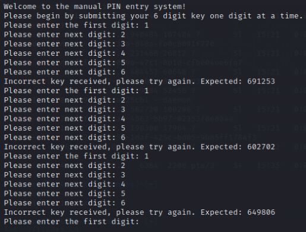

The starting key is also randomized for each connection, and the server implements a lockout for 60 seconds (which will close your connection) after three failed attempts. It will take multiple connections to build the full table of 10 keys.


However, if you build the table of keys from the Wireshark traffic coming from the client/sender, you would only need to connect once to see what the last expected key is to know what key to use next.

The submission and flag retrieval is the same as for lock \#1

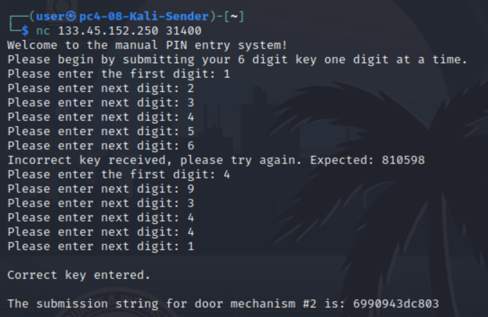

## Question 3

_What is the hex code for unlocking the third door mechanism?_

**Answer:** `d5a412735965` (the receiver will be listening on port 33146 on 133.45.153.250)

Solving lock \#3 will take some analysis to predict how to use the proper key.

First, there is no FOB transmitting for this lock. Therefore you must scan the receiver's ports to find which one is open. The key will always fall between 30000 and 49999 but is chosen at random.

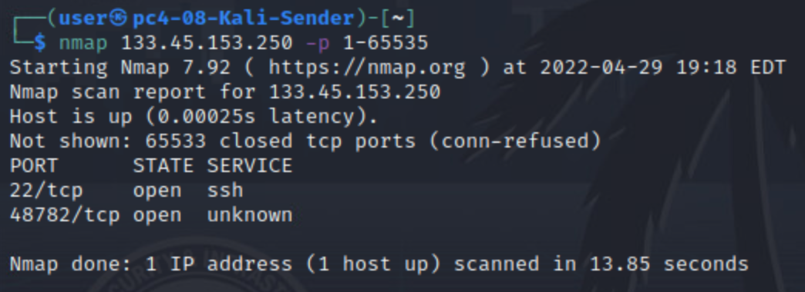

Lock \#3 decrements the last valid key by the value of the current time in HHMMSS plus the key that you last entered for that session. The key will reset on each connection or session. For example, if the key was 100000 and the current time when you submitted a key was 12:00 and you entered a code of 200000, the new key would become 301200 or 100000 - 1200 + 200000.

The only way to solve this is to enter codes and recognize the math behind subsequent expected codes. The best code to use is 000000, since then you only have to incorporate two values to the equation. You will need to enter at least two incorrect codes to be able to see the pattern. There is no lockout on this lock for any number of incorrect attempts, though the key will reset to a random value on each unique connection or session.

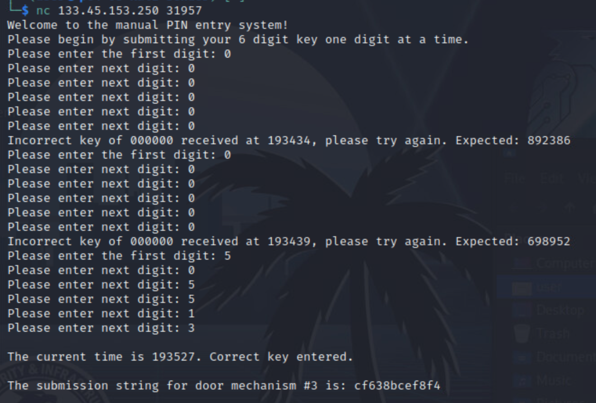

In the above example the correct key of 505513 is deduced by subtracting 1934439, the time the last key was entered, from the last expected key of 698952.
