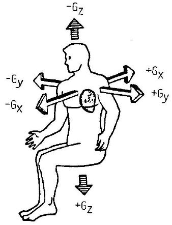

# Gee Whiz

In the rush to retrofit the Dauntless with CubeDrive technology, there was a slight oversight: The drive is capable of generating accelerations much in excess of what any human crew member could survive.

Your mission is to place a firewall rule in front of the drive controller's network interface, with the goal of preventing drive commands that request acceleration values in excess of specified human-survivable limits.

The document specifying the exact ordering of the fields in the data structure representing a drive command was also misplaced, but no worries, we can provide a binary program used to convert numeric values on the command line into the requisite hex string that can be sent to the drive controller over the network.

**NICE Work Roles:**
- [Network Operations Specialist](https://niccs.cisa.gov/workforce-development/cyber-security-workforce-framework/workroles?name=Network+Operations+Specialist&id=All)
- [Cyber Defense Forensics Analyst](https://niccs.cisa.gov/workforce-development/cyber-security-workforce-framework/workroles?name=Cyber+Defense+forensics+Analyst&id=All)
- [Software Developer](https://niccs.cisa.gov/workforce-development/cyber-security-workforce-framework/workroles?name=Software+Developer&id=All)

**NICE Tasks:**
- [T0117](https://niccs.cisa.gov/workforce-development/cyber-security-workforce-framework/tasks?id=T0117&description=All) - Identify security implications and apply methodologies within centralized and decentralized environments across the enterprise's computer systems in software development.
- [T0118](https://niccs.cisa.gov/workforce-development/cyber-security-workforce-framework/tasks?id=T0118&description=All) - Identify security issues around steady state operation and management of software and incorporate security measures that must be taken when a product reaches its end of life.
- [T0175](https://niccs.cisa.gov/workforce-development/cyber-security-workforce-framework/tasks?id=T0175&description=All) - Perform real-time cyber defense incident handling (e.g., forensic collections, intrusion correlation and tracking, threat analysis, and direct system remediation) tasks to support deployable Incident Response Teams (IRTs).
- [T0182](https://niccs.cisa.gov/workforce-development/cyber-security-workforce-framework/tasks?id=T0182&description=All) - Perform tier 1, 2, and 3 malware analysis.

## Background

The impact of acceleration on the human body strongly depends on its direction, as illustrated in the following figure (image credit: FAA.gov):



The CubeDrive computer interface accepts commands matching the following record structure:

```
struct drv_ctl_t {
	float gx;     /* acceleration along the x axis (m / s^2) */
	float gy;     /* acceleration along the y axis (m / s^2) */
	float gz;     /* acceleration along the z axis (m / s^2) */
	unsigned ms;  /* duration of "burn" (ms) */
};
```

Any such command will apply an acceleration equal to the vector sum of the x, y, and z components relative to how the human crew is seated (per the
above drawing), for the given duration (in milliseconds). At the end of the specified duration, acceleration is cut off, and the ship will then "coast" until the next command is applied.

While the drive itself is capable of accepting any per-axis acceleration value that can be represented by a `float`, life and safety of the human
crew must be preserved by imposing the following (simplified) maximum limits:

| $Duration$ | &#124;$G_x$&#124; | &#124;$G_y$&#124; | $G_z$ | $G_{total} = \sqrt{G_x^2 + G_y^2 + G_z^2}$ |
| -------------------: | :---: | :---: | :-----------: | :---: |
|    0s < t &leq; 120s |  6.0  |  6.0  | [-1.5 .. 3.0] |  8.0  |
| 120s < t &leq; 3600s |  3.0  |  3.0  | [-1.0 .. 2.5] |  4.0  |
|            t > 3600s |  2.0  |  2.0  | [-0.5 .. 2.0] |  2.5  |

Each field in `struct drv_ctl_t` is 32-bit wide, and is stored in memory using Little-Endian byte ordering. The full 128-bit record is sent over the network as a 32-character hex-digit ASCII string in memory order (low to high byte address), e.g.:

```
String: d3b07384d113edec49eaa6238ad5ff00
Legend: <------><------><------><------>
         field1  field2  field3  field4
```

The bad news is that the exact order of each field within a `struct drv_ctl_t` is unknown (there are 4! = 24 possible permutations). The good news is that that you have access to a binary program, `drvctl.bin`, which generates a request string when given G<sub>x</sub>, G<sub>y</sub>, G<sub>z</sub>, and the desired "burn" time in milliseconds:

```
$ ./drvctl.bin

	Usage: ./drvctl gx gy gz ms
```

Assuming the fields of `struct drv_ctl_t` are ordered as `gx`, followed by `gy`, `gz`, and finally `ms`, the resulting request for G<sub>x</sub>=6.0m/s<sup>2</sup>, G<sub>y</sub>=6.0m/s<sup>2</sup>, G<sub>z</sub>=-1.5m/s<sup>2</sup> (resulting in a G<sub>total</sub> acceleration with magnitude 8.617m/s<sup>2</sup>), and a "burn" duration of 60 seconds (i.e., 60,000ms) should be:

```
$ ./drvctl.bin 6.0 6.0 -1.5 60000
0000c0400000c0400000c0bf60ea0000
```

In this example, `00 00 c0 40` is the in-memory LE representation of a `float` with value `6.0`; `00 00 c0 bf` is the LE `float` representation of `-1.5`; and `60 ea 00 00` is the LE `uint32_t` representation of the integer value `60,000`.

The `drvctl.bin` binary can be downloaded onto any `usr*` workstation by visiting `http://challenge.us/files`, and should help determine the precise ordering of the fields within a `struct drv_ctl_t` record.

A linux firewall (`svcnat`) accepts drive commands on TCP port 31337 and, subject to a set of iptables firewall rules, forwards them to the actual
CubeDrive computer (`srv`) over a private, isolated network link.

Your team's objective is to write a firewall rule that ensures only drive control commands that respect the acceleration and time limits provided in the table above are forwarded to `srv`, in order to prevent injury to the human crew. A sample/skeleton firewall program, designed to work in conjunction with iptables user-space queuing rules, is also available for download from `http://challenge.us/files`. You should modify this program
to parse 32-hex-character drive control requests as illustrated above, and issue a verdict on whether to accept or reject the request based on whether the maximum acceleration and time limits are met or not.

## Getting Started

Your team has access to a set of Kali user workstations (`usr*`), which may be used to study and analyze the sample binary command generator, and also to develop user-space firewall filter binaries and upload them to `svcnat` for use in conjunction with the iptables firewall.

The relevant network map is shown below:

```
                                   --------
                               +---| usr1 |
-------  private  ----------   |   --------
| srv |-----------| svcnat |---+     ...
-------  network  ----------   |   --------
                               +---| usrN |
                                   --------
```

Visit `http://challenge.us/files` from any of your team's `usr*` machines to access:

  - `drvctl.bin`: a binary program you may use to reverse-engineer the drive
    control request format
  - `sample_filter.c`: containing a sample program, written in C, that shows
    how one would filter out 32-character request strings beginning with
    `deadbeef`. Modify this sample to calculate whether a given drive control
    command would remain within the allowed acceleration and time limits, and
    allow or reject each individual request accordingly.

## Submission Format

Visit `http://challenge.us` from any `usr*` machine to request a grading run, which evaluates your firewall rules' ability to filter out unsafe drive
control commands while allowing through safe ones. You will be issued up to five 8-digit hexadecimal tokens, each worth 20% of the total score.

## Challenge Questions

1. Enter the value of token 1  
2. Enter the value of token 2  
3. Enter the value of token 3  
4. Enter the value of token 4  
5. Enter the value of token 5
