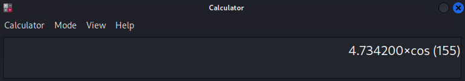

# I Can't Believe It's Not Honey

*Solution Guide*

## Overview

This solution guide covers how to find each probe, find the required credentials, recovering encrypted data, finding the scanned traffic and finally, retreiving the coordinates.

## Question 1

*What is the page name that holds the secret information on the probe's website?*

### Finding the probe and scanning for services

1. First find your IP address by using ifconfig or other means. 

This is a DHCP address from the probe, so it is now on your network for scanning. Scan the IP space to find it. The IP of the probe will change for each gamespace, but will always be found in the .200-.250 range of the network.


2. Next, perform a more thorough service scan using the ports provided in the guide:

```bash
nmap -sV -n -p 19,20,21,22,23,25,42,53,69,81,123,135,161,445,623,1025,1433,1723,1883,1900,2404,3306,5000,7634,8443,10001,11112,27017,50100,51884,61059,61093,61229,61468,61932,62427,62492,62585,62656,62921,63086,63216,63334,63408,63680,64294,64295,64297,64304 187.243.93.233
```

This scan should complete in about 3-5 minutes.

3. Next grep the results for the specified services in the guide: some type of web server (http/https), ssh, and ftp or some form of ftp. The SSH server will always be found in the 61000 port range, the Apache web server will always be found in the 62000 port range, and the FTP/VSFTP service will always be found in the 63000 port range.


>Note that the exact ports listed will change on each deployment, but will always be one of the listed ports in the respective range. The other SSH,FTP, or HTTP services are red herrings that will not lead to anything fruitful.

### Getting the creds from hidden website

1. Browse to the website as indicated in the guide as your first step.


The page will appear black, though the title indicates this is the probe's page.

2. The page source won't have any clues, so a scan of the web application/server is in order. Kali includes Nikto, which can be run against the web site using the `nikto -h 187.243.93.233 -p 42265` command (in this case).


The scan will find the `/test/directory` attached to this page. 

3. Browsing to this page displays a hidden html file not put into place.


The name of this page file `secret.html` - is the answer for submission to question 1. This helps ensure that you find this page and find it early. The name of the page is randomized and will be different for each deployment.

## Question 2

*Which 3 files recovered from the zip files contain the "VIGIL" text marker? (order does not matter, though all three filenames must be present). The filename also matches the zip file that contained it.*

### Recovering the encrypted data from the SSH connection

1. View this page (`187.243.93.233:42265/test/secret.html`). It displays some binary data.


2. Decode this binary back to ASCII as referenced in the guide.

You can use online resources:


Or you can convert via the command line:


Example: 

```bash
echo 0100000101000010 | perl -lpe '$_=pack"B*",$_'
# Produces "AB". 
```

3. Make sure to remove the formatting spaces if converting using a script.

Once decoded the text will provide a set of credentials and an AES decryption key.

4. With the discovered creds, login to the SSH server found earlier. If more than one pops up, only one will take the credentials that you found. This is the target.

5. Once connected, a simple `ls` will show multiple zip files (100 to be exact) and 100 ECIES encrypted files as well.


6. You should run some command to determine their location for the next step.


7. You should then use SCP (or other transfer tool) to transfer these files to their system for investigation. For example:

```bash
scp -P 41760 tester@187.243.93.233:/home/tester/signal/*.zip /home/user/Desktop/zipfiles
```

Remember to set the specific IP and port used in your deployment.

Each zip files contains two files. The webpage alludes to AES encryption being used on these files, and one of them is labelled with an ECIES tag which refers to the encryption used for that file.

8. You can extract the contents of all of the zips with the following command:

```bash
unzip '*.zip'
``` 

Just make sure to use the single quote. Otherwise you could write a for loop that unzips each zip file in the directory.

9. You may want to redirect the extracted files to a new directory to make it easier to decode in an iterative fashion without the zips getting in the way. Or move the zips to a different location.

Additionally, the files tagged with "ecies-encoded" are not encrypted using aes and can be ignored. Your focus is on the additional marker files. If you try to decode these "ecies" files using openssl they will fail.

10. To attempt to decode the files with the AES key given on the webpage, use a command similar to the following:

```bash
openssl aes-256-cbc -d -in 1234abcd1234abcd5678ef90 -out decoded/1234abcd1234abcd5678ef90
``` 
which will prompt you for the AES password/key found earlier. Remember that this key is unique to each
session.

This will work for one file, but you will want to script something to automate this process for all files. This script can be a bit tedious to write and test if unfamiliar with `openssl` and `expect`. You can of course just run the command above in a loop for every file and paste in the password, worst case. The most efficient script we found to do the job was:

```bash
    #!/bin/bash
    for file in /home/user/Desktop/files/*
    do
        /usr/bin/expect << EOF
        spawn openssl aes-256-cbc -d -in $file -out decoded/${file##*/}
        sleep 1
        expect "password"
        send "93da7a86dbbc438a\r"
        sleep 5
    EOF
    done
```
>Note that the sleep times here may be excessive, but guarantee that the loop does not reach EOF before the decryption process is complete. Overall, with these sleeps, the script would take ~10 minutes to complete. You can use a lesser sleep and likely still be fine.

The resulting decrypted files will be placed in a new folder. 

11.  After, simply grep the contents of these files for the "VIGIL" marker.

```bash
grep -E 'VIGIL' decoded/*
```


The three filenames provided are the answers to submit for question 2. Order does not matter but you must provide all three filenames to receive credit.

## Question 3
*Which of your system's ports are being scanned by the probe? (order does not matter, though all five ports must be present)*

### Finding the scan traffic

This step can technically be done at any point about 5 minutes after the challenge starts. The probe completes all other startup tasks before launching these scans, which will last the duration of the challenge. The scans will iterate for every IP in the DHCP space (187.243.93.10-20) and over each port in the predefined list.

1. Run Wireshark on any player system and watch for the scans to come in and record the destination ports that the scan is hitting on your system(s). The ports are slightly randomized on each deployment but the ports scanned will be the same 5 ports for each player system.

The more systems capture traffic the quicker the scans will be picked up. If running on a single system, it could take as long as 10 minutes, though as mentioned before, this cycle will repeat for the duration of the challenge so it cannot be truly missed.


2. Filter for the traffic coming from the probe only, 5 ports should be shown as being scanned. In the example above, the ports were 23, 123, 443, 502, and 3306. These port numbers can be submitted in any order.

## Question 4
*What is the next destination on the probe's journey (including any hyphens)?*

### FTP/Coordinates

1. Assuming you have identified the FTP service running on the probe, you should connect and retrieve the files found in the landing directory. For this example, you can try the following command:

```bash
ftp tester@187.243.93.229 -p 43573
``` 


2. Then, you could use either get via ftp or wget to retrieve the files.


3. Once you can view the data, it will appear as a journey log, giving details about the probe's flight plan, and images of various celestial bodies, each tagged with their respective X,Y coordinate.


From the guide: 

The probe moves in an Archimedes spiral, for which it's position can be calculated as `X = r x COS(Θ)`, `Y = r x SIN(Θ)`, and its movement is determined by the equation `r = a x Θ`, where the radius is measured in AU and Θ is measured in radians.

We are looking for the 10th destination of the probe, and the solution is easier than it may at first seem.

The angle, `Θ (theta)`, is given for the first position and increments by `0.261799 radians` for each stop. Therefore, at stop 10, the angle must be `2.356191 radians` greater than it was at the probe's first stop, or 9 x .261799 radians greater. In the above example, the final angle will be `2.705257`. 
>For reference, this has an equivalent of 155 degrees and you may or may not need to convert this depending on what online tool or calculator you use.


Therefore, the new angle for stop 10 can be calculated, and now, so can the radius from center using the given equation `r = a x Θ`. In this example, the radius at stop 10 will be `1.75 x 2.705257` or `4.73419975 AU`.

4. Now that we know the radius and the angle, we can calculate the X, Y coordinates.

`X = 4.734200 x COS(155)` or `-4.29064`

`Y = 4.734200 x SIN(155)` or `2.00076`



5. Lastly, you should consult the `destination.csv` file provided in the guide and match the body that can be found at these coordinates. None of the bodies are close, and small estimations or rounding errors should still provide a clear answer.

The name of this body is the answer for submission.
