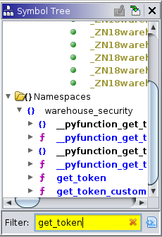
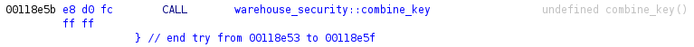
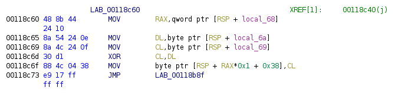
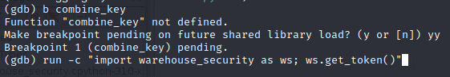
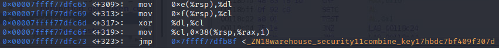
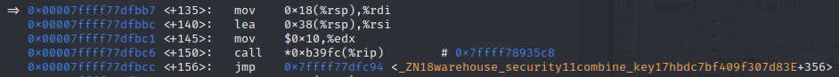
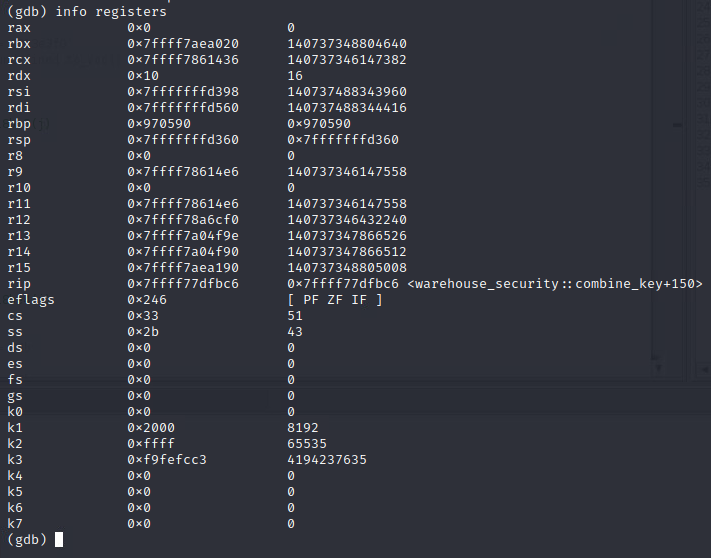
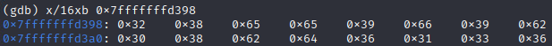
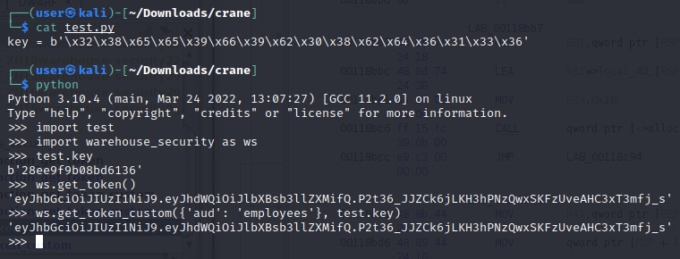
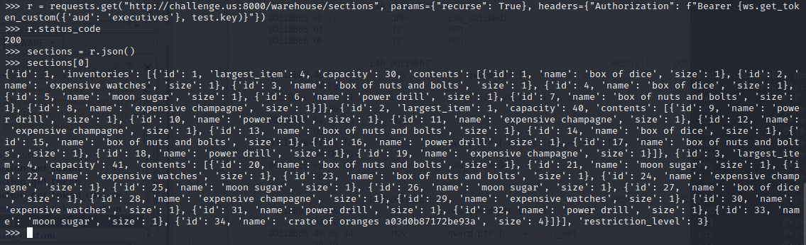

# Operation Juliett Whiskey Tango

_Solution Guide_

## Overview

This challenge requires generating a JSON Web Token with elevated permissions to trick a remote server into allowing actions that should not be permitted. It entails extracting a signing key from a Python extension module to use for generating the JWT using a function from the same extension module. In this guide, we use GHIDRA and `gdb` to perform the analysis and debugging to get the key, and then provide it to a function using Python in interactive mode in order to generate the forged token with the key.

## Question 1

_Signing key_

(Info) After retrieving and unzipping `crane.zip`, there will be three files, `crane.py`, `warehouse_security/__init__.py`, and `warehouse_security/warehouse_security.cpython-310-x86_64-linux-gnu.so` (this last file will be referred to as the "extension module" in the rest of this document). Examining `crane.py` will reveal the code for a graphical program that makes HTTP calls to a remote server. It imports `warehouse_security` and calls `warehouse_security.get_token()`.

Running `python` in a terminal in the same directory as `crane.py`, and then doing `import warehouse_security` will import the `warehouse_security` module. Now we can type `help(warehouse_security)` and see that there is a second function available from this module, `get_token_custom()`. The help output also indicates that it takes a `dict` and `bytes`, the first argument is named `claims` and the second is `key`, and the call returns `str`.

In order to gain more insight, it will be necessary to examine the extension module's assembly.

* Open GHIDRA and create a new project with File -> New Project.
* Then File -> Import File, and select the extension module.
* Accept the defaults with Ok, and then click Ok again after the progress window finishes.
* Right click the name of the extension module in GHIDRA, and in the menu, Open With -> CodeBrowser.
* At the Analyze prompt, click Yes and then Analyze on the Analysis Options dialog.
* Wait for the progress indicators at the bottom right of the GHIDRA window to finish.
* At the conclusion of the analysis, there will likely be a few warnings in a dialog. Click Ok.

On the left, there is a Symbol Tree box. Enter `get_token` (the name of the function used in `crane.py`).

The `f` symbol indicates a function. The `__pyfunction_` prefixes are wrappers around the function we want. Click `f` `get_token` in the Symbol Tree box to be taken to that function. There are a lot of instructions here that are not relevant to the challenge. Scroll through, looking at the labels, and find the call to `warehouse_security::combine_key`.

Double click this function and have a look around. In it, there is a set of instructions which copies bytes from two separate registers and performs an XOR operation on them. This is where the key is being combined.

Instead of trying to piece it together manually, it will be easier to let the system do it for us. Open a terminal and type `gdb python`. In the interactive debugger, type `b combine_key`. It will ask to make a breakpoint pending on a future shared library load. Type `y` and press Enter. Now type `run -c "import warehouse_security as ws; ws.get_token()"`.

Done right, GDB will pause when `combine_key()` is called. From here, typing `disas` and pressing Enter will show the disassembly for the function. Looking through it, you can match up the XOR instruction found earlier in GHIDRA and see its in-memory address. The address should end with `c6d`. (The format of the instructions will be different, as GDB uses AT&T syntax while GHIDRA uses Intel syntax). The following instruction moves the result of the XOR into a buffer on the stack with
the offset **0x38**.

From here, you can further analyze the code to see where it will jump to, or add a breakpoint to the XOR instruction with `b *0x<address>` and follow the program execution with `si`. It's quicker to use GHIDRA's analysis to trace backwards from the function's return. Following this path will show a call to `alloc::slice::<impl[T]>::to_vec`. Leading up to this call shows an address being loaded into memory, which is the offset 0x38 into the stack. This indicates that the buffer being
operated on by the XOR instructions is being converted into a vector to be returned to the caller function. Add a breakpoint to the address of the call instruction with `b *0x<address>`. The address should end with bc6.

If you created a breakpoint to follow the program execution after the XOR instruction, you can delete it with `d 2` (or whatever number it gave you when you ran the command, check with `info break` if unsure). Then type `c` or `continue`. This should take you to the next breakpoint, which should be the one at the call instruction. Next type `info registers` and press enter. This will show the current values of all the processor registers in this context. Since the stack buffer with offset 0x38 was being moved into the `rsi` register, check the value of `rsi` in this info dump.

Now type `x/16xb 0x<address>`. This will dump the integer value of each byte along with the corresponding ASCII character, from left-to-right, top-to-bottom. These bytes were specifically chosen to be lowercase hex characters and should all be printable.

Copy the bytes into a separate file, as we're going to be checking them to make sure we got the whole key and nothing else. As shown in the image, the result of `ws.get_token()` and `ws.get_token_custom({'aud': 'employees'}, test.key)` should match.

If the two tokens match, submit the key you found as the first flag.

## Question 2

_Hidden item token_

Now that you have the signing key, you need to use it to create a token with greater privileges. The above comparison using `{'aud': 'employees'}` comes from the expectation that the competitor would have run across the following error string during disassembly of the extension module: `get_token_custom expects the value for the "aud" key to be "employees","managers", or "executives".` Now, we'll need to forge an `executives`-level token to trick the server into revealing the objective
item in the executive section.

In the same Python shell as before, `import requests` into the environment.

In the list of items, the "crate of oranges" item will always have the second flag in its name field.
