# Tale of the Missing Oranges!

_Solution Guide_

## Overview

In this challenge, players analyze a corrupted SQLite database file.  This solution guide refers to questions and evidence for variant #1. There are four possible variants for this challenge. This solution guide covers the walk-through for variant #1, organized by submission question. The steps used to solve all variants will be similar, but the answers will vary.

## Question 1

_What is the root page for "users" table?_

This information is present in the `sqlite_master` table which is in the first page of the database file which may overflow into additional pages. Every database file contains tables and each table is made up of pages. Each table is stored as a B-tree with each B-tree containing one or more pages.

Because we know the file is corrupted, we will use a hex editor to open the file.

The first few bytes have been zeroed out. This is where the database header for the file is. The first page starts with the database header and the remaining bytes in this page contain a B-tree. The B-tree present in the first page contains the database schema in the form of a table known as `sqlite_master`. The other pages in the databases do not have the database header. Immediately following the database header is the B-tree page header which seems to have been zeroed out as well. 

Database schema basically tells what tables are present in the database file and where they are stored in the file. `sqlite_master` table contains five columns: **type**, **name**, **tbl_name**, **rootpage**, and **sql**. The **type** column can have one of following values: 'table', 'index', 'view', or 'trigger'. The **name** and **tbl_name** column has the name of the table. The **rootpage** column stores the page number of the root B-tree page for the table. The last column contains the sql statement used to create the table. 

We know that the database schema (`sqlite_master`) is present in the first page. We also know from challenge documentation that the page size is 4096 bytes. So, the database schema is present somewhere between the start of the file and byte offset 4096. 

Scroll down until you see something like the following screenshot. 

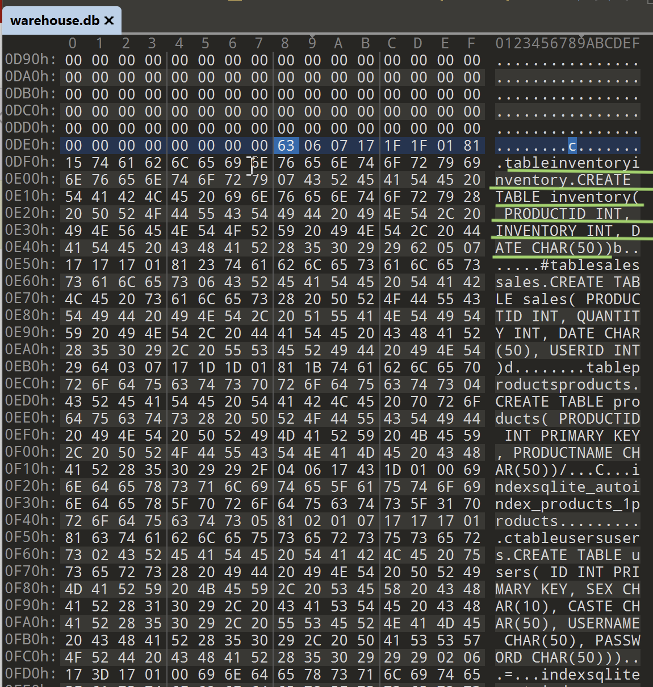

One of the `sqlite_master` table entries has been underlined. Similarly, you can read the entries for other three tables.

The `.` before the CREATE statement is the root page for that table as shown below. 

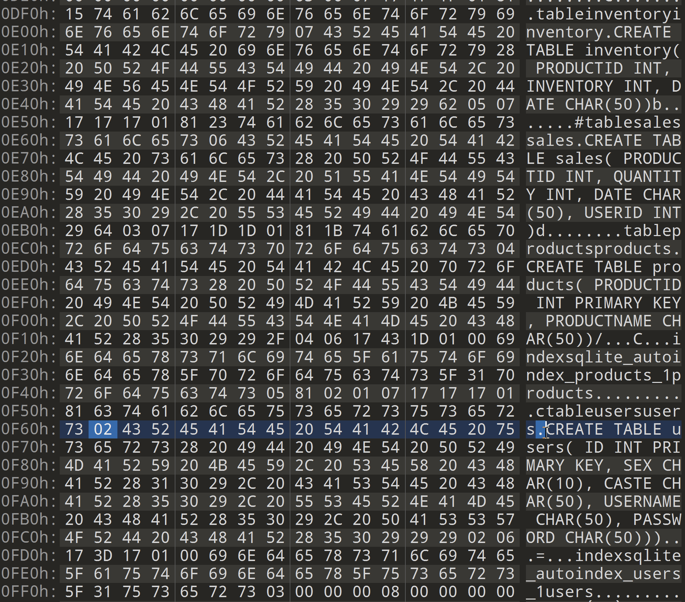

Recreating `sqlite_master` for tables present in this database file: 

| type | name | tbl_name | rootpage | sql |
|----|----|----|----|----|
| table | inventory | inventory | 7 | CREATE TABLE inventory(PRODUCTID INT, INVENTORY INT, DATE CHAR(50))|
| table | sales | sales | 6 | CREATE TABLE sales( PRODUCTID INT, QUANTITY INT, DATE CHAR(50), USERID INT) |
| table | products | products| 4 | CREATE TABLE products( PRODUCTID INT PRIMARY KEY, PRODUCTNAME CHAR(50)) |
| table | users | users | 2 | CREATE TABLE users( ID INT PRIMARY KEY, SEX CHAR(10), CASTE CHAR(50), USERNAME CHAR(50), PASSWORD CHAR(50)) | 

## Question 2

_What is the product ID associated with "Orange Concentrate"?_

To find the productid associated with a specific product, we need to navigate to `products` table. The rootpage for `products` table is `04`. 

So, the bytes offset for the products table will be (rootpage - 1) * size of the page
= (4-1)* 4096
= 12288

Jump to byte offset 12288 in the hex editor. 

Every page begins with a B-tree page header which can be eight or 12 bytes in length depending on the the type of B-tree. 

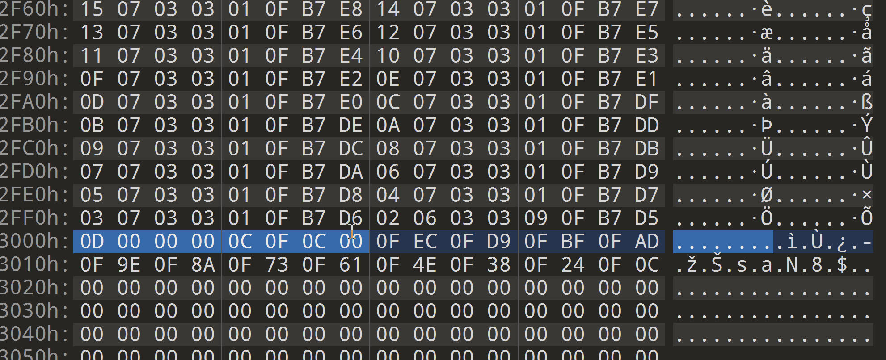

The first byte is the flag which determines the type of page. In this case, it is `0x0D` which means it is a leaf table page and therefore the page header is eight bytes long. 

The page header for this page is: `0D 00 00 00 0C 0F 0C 00`. As mentioned above, byte offset 0 (`0xOD`) is the flag that determines the type of page.

- Byte offset 1 and 2: represent the offset for first free block.
- Byte offset 3 and 4: total number of entries in the table. In this case, it is (`0x000C`) 12. 
- Byte offset 5 and 6: offset to the first byte of content. In this case, it is (`0x0F0C`) 3852.
- Byte offset 7: fragment byte count. 

From this header information, we  know  there are 12 records in the `products` table and the first byte of valid record starts at byte offset 3852 from the start of this page. 

Immediately following the page header is the cell pointer array. The cell pointer array is an array of 2-byte integer pointers: there is an entry for each table record and each entry gives the offset of the start of the record in the B-tree page. We know from the page header that there are twelve records in this table. Therefore, the cell pointer array is 24 bytes long. 

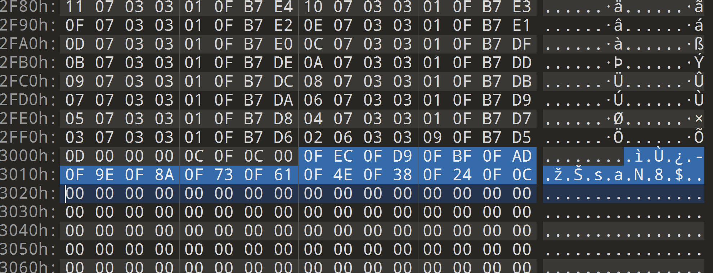

Offsets for 12 records are:

- 0xOFEC - 4076

- 0x0FD9 - 4057

- 0x0FBF - 4031

- 0x0FAD - 4013

- 0x0F9E - 3998

- 0x0F8A - 3978

- 0x0F73 - 3955

- 0x0F61 - 3937

- 0x0F4E - 3918

- 0x0F38 - 3896

- 0x0F24 - 3876

- 0x0F0C - 3852

These offsets are relative to the start of the current page. If we want to know the offset relative to the start of the file, we need to add 12288 to the byte offset. 

Let's jump to the first record. 12288+3852 = 16140. Jump to byte offset 16140. 

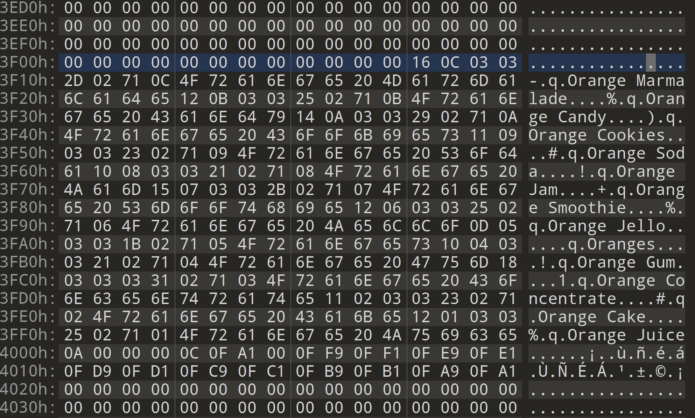

Keep in mind that the `products` table contains two columns: **productid** and **productname**. Based on this information and just glancing over the information present in the screenshot, it looks like the cell entry at byte offset `0x0FBF` (4013) represents the entry for `Orange Concentrate`. (Tenth entry in the record. Therefore, the offset with the tenth-highest value.)

3. Jump to byte offset 16319 (12288+4031)

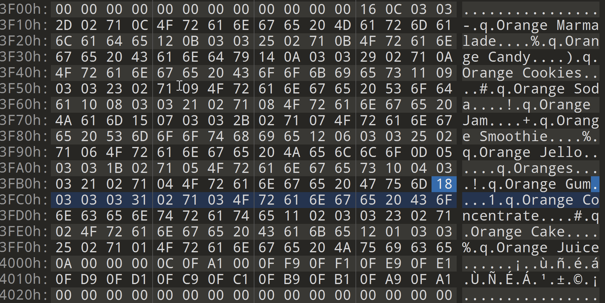

At this point, let's learn how to read a record from the table. Each record starts with a header followed by the payload (actual content for that record). 

Header comprises of two *varints*. The first is the total length of the payload, and the second is the ROWID for that record. 

Now, what is a varint? Varint is a variable length integer that allows us to use less space for small positive integers. Following is an excerpt from SQLite Forensics book by Paul Sanderson: 

> A variable-length integer or variant is a static Huffman encoding of 64-bit twos-complement integers that uses less space for small positive values. A varint is between one and nine bytes in length. The varint consists or either zero or more bytes which have the high-order bit set followed by a single byte with the high order bit clear, or nine bytes, whichever is shorter. The lower seven bits of each of the first eight bytes and all eight bits of the ninth byte are used to reconstruct the 64-bit twos complement integer. Varints are big integer: bits taken from the earlier bytes of the varint are the more significant than bits taken from the later bytes.

Let's read the cell header for `Orange Concentrate` entry in this table. 

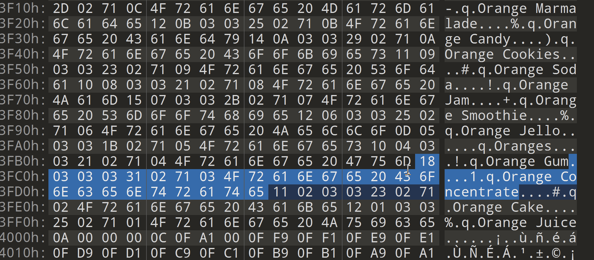

The second byte is `0x18`, which in binary is 00011000, and taking the last seven bits leaves 00011000. The MSB is not set so do not process the next byte. That means this is the only byte in this varint. 0x18 = 24. This varint is the length of the payload.  

Let's move on to the second varint in the cell header. The next byte is 0x03, which is 00000011. The MSB is not set so do not process the next byte. We do not have to do anything with the ROWID so let's move on to the payload. 

Following the cell header starts the payload which in this case is 24 bytes and is highlighted in the screenshot below. 

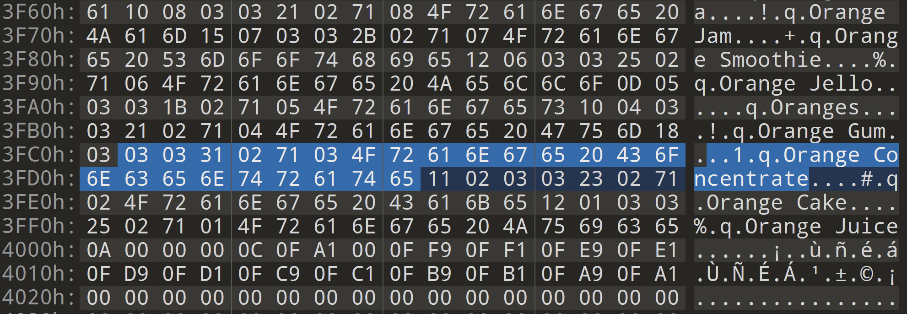

Payload also has its own header followed by the actual content. Let's analyze the payload header. It starts with a single varint that denotes the length of the header including the bytes occupied by the header length varint itself. 

The first byte in the payload header is 0x03 which is 00000011. The MSB is not set so do not process the next byte. This means the payload header is 3 bytes in length. It is highlighted in the screenshot below. 

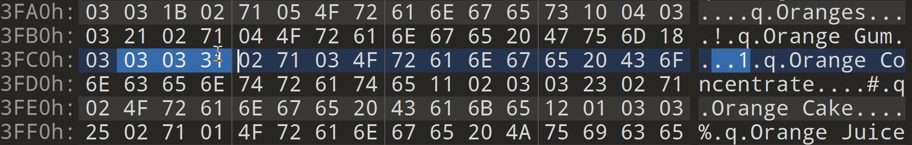

The remaining bytes in the header are one or more varints, one for each column in the record. These varints determine the type and size of data for each column.

For determining the size and type of data, refer to the following table - 

The next byte is `0x03` which is 00000011. MSB is not set so this is the only byte in this varint. `0x03` is equal to three in decimal. Three matches the fourth serial type in the above table. The value of the first column in this record is an integer of three bytes. 

The next byte is `0x31` which is 0110001. MSB is not set so this is the only byte is this varint. `0x31` = 49 in decimal. This matches the last serial type in the above table which means the second or the last column is a string of 18 bytes.

Overall, this record consists of an integer of three bytes followed by a string of 18 bytes.

Let's recall, the `products` table contains two columns: **productid** and **productname**. Therefore, for the cell record that we have been analyzing: 

- `productid` is an integer of three bytes. The value is `0x027103` which in decimal is 160003.
- `productname` is string of 18 bytes. The value is `Orange Concentrate`.

Each of the above record values are highlighted in the screenshot below. 

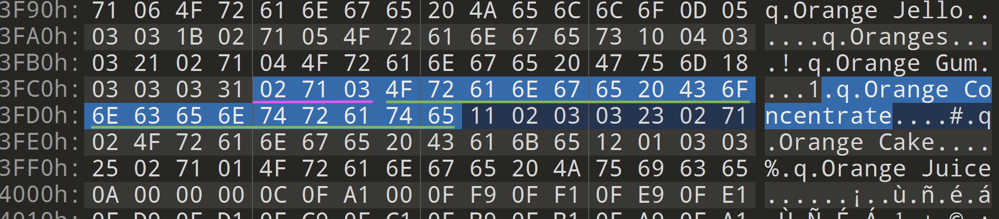

## Question 3

_Some of the "Orange Concentrate" items are missing from the warehouse. We see that there is an entry in the inventory table showing some items were checked out, but no equivalent entry in the Sales table. Analyze the deleted record from Sales table and provide the userid that checked out the missing items._

For this question, we need to analyze a deleted record in the **sales** table. The root page for sales table is 06. So, the bytes offset for sales table will be (6-1)*4096 = 20480.

Jump to byte offset 20480 in hex editor.

Let's read the page header: 

- Byte offset 0 (`0xOD`) is the flag that determines the type of page.
- Byte offset 1 and 2: represent the offset for first free block. This is what we are interested in. `x0F9B` = 3995. This offset is relative to the start of this page. So it is 20480+3995 = 24475 from the beginning of the file. 
- Byte offset 3 and 4: total number of entries in the table. In this case it is (`0x0014`) 20. 
- Byte offset 5 and 6: offset to the first byte of content. In this case it is (`0xODEC`) 3564.
- Byte offset 7: fragment byte count. 

From the `master_sqlite` table, we already know that sales table is comprised of four columns: **productid int**, **quantity int**, **date char(50)**, **userid int**.

Let's navigate to the first free block: byte offset 24475.

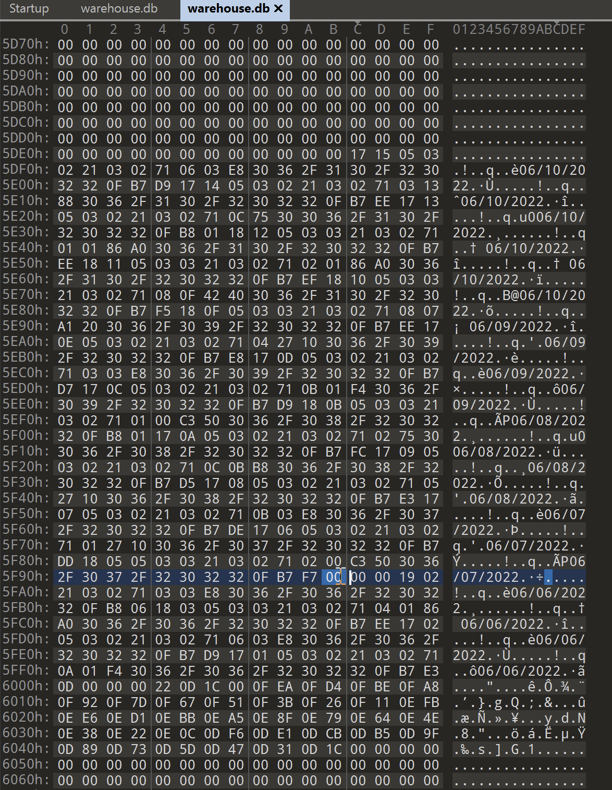

If you notice in the above screenshot, there are some dates mentioned. If you count all the dates, there are 21 in total. But we know from page header that there are 20 records in the sales table.  One record was deleted. That deleted record is at byte offset 24475.

Let's analyze the deleted record. In SQLite when a record is deleted, the first four bytes are overwritten by a freeblock record. The first two bytes are the pointer to the start of the next freeblock (or 0 if it is the last freeblock). The next two bytes for the length of the current freeblock. 

So in our case the first four bytes are **00 00 00 19**. The first two bytes are **00 00**, that means this is the only free block or the only deleted record in this page. The next two bytes are **00 19** which is equal to 25 in decimal and is the length of the current freeblock / deleted record. 

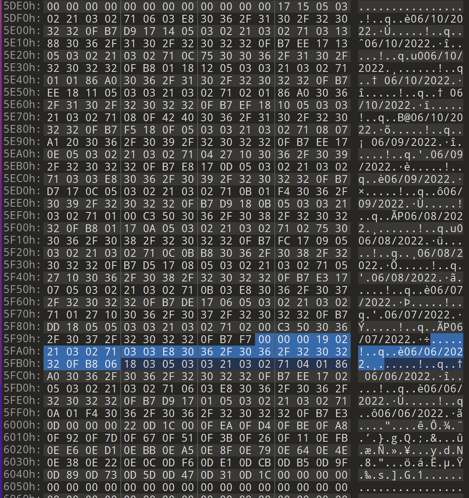

25 bytes are highlighted in the screenshot above. 

Recall that this table contains four columns: **productid int**, **quantity int**, **date char(50)**, **userid int**. **Date** is the third column, and **userid** is the fourth column. The date value for the deleted record is underlined in red in the screenshot below. 

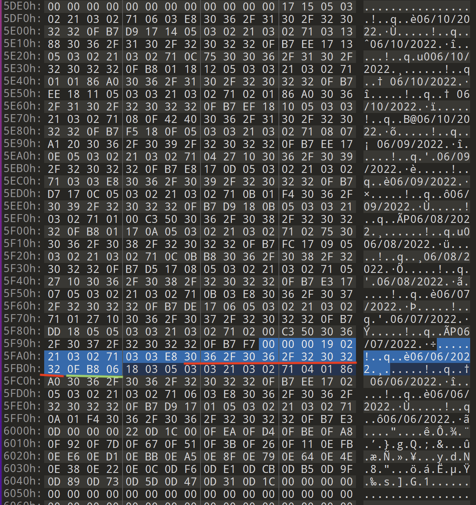

Therefore, the remaining three bytes (`x0FB806`) highlighted in green belong to **userid** column. `x0FB806` is equal to 1030150 in decimal and is the answer to Question 3.
