# The Party Line

_Solution Guide_

## Overview

This is an infinity-style challenge. This solution guide covers the walk-through and is organized by submission question.

### Answer Quick Reference

The correct answers for questions with static answers are provided here for your convenience.

1. `Angela Williams`
2. `This value is randomly generated`
3. `Ryan Knight`
4. `This value is randomly generated`
5. `This value is randomly generated`
6. `This value is randomly generated`

## Question 1

_What is the first and last name of the user that attempted shell access to the enterprise-server (10.5.5.160)?_

You will need to check the .bash_history file for the **awilliams** account to find the attempted ssh access.  

You can find the answer to this question by logging into the awilliams machine with the "user" account and searching the bash history file located at: `/home/angelawilliams/.bash_history`. You will see this line: `ssh user@10.5.5.160`, which indicates an attempt at shell access. The answer to the questions is Angela Williams.

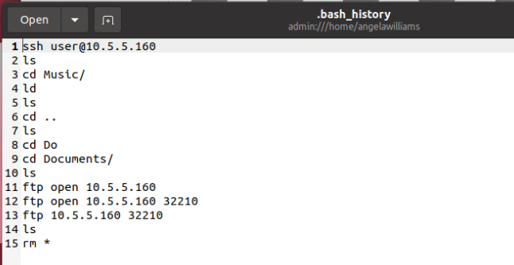

## Question 2

_What is the password of the "user" account on the enterprise-server?_

You need to find the share.zip file then crack the zip.hashes file with the help of the provided wordlist.txt file.  

1. The first step is to login to **rknight's Desktop** with the "user" account and find the deleted chat log file in Ryan Knight's trash. The location of the file is: `/home/ryanknight/.local/share/Trash/files`.

1. After opening the chat log file you will find a hint when Angela Williams mentions that she installed an unauthorized FTP server on 10.5.5.160:32210. 

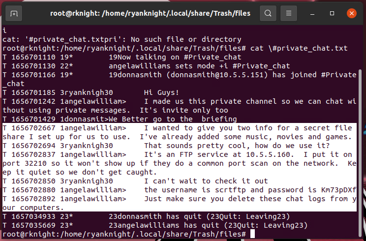

3. This should prompt challengers to try logging into the server to investigate the FTP server's contents and logs. At this point they will realize they don't have the password for this machine. In order to login to the machine where the FTP server is hosted (10.5.5.160) you will need to get the password for the local "user" account. This password was changed by Angela Williams. In order locate the password you must login to the **awilliams** machine with the "user" account and find the `/home/angelawilliams/Documents/share.zip` file. It is a password protected zip file that can be cracked using the word list provided in the IS0 on the Kali machine.

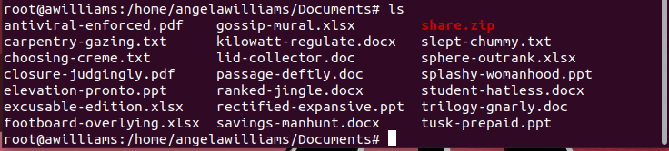

4. There are multiple ways to move files from between the machines in the challenge and the Kali box. One way is to run a simple web server on an open port using the following Python command: `python3 -m http.server`. This will start on web server running at http://0.0.0.0:8000. You can download the file using a browser on the Kali box substituting the IP address of the target machine where the file is hosted. For example: http://10.5.5.152:8000 
Another option is to move the file via **scp** from the host machine to the Kali box using a command similar to: `scp /home/angelawilliams/Documents/share.zip user@10.5.5.112:/home/user/Documents/share.zip`.

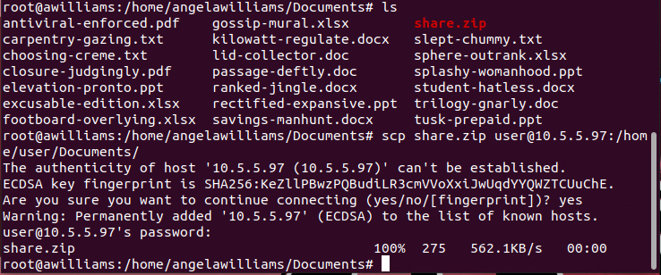

5. Using John the Ripper, collect hashes from the zip file by running: `zip2john share.zip > zip.hashes`. Using the provided wordlist.txt, crack the zip.hashes file by running: `john --wordlist=/media/cdrom0/wordlist.txt zip.hashes`.

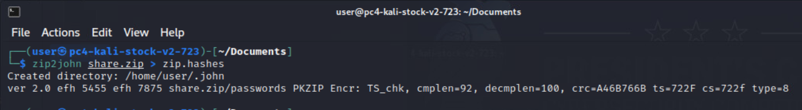
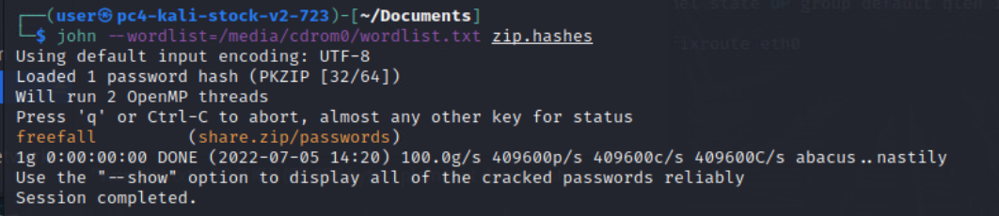
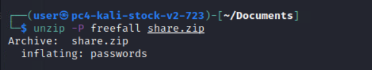
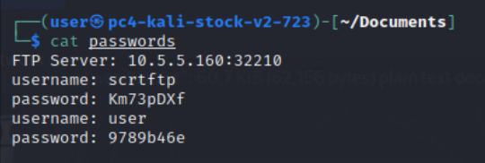

> **Note:** After gaining access to the enterprise-server many challengers will probably find it helpful to review the server's IRC logs. While other machines do contain various useful logs, it is not a complete picture since some of the users have intentionally deleted some of the logs from their local profile folders. The IRC logs can be found here: **/home/inspircd/run/logs**.

## Question 3

_What is the first and last name of the user that ran the application that was shared via the unauthorized service?_

Identify the name of the user who runs the 2048 game by gathering evidence from chat and FTP logs.  

In Ryan Knight's chat logs located on the **rknight** machine at `/home/ryanknight/.xchat2/scrollback/dauntless`, there is a conversation where Ryan sends a private message to Angela Williams mentioning that he notices error messages when playing the 2048 game that was retrieved from the FTP server. He seems to be concerned that IT is going to notice that he is playing an unauthorized game on the network.

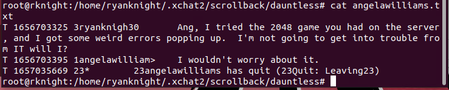

Challengers can find additional evidence that Ryan Knight downloaded the game by looking at the FTP server logs located on the enterprise-server machine at `/var/log/vsftpd.log`.

The name "Ryan Knight" is the answer to the question.

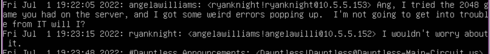

## Question 4

_What is the value written after the text "License Key: " that is visible in the file that is sent at the request of one of the users?_

You need to retrieve the value of the license key by finding the image in Donna Smith's Downloads directory.  

In one of the chat logs on the **dsmith** machine Donna Smith asks Angela Williams for a license key for a piece of software that was previously downloaded. Angela replies saying the file was sent. This file is an image named **licensekey.jpg** and is located on the dsmith machine. Challengers can login with the "user" account and look in the `/home/donnasmith/Downloads` directory. The answer is an eight character hexadecimal value that is written after the **License Key:** text in the image.

## Question 5

_The unauthorized application that was shared on the network appears to try contacting other machines when executed. The value being sent over the network from the application is encrypted and encoded. The decoded and decrypted text is the token._

Users must capture network traffic generated by the 2048 game and find the value posted via HTTP, following a successful GET request. After retrieving the value, they must decrypt the string, which is the token needed for this question.   

1. Challengers can analyze the application by downloading the **2048Game.zip** file from the FTP server to the Kali server. There are multiple ways to do this. One way is to use the FTP server credentials found in the password-protected zip file and download the file directly to the Kali box. Another method is to download the file via FTP to a user machine then use steps similar to those in Question 2 to transfer the files to the Kali box. Challengers can also login directly to the enterprise-server and use the steps from Question 2 to scp the file directly to the Kali box for analysis. The file to move is located at `/home/scrtftp/2048Game.zip`.

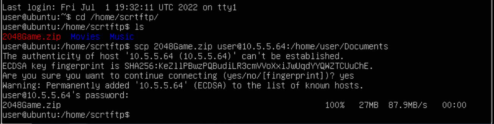

2. Extract the **2048Game.zip** file.

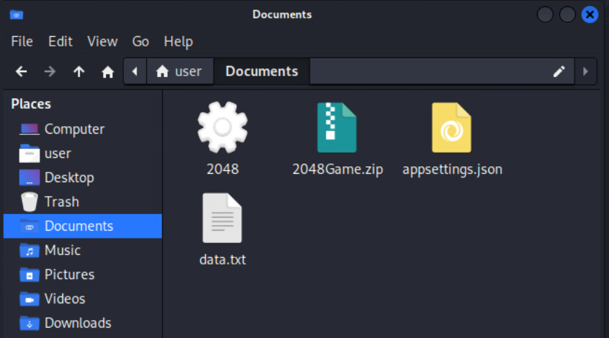

3. Before running the game, start Wireshark from the terminal with the `sudo wireshark` command. Start the packet capture.

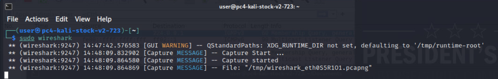

4. Launch the 2048 game and begin playing. After roughly 30 seconds challengers will see HTTP requests. Notice that some GET requests are successful and others appear to be failing. After making a successful GET request to **dauntless.us** the game will POST a value. The token value included in the body of the POST contains the answer in an encrypted string.

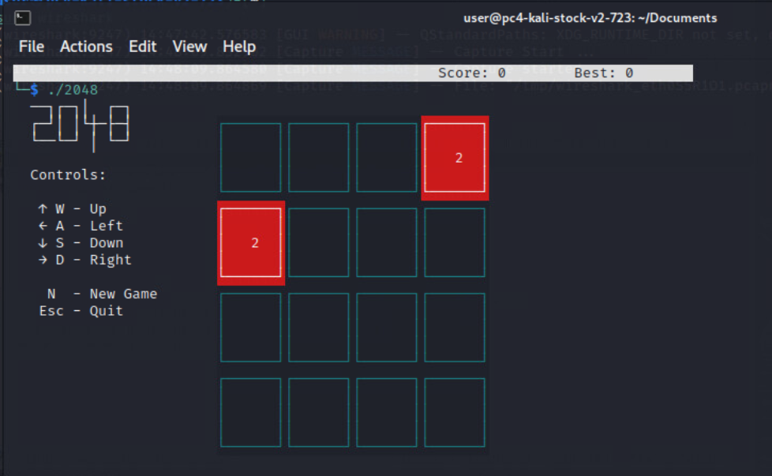
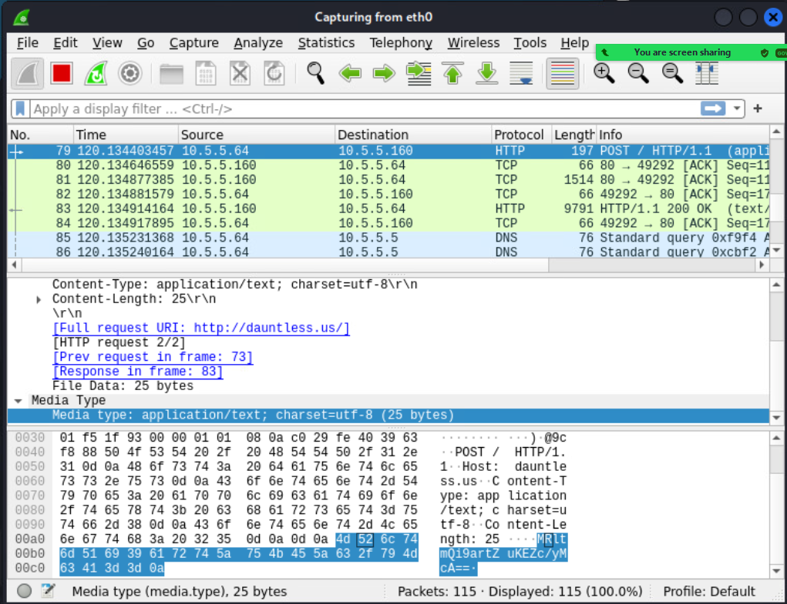

5. Challengers will find the information they need to decrypt the token by opening the **appsettings.json** file that is included in the 2048Game.zip file. The configuration file for the application contains settings that provide hints as to the encryption type used to hide the token. A lucky guess by a challenger or a little experience would allow them to skip capturing the encrypted token in Wireshark and grab the value directly from the **data.txt** file.

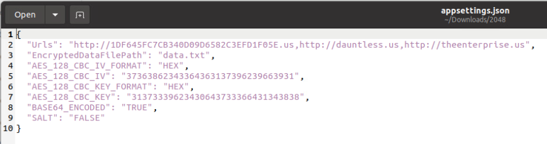

6. Challengers can go about decrypting the string in multiple ways. We will use the openssl tool included with our Kali image. Run the following command: `openssl enc -d -aes-128-cbc -nosalt -base64 -in /home/user/Documents/data.txt -K 31373339623430643733366431343838 -iv 37363862343364363137396239663931 -out decrypted.txt`

The eight character hexadecimal value in the decrypted.txt file is the answer to this question.

## Question 6

_Finally, you must prevent users from accessing any unauthorized applications or services without disrupting the chat and web server services. This will determine if the appropriate remediation steps have been completed and provide the final token._

For the final token, challengers must disable the FTP server so it is not accessible to the grading script. This can be done in multiple ways: by removing the FTP server, stopping the service, blocking the ports it runs on (32210) with a firewall rule, etc. However, the other services such as the Apache web server hosting the *Dauntless* intranet site and the IRC chat server must be available and operational for the grading check to pass. 

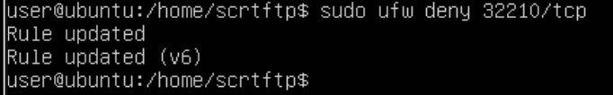

Once the appropriate changes have been made, browse to: http://challenge.us and click Grade Challenge.

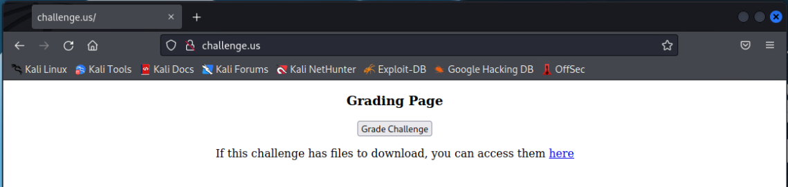
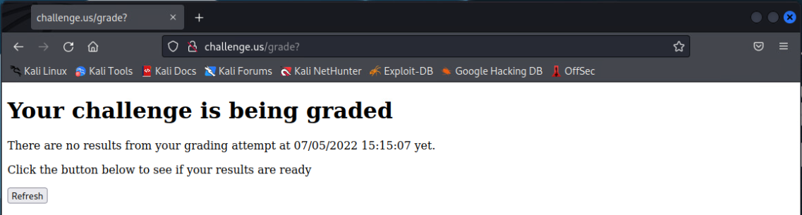
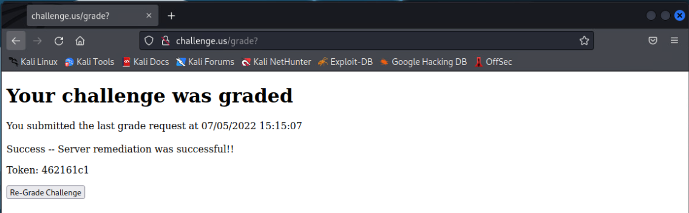
