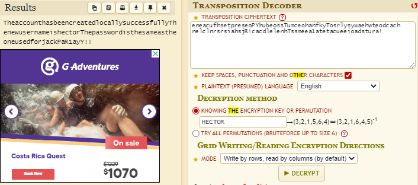

# What's in the Box

_Solution Guide_

## Overview

For this challenge, five tasks need to be completed to get all points available. These tasks revolve around gaining information from the five obfuscated scripts given to the user and then using information to either gain access to an external resource or determine what file is being exfiltrated. The walk-through is organized by question. 

## Question 1

_What is the token found by connecting to the service used by script1?_

This script creates a new user and then sends an encrypted message that contains these credentials. These are the steps that one can use to solve this.

1. Begin by executing the script, you will get back a string of what seems like garbled characters. If you look, you will see that the string's basic structure - including spaces, periods, and other special characters - has stayed intact.
2. Execute it again. You will get another string that looks similar to the previous one but it is slightly altered. Look closely. You can see there vowels/common letters still in the string. These aspects of the cipher text hint that a transpositional cipher is being used. The only thing left to find is the key that is needed to revert these strings back to normal.
3. Look at the /etc/passwd file. Two new users were added with the previous two executions.
4. Just to verify this, execute it once more. You will then find a new user has been added in the /etc/passwd file.
5. Try decrypting the string returned on the last execution with the username of the user who was added during that same execution. Chances are, some users will use the site `https://www.dcode.fr/transposition-cipher` to get a better understanding of how a transpositonal cipher works. 
    - Be warned if you do decrypt the string using the site, you will still need to edit it to get it into the correct format. 
    - The site will output the string in all capitals, which is incorrect; the password is case sensitive and needs to match the case used in the cipher text.
    - The site may remove some special characters in the cipher string that are required in order to get the correct password.
6. If you want to verify that it is correct via `https://www.dcode.fr/transposition-cipher`, follow these steps.
    - Remove all instances of spaces, commas, and colons from the cipher string. (' ' and ',' and ':' ). If you run `script1.py` multiple times, you will see that these characters are the only ones always in the same place. That means they are not factored in when the text is being shifted/encrypted.
    - Take this new string and enter it in the decrypt section of the site.
    - Click the checkbox enabling the setting `Keep spaces, puncuatuation and other characters`.
    - Click `Decrypt` and you will get the decoded plain text. Below is an example of how it should look when ran correctly. The username/key for this example is `hector` while the password found is `PaR1ayY!!`.
    - 
7. If you attempt to do it yourself, the script `decrypt.py` gives the plain text of the string if the cipher text and key are written into it. Once you get the plain text, you will see the creds of the new user. It also states that the password of this user matches the password used for user `jack`. This is a hint that you can now use these creds to SSH into ext.
8. Run the command `ssh jack@ext` and enter the password you find; once complete, you should find a file on that page containing the hex token for this section.

## Question 2

_What is the token found by using script2?_

This script deals with running commands locally and storing the output of it on the external VM.

1. Begin by executing it. You will get output that it is running commands and the results have been stored.
2. If you watch Wireshark while it is running, you will see that a transfer occurred. Assume that data was sent out to another host.
3. If you continue testing the script, you will find that cmds can be passed as arguments which are sent to the external host. The results will be returned.
4. You can test it by running this command:
    - `Python3 script2.py ‘ls -l’`
    Which will then return to you the listing of files in the directory of the host this script connects too
5. From here, you can pass the following command to get the contents of the files present:
    - `python3 script2.py ‘cat *’`
6. In the output, see that one of the files available had the hex token for this piece.

## Question 3

_What is the token found by connecting to the service used by script3?_

This script grabs some information from files and then begins uploading them to an API located on the external host. Analyze the traffic going to the API and gain access to pull down the data.

1. Begin by executing it; you will not get any output from the script.
2. Start Wireshark to watch your network.
3. See that POST requests are going out too. Begin analyzing these POST requests and see they are going to host `ext:5000`. All requests contain a `key` value that accompanies data that was taken from your machine.
5. Attempt to browse to `ext:5000` site; you need authorization to access, and a key is needed.
6. Attempt to copy one of the keys used in a POST and use it yourself to access the site. You will get a response that that key has already been used. 
7. Analyze the keys being used; notice they are `palindromes`. These keys are the same forward and backward.
8. Create your own key using the format found. If the key is less than 30 characters, you will get a response that the key is not long enough.
9. Once you pass an accepted key, you can access the API. Each request to the API must use a new key, so edit your requests as you go along.
10. Look at the source code of the API home page. It contains a comment that says: `‘index’ is required to search`. This is the hint to attempt GET requests to get entries from the server.
11. Browse to the site and use the following command to get an entry: `http://ext:5000?key=1111111111111111111111111111111&index=0`. From here, you could automate grabbing all the entries in the API as long as you generate a new key every time you make a request. The easier route is to use the wildcard `*` to grab all of the API entries. The following cmd can be used in terminal to do that & write the output to file: `curl 'http://ext:5000/?key=222211111111111111111111111111111112222&index=*' > out`
12. Grep the file for the work `token`. Find the entry that has the hex token for this part.

## Question 4

_What is the token found by connecting to the service used by script4?_

This script transfers data out using FTP and you must analyze the traffic to get the credentials to access the FTP being hosted on the other machine.

1. Begin by executing it; you won't see any output in terminal.
2. Get some data from the file by running the command:`ps aux | grep python3`. A function called `transfer()` is being called.
5. Start Wireshark, and start analyzing traffic.
4. Execute the script again and look at the Wireshark traffic; an FTP transfer is occurring due to the script.
5. Keep analyzing this traffic; you can find the credentials being used to store the files on the FTP server.
6. Once you get the creds from the packet data, you can log into the FTP server yourself. Once logged in, you will find that there are various files. The hex token is found in file19.

## Question 5

_What is the full path of the file that script5.py is attempting to exfiltrate?_

This script is a bit different then the others. Once executed, it will begin setting up hidden Python servers on different directories on your machine. You need to analyze the traffic for what file is being exfiltrated from those servers rather than attempt to remove them immediately. 

1. Begin by executing it; the only output you get is: `N successfully setup` where N is a number that changes depending on the directory structure of where it is executed.
2. Check your running processes; you can see various Python servers have started running on your machine. You  see this if you run the command `netstat -tulpn` too.
4. Start up Wireshark; begin watching the network to see if any data is being sent out. 
5. To determine what file is being exfiltrated, let these servers stay up instead of taking them down immediately. Only one file is being downloaded every so often. The full path of the file being downloaded is the answer to this piece.
