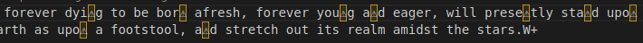

# Code Breaking Tryouts

_Solution Guide_

## Overview

This challenge asks competitors to break adversarial codes to uncover vital intelligence. 

When deploying a hosted version of this challenge, answers are randomly generated for each deployment. This guide provides the steps to solve the challenge and the answers for the artifacts provided in the challenge directory.

## Question 1

_What is the passcode recovered from the Unicode message problem? (10 alphanumeric characters)_

- iteonauslr

### Unicode Decoding

Teams can find the applicable files or this part of the challenge on the `challenge.us/files` site under the Unicode-translation.zip package.

The zip contains a mapping key file, a character set, a dictionary file, one passcode file, and 10 unique encoded messages.

First, teams must determine the translation key by calculating the character counts for the specific characters in the text of the dictionary.txt
file.

You can do this many ways. One script we found was as follows:

```
#!/bin/bash
rm -rf counts
string="abcdefghijklmnopqrstuvwxyz ABCDEFGHIJKLMNOPQRSTUVWXYZ1234567890!@#$%^&*()-_=+;:,.?'\""    #You should escape the first " to include it in the counts

for (( i=0; i<${#string}; i++ ))
do
  j=${string:$i:1}
  echo $j","`tr -cd "$j" < dictionary.txt | wc -c` >> counts
done
```

The above script will iterate over each character in the character set (escaping to account for the first double-quote character), count the
number of times this character appears in the file, and then write the character and count in a csv comma-delimited fashion to the counts file.

Alternatively, you can do a search for each character one by one in something like VS Code and build the table manually in a spreadsheet-type 
application, though this can be prone to error and you have to be specific by case.

Open the counts file and make sure to account for the space character as this cell/value will appear as blank. You can convert
this file to a .csv simply by changing the filename or importing the data as such. You will want to account for the comma character and double
quotes when opening the file as a .csv as those could be used as cell delimiters and string delimiters.


Once you have the character frequency counts for all 84 characters open in the spreadsheet you can sort them by number and then copy this column to the mapping key file retrieved from `challenge.us/files`.


Your mapping table should look like the screenshot above. The full mapping is as follows.

  |ASCII|Unicode|ASCII|Unicode|ASCII|Unicode|ASCII|Unicode|ASCII|Unicode|ASCII|Unicode|
  |-------|---|---|---|----|---|----|---|----|---|----|---|
  |Space   |▬   |f   |◪   |W    |▫   |?    |◘   |1    |◲   |*   |◀|
  |e       |◤   |w   |▸   |x    |□   |P    |●   |Q    |◩   |@    |◉|
  |t       |◛   |y   |◭   |S    |◜   |z    |○   |8    |▧   |7   |◰|
  |a       |◯   |p   |◧   |-   |◝   |G    |▷   |Z    |◍   |6    |▯|
  |n       |◆   |,   |▿   |;    |◣   |D    |▰   |9    |▼        |
  |o       |◄   |b   |◔   |B    |◕   |_   |◈   |4    |◱        |
  |i       |◡   |.   |◢   |!    |△   |Y    |▣   |3    |▭        |
  |h       |◇   |V   |▾   |O    |◮   |K    |◒   |2    |◌        |
  |s       |◎   |K   |◖   |E    |▲   |V    |▻   |5    |◬        |
  |r       |◃   |I   |▹   |q    |◨   |U    |◞   |$   |◑        |
  |d       |▱   |T   |◻   |j    |◠   |:    |◂   |=    |▵        |
  |l       |◗   |A   |◟   |L    |◫   |0    |◥   |+   |◦       | 
  |u       |◚   |M   |▪   |F    |▽   |)    |▤   |^   |▶        |
  |m       |◓   |H   |▴   |C    |◊   |(    |◁   |%   |◙        |
  |g       |◅   |'   |▮   |R    |◐   |J    |■   |#   |▢        |
  |c       |▦   |"   |►   |N    |▩   |X    |▥   |&    |▨        |

The expected character counts are as follows:

  |Char|Count|Char|Count|Char|Count|Char|Count|Char|Count|Char|Count
  |-------|-------|---|------|----|-----|----|-----|----|---|----|---|
  |Space   |54669   |f   |5901   |W    |372   |?    |121   |1    |5   |*   |0|
  |e       |33147   |w   |5806   |x    |359   |P    |118   |Q    |3   |@   | 0|
  |t       |24769   |y   |4702   |S    |323   |z    |103   |8    |3   |7    |0|
  |a       |21889   |p   |4530   |-   |319   |G    |99    |Z    |2   |6    |0|
  |n       |19089   |,   |4138   |;    |243   |D    |77    |9    |2        |
  |o       |18434   |b   |3797   |B    |213   |_   |76    |4    |2        |
  |i       |16398   |.   |3092   |!    |203   |Y    |51    |3    |2        |
  |h       |15960   |V   |2331   |O    |188   |K    |39    |2    |2        |
  |s       |15836   |K   |1981   |E    |184   |V    |34    |5    |1        |
  |r       |15521   |I   |1643   |q    |176   |U    |29    |$   |0        |
  |d       |12769   |T   |860    |j    |169   |:    |22    |=    |0        |
  |l       |10032   |A   |522    |L    |164   |0    |20    |+   |0       | 
  |u       |6997    |M   |464    |F    |141   |)    |19    |^   |0        |
  |m       |6388    |H   |440    |C    |140   |(    |19    |%   |0        |
  |g       |6292    |'   |411    |R    |135   |J    |16    |#   |0        |
  |c       |5998    |"   |406    |N    |129   |X    |12    |&    |0        |

Lastly, replace all of the characters according to the mapping in the message files. You can do this with a list of sed commands or some other
method potentially. You might find it easiest to create a CONCATENATE function in the spreadsheet application to write these commands for you,
then copy them to a script.


Once they are part of a script you can simply change the filename in the script for each file, or script the translation over the set of files
another way. Make sure to account for the single and double quotes by escaping as necessary.

A script including a list of the sed replacements should suffice.

Alternatively, you can do this by simply finding and replacing all characters for every file using something like VS Code. However,
this would be time intensive and prone to human error.

Using the proper sed replacements should reveal legible text, though some characters will still be scrambled into unknown Unicode symbols.



Each unknown character represents one of the most common letters in the English alphabet: `a e i o u r s t l` and `n`. Teams will have to use visual
analysis of the 10 messages to determine the additional mapping of these special characters into English/ASCII. For example, if the message contained "I lov◈ Pr◈sid◈nt's Cup", then the ◈ obviously stands for the letter "e." Each letter is used only once in the passcode string, so teams will need to determine the mapping for the unique characters to complete the string without guessing.


*Note, even in the above example you can make one or two mistakes in the overall translation and still be able to discern the messages. In this example, the anchor symbol would be the letter "l" (lowercase L). The letter "P" should have been "N."*

The mapping of Unicode to ASCII is always the same for each deployment but the passcode string file will be different--meaning the string for submission can be one of many possibilities.

Teams can enter this passcode as the submission for question 1 but this passcode will also be needed in the final part of the challenge to unlock one of the encrypted containers.

## Question 2

_What is the passcode recovered from the maillog/mail messages problem? (10 alphanumeric characters)_

 - UROsGBCO47

### Mail Log Dissection and Message Repair

Download the maillogs.zip file from `challenge.us/files`. The package contains a directory of 50 messages, a README, and a SentMessagesLog file.

There are a few things to take note of off the bat. First, note the person who authored the instructions. This person mentions that you should only be looking at messages sent by them. We'll get to that in a moment. Next, look at the SentMessageLog file. The file shows a table of Receiver IDs, Sender IDs, Message IDs, a SentTime, and a Message Hash value Pre-Encoding. Looking at the messages shows that each message matches one of the Message ID values and that the messages are all likely Base64 encoded.

A likely first step would simply be to decode all 50 messages and get that out of the way.

You can do this with a looping command:
```
for f in *; do base64 -d "$f" > decoded/"$f"; done
```
Making sure you create the `decoded` directory first. The command will throw an error trying to decode the `decode` directory in this example, but that is OK.

## 

You should be able to read the majority of the messages, but some will still have partially garbled text at points. These messages all contain clues to assemble the password/passcode but a critical part of the text is unreadable/corrupted.


Next, figure out which Sender ID to focus on. This part takes a little bit of guesswork but it's not a wild leap to see that the Sender and Receiver ID values are hexadecimal and might be some sort of GUID or partial hash match.

Sure enough, if you hash the names of your Sender, the first 8 characters will match one of the Sender IDs.


These are the messages you need to focus on. Of the 50 possible messages, 10 will be sent by the person in your challenge instance (the
others are used for other variants), and 5 of those 10 will contain clues to the password composition.

Condense your fileset down to just the five that make references to the password to make life easier. Then you can start working on reversing
the corruption.

The first part of the password implies a specific planet based on a number that is illegible. The second part of the password implies the
number of electrons in an element, but is also illegible. The third part of the password implies a size expressed in 10^n bytes notation, but
the case of the part is illegible. The fourth part of the password implies a number in reference to states joining the U.S. though the number is  illegible. The fifth part of the password is given without corruption and can be used as is and is always a number.

In each case, a critical piece of information is corrupted by the encoding of the original text. There are some assumptions to be made based on the context of these messages. For instance, we can safely assume that the question regarding the planets must be a number between 1 and 8 (sorry, Pluto). And that the text may be the number alone or the words 1st, 2nd, 3rd, 4th, 5th, 6th, 7th, or 8th. Since the number of Base64 malformed characters implies 3 characters are obscured, it's safe to try the full words. The question about an element must be a number between 1 and 118 based on the known elements, though the number of characters in the encoding implies only two characters are in use; so it should be between 10 and 99. The question about a unit of size implies that the only two options would be "upper" or "lower", but "upper" is somewhat implied based on context. The question about the state must be a number between 1 and 50, though again, the number of characters in use implies that we are looking for something higher than single digits, and the implied inclusion of "th" would reduce the possibilities even more.

Therefore, you should test each possible string, hash it, and see which one matches what was supposed to be sent. You can script this or do these tests manually until you find a match. For obvious reasons, the test regarding the elements or state will take the most tries due to the number of possibilities.

An example script might look like this (for the electron number):

```

for i in {1..118}
do
  cp 5a342648 5a342648-$i
  sed -i "g/(r/$i/s" 5a342648-$i
  md5sum 5a342648-$i >> hashlist
done

```

Then check the hashlist for a match to what is in the SentMailLog file. This number will help you answer the question to obtain that piece of the password.


After finding a matching message string when compared to the original message hash, simply answer the question (use online research if needed)
and compile the password in the correct order.

For example, if Jupiter is the one who sent your messages, your answers would be the 7th planet from the Sun (Uranus = UR), the element with 76 electrons (Osmium = Os), the unit of measure for Gigabyte in uppercase (GB), the 38th state to join (Colorado = CO), and the number 47. Making the password string: UROsGBCO47.

A complete list of answers to the questions and the proper text value to match the hash is below.

  |Sender|Text    |Answer   |Text   |Answer   |Text    |Answer   |Text     |Answer   |Text   |Answer|
  |---------|-------|--------|------|--------|-------|--------|--------|--------|------|--------|
  |Mars      |5th|   JU|       82   |  Pb   |    upper|   KB|       30th|   WI  |     N/A|    32|
  |Jupiter   |7th|   UR |      76   |  Os    |   upper|   GB|       38th|     CO|       N/A|    47|
  |Venus     |4th|   MA  |     87   |  Fr   |    upper|   MB|       35th|   WV|       N/A |   82|
  |Neptune   |8th|   NE   |    80  |   Hg   |    upper|   MB|       39th|   ND|       N/A |   19|
  |Pluto     |6th|     SA  |     93|     Np  |     upper|   KB|     34th|   KS|       N/A |   24|  

Possible passwords:

Mars -- `JUPbKBWI32`\
Jupiter -- `UROsGBCO47`\
Venus -- `MAFrMBWV82`\
Neptune -- `NEHgMBND19`\
Pluto -- `SANpKBKS24`

## Question 3

_What is the passcode recovered from the packet capture problem? (12 hexadecimal characters)_

 - c6e7b458e371

### PCAP Dissection and Analysis

Teams are given multiple files within the traffic.zip file: a key.pcapng file, a secret.txt file, a README, and a password.pcapng file.

Start the with key.pcapng file and README. The README file alludes to the key.pcapng file being used as the key for reading the contents of password.pcapng properly. The key.pcpang file shows 32 packets, each containing a short message or string of text of either ack, udp, res, icmp, or syn with a number. The packets in the key.pcapng file are also in a specific order of TCP ACK, UDP, TCP RES, ICMP, TCP SYN. This pattern repeats for all 32 packets and each message corresponds to the type of packet sent and its order.


The order of these packets and their messages is the order in which you should read the messages of the packets in password.pcapng. Therefore, you should read the message of the first TCP ACK packet, followed by the message of the first UDP packet, followed by the message of the first TCP RES packet, followed by the message of the first ICMP packet, followed by the message of the first TCP SYN packet, and then repeat for the 2nd, 3rd, 4th, 5th, 6th, and 7th of each until all 32 packet messages have been exhausted.

You can filter for each specific type of traffic and build a table of their contents with the following Wireshark filter strings:

ACK packets: `ip.src == 10.10.10.100 and tcp.flags.ack==1`\
UDP packets: `ip.src == 10.10.10.100 and udp`\
RES packets: `ip.src == 10.10.10.100 and tcp.flags.reset==1`\
ICMP packets: `ip.src == 10.10.10.100 and icmp`\
SYN packets: `ip.src == 10.10.10.100 and tcp.flags.syn==1`

Then build a table of the packet messages/contents in order.


Last, convert these values in order from Hex to ASCII to get the password string. This string will always be an easily legible string, so you will know if something in your translation has gone wrong.

In the example above the hex string would become:
`5468697349734D5950617373776F7264`

This converts to an ASCII string of: `ThisIsMYPassword`

Thus it is clear that we have indeed recovered a legible password.

Next you must repair the secret.txt file, which is actually the pcap data of the original capture in text format.

The file has been shuffled so that the line numbers displayed on the left-hand side are not in order. The sort command will solve this for
you:
```
sort -n secret.txt > secret-sorted.txt
```
Next, you should recognize that this is a text dump of the pcap data. Therefore the packet data contents are preserved in hex form in the text file.

Simply copy out the hex data that corresponds to any data packets within the file to a new file in order. Whitespace is OK, as the eventual conversion will ignore it.


Next, you will want to remove the first 11 characters from each line to remove the line numbering and hex position numbering (which resets for each packet) to reduce the output to just the raw hex.


```
cut -c11- ascii-dump.txt > hexdump
```

Then remove the last 19 characters to leave just the hex values. There are likely more ways to do this, but one way with sed is:
```
sed 's/...................$//' < hexdump > rawhex
```

Then convert the hexdump to a binary file:
```
xxd -r -p rawhex > secret.zip
```

As long as you see an unzipping prompt when viewing the zip file, then it has been extracted properly.


Using the password found initially, open the zip file and view the image file within. This image contains the 3rd passcode.


## Question 4

_What is the location (star, planet, moon, etc) of the meetup event for the code breaker competitors?_

 - Titan

### Accessing the Encrypted Container

First, download the container.zip and extract the .img file and the README which includes the instructions to open the container.

Per the instructions, the final location data is contained within the container.img encrypted container. The password to unlock the container
is the concatenation of the previous three passcodes, i.e. passcode1|passcode2|passcode3 (pipes used here only to represent concatenation and should not be included in the string).

The README mentions the container being created with luks which implies using cryptsetup to open it.

There are two ways to include the password when unlocking the container, and you will also need to mount the container to access it once unlocked.

You can either create a password/key file that includes the 32-character password or pass the password to the command prompt when opening it with
cryptsetup/luks.

The command to use a key file would be:

```
sudo cryptsetup luksOpen container.img myVolume --key-file key.bin
```

where myVolume is any name you wish to call the created volume and key.bin is the key file with the password (be careful there is not an additional newline character in the key.bin file).

The command to use the password when typed is simply:

```
sudo cryptsetup luksOpen container.img myVolume
```

Then you will be prompted to enter the password, though there is no confirmation when entered correctly.

After this, mount the volume to some location of your choice (assuming the mount location already exists):

```
sudo mount /dev/mapper/myVolume /home/user/mount
```

If successful you can simply browse to the mount point, check the directory contents, and read the "final-location" file to get the location of the meeting.


The name of the location is randomized but is always one of ten various large moons of Jupiter, Saturn, Neptune, or Uranus. Just the name of the
moon is required.    
