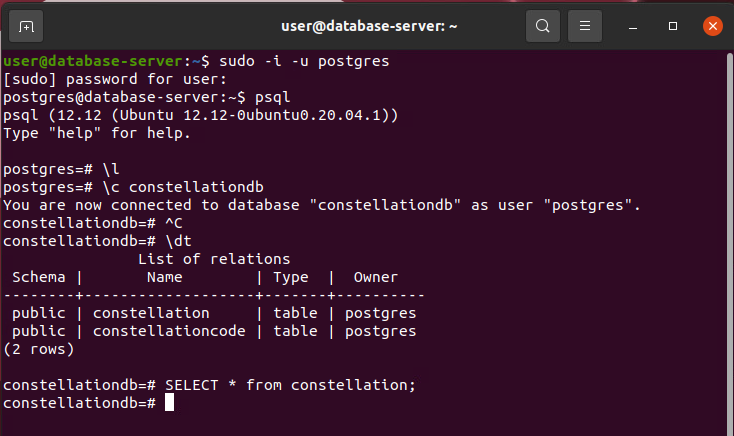

# It's Got to be Somebody's Data

_Solution Guide_

## Overview

There is one variant for _It's Got to be Somebody's Data_. This solution guide covers the walk-through for that single variant, organized by submission question.  Question 3 is further broken down into smaller steps.

## Question 1

*Enter the six integer values that represent the three pairs of weights as a comma-separated list.*

You can modify the `waypoints.py` file to produce the correct answers. A sample solution is provided [here](Question1Solution.py).

```
denseNerualLayer = Dense(units=1, input_shape=[1])  
#mod = Sequential([Dense(units=1, input_shape=[1])])  
mod = Sequential([denseNerualLayer])

mod.fit(waypoints1, waypoints2a, epochs=1000)
```

Add this line to the end of the script: `print(denseNerualLayer.get_weights())`.

Run the script three times, one for each of the waypoints lists:

```
mod.fit(waypoints1, waypoints2a, epochs=1000)  
mod.fit(waypoints1, waypoints2b, epochs=1000)  
mod.fit(waypoints1, waypoints2c, epochs=1000)  
```

Each run will produce a pair of numbers: `27, -5`, `19, -4`, `21, -2`.  The final answer is a combination of these numbers. The order is not important. 
`27, -5, 19, -4, 21, -2`

## Question 2

*Provide a comma-separated list of galaxy names that are not present in the image collection.*

There are multiple ways to solve this problem. We will use a Python script and optical character recognition to read each of the images, parse the text, and add the unique image names to a list. We will compare them to the galaxy names in the **galaxyreferencelist.txt** file. The two missing galaxy names are the correct answer.

Start by obtaining the **galaxies** folder and **galaxyreferencelist.txt** file from the **question2** folder of the ISO image attached to the Kali Analyst Workstation. 

Install the following libraries on the Kali workstation if the are not already present:

```
sudo apt-get update  
sudo apt-get install tesseract-ocr  
sudo apt-get install libtesseract-dev
```

Use a Python script similar to [this one](Question2Solution.py).

The final answer for this question is: `BACKWARDGALAXY, HOAGSGALAXY`

## Question 3

Provide the name of the constellation encoded in the **event_data** collection. Follow the procedures described in Steps 1-5 below to get the answer.

#### Step 1: Find all of the images that contain labels with the word "orange"

Start by extracting the **orangeimages ZIP** file from the **question3** folder of the ISO image attached to the Kali Analyst Workstation. The **ChallengeImages** folder contains 1,000 images, each with a QR code. Fourteen of the images contain oranges (the citrus fruit). The QR codes on these images contain 14 unique start names with the complete constellation name.

The approach we take is to use a Python script with the detecto and cv2 libraries to find the images containing labels with the word "orange", then read the QR codes. You could also choose to read all of the QR codes then filter or sort by the QR code data.

A sample solution is provided [here](Question3Solution.py). This may take 20 or more minutes to run depending on the available hardware resources. Competitors might find it faster to just read all QR codes, then filter the returned data. We are demonstrating one way to solve the problem.

Reading the QR codes in all of the images and filtering via trial and error is a faster, but less exact approach. You may have to run the program a few times and adjust it based on your results. A second sample solution is provided [here](Question3Solution2.py).

- V0990 Hercules

- V2138 Ophiuchus

- V0719 Monoceros

- V1907 Sagittarius 

- V1167 Ara

- V2173 Orion

- V0714 Cassiopeia

- V1560 Scorpius

- V0387 Bootes

- V2590 Sagittarius

- V0516 Hercules

- V3144 Cygnus

- V0621 Scutum

- V1439 Scorpius


#### Step 2: Connect to the database server

Connect to the database server. If you look at the **Star_Name_ID.csv** file located in the **/home/user/Documents** folder you will notice that it contains star names with abbreviated constellation names.  


#### Step 3: Explore the data in the Postgres and MongoDB databases

Explore the data in the Postgres and MongoDB databases.

```
Connect to Postgres  
sudo -i -u postgres  
psql
```


List the databases: `\l`


Connect to the database and list the tables.  

```
\c constellationdb  
\dt 
```


Query the tables.  

```
SELECT * FROM constellation;  
SELECT * FROM constellationcode;  
```




Connect to MongoDB: `mongo`


List the databases and collections: `show dbs`  


Connect to the events database and query the `event_data` collection.  

```
use events  
show collections    
db.getCollection("event_data").find({})
```


Now that we understand the data and the relationships between these three data sources, we can start using it to find the unique records in the `event_data` collection. 

The NameCode values are an anagram for the constellation name we are trying to locate. This tells us we need to start with the data found in the **ChallengeImages** folder and end with a set of records from the `event_data` collection. The NameCode values for each of these records contain the answer.

Here are the values we should be able to extract from the images and their QR codes:

- V0990 Hercules
- V2138 Ophiuchus
- V0719 Monoceros
- V1907 Sagittarius
- V1167 Ara
- V2173 Orion
- V0714 Cassiopeia
- V1560 Scorpius
- V0387 Bootes
- V2590 Sagittarius
- V0516 Hercules
- V3144 Cygnus
- V0621 Scutum
- V1439 Scorpius

Using the list of 14 stars we identified above we can get the abbreviated names using this method.

#### Step 4: Find the abbreviated name 

Look up a name, such as Hercules, in the Postgres constellation table.  

- Hercules > Her 
- Ophiuchus > Oph
- Monoceros > Mon
- Sagittarius > Sgr
- Ara > Ara
- Orion > Ori
- Cassiopeia > Cas
- Scorpius > Sco
- Bootes > Boo 
- Cygnus > Cyg
- Scutum > Sct  

Match the Id column value of 67373678-10B5-7931-1B66-4484B97A6A74 to the Id column of the constellationcode table. For Hercules, this will give us **Her**. 

Looking up V0990 Her in the Star_Name_ID.csv file will give us an Id of 1995239.283.

**1995239.283,V0990 Her**

These Ids match the values in the StarId field of the event_data collection.

If we search the MongoDB event_data collection for this StarId, we can get the corresponding NameCode.

```
db.getCollection("event_data").find({StarId: 1995239.283})

{ "_id" : ObjectId("6369327168534bcdd02fc8e2"), "EventId" : "c6618836-fb03-4328-aaa3-883be17f917a", "StarId" : 1995239.283, "Tval" : 0.8709967306368551, "Rval" : 0.42254947331652326, "Sval" : 0.5101621506475732, "NameCode" : "E" }
```

The value "E" is the NameCode value we need.

Repeat this process for all of the records:

V0990 Her - 1995239.283
V2138 Oph - 3567999.259
V0719 Mon - 5286063.018
V1907 Sgr - 5802812.392
V1167 Ara - 5894906.34
V2173 Ori - 8790749.365
V0714 Cas - 9888713.876
V1560 Sco - 11603707.84
V0387 Boo - 12971814.59
V2590 Sgr - 14440201.43
V0516 Her - 15669144
V3144 Cyg - 17235764.38
V0621 Sct - 18438102.03
V1439 Sco - 18822850.08  

```
db.getCollection("event_data").find({StarId: 1995239.283})
db.getCollection("event_data").find({StarId: 3567999.259})
db.getCollection("event_data").find({StarId: 5286063.018})
db.getCollection("event_data").find({StarId: 5802812.392})
db.getCollection("event_data").find({StarId: 5894906.34})
db.getCollection("event_data").find({StarId: 8790749.365})
db.getCollection("event_data").find({StarId: 9888713.876})
db.getCollection("event_data").find({StarId: 11603707.84})
db.getCollection("event_data").find({StarId: 12971814.59})
db.getCollection("event_data").find({StarId: 14440201.43})
db.getCollection("event_data").find({StarId: 15669144})
db.getCollection("event_data").find({StarId: 17235764.38})
db.getCollection("event_data").find({StarId: 18438102.03})
db.getCollection("event_data").find({StarId: 18822850.08})

{ "_id" : ObjectId("6369327168534bcdd02fc8e2"), "EventId" : "c6618836-fb03-4328-aaa3-883be17f917a", "StarId" : 1995239.283, "Tval" : 0.8709967306368551, "Rval" : 0.42254947331652326, "Sval" : 0.5101621506475732, "NameCode" : "E" }

{ "_id" : ObjectId("6369327168534bcdd02fcb80"), "EventId" : "843776a2-b5e1-4559-ba6d-24d6c8cfb2ff", "StarId" : 3567999.259, "Tval" : 0.7879134839528693, "Rval" : 0.11128741651619423, "Sval" : 0.8656730944324232, "NameCode" : "A" }

{ "_id" : ObjectId("6369327168534bcdd02fce40"), "EventId" : "6b836421-c696-4833-8bba-c1cd95d0f040", "StarId" : 5286063.018, "Tval" : 0.20698267950136628, "Rval" : 0.04976391334332286, "Sval" : 0.5261443714200646, "NameCode" : "L" }

{ "_id" : ObjectId("6369327168534bcdd02fd021"), "EventId" : "1d6d58c5-baf4-4d88-a78c-7c0ae20ef29a", "StarId" : 5802812.392, "Tval" : 0.8279475836569112, "Rval" : 0.48622577598451744, "Sval" : 0.32920810184420224, "NameCode" : "R" }

{ "_id" : ObjectId("6369327168534bcdd02fd3a4"), "EventId" : "c9aad2af-14d2-4451-ade9-44a826a1ba49", "StarId" : 5894906.34, "Tval" : 0.6077781814956221, "Rval" : 0.045613165421399815, "Sval" : 0.7313227719655085, "NameCode" : "S" }

{ "_id" : ObjectId("6369327168534bcdd02fd4d8"), "EventId" : "c101e776-0db2-4e49-a75d-555ab1194f48", "StarId" : 8790749.365, "Tval" : 0.22923979203388845, "Rval" : 0.6007455683410229, "Sval" : 0.9947055859775684, "NameCode" : "C" }

{ "_id" : ObjectId("6369327168534bcdd02fd615"), "EventId" : "fc680b93-e86f-4a6d-aa0b-6f15c247aa77", "StarId" : 9888713.876, "Tval" : 0.03526925599183539, "Rval" : 0.593648527650393, "Sval" : 0.09453258476682536, "NameCode" : "L" }

{ "_id" : ObjectId("6369327168534bcdd02fd852"), "EventId" : "e0625d0a-8a14-49a3-ae2b-45f26d76ecc2", "StarId" : 11603707.84, "Tval" : 0.9899939210221884, "Rval" : 0.451630820974244, "Sval" : 0.7186116475751074, "NameCode" : "O" }

{ "_id" : ObjectId("6369327168534bcdd02fddee"), "EventId" : "2b3a1f53-39cd-48bb-a356-7026ad7717e5", "StarId" : 12971814.59, "Tval" : 0.08390908251419005, "Rval" : 0.9955738825309299, "Sval" : 0.36997915338008713, "NameCode" : "D" }

{ "_id" : ObjectId("6369327168534bcdd02fe2d5"), "EventId" : "522afcfa-defe-494e-8192-186f16e6f11c", "StarId" : 14440201.43, "Tval" : 0.49545520210564375, "Rval" : 0.014646622561984124, "Sval" : 0.4631805752452417, "NameCode" : "M" }

{ "_id" : ObjectId("6369327168534bcdd02fe692"), "EventId" : "b63c0cf8-462f-4d03-ad5c-0b0eb93aede4", "StarId" : 15669144, "Tval" : 0.15467196738343603, "Rval" : 0.1686840846531965, "Sval" : 0.9471582059752357, "NameCode" : "A" }

{ "_id" : ObjectId("6369327168534bcdd02feaac"), "EventId" : "f3b06c56-4ba6-414e-ab0b-cde80ed6e122", "StarId" : 17235764.38, "Tval" : 0.7527315889139815, "Rval" : 0.3552655277943928, "Sval" : 0.8138051128333056, "NameCode" : "I" }

{ "_id" : ObjectId("6369327168534bcdd02fec61"), "EventId" : "30410d54-d723-448b-b3aa-7334edd4f623", "StarId" : 18438102.03, "Tval" : 0.6827434044019072, "Rval" : 0.6744115632288797, "Sval" : 0.777057623026038, "NameCode" : "P" }

{ "_id" : ObjectId("6369327168534bcdd02fee84"), "EventId" : "5451663e-1acc-4e06-bda9-e0b24216d1dd", "StarId" : 18822850.08, "Tval" : 0.2977371473628475, "Rval" : 0.19411858265834248, "Sval" : 0.8701484502696005, "NameCode" : "A" }
```

Once we get the fourteen unique records from the `event_data` collection we can write a database query to find the constellation name that has all of the characters we identified in the `event_data` collection.

`E A L R S C L O D M A I P A`

#### Step 5: Collect the final answer

Go back to the PostgreSQL database. Writing a select query and choosing some random letters will quickly get you to the correct answer.

`SELECT * from constellation where name LIKE '%p%' AND name LIKE '%d%';`


The final answer for this question is: `CAMELOPARDALIS`

## Question 4

Find the token hidden in the video. 

We have a video file with evidence that someone was searching for something interesting in the audio. Retrieve the **findme.m4v** file from the ISO attached to the Kali Analyst Workstation. Use the audio embedded in the video to find the easily detectable differences in the audio level. Use the timing of the audio events to find the significant portions of the video that will contain the token parts you are looking for.

Start by using **ffmpeg** or another audio tool to separate the audio track from the video and save it as a wave file.  

`ffmpeg -i findme.m4v -vn findme.wav`

Use code similar to [this file](Question4Solution.py) to find the timestamps associated with the notable audio events. The output of this file shows the parts of the audio track with detectable noise. The values represent seconds. Looking at the transitions will show you values roughly like this:

- 736 seconds
- 5567 seconds
- 8585 seconds
- 13556 seconds 

 

  

  

  

- 736 seconds / 60 = 12.26667 minutes 
- 5567 seconds / 60 = 92.78333 minutes 
- 8585 seconds  / 60 = 143.0833 minutes 
- 13556 seconds  / 60 = 225.9667 minutes 

Once you located the approximate time of the four events, open the **FindMe.m4v** from the ISO attached to the Kali Analyst Workstation and begin watching the video during those times. You will see all four parts of the token identified in order, but you might need to scan through the identified areas slowly.

  

1. Event 1: token = 24
2. Event 2: token = fc 
3. Event 3: token = 8d
4. Event 4: token = f6

The final answer for this question is: `24fc8df6`
