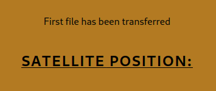

# Moving Day

_Solution Guide_

## Overview

_Moving Day_ is an infinity-style challenge. The steps used to solve all challenge instances will be similar, but the answers will vary. Start by providing an IP to the Kali system between 123.45.67.1 and 123.45.67.99 with a 24 subnet mask value.

Teams can split up the initial enumeration work by having one player enumerating the site for the hidden storage and shutdown pages, while another player controls the satellite dish to retrieve data files. Once the data files are retrieved, additional players can start analyzing these files.

## Enumerating the website and Web API to adjust the antennae

Reviewing the satellite operation manual provides several key pieces of information, including the default administrative credentials. Scan and webscan the satellite to find the port the site is running on and the login page.

You can verify which port the website is running by trying to connect to port 5000 and 5500 in the browser--only one will work. SSH is open, but will not be accessible. If you try to connect to port 5000 you will see a redirect link to the login page.

Connect to http://123.45.67.100:5000/login and use the administrative credentials in the manual to login. The creds are **admin** | **h0m3C0m1nG**. The following page holds the satellite position.

Figure out the structure to send commands to move the satellite. The satellite can only be moved *X commands* per entry at a time and each movement takes approximately five seconds as the satellite dish must relay its current position before it can be moved again.

There is a faster method you can use to move the satellite if you do some more scanning/enumeration.

If you analyze the satellite, you will find an endpoint that is used to execute satellite move commands. This is located at **123.45.67.100:5050/run**. If you browse to that page, right-click, **inspect**, and look at the console there are basic instructions on how to format any move commands that are received. 

Using this information, it is possible to bypass using the admin site GUI to move the satellite and also bypass the five-command limit that is implemented.

Here is an example command that follows the syntax described:

    azimuth:+1:degree.elevation:-1:minute.azimuth:-1:minute

Once the command is created, you will need to make sure it is URL encoded. It should look something like this:

    azimuth%3A%2B1%3Adegree.elevation%3A-1%3Aminute.azimuth%3A-1%3Aminute

From here, put the URL all together like so:

    http://123.45.67.100:5050/run?cmd=azimuth%3A%2B1%3Adegree.elevation%3A-1%3Aminute.azimuth%3A-1%3Aminute

Using this method, you can send any number of commands to the satellite rather than only sending 5 at a time.

## Finding the storage location of the satellite

### Question 1   

_Enter the value of the storage-token, found by listing the files on the admin storage interface._  

You will need to scan the website's **admin** pages, which require a user to be logged in or the active cookie. You need to store the cookies that your browser is currently using for the admin user.

Right-click anywhere on the page and click **Inspect**. Under the **Storage** tab, click on the **Cookies** side menu item. Here you can view your current cookies.

Use the cookies here to run a scan against the site with `dirb`. Your command should look something like this, using your specific cookie token values:

`dirb http://123.45.67.100:5000/admin/ -c 'remember_token=
1|173d88e42f1eb807d1f3d6b7acec7b7de939fa283d3b3debe3c82d76f20be3f72d46d19777a69eb6a03267a41784b9680016a93e7c779ef820da39988edfae99'
-c 'session=
.eJwlzj0OwjAMQOG7eGawEztOe5kq8Y9gTemEuDuVeOtbvg8cueJ8wv5eVzzgeDns0O9UnVKYJpOStNmZqViSUbNWHJO1lJadmDM3koFpGNNDAmWS1FC9T3oMtZLqLtKt9TqlNp8Y6i02ZLJSpI45jBTH2HoYwQ25zlh_DcH3B4tgL2o.Y3FRAQ.AlXwkUaUeDzn9iHy4L8WRoVbVFs'`

Once completed, dirb should have found three directories; the storage page is the one found at http://123.45.67.100:5000/admin/storage.

In the manual, there is a mostly corrupted page referring to the storage page that alludes to using a **?filename=*** option to list files.

Doing so for the first time will display the token for finding the storage location. Submit this token in the proper submission field.

## Retrieving the data packages

Direct the satellite dish to one of the three coordinate pairs listed in the challenge guide. The example structure of the commands is:

`move azimuth +1 degree`

`move elevation -1 minute`

Continue sending commands until the satellite is positioned at one of the three coordinates listed in the guide.

As you retrieve each data package they will appear on the storage page and a notice will be placed on the satellite's control page. As data packages are retrieved, teammates can start analyzing them independently.

The file you last received will always be highlighted on the site for reference (first, second, third).

After you retrieve the first data package the logic of the commands will do the opposite of what you tell it to do. Moving the dish up, for example, will move it down. Moving it left will move it right. Therefore, give it the opposite instructions that you normally would in order to point the antenna at a second coordinate pair to then retrieve the second data package.

Once you retrieve the second data package the logic will change once again to alternate between doing what you tell it to do and the opposite. If you tell it to move up and right, it will move up and left. If you tell it to then move right and right to correct, it will move right and then left. Alternate commands to point it to the third and final coordinate pair to retrieve the third data package. This adjustment is worth more because you have to alternate while keeping track of which logic you are on.

Once all data packages are retrieved, download them from the storage page found previously for analysis. At this point the satellite antenna movement functionality will crash with a fatal error and cannot be used again. You will still be able to access the downloaded files from the storage page.

### Question 2  

_Enter the value of the wa-token, found with the data recovered from the orbital weapons array (wa-data.zip)?_
`5ddb455e92e3`

### Question 3   

_Enter the value of the sd-token, found with the data recovered from the moon base supply depot(sd-data.zip)?_  
 `fa3380b77d35`

### Question 4  

_Enter the value of the hq-token, found with the data recovered from the headquarters building (hq-data.zip)?_  
`3039f52bd65f`

> **Note:** The shutdown sequence can be performed at any point after all three files are retrieved, but the solution is listed at the end of this guide. You cannot perform the shutdown sequence unless all three files are retrieved.

## Analyzing the weapons array data

### Question 5

_Using the data in wa-data.zip, what is the total battle complement of the weapons array as of the final report?_
`32994`

The weapons data comes in a few different reports. The first is a **September 1st** status report. This report provides the status of the weapons array as of this date. The report will list the total complement of weapons and munitions as well as which and how many of each weapon are offline or damaged.

In essence, this report provides the start state of the array for correlating changes over time.

Be aware:

-   the status report lists the starting inventory amounts in hex, so you will need to convert it to decimal to make life easier
    
-   the status report lists the number of online, offline, and total of each weapon type

The other reports come in two types: battle reports (br) and re-supplies (rs).

- **Battle reports** record munitions spent and weapons that were damaged or made inoperable during that altercation.

- **Re-supply reports** record how many new weapons systems were delivered or replaced and how many munitions were replenished.

In order to calculate the overall change, you can make a spreadsheet-type tracker or any other method for recording the numbers. In the end, it's all addition and subtraction, so the overall calculation is commutative, though the reports are labelled with timestamps.

Additionally, the battle reports and status reports are the same for each of the five variations for this part of the challenge. The only thing that changes is the number of systems that start in the offline/damaged state. Read the data from each battle report and re-supply report and place the amount of  change per report in a spreadsheet.

This table dictates the math:

This table could be used to calculate the change over time and the values of each weapon and munition on hand according to the final report.

The **total value** is the answer for submission for this part of the challenge. The five possible values are **32994**, **31644**, **31994**, **30644**, and **31294**.

## Analyzing supply depot data

### Question 6

_Using the data in sd-data.zip, what is the total weight (in kilograms) of the final inventory stock plus shipping containers as of the final invoice date for the original supply depot? (number only, out to two decimal places)_  
`17185.12`

The supply depot data comes in two forms: a starting **inventory list** and **invoices of supplies** to be sent out to specific ships over time.

The inventory list is the starting inventory as of Sept 1st. The list includes the item name, SKU, amount on hand, weight per unit, and volume per unit. The weight and volume per unit will come into play at the end of the inventory calculations  to determine the overall shipping weight of the supplies to be moved to the new moonbase.

The simplest way to solve this one is to track which items are being shipped out and subtracting those amounts from the starting totals in a spreadsheet or .csv file. You can do this by hand but there are some programmatic ways to make this more efficient and reliable.

First, sort the SKU's to place them in a known order.

Then, take all of the invoice SKU/amount pairs and put them in their own column to sort that by SKU. Spreadsheet applications will be able to consolidate like items making totaling easier.

Further convert these values to negative numbers and consolidate these values with the original inventory values to get the final totals.

At the end, multiply all of the current inventory times their respective volumes to get the total volume required to ship the items. This will tell you how many containers will be needed at a minimum. Multiply each inventory item by its respective weight and total the weights. Finally, add the weight for the necessary containers to the total.

This number is the answer for submission. You do not need to include the unit of kg, just the number.

The possible total weight values, depending on your deployment, will be: **17185.12**, **16941.56**, **16990.60**, **17034.23**, or **17096.48**.

## Analyzing the headquarters data

### Question 7

_Using the data in hq-data.zip, what is the code name of the person who was in each room when each BOOM was heard?_  
`5V5XIE`

The headquarters data comes in one single file, a series of RFID badging logs for the headquarters building. There is also a reference sheet explaining how to use the RFID logs to identify the person who was in each room when the mysterious noise was heard. This data can be analyzed with consolidation and correlation methods.

Import the text into a spreadsheet application for analysis, making sure to delimit by the **:** character.

Alternatively, you might be able to do the same with some clever scripting and parsing. This solution guide walks through the spreadsheet approach.

First, identify the three times the "BOOM" was detected: 

1. a first in room 5 between timestamp 1668175586 and 1668175590, 
2. a second in room 8 between timestamp 1668177068 and 1668177072, and 
3. a third in room 12 in between timestamp 1668179465 and 1668179466

For each room, you only need to be concerned with who was in the room at the time the "BOOM" occurred and then correlate who was in all three rooms - only one single individual.

To begin, look for individuals who entered room 5 but have not left room 5 by the time of the first "BOOM". To do so, filter for those who left room 4 in the "R" direction prior to a timestamp of 1668175587. Save this list.

Filter for those who left room 5 in either direction prior to the same timestamp.

Cross-check these two lists for those not on both, these were the individuals who were in room 5 at the "BOOM". You can do this manually, or do some function in a spreadsheet application to compare the two columns and find where matches do not exist, something like:
`=IF(COUNTIF($B:$B, $A2)=0, "Match Not Found", "")`

Save the list of those who were in Room 5 off to another tab or list.

Repeat the same process for those who left room 7 to the right, but did not exit room 8 either L or R by the timestamp 1668177069.

Repeat the same process for those who left room 11 to the right, but did not exit room 12 either L or R by the timestamp 1668179466.

Once you have all three lists of who was in each room at the time of the "BOOM", either visually compare or perform another spreadsheet function to
find where matches do not exist.

## Shutting down the satellite

### Question 8

_Enter the token awarded for successfully shutting down the satellite - visit https://challenge.us to retrieve this token._

Using the same method/cookies we used to scan and find the storage page, scan again to find the **shutdown** page.

Skipfish or other web scanning tools will help find the hidden page:

`skipfish -C "Session=**token found**" -o ./output
http://123.45.67.100:5000/admin`

Once completed, it will produce a new folder with multiple files containing information. In the new **output** directory, you can open the generated report by double-clicking **index.html**.

Click the hidden page to go to it. Note that the page is actually running on port 5050, and you should instead redirect your browsing to http://123.45.67.100:5000/admin/emergency-SD.

After you browse to the new shutdown page, you will see:

The satellite manual lists the emergency shutdown procedures once you have accessed the administrative shutdown page. The logic provided dictates the following:

1.  Each colored button is only pressed once in the sequence
2.  The red button is pressed last
3.  The yellow button is pressed before the green
4.  The blue button is not pressed first
5.  The blue button is pressed immediately after the yellow button
6.  The orange button is not pressed second
7.  The orange button is pressed after the green button

**Therefore, the following must be true:** red is pressed last. Blue is not first and must come after yellow, which in turn must come before green, which in turn must come before orange. Thus, yellow must be pressed first. Blue is pressed second. Green must come before orange.

**The full sequence is:** Yellow, Blue, Green, Orange, Red.

Once the proper shutdown sequence has been entered, the admin site will state that the shutdown has been initiated and any attempt to further connect to the satellite will result in getting a response that the satellite is offline.

Browse to: https://10.5.5.5 and run the grading check to verify this. If done correctly you will be presented with the final token.
