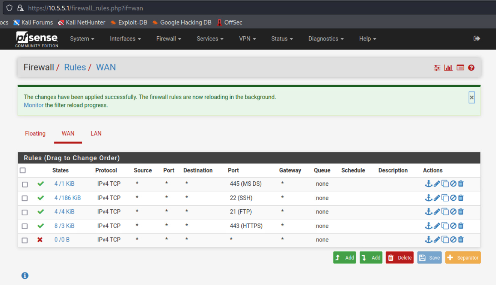
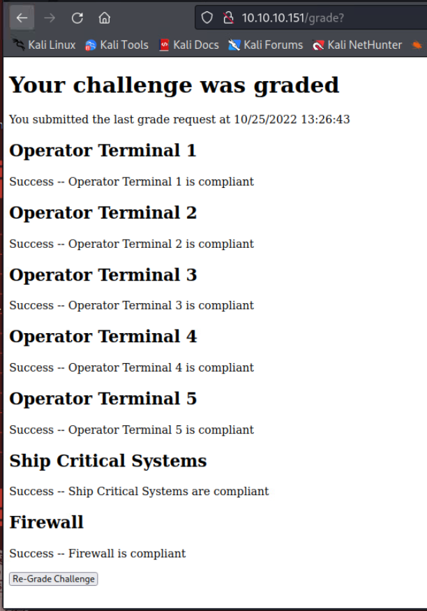

# Aurellian Galactic Museum 
_Solution Guide_

## Overview
The Aurellians have a massive museum where they showcase many of the objects they’ve collected from the thousands of worlds they have conquered. The crew of the _Dauntless_ would love to get access to the archives but the snobbish Aurellian Elite caste members won’t give them permission to dock, as they consider the human’s spaceship to be a massive deathtrap as soon as they detect the nuclear reactor on-board. The only way space-OSHA regulations would even allow them near the precious museum is if they are reclassified as a garbage-scow hauling hazardous waste. As such, the players must meet a compliance checklist for such a vessel.

## Getting Started
1. From one of the operator terminals, open a web browser and navigate to http://10.10.10.151.  
2. Click the Grade Challenge button.  


You will receive a series of messages detailing the state of the seven systems that must be compliant for the grading script to pass.

 

3. Connect to each of the virtual machines (VMs) and make the necessary changes to make them compliant.  

## Operator Terminal 1 (operator-terminal-1)

### Disable root login via SSH  
1. Open the `/etc/ssh/sshd_config` file.  
2. Find `PermitRootLogin` setting and change it to “no”.  
3. Save the file and restart the SSH service: `sudo systemctl restart sshd`.

### Make the samba share read-only  
1. Open the `/etc/samba/smb.conf` file.  
2. Find the sharedfiles configuration section.  
```
[sharedfiles]  
path = /home/user/sharedfiles  
valid users = user  
read only = no  
```
3. Change the `read only` setting from "no" to "yes".  
4. Save the file and restart the service: `sudo systemctl restart smbd`.

## Operator Terminal 2 (operator-terminal-2)

### Disable root login via SSH  
1. Open the `/etc/ssh/sshd_config` file.  
2. Find `PermitRootLogin` setting and change it to “no”.  
3. Save the file and restart the SSH service: `sudo systemctl restart sshd`.  

### Change the webapp account password on the PostgreSQL database server  
Connect to the local database server.  
```
sudo -i -u postgres  
psql  
ALTER USER webapp WITH PASSWORD 'new_password';
```  
The password can be changed to any value other than the current value which is: `password`

If you receive any grading errors related to Postgres, you may need to restart the postresql service.
`sudo systemctl restart postresql`

## Operator Terminal 3 (operator-terminal-3)

### Disable root login via SSH  
1. Open the `/etc/ssh/sshd_config` file.  
2. Find `PermitRootLogin` setting and change it to “no”.  
3. Save the file and restart the SSH service: `sudo systemctl restart sshd`.

### Disable anonymous access to the FTP server  
1. Open the `/etc/vsftpd.conf` file.  
2. Edit the setting `anonymous_enable`.  
3. Change it from: `anonymous_enable=YES`  
to: `anonymous_enable=NO`.
4. Remove these settings:  
```
anon_root=/home/user/ftp/  
no_anon_password=YES  
hide_ids=YES
```
5. Save the file and restart the service: `sudo systemctl restart vsftpd`.

### Make the Samba share read-only  
1. Open the `/etc/samba/smb.conf` file.  
2. Find the sharedfiles configuration section.  
```
[sharedfiles]  
path = /home/user/sharedfiles  
valid users = user  
read only = no  
```
3. Change the `read only` setting from `no` to `yes`.  
4. Save the file and restart the service: `sudo systemctl restart smbd`.

## Operator Terminal 4 (operator-terminal-4)

### Disable root login via SSH  
1. Open the `/etc/ssh/sshd_config` file.  
2. Find `PermitRootLogin` setting and change it to “no”.  
3. Save the file and restart the SSH service: `sudo systemctl restart sshd`.

### Create and install an SSL certificate in Apache
Generate the Root CA, Intermediate and Server Certificates

1. Login to the server where the apache web server is installed and running
2. Run the following commands:  
```
cd /home/user  
mkdir root  
cd root  
mkdir tls  
cd tls  
mkdir intermediate  
mkdir certs  
mkdir private  
echo 01 > serial  
touch index.txt
cp /etc/ssl/openssl.cnf /home/user/root/tls/
sudo vi openssl.cnf
```
3. Find the `[ CA_default ]` section and update the following settings:  
```
set dir = /home/user/root/tls  
certificate  = $dir/certs/cacert.pem
new_certs_dir = $dir/certs
```
4. Add this section below the `[ v3_ca ]` section:  
```
[ v3_intermediate_ca ]  
subjectKeyIdentifier = hash  
authorityKeyIdentifier = keyid:always,issuer  
basicConstraints = critical, CA:true, pathlen:0  
keyUsage = critical, digitalSignature, cRLSign, keyCertSign
```
5. Save the file.  
6. Generate the certificate key  
`openssl genrsa -out private/cakey.pem 4096`
7. View the key  
`openssl rsa -noout -text -in private/cakey.pem`
8. Create the root certificate. When you run this command you will need to answer a few questions  
`openssl req -new -x509 -config openssl.cnf -extensions v3_ca -key private/cakey.pem -out certs/cacert.pem`
9. Convert it to PEM format  
`openssl x509 -in certs/cacert.pem -out certs/cacert.pem -outform PEM`
10. Create the intermediate certificate by running the following commands: 
```
cd intermediate
mkdir certs  
mkdir csr  
mkdir private  
touch index.txt  
echo 01 > serial  
echo 01 > crlnumber
cd ..  
cp openssl.cnf intermediate/  
cd intermediate  
sudo vi openssl.cnf
```
11. Find the `[ CA_default ]` section and update the following settings:  
```
dir = /home/user/root/tls/intermediate # Where everything is kept  
certificate     = $dir/certs/intermediate.cacert.pem   # The CA certificate  
private_key     = $dir/private/intermediate.cakey.pem  # The private key  
policy          = policy_anything  
```
12. Save the file
13. Create the intermediate key  
`openssl genrsa -out private/intermediate.cakey.pem 4096`
14. Create the intermediate certificate signing request (CSR). When you run this command you will need to answer a few questions. Leave the challenge password blank when prompted.\
`openssl req -new -sha256 -config openssl.cnf -key private/intermediate.cakey.pem -out csr/intermediate.csr.pem`
15. Create the certificate  
```
cd ..  
openssl ca -config openssl.cnf -extensions v3_intermediate_ca -notext -batch -in intermediate/csr/intermediate.csr.pem -out intermediate/certs/intermediate.cacert.pem
cat index.txt
```
16. Verify the certificates
```
openssl x509 -noout -text -in intermediate/certs/intermediate.cacert.pem
openssl verify -CAfile certs/cacert.pem intermediate/certs/intermediate.cacert.pem
```
17. Convert to PEM format  
`openssl x509 -in intermediate/certs/intermediate.cacert.pem -out intermediate/certs/intermediate.cacert.pem -outform PEM`
18. Create the certificate chain    
`cat intermediate/certs/intermediate.cacert.pem certs/cacert.pem > intermediate/certs/ca-chain-bundle.cert.pem`
19. Create the server certificate  
```
cd certs  
openssl genrsa -out server.key.pem 4096
```
20. Create the certificate signing request. When you run this command you will need to answer a few questions. Leave the challenge password blank when prompted. \
`openssl req -new -key server.key.pem -out server.csr`
21. Create the server certificate  
```
openssl x509 -req -in server.csr -CA /home/user/root/tls/intermediate/certs/ca-chain-bundle.cert.pem -CAkey /home/user/root/tls/intermediate/private/intermediate.cakey.pem -out server.cert.pem -CAcreateserial -sha256
sudo a2enmod ssl
sudo systemctl reload apache2
sudo a2ensite default-ssl  
sudo systemctl reload apache2
cd /etc/apache2  
cd sites-available  
sudo vi 000-default.conf
```
22. Change 
`<VirtualHost *:80>`
to
`<VirtualHost *:443>`
23. Set the following values:  
```
ServerName: www.mydomain.com  
SSLEngine on  
SSLCertificateFile /home/user/root/tls/certs/server.cert.pem  
SSLCertificateKeyFile /home/user/root/tls/certs/server.key.pem  
SSLCertificateChainFile /home/user/root/tls/intermediate/certs/ca-chain-bundle.cert.pem
```
25. Save the file
`sudo systemctl reload apache2`
26. View your website. You will have to accept any warnings and choose to continue.
### Change the webapp account password on the PostgreSQL database server
Connect to the local database server.  
```
sudo -i -u postgres  
psql  
ALTER USER webapp WITH PASSWORD 'new_password';
```
The password can be changed to any value other than the current value which is: `password`

If you receive any grading errors related to Postgres, you may need to restart the postgresql service.
`sudo systemctl restart postgresql`

## Operator Terminal 5 (operator-terminal-5)

### Disable root login via SSH  
1. Open the `/etc/ssh/sshd_config` file.  
2. Find `PermitRootLogin` setting and change it to “no”.  
3. Save the file and restart the SSH service: `sudo systemctl restart sshd`.

### Disable anonymous access to the FTP server  
1. Open the `/etc/vsftpd.conf` file.  
2. Edit the setting `anonymous_enable`.  
3. Change it from: `anonymous_enable=YES`  
to: `anonymous_enable=NO`.
4. Remove these settings:  
```
anon_root=/home/user/ftp/  
no_anon_password=YES  
hide_ids=YES
```
5. Save the file and restart the service: `sudo systemctl restart vsftpd`.

## Ship Critical Systems (ship-critical-systems)

The ship-critical-systems VM has four docker containers that must be running. Each of the containers is started by a service, with the configurations located in `/etc/systemd/system/`.
By default, these containers are started on the same host network, rather than using the best practice of running these containers on their own networks. Users need to modify the configuration files. 

Open an operator terminal and ssh to `user@10.5.5.136`.

Stop the services:
```
sudo systemctl stop communicationWatch
sudo systemctl stop navigationWatch
sudo systemctl stop pilotWatch
sudo systemctl stop flightWatch
```

Add the networks:  
```
docker network create --driver bridge flightnet  
docker network create --driver bridge commsnet  
docker network create --driver bridge navnet  
docker network create --driver bridge pilotnet
```

You will need to find the ports for the networks:
```
/home/user/criticalSystems/flight/flightListener.py (25200)  
/home/user/criticalSystems/comms/communicationListener.py (22900)  
/home/user/criticalSystems/nav/navigationListener.py (29600)  
/home/user/criticalSystems/pilot/pilotListener.py (31400)
```

Navigate to `/etc/systemd/system` and edit the service files listed below:

**flightWatch.service**  
Change: `ExecStart=/usr/bin/docker run --rm --name flightContainer --network host -t flight`  
To: `ExecStart=/usr/bin/docker run --rm --name flightContainer --network flightnet -p 25200:25200 -t flight`

**communicationWatch.service**  
Change: `ExecStart=/usr/bin/docker run --rm --name commsContainer --network host -t comms`  
To: `ExecStart=/usr/bin/docker run --rm --name commsContainer --network commsnet -p 22900:22900 -t comms`

**navigationWatch.service**  
Change: `ExecStart=/usr/bin/docker run --rm --name navContainer --network host -t nav`  
To: `ExecStart=/usr/bin/docker run --rm --name navContainer --network navnet -p 29600:29600 -t nav`

**pilotWatch.service**  
Change: `ExecStart=/usr/bin/docker run --rm --name pilotContainer --network host -t pilot`  
To: `ExecStart=/usr/bin/docker run --rm --name pilotContainer --network pilotnet -p 31400:31400 -t pilot`

Run `sudo systemctl daemon-reload` to reload services with an updated config.

Start all of the services:
```
sudo systemctl start flightWatch.service    
sudo systemctl start communicationWatch.service    
sudo systemctl start navigationWatch.service  
sudo systemctl start pilotWatch.service
```

Make sure all containers are running:
`docker ps -a`

Run `sudo systemctl daemon-reload` to display the name of the network and their corresponding containers.   

```
NETWORK ID     NAME        DRIVER    SCOPE  
1151452c442e   bridge      bridge    local  
519e0a68cbd9   commsnet    bridge    local  
a02dbb6ce887   flightnet   bridge    local  
b97ed310685a   host        host      local  
1d24bab5660a   navnet      bridge    local  
4915634f40a3   none        null      local  
eb330c98b1b5   pilotnet    bridge    local
```

Verify that the following networks are listed under the NAME column:

```
commsnet  
flightnet  
navnet  
pilotnet  
```

## Firewall (gateway-router)

1. Connect to the gateway-router VM that is running pfSense by browsing to `10.5.5.1`.  
2. Login with `admin/tartans`. By default, all traffic from the WAN side is allowed through.  
3. For the grading test to pass, block all WAN side TCP traffic except for the ports listed below.

```
21 tcp  
22 tcp  
443 tcp   
445 tcp  
```



### Run the Grading Script

From one of the operator terminals, open a web browser and navigate to http://10.10.10.151. Click the Grade Challenge button.  


You will receive a series of messages detailing the state of the seven systems that must be complaint for the grading script to pass.




## Retrieve Codex E

Once users have brought all systems into compliance, they will be moved to the `museum-close` vlan. Here they will find a single VM with an IP address of 10.10.10.57.
Connect to the SMB share named `MuseumGuests (smb://10.10.10.157/MuseumGuests)` and retrieve the `CodexE` file.

