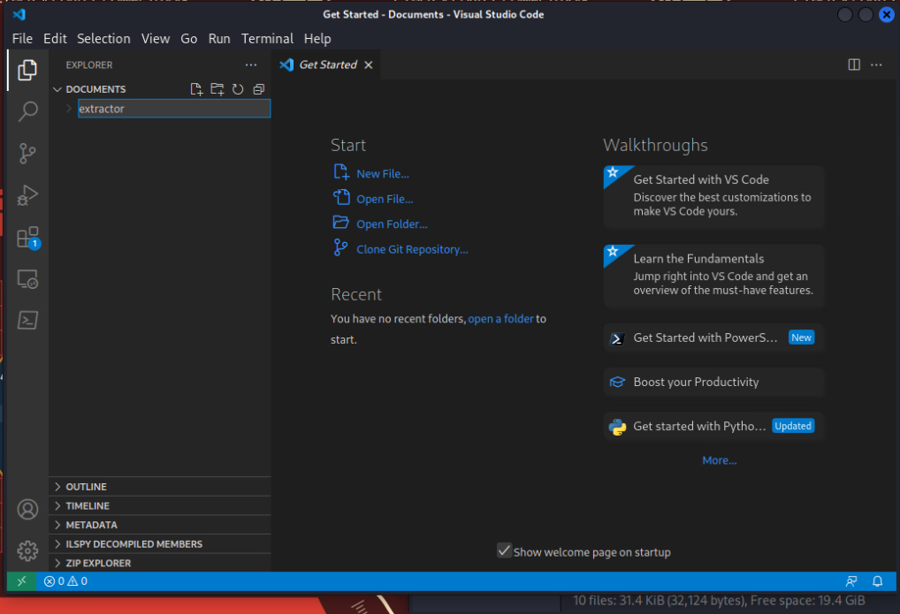

# Final Goal Program

_Solution Guide_

## Overview

To complete the final goal, players must discover the address of the final location. They accomplish this by compiling an executable from a combination of the main program's source code while referencing the three DLLs obtained by submitting Alien codex files. Then, run the resulting executable against the six data-sets to decode the final answer. The final answer is a set of coordinates given as two (2) sets of three (3) case insensitive alphanumeric characters (e.g., **123/abc**, **a2n/3ib**).

In order to ensure that players can finish the game by solving any three challenges, the files are split up as follows:

- **Archive A:** All six data files, no source code.
- **Archive B:** Library File #2, Library File #3, Main Source File, Data File 4, Data File 5, Data File 6.
- **Archive C:** Library File #1, Library File #3, Main Source file, Data File 2, Data File 3, Data File 6.
- **Archive D:** Library File #1, Library File #2, Main source file, Data File 1, Data file 3, Data File 5.
- **Archive E:** Library File 1, Library File 2, Library File 3, Data File 1, Data File 2, Data File 4.  

The final solution can be built using Visual Studio Code or from the C# command-line tools on any of the five Kali Linux operator terminals.

### Answer Quick Reference

The correct answer is provided here for your convenience.

Provide the coordinates of the final artifact to save Mars. 

`20x/y4R`

## Question 1

_Provide the coordinates of the final artifact to save Mars._

1. Start by moving all of the collected archives to the operator terminal and extracting them.

  

2. Open Visual Studio Code.

3. From the terminal, enter the following command: `dotnet new console --name extractor`

   

   

   

4. Copy the **DataExtractor1.dll**, **DataExtractor2.dll** and **DataExtractor3.dll** files into the root of the new extractor directory.

5. Copy the **DataFile1.txt**, **DataFile2.txt**, **DataFile3.txt**, **DataFile4.txt**, **DataFile5.txt**, and **DataFile6.txt** files into the root of the new extractor directory.

6. Replace the **Program.cs** text in the extractor directory with code similar to that below.

   

```cs
using System;
using System.IO;

namespace FinalProgram
{
    internal class Program
    {
        private static DataExtractor1.Class1 dataExtractor1 = new DataExtractor1.Class1();
        private static DataExtractor2.Class1 dataExtractor2 = new DataExtractor2.Class1();
        private static DataExtractor3.Class1 dataExtractor3 = new DataExtractor3.Class1();

        static void Main(string[] args)
        {
            string finalCoordinates = ProcessFile1();
            finalCoordinates = finalCoordinates + ProcessFile2();
            finalCoordinates = finalCoordinates + ProcessFile3();
            finalCoordinates = finalCoordinates + "/";
            finalCoordinates = finalCoordinates + ProcessFile4();
            finalCoordinates = finalCoordinates + ProcessFile5();
            finalCoordinates = finalCoordinates + ProcessFile6();

            Console.WriteLine("Final Coordinates: " + finalCoordinates);
        }

        private static string ProcessFile1()
        {
            var text = string.Empty;

            using (var sr = new StreamReader("DataFile1.txt"))
            {
                text = sr.ReadToEnd();
            }

            string result = dataExtractor1.Method1(text).ToString();
            return result[733].ToString();
        }

        private static string ProcessFile2()
        {
            var text = string.Empty;

            using (var sr = new StreamReader("DataFile2.txt"))
            {
                text = sr.ReadToEnd();
            }

            string result = dataExtractor2.Method4(text).ToString();
            result = dataExtractor2.Method4(result).ToString();
            return result[116].ToString();
        }

        private static string ProcessFile3()
        {
            var text = string.Empty;

            using (var sr = new StreamReader("DataFile3.txt"))
            {
                text = sr.ReadToEnd();
            }

            string result = dataExtractor2.Method1(text).ToString();
            return result[393].ToString();
        }

        private static string ProcessFile4()
        {
            var text = string.Empty;

            using (var sr = new StreamReader("DataFile4.txt"))
            {
                text = sr.ReadToEnd();
            }

            string result = dataExtractor3.Method1(text).ToString();
            return result[840].ToString();
        }

        private static string ProcessFile5()
        {
            var text = string.Empty;

            using (var sr = new StreamReader("DataFile5.txt"))
            {
                text = sr.ReadToEnd();
            }

            string result = dataExtractor1.Method3(text).ToString();
            return result[257].ToString();
        }

        private static string ProcessFile6()
        {
            var text = string.Empty;

            using (var sr = new StreamReader("DataFile6.txt"))
            {
                text = sr.ReadToEnd();
            }

            string result = dataExtractor2.Method3(text).ToString();
            return result[905].ToString();
        }
    }
}
```

7. Edit the **extractor.csproj** file, adding the following values inside the element.

  

```cs
    <ItemGroup>
        <Reference Include="DataExtractor1.Class1">
          <HintPath>DataExtractor1.dll</HintPath>
        </Reference>
        <Reference Include="DataExtractor2.Class1">
          <HintPath>DataExtractor2.dll</HintPath>
        </Reference>
        <Reference Include="DataExtractor3.Class1">
          <HintPath>DataExtractor3.dll</HintPath>
        </Reference>
    </ItemGroup>

    <ItemGroup>
        <None Update="DataFile1.txt">
          <CopyToOutputDirectory>Always</CopyToOutputDirectory>
        </None>
        <None Update="DataFile2.txt">
          <CopyToOutputDirectory>Always</CopyToOutputDirectory>
        </None>
        <None Update="DataFile3.txt">
          <CopyToOutputDirectory>Always</CopyToOutputDirectory>
        </None>
        <None Update="DataFile4.txt">
          <CopyToOutputDirectory>Always</CopyToOutputDirectory>
        </None>
        <None Update="DataFile5.txt">
          <CopyToOutputDirectory>Always</CopyToOutputDirectory>
        </None>
        <None Update="DataFile6.txt">
          <CopyToOutputDirectory>Always</CopyToOutputDirectory>
        </None>
        <None Update="DataExtractor1.dll">
          <CopyToOutputDirectory>Always</CopyToOutputDirectory>
        </None>
        <None Update="DataExtractor2.dll">
          <CopyToOutputDirectory>Always</CopyToOutputDirectory>
        </None>
        <None Update="DataExtractor3.dll">
          <CopyToOutputDirectory>Always</CopyToOutputDirectory>
        </None>
    </ItemGroup>
```

8. Save and close the **extractor.csproj** file.

9. Make sure you are in the correct directory (where the **.csproj** file is located). Run the following command in the VS Code terminal window: `dotnet build`

   

10. If there are any build errors, correct them and run the build command again.

    

11. Run the program from the VS Code terminal window with the following command: `dotnet run`

    

The final output should be printed out. **Final Coordinates:** `20x/y4R`
