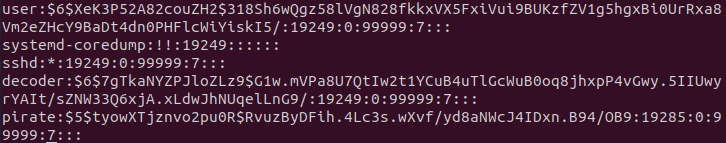
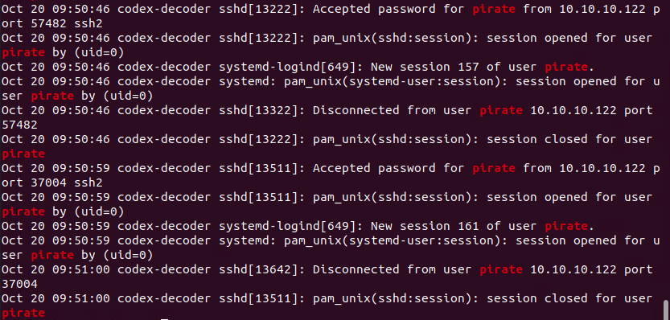
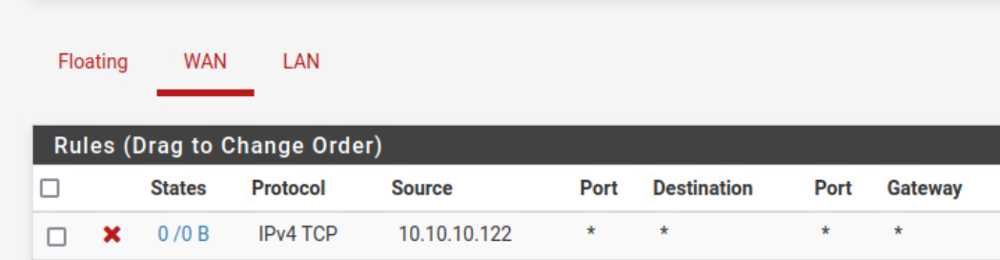
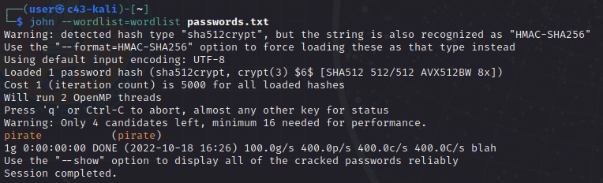
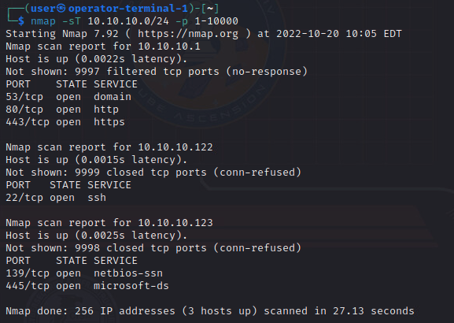
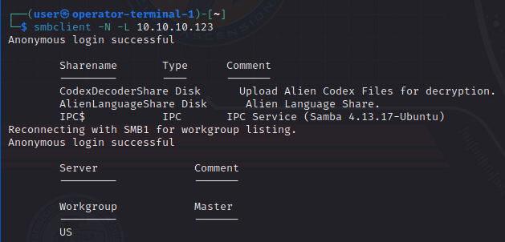

# Red Raider

_Solution Guide_

## Overview

This solution guide describes the _Red Raider_ challenge: how the pirate-attacker system attacks; how challengers can prevent the attack; and, in turn, how challengers can attack the pirate, locate and retrieve the codex, and complete the challenge.

## Red Raider attack script

The pirate-attacker VM will take actions against the codex-decoder and through the decoder, the ship-critical-systems. A cronjob activates five minutes after boot that will start off the scripted attack chain.

The pirate-attacker system will continuously poll the network via ping for the appearance of the ship once it enters the deepspace network.

Once a ping is received from the ship, it will immediately try to pull down the dictionary file over SMB. It will continue trying until the dictionary file is received for as long as the ship remains in the deepspace network in the event that SMB is disabled or a file with that exact name cannot be found in the proper location.

SMB services must be enabled and the file must be accessible on the codex-decoder for this portion to be successful. Once the file is received the grading output will be modified from "fail" to "success."

Once the dictionary file is received and the status message is changed, the pirate-attacker system will begin its attacks. It will not try to grab the dictionary file again unless somehow the dictionary file is deleted from the attack system. As far as the attacker VM is concerned, it only needs to get this file once.

The attacker will conduct an exploit against a known vulnerability in policy kit. This exploit interrupts the prompt that would be sent to a user in the GUI by killing the process midstream, thus completing the next task without interaction whether it should be allowed or not.

Using this exploit the pirates will create a root-level account on the codex-decoder under `pirate|phantom`.

The way to prevent this attack is to either disable the policy kit (not recommended, though not impossible) or disable the malicious user account. In theory, if the account is disabled, but not deleted, the attack script will fail to do anything further. Players could block the attacker IP, effectively blocking it from doing anything further. SSH connection logs/auth.log or firewall state logs should show the attacker IP address and the account name.

Now that the pirate-attacker has a root account on the system, it will attempt to pass an ssh command through the codex-decoder to the ship-critical-systems VM to shutdown and remove all Docker containers.

The way to prevent this attack would be to block the attacker system at the source/gateway firewall, disable remote Docker commands on the ship-critical-systems VM, disable the pirate account on the codex-decoder, or set up some type of watchdog service to make sure the containers stay up.

The process described above will run endlessly on a loop for the duration of the scenario. If teams remove the pirate account, it will attempt to add it back. If teams leave the deepspace network and return, it will try all attack efforts again on a loop. If the attacker system ever loses access, it will loop in place until access is restored. The real solution is to block the attacker IP at the gateway firewall.

## Gaining access to the Pirate Codex

Attacking the raider-codex-decoder can be done with the same policy kit exploit, though it would be tricky to figure out this is what led to the account creation. Teams would need to research this exploit to know how to conduct it and read their own codex-decoder logs to understand it. 

The easier way - and the way described in this guide - is to discover that the same `pirate|phantom` credentials will work on the raider-decoder's SMB share.

John the Ripper can assist in this. Simply extract the **/etc/shadow** contents for the pirate account and the **/etc/passwd** contents for the pirate account from the codex-decoder.

From an operator-terminal you can ssh to the decoder and collect those files:
- `ssh user@10.5.5.19`
- `sudo less /etc/shadow` > copy this text out for at least the pirate account line
- `sudo less /etc/passwd` > copy this text out for at least the pirate account line

Once you have copies of these files on any operator-terminal system (Kali) and retrieve the wordlist from the ISO mounted to the operator terminals, use unshadow on the files to create a passwords.txt file: `unshadow password.txt shadow.txt > passwords.txt`.

Then, use John the Ripper against this file with the wordlist:
`john --wordlist=/path/to/your/wordlist.txt passwords.txt`

The screen capture above is only an example. The actual password will be `phantom`.

Teams should scan for, and then scan, the running services of the raider-codex-decoder system running at **10.10.10.123** which is running SMB over port 445. Teams will know that the **10.10.10.0/24** space is the operating space based on logs from the attacker's SSH connections.

SMB is running just as it is in the codex-decoder on the pirate-decoder. Access to this share allows teams to capture any files with the found credentials.

Teams can query for the running shares:

Connect and get the contents of the shares:

`smbclient //10.10.10.123/AlienLanguageShare -U pirate`
`smbclient //10.10.10.123/CodexDecoderShare -U pirate`

Lastly, retrieve the alien dictionary file:

`smb: \> get dictionaryfile.txt` (you will need to replace with actual name once it is on the system).
