# A View to a Spill
*Solution Guide*

## Overview

Investigate device lists and network traffic to access ship security cameras to confirm evidence of a data leak. Remediate the issue to prevent future leaks.

## Question 1

*What is the flag found by accessing the correct camera's video storage page?*

Review the files found here: `challenge.us/files` as per challenge guide instructions. These files include a device list, a transmission log, an alphabet translation file, and an exemplar packet capture (**pcap**). You will need all four files to fully solve the challenge.

Review the security website found here: `security.merch.codes`(`10.4.4.100`).

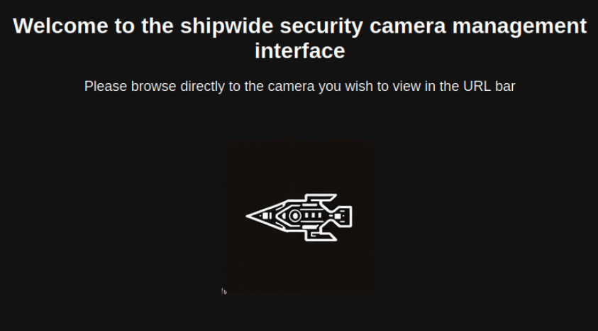

The page says to "browse directly to the camera you wish to view in the URL bar". There is nothing in the page source that 
alludes to the correct page format or how to access each camera.

View the packet capture to see how to connect to a camera page. The packet capture holds typical traffic for a ship as captured by Security Onion. You will see several web connections to several ship sites as well as package installations. Look for connections including **security.merch.codes**. We know that the connections appears to be over HTTP and not HTTPS. Exporting HTTP Objects can also help locate the traffic.

Looking at HTTP traffic for security.merch.codes should display a connection to an exemplar camera site.

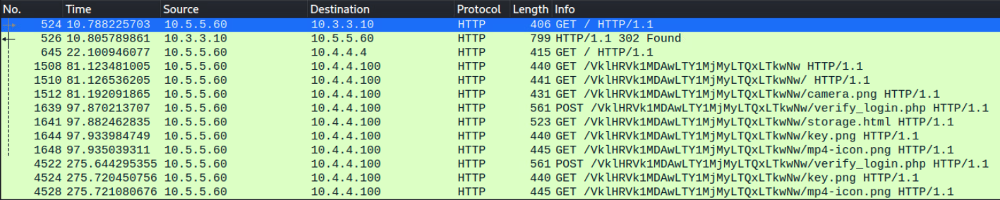

The URL request appears to have some sort of encoded structure, which looks like Base64. The question becomes: "*What is the string encoded from and how is each camera unique?*"

The device list shows ten cameras in use on the ship. Each has a unique serial number; every other detail except its location is identical (same make and model).

Test encoding one of these serial number strings proves fruitful because the prefix "**VIGEYE5000-**" is the same for each camera and the encoded string partially matches the camera in the exemplar traffic.

You can encode the string with the following command (be mindful of the no newline option):

```bash
echo -n "VIGEY5000-" | base64
```

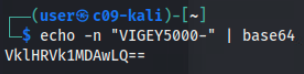

Next, encode an entire serial number as a test.

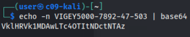

Then attempt to browse to this camera with `http://security.merch.codes/[your Base64 string]`.

You should successfully hit the camera's login page.

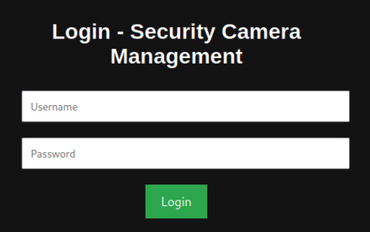

Without correct credentials, you can't bypass authentication to access the camera's storage. Viewing the page source confirms this. The security crew is adamant that exposed credentials are not a way to gain malicious access (this is mentioned in the challenge document). While credentials are visible in the packet capture, these are from another ship, and were never intended to allow access on this instance of security.merch.code. The guide also mentions that there must be something else on the network that is accessible. We'll look elsewhere.

Back to the packet capture. We could search for the string `security` and review all instances for clues.

This would be time consuming, but would lead to the same result as a faster approach: looking at resolved hosts and/or DNS traffic.

The packet capture is relatively small, so you may spot the random DNS requests for `security-v6.merch.codes` which responds with an address of `fdab:1:1:2::1002`.

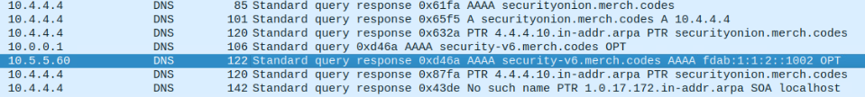

In Wireshark, **Statistics** > **Resolved Addresses** > **Hosts** shows the returned hostnames and IP pairs.

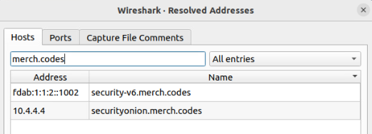

So, perhaps there is an equivalent IPv6 site out there unbeknownst to the security team!

Check your IP settings - notice you already have an IPv6 address on the **fdab:1:1:1::1000/64** network. Browsing to the IPv6 address for the security-v6.merch.codes takes you to an alternate site.

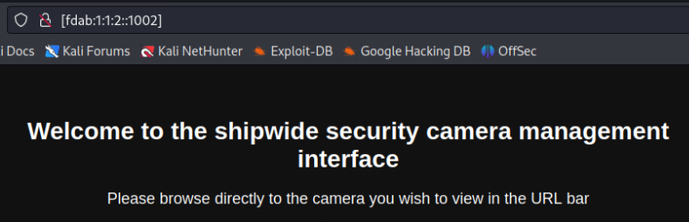

Try the same URL suffix again to hit the same camera as before. This works, but note the lack of authentication before you are taken right to the camera's storage page, which lists a set of video files.

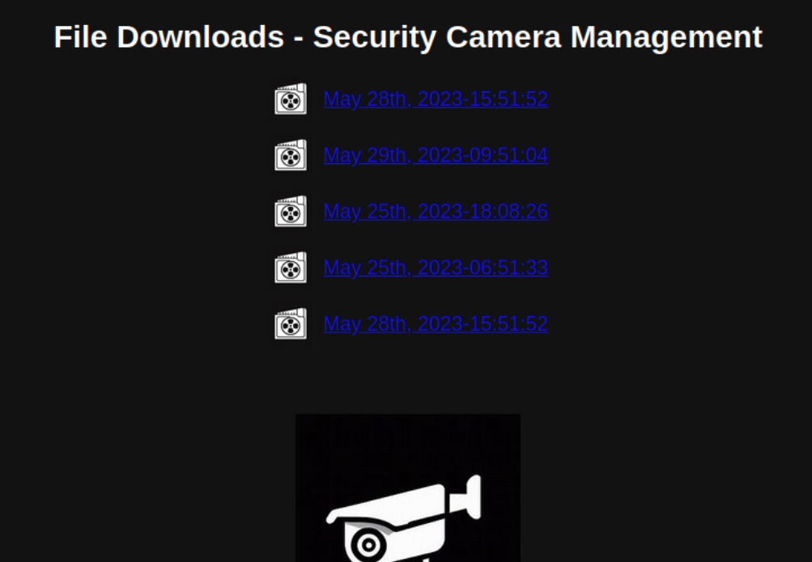

Depending on which camera you accessed first, you may not find anything useful. Since we are specifically looking at instances involving the security crew, the likely candidate is the camera in the Security Control Room. The device number of this camera is unique to each gamespace and so is the Base64 encoding and URL string required.

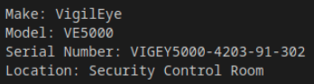

Encode the serial number:

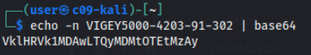

Browse to this camera. You should see a list of 11 files - one token and ten video files with date stamps.

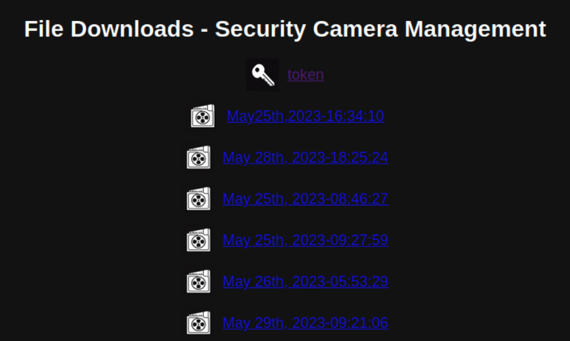

Ignore the files with date/timestamps for now.

Open the token file and submit this string as the answer to Question 1.

*Note: It is entirely possible to glean the webserver SSH credentials that you would receive later on in the packet capture data. With this you could SSH into the webserver and perform local discovery of the IPv6 website files to find the token. While this is not the originally intended method of solving this challenge, it is an equally acceptible method for solving questions 1 and 2. The same basic steps would apply to figure out which camera is which, and which video file contains the code phrase you are looking for.*

## Question 2

*What is the sensitive data (in English) sent within the correct video file for the camera in question?*

The Security Control Room camera's IPv6 page shows ten video files - all of which could have some data. The key file matches one of the timestamps in the transmission log and is marked as "**Sensitive/Mission Critical**".

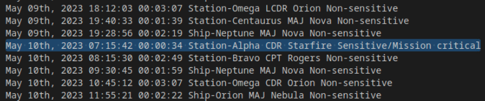

One of the files has a timestamp matching one of these Sensitive/Mission Critical transmissions.

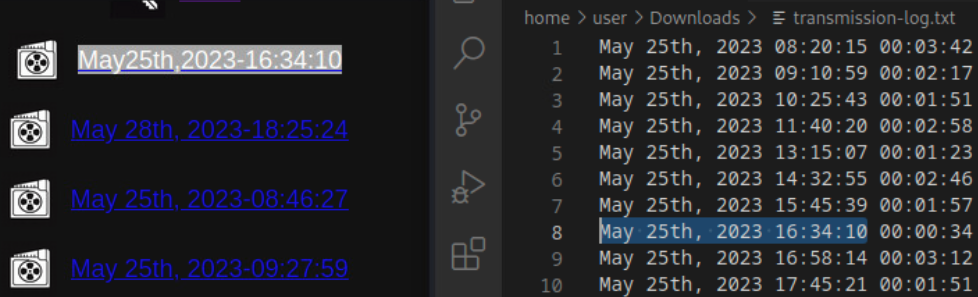

The video looks like this:

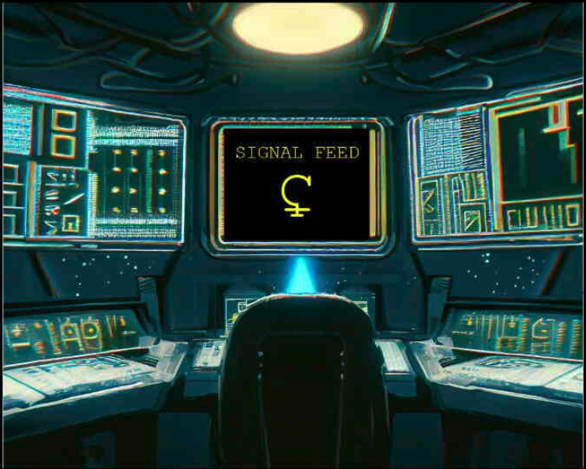

Using the alphabet translation file,  decipher the contents of the message in English. Substitute each Aurelian character to English to produce a 12-character alphabetical string. The only character that appears to be tricky depending on the rendering of the Unicode character in your text editor is "**L**". It appears somewhat like a figure eight, but no other character looks like this, and since the chain code string will be a combination of space-themed familiar words, you can deduce the translation.

There are ten possible strings chosen at random. The ten possible strings are:

1. stardustbeam
2. lunarglowing
3. nebulatwirls
4. cometseekers
5. cosmicwander
6. astrojourney
7. starlitegaze
8. lunareclipse
9. nebulagalaxy
10. celestialsky

## Question 3

*What is the token provided by the grading check?*

Once you have retrieved **token1**, place its contents into the **token.txt** file on the Kali Desktop. Then go to `challenge.us` from Kali and grade the challenge.

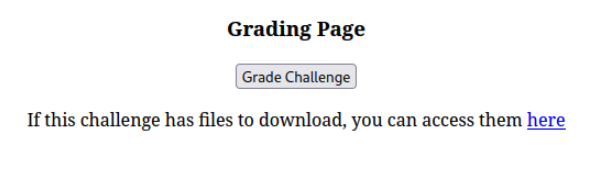

The first time you grade, the check only verifies that the token value is correct in `/home/user/Desktop/token.txt`. The reason is: the remediation instructions would give away that an alternate IPv6 site is running. By asking for the token in-game, the grading check can validate that you have successfully found the IPv6 site and its token *first*. If successful, you will see a page like this (the check will take a moment):

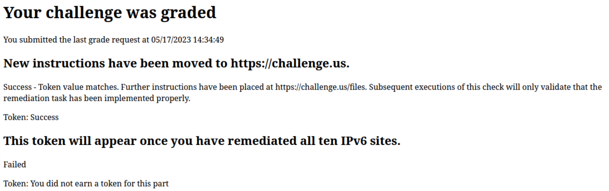

The text points you to `challenge.us/files`, where a new file is available. Browse to `challenge.us/files` and read the new instructions on how to remediate the IPv6 site.

The remediation steps are simple and credentials are provided so you can remotely access the web server.  Copy the same login formatted **index.html** page from one of the IPv4 site folders to the IPv6 folders, and also the **verify_login.php** and **storage.php** files.

Remote into the web server with the credentials `user | M0r3S3cur34L1f3`:

```bash
ssh user@10.4.4.100
```

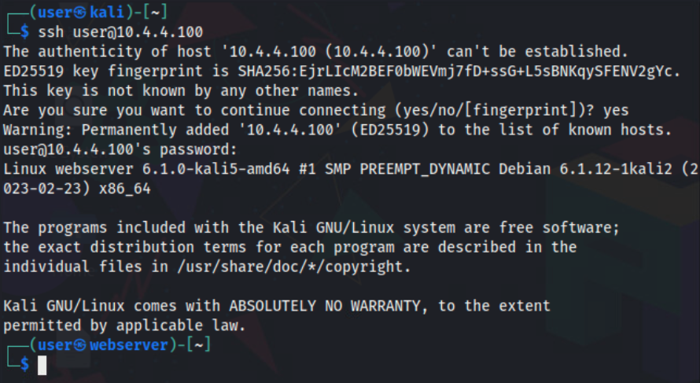

Browse to one of the IPv4 camera directories to see its contents:

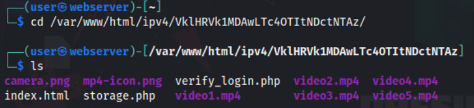

Use a looping script to copy the files to the IPv6 site folders.

This will copy index.html:

```bash
for dir in /var/www/html/ipv4/*/;
do
ipv6_dir="/var/www/html/ipv6/$(basename "$dir")";
[ -d "$ipv6_dir" ] && cp "$dir/index.html" "$ipv6_dir";
done

```

This will copy verify_login.php:

```bash
for dir in /var/www/html/ipv4/*/;
do
ipv6_dir="/var/www/html/ipv6/$(basename "$dir")";
[ -d "$ipv6_dir" ] && cp "$dir/verify_login.php" "$ipv6_dir";
done
```

This will copy storage.php:

```bash
for dir in /var/www/html/ipv4/*/;
do
ipv6_dir="/var/www/html/ipv6/$(basename "$dir")";
[ -d "$ipv6_dir" ] && cp "$dir/storage.php" "$ipv6_dir";
done
```

Then, restart and reload Apache:

```bash
sudo service apache2 restart
sudo systemctl reload apache2
```

Either one might work alone, but it doesn't hurt to do both.

Return to the grading page and grade again. This time, it checks all 10 IPv6 web directories for the required
changes. The grading check will tell you how many sites have been updated in case you missed any.

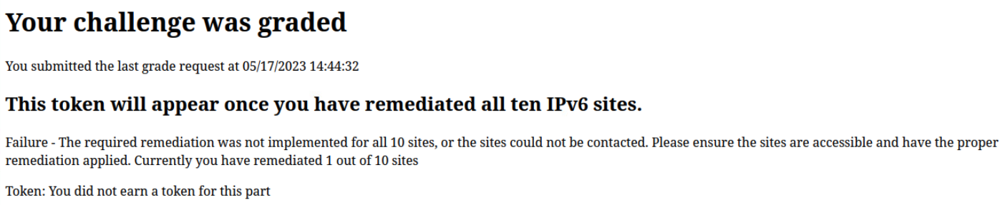

You might wish to update one camera site first to make sure you are doing it correctly. Once all ten directories are updated, a token appears on the grading page.

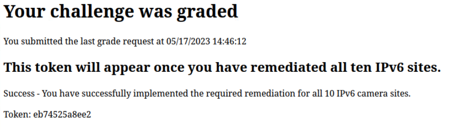

This token is the submission for Question 3. Assuming you have solved the previous parts this completes *A View to a Spill*.
