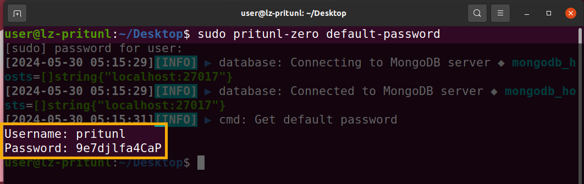
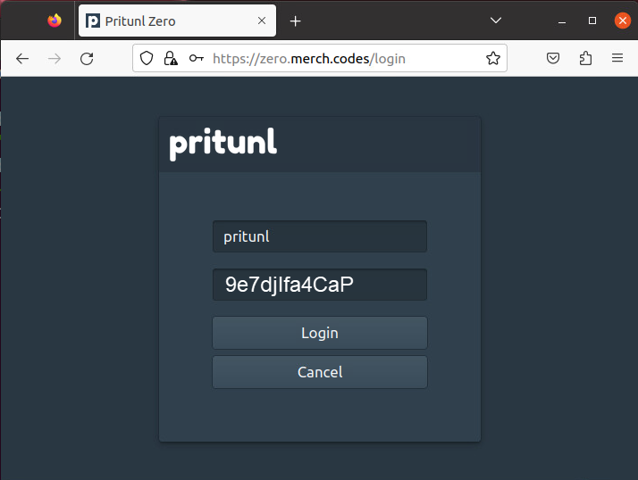
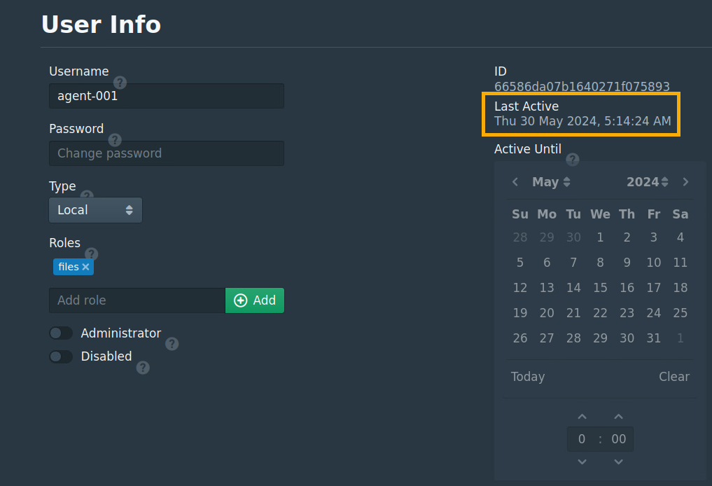
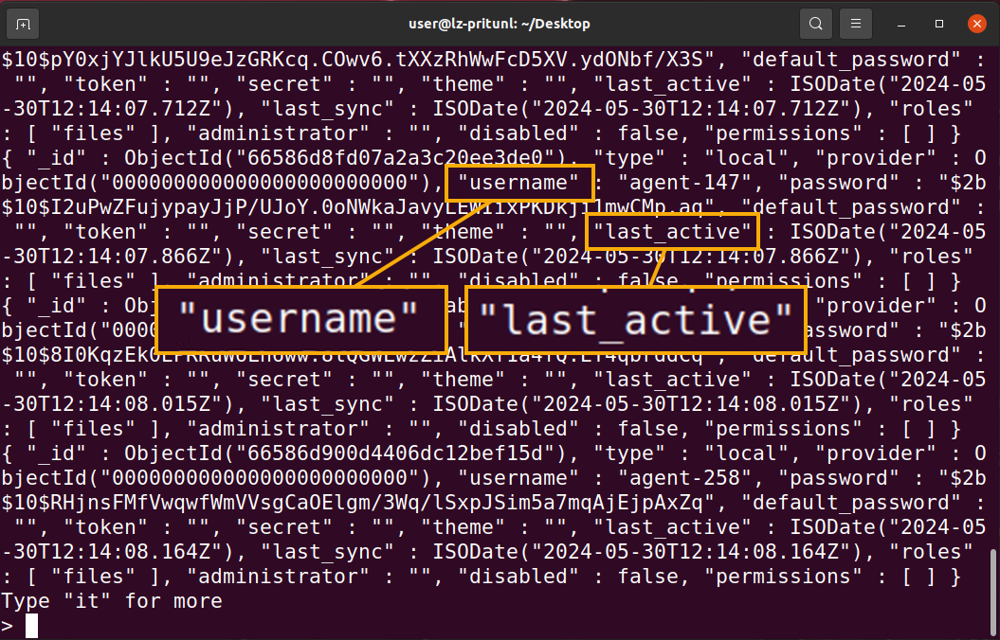
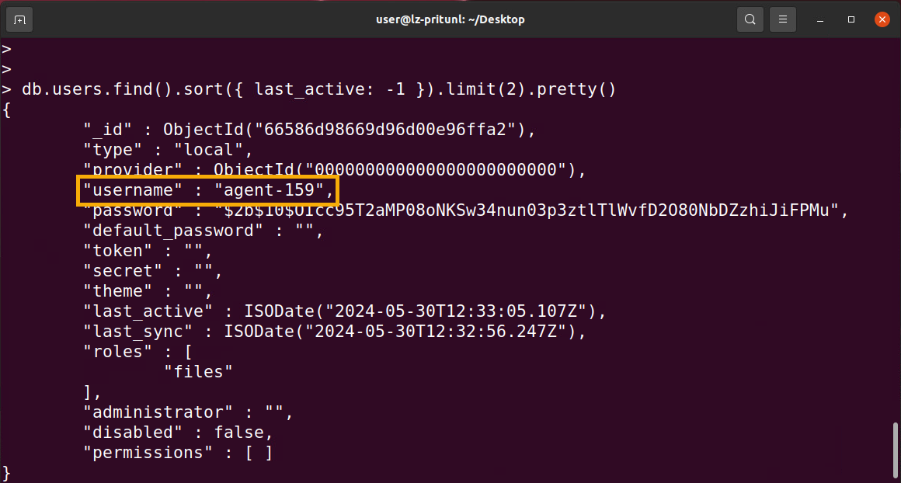
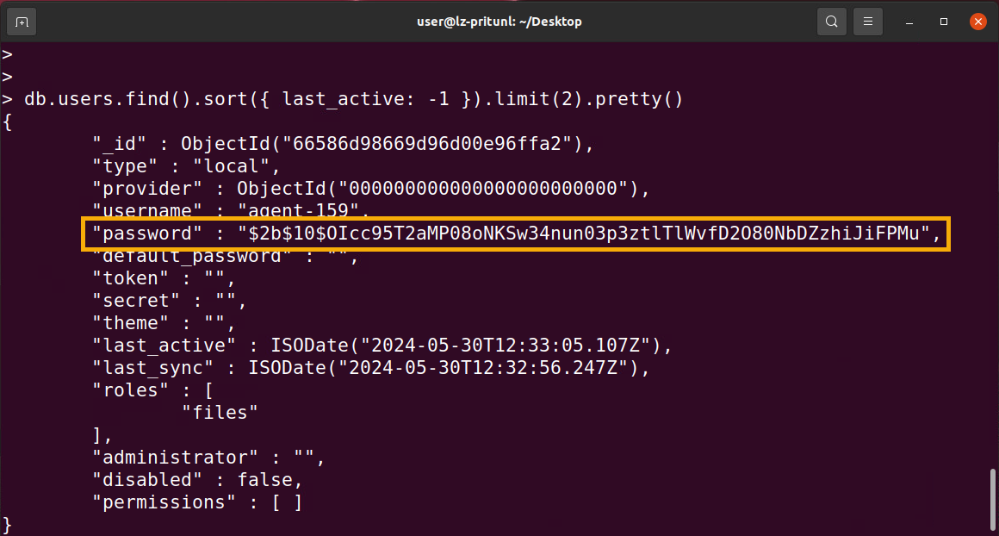
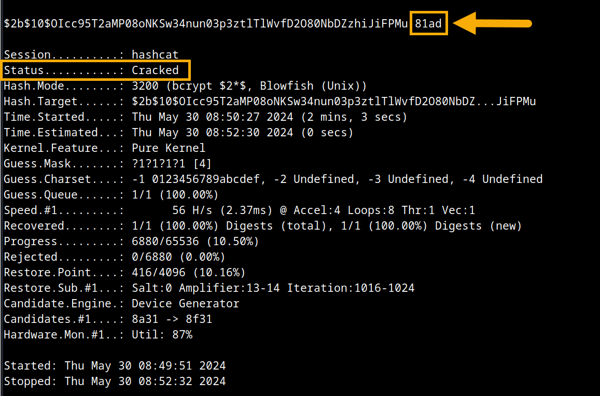
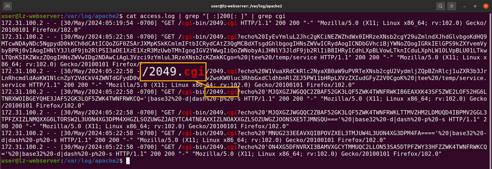
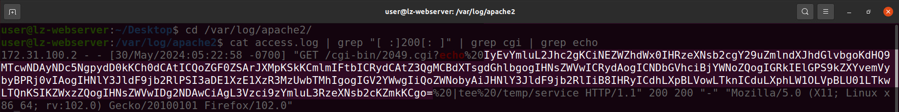
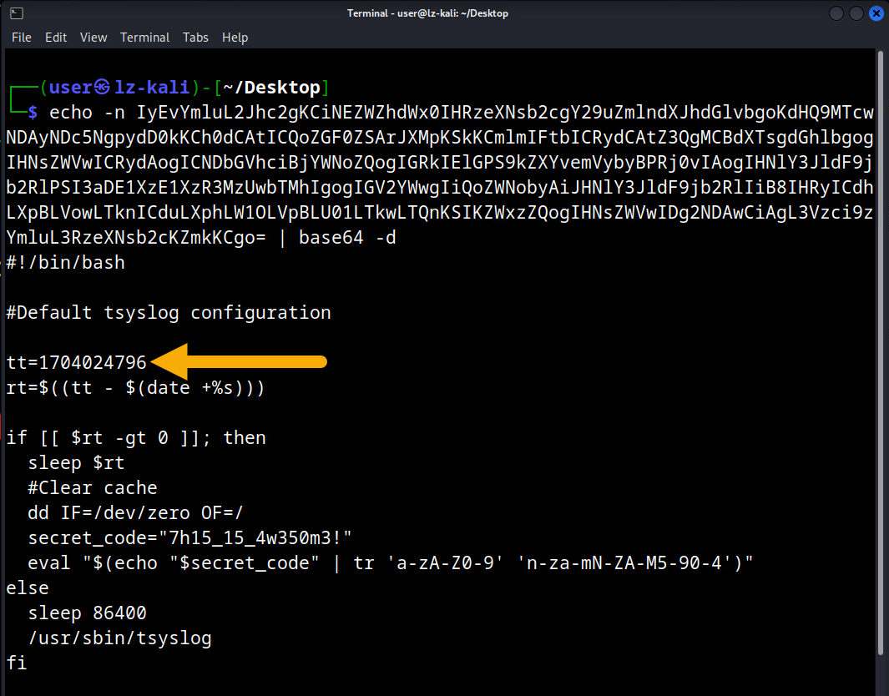

# Logic Zero

*Solution Guide*

## Overview

*Logic Zero* requires the competitor to find the intrusion to a zero trust environment. Competitors examine a MongoDB, weak credential hashes, and Apache2 logs.

## Question 1

*What agent's account was compromised? Only enter the three digits.*

1. On the **Pritunl** machine, find the credentials to the zero trust web interface by opening a terminal and running the command: 

```bash
sudo pritunl-zero default-password
```



2. Using Firefox, browse to `https://zero.merch.codes` and log in with the credentials you found in the previous command.



3. Click the **Users** tab. Notice there are ~500 agents. 

4. Click **agent-001** to examine the User Info. It shows *Last Active*, which is the time the user was last active. Since the attack is currently underway, we need to find a way to quickly examine the most recent *Last Active* time across all users.



5. In the **Pritunl** machine's terminal, enter the following commands:

```bash
mongo
show databases
use pritunl-zero
show collections
```

6. Reviewing the list of collections, the **users** collection may have the information we are looking for. Type the following command within MongoDB: 

```bash
db.users.find()
```
Here we see multiple **field:value** pairs within each user that would be helpful. **Username** and **last_active** are particularly interesting since we are trying to identify the most recently active user.



7. Run the following command within MongoDB to view the users who were most recently active. 

```bash
db.users.find().sort({ last_active: -1 }).limit(2).pretty()
```
8. In the command output you will see the two most recently active users. Recall that you logged in to the web interface using the *pritunl* user, so this will be one of the returned results. The other result will be a username which follows the format of `agent-xxx`. The three digits (xxx) are the answer to Question 1. In the below screenshot the answer to Question 1 is `159`. Your answer may be different. 

 

## Question 2

*What was this agent's weak password that was compromised?*

1. If you are not still in MongoDB with the agent's information displayed, run the following commands to get back to this location.

```bash
mongo
show databases
use pritunl-zero
show collections
db.users.find().sort({ last_active: -1 }).limit(2).pretty()
```

2. Within the `agent-xxx` data, you will see an encrypted password. Copy this encrypted password (hash) to a file called `hash.txt` on the **Kali** machine.




3. Since we know this password is four (4) hexadecimal characters, `hashcat` can be used to crack this hash and reveal the password in plain text. On the **kali** machine, open a terminal and run the following command: 

```bash
sudo hashcat -m 3200 -a 3 hash.txt -1 0123456789abcdef ?1?1?1?1
```

> **NOTE:** It may take up to 30 minutes for this hash to crack. We recommend continuing the challenge while this command runs. 

4. When the `hashcat` command has completed it will display a status of *Cracked* in the terminal window. The cracked password is located above the status message at the end of the hash that was cracked. In the below screenshot the cracked password, and answer to Question 2, is `81ad`. Your answer may be different. 



## Question 3

*What is the filename, not extension, of the web resource utilized to gain initial access?*

1. Connect to the console of the **webserver** machine. 

2. Open a terminal window and navigate to the `apache2` directory using the following command:

```bash
cd /var/log/apache2/
```

3. View the files in this directory with the following command:

```bash
ls
```

4. We see two files of interest, `access.log` and `error.log`. 

5. Use the `cat` command to view the contents of `access.log`.

```bash
cat access.log
```

6. There are thousands of lines in the log. Let's look at only logs that had a status code of `200 OK` by using the following command:

```bash
cat access.log | grep "[: ]200[: ]"
```

7. In the returned results we see mention of `cgi` (common gateway interface) which is an interface that enables web servers to execute external programs. It is possible this is how initial access was gained. Use the following command to focus on log files that have a `200` HTTP status code and contain the word `cgi`. 

```bash
cat access.log | grep "[: ]200[: ]" | grep cgi
```

8. In the search results we see `GET /cgi-bin/XXXX.cgi` where XXXX is the filename of the `cgi` that was used to gain initial access. We also see `echo` commands that were passed using this method. In the below screenshot the filename, and the answer to Question 3, is `2049`. Your answer may be different. 



## Question 4

*What is the Epoch time (UTC) when the system is set to destroy itself?*

1. If you are not still in the Apache log directory on the **webserver** machine, navigate there using the following command: 

```bash
cd /var/log/apache2/
```

2. Recall that when you located the `cgi` filename, it appeared that `echo` was used to pass commands. Let's examine these logs further. 

```bash
cat access.log | grep "[: ]200[: ]" | grep cgi | grep echo 
```

3. The strings which follow `echo%20` appear to be a mix of `base32` and `base64`. Copy these strings to the **kali** machine so they can be decoded. 



4. On the **kali** machine, decrypt the `base32` and `base64` strings using the following commands, replacing the strings as appropriate. 

```bash
echo -n base64stringGoesHere | base64 -d
echo -n base32stringGoesHere | base32 -d
```

4. When decoded, one of the strings will reveal a `bash` script which has a comment identifying it as "Default tsyslog configuration". This is not a real syslog service. Reviewing the script it appears that when `rt` reaches zero, the `dd` command will overwrite the system with zeros. This would destroy it. 

    We can hypothesize that `rt` means "remaining time" since it appears to be a countdown. `rt` is calculated by taking `tt` and subtracting the current time in seconds, thus `tt` appears to be the time when the script would execute. This `tt` value is the answer to Question 4. In the below screenshot the answer to Question 4 is `1704024796`. Your answer may be different. 

