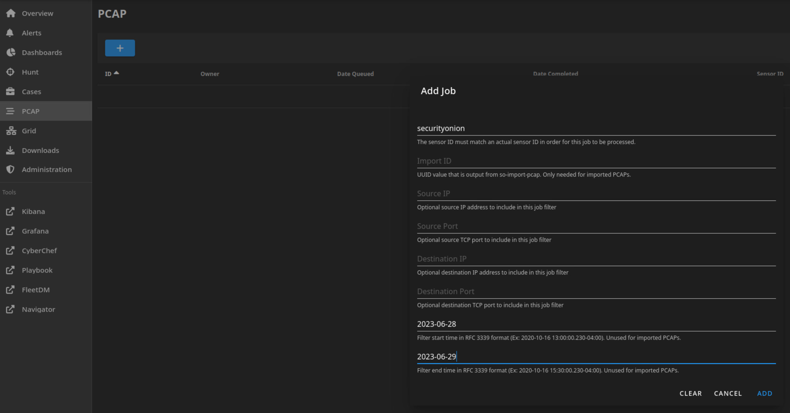
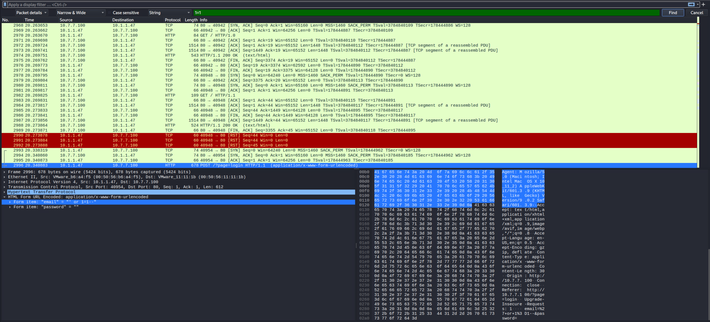
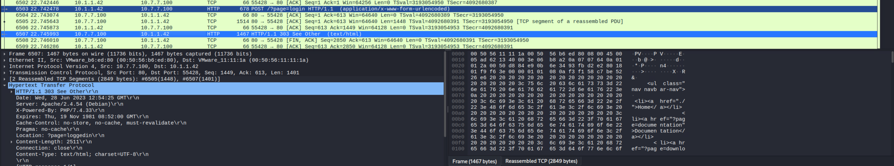
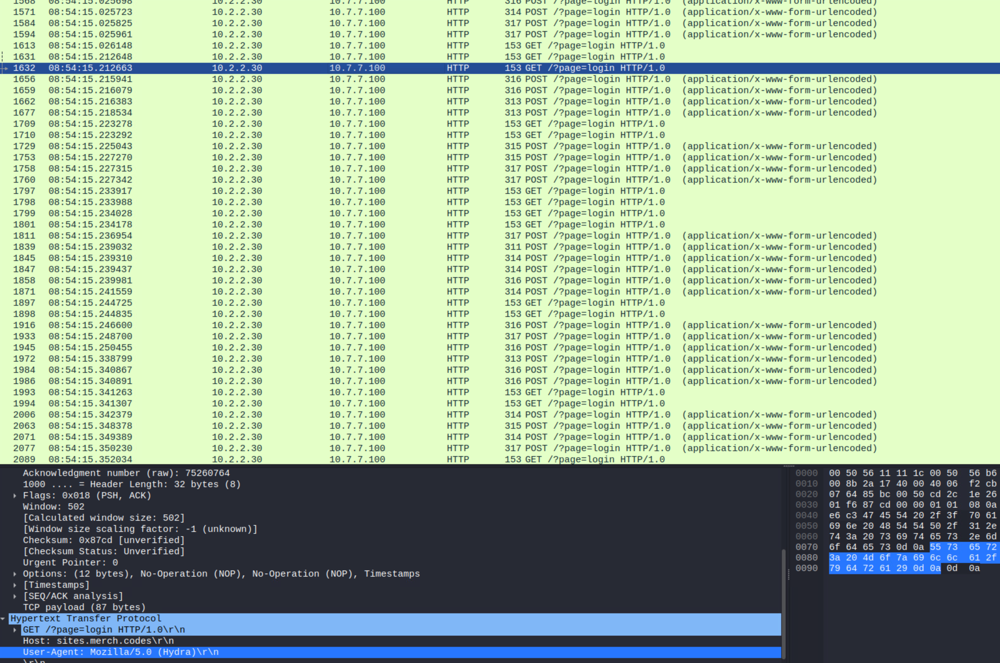
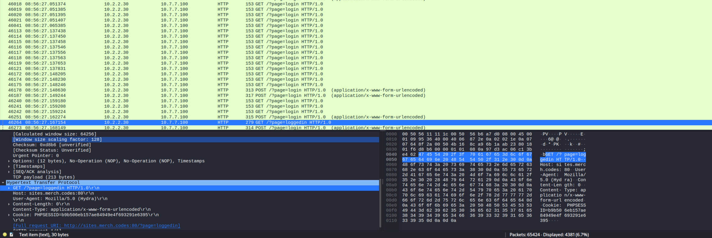
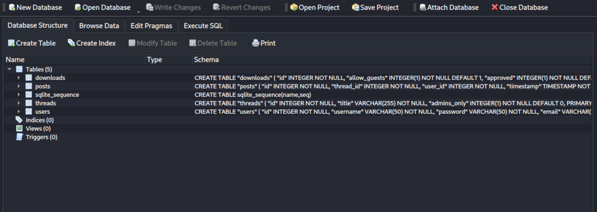
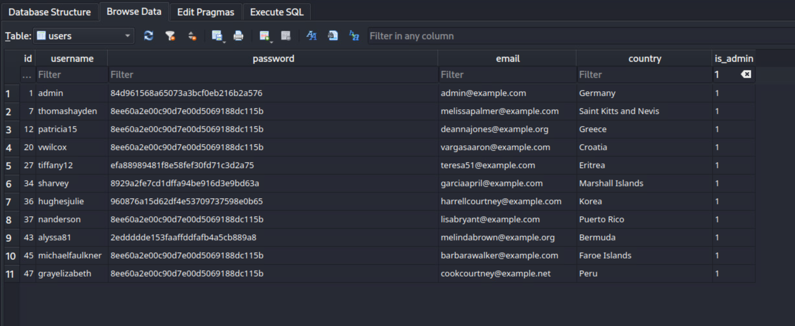
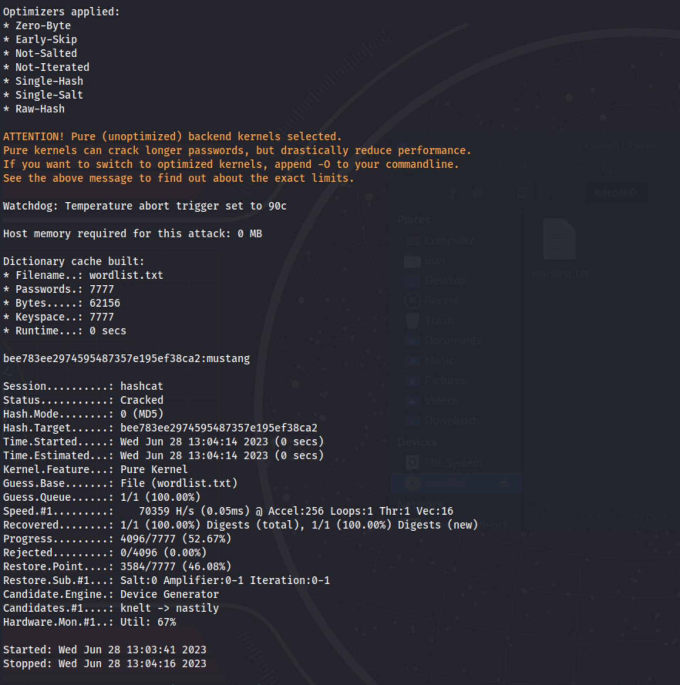

# Peeling an Onion

*Solution Guide*

## Overview

This is a network attack scenario.  The questions can be answered by examining a pcap or by using Security Onion tools.

> **Notes:** 
>
> 1. Security Onion takes some time to become available. You can check progress by ssh:  `so@10.4.4.4`  | `tartans` as the password and running `sudo so-status`. 
> 2. *Peeling an Onion* uses infinity variables, so answers may be different every time.

## Question 1

*What is the IP of the machine that performed a SQL Injection attack to log into the page?*

On the Analyst-machine, open Security Onion via the web interface and download the pcap file of the traffic. 
1. On the left, click **PCAP**, then **+**.
2. For **Filter Begin** and **Filter End**, enter current day; for **Sensor ID**, enter `securityonion`. Click **Add**.
3. When **Status** is **Completed**, click the binoculars, then **Download**.
4. Using Wireshark, open the new pcap.
5. In Wireshark, search for common SQL injection strings using **Packet Details** and **String**. 

6. Someone entered ```' or 1=1--``` in the "email" form on the login page.
7. Look at the HTTP response from the page to the IP address. Notice it returned the ```?page=loggedin``` denoting a successful login.



The correct submission for Question 1 is: `10.1.1.<random number between 41 - 60>`.

## Question 2

*What is the IP of the machine that successfully brute forced the website login?*

1. We see the IP address of the attacked website is `10.7.7.100` . Enter `ip.dst==10.7.7.100` to filter the Wireshark view.
2. In this instance, you can see there are three IP addresses that have multiple hits on the login page per second, and the User-Agent is `Hydra`.



The IP addresses are: `10.2.2.9`, `10.2.2.30`, and `10.1.1.77`.

3. From Question 1, we know to look for `?page=loggedin` for a successful login. Perform a string search for that. 

4. The `10.2.2.30` IP got the logged-in page after a long sequence of login attempts. 



The correct submission for Question 2 is: `10.2.2.<random number between 21 - 40>`.

## Question 3

*The database was exfiltrated from the site.  Which insecure password was most frequently used for administrator accounts?*

1. In Wireshark, go to **File**, **Export Objects**,  **HTTP...** .
2. From the **Content Type** dropdown, select **application/x-sqlite3**. This shows a file named **db.s3db** (there will be multiple listings because the script to exfiltrate it runs on a loop).
4. Select one of the listings and **Save** it.
4.  In DB Browser for SQLite, open the file you just saved.
6. Select the **users** table.
7. Select the **Browse Data** tab,  then `users` from the **Table** dropdown.
8. You'll see there is a column named ```is_admin``` in the table. Filter on  that with a value of **1**.

9. If you sort the **password** column, you can see there is one hash that's repeated multiple times. Copy that hash value.
10. You can attempt to crack it with Hashcat (shown below), or Google it.
11. Open a terminal window and enter:

```bash
hashcat -m 0 <hash value> /media/cdrom0/wordlist.txt
```

After a minute or two, the cracked password will output to the screen:



The answer to Question 3 is one of the following:
-    `mustang`
-    `negligent`
-    `nintendo`
-    `wolverine`
