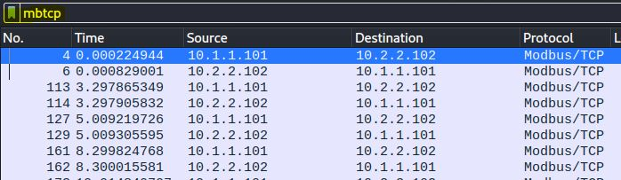
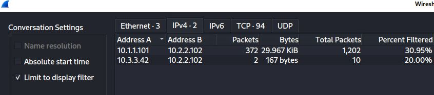
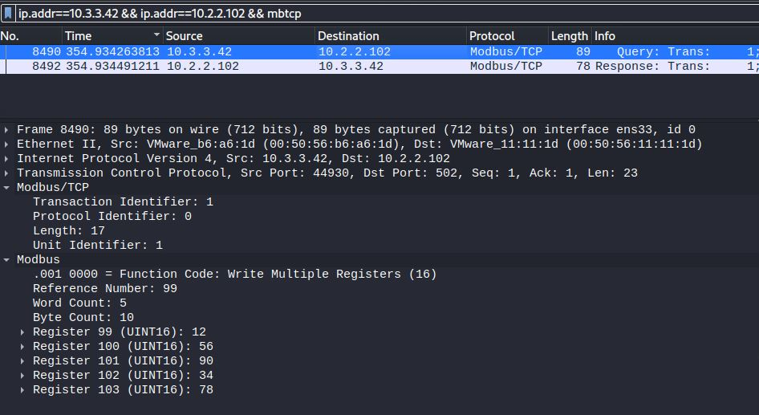
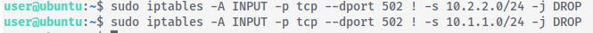

# Protect Ya Tech

*Solution Guide*

## Overview

Someone on the Aurellian spaceship *Daunted*'s network has been tampering with a programmable logic controller (PLC) device on the ship's supervisory control and data acquisition (SCADA) systems. Players are given a network traffic capture to start with. 

Using the given packet capture:
- identify which host the threat actor accessed the PLC from
- identify what values they updated
- remediate the vulnerability

The SCADA system is on the `10.1.1.0/24` and `10.2.2.0/24` networks. Therefore, the PLC device should only receive Modbus/TCP traffic from those networks. On the provided Kali VM, open the `capture1.pcapng` file on the Desktop.  

## Question 1

*What is the IPv4 address of the host that wrote unauthorized entries to the PLC?*

We know we are looking for evidence of tampering with SCADA PLC devices. On Kali, open `capture1.pcapng`, and filter the traffic for Modbus/TCP traffic with `mbtcp` as shown.



Examining the traffic, we see numbers queries and register updates from the address at `10.1.1.101` to the device at `10.2.2.102`. 

Next, use Wireshark to analyze the conversations. Go to **Statistics**, **Conversations**, and select the **IPv4** tab.



The other address talking to `10.2.2.102` is `10.3.3.42` -- an address outside of the authorized networks. Filter the traffic for packets with an IP source of `10.3.3.42`.



Drilling down to the **Modbus** section tells us this host was making updates to PLC registers 99-103.

The correct submission for Question 1 is: `10.3.3.42`.

## Question 2

*What are the PLC register values updated by the unauthorized host in Question 1? Enter without spaces in the order they were received.*

We can also see which values the host was updating. Enter them sequentially into the answer box for Question 2 in the order they were sent (Register 99 through Register 103).

The correct submission for Question 2 is: `1256903478`.

## Question 3

*Prevent the PLC device from receiving Modbus/PLC traffic from a network other than 10.1.1.0/24 or 10.2.2.0/24. After securing the network from further PLC tampering, enter the token given by the grading check after visiting https://challenge.us in game.*

To stop the host at `10.3.3.42` (or any other unauthorized host) from making unauthorized updates to the PLC device we need to segregate the network or, at least, prevent Modbus/TCP traffic from talking to the PLC from outside the authorized networks. There are a number of ways to do this. You could implement a firewall rule at the VyOS router; the console is a gamespace resource. 

In this solution guide, we implement firewall rules on the PLC device itself. From Kali, ssh to the PLC device using the credentials from the challenge document.

`ssh user@10.2.2.102` 

Next, issue `iptables` commands to prevent Modbus/TCP traffic on TCP port 502 from being accepted unless it comes from the `10.1.1.0/24` or `10.2.2.0/24` networks.

```bash
sudo iptables -A INPUT -p tcp --dport 502 ! -s 10.2.2.0/24 -j DROP
sudo iptables -A INPUT -p tcp --dport 502 ! -s 10.1.1.0/24 -j DROP
```



After implementing the rules, browse to `challenge.us` from a gamespace resource and click **Grade Challenge**. The test may run for a few minutes, but when complete it will either return the answer (token) to Question 3 or an error with the issue it detected.
