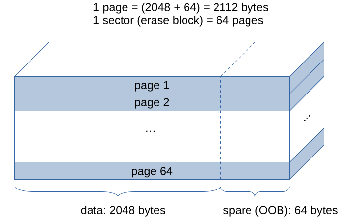
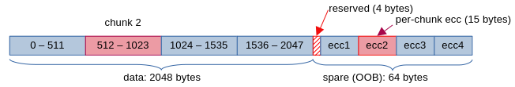

# Bravo Charlie Hotel

*Solution Guide*

## Overview

This challenge requires competitors to understand and apply the BCH error
correction (ECC) algorithm to a portion of a NAND Flash image. Given BCH
libraries and sample programs in Python and C, the competitor must:

- discover the layout of the device
- discover the properties of the BCH algorithm used for error correction
- apply the necessary error correction, and
- extract information from the device image

## Question 1

*How many pages of the provided sector are in use?*

We know that each page in the provided sector has 2048 data and 64 OOB bytes,
for a total of 2112 (or 0x840) bytes. We also know that uninitialized pages
are filled with `0xFF` bytes.

We use `hexdump` to view the content of the provided sector. The tool displays
lines consisting of the offset within the file, followed by 16 bytes worth of
content. If multiple lines of output contain an identical (repeating) pattern,
`hexdump` will "factor out" those lines and only display a single `*` to
signify the repeating pattern.

Therefore, if we assume the end portion of the sector is unused and it will
contain repeating lines of all-`0xFF` data. If we want to find out where the
unused portion of the sector starts, we examine the tail end of the hex dump
output:

```bash
hexdump -C handout.bin | tail
```

```
0000ad00  ff ff ff ff 7b 00 45 87  c4 88 12 ed be f0 d1 15  |....{.E.........|
0000ad10  e0 d9 6f 69 26 e7 ae 6c  cb f7 5e 51 38 2a c1 b5  |..oi&..l..^Q8*..|
0000ad20  e2 b7 39 79 46 89 6b f2  2c f4 39 ed 34 49 6e 44  |..9yF.k.,.9.4InD|
0000ad30  1f ff ff ff ff ff ff ff  ff ff ff ff ff ff ff ff  |................|
0000ad40  ff ff ff ff ff ff ff ff  ff ff ff ff ff ff ff ff  |................|
*
00021000
```

The last chunk of data containing something other than `0xFF` starts at
address `0xAD30`, so the number of pages in use is `0xAD30 / 0x840 + 1`,
or decimal 21 (adding 1 compensates for the implicit "rounding down"
performed by the integer division, i.e., ensures we count the
*partially utilized* page where the all-0xFF data extent starts).

## Question 2

*How many OOB bytes per page (out of 64) are utilized for ECC?*

First, let's remember the layout of our NAND Flash block:



We use:

```bash
hexdump -C handout.bin | less
```

to scroll back and forth over hex-dumped contents of the sector.

We know that the *first* OOB byte in *every* page is always reserved as marker
for bad blocks, and should always be `0xFF`. Let's examine the first page's
OOB area, which starts at offset 2048 or `0x800` (given that each page
contains 2048 data and is followed by 64 OOB bytes):

```none
00000800  ff ff ff ff 8e 63 65 f9  ac 34 bf de 34 14 09 9d  |.....ce..4..4...|
00000810  73 46 07 ec 47 5a e0 b3  df 8a 06 c5 03 b9 7f 13  |sF..GZ..........|
00000820  13 c7 05 b5 10 b6 51 dd  69 6b ef c4 41 bd 07 3a  |......Q.ik..A..:|
00000830  4f d9 f3 77 63 22 41 f4  93 5d 5a ac 32 0f a7 bf  |O..wc"A..]Z.2...|
```

Then, look at the second page's OOB area at offset 4160 or `0x1040`. The second
page's OOB offset is determined as follows:

**2048 bytes** (first page data) +<br>
**64 bytes** (first page OOB area) +<br>
**2048 bytes** (second page data) =<br>
**4160** or `0x1040` bytes

```none
00001040  ff ff ff ff 97 b4 80 ef  f4 05 43 50 6c e5 da 1d  |..........CPl...|
00001050  37 9d 67 0e 12 1a 0a f7  f8 89 2b fd 40 a5 0f 72  |7.g.......+.@..r|
00001060  a6 57 d9 2f 40 1c 25 16  b2 5d 65 2a 4a d9 b9 ad  |.W./@.%..]e*J...|
00001070  07 a4 ac ec 76 2d 6e 39  d4 51 36 0c ea 63 1a 07  |....v-n9.Q6..c..|
```

After looking at a few more, we notice that the first *four* OOB bytes in
every utilized page are set to `FF FF FF FF`, which means they are
uninitialized, and therefore *not* used to store ECC material! Since each
page's OOB area is 64 bytes, and 4 of those are not utilized, that leaves
60 bytes dedicated to storing ECC material.

## Question 3

*What combination of `m:t` maximizes per-page ECC capability?*

We know that a total of 60 bytes of ECC are used to protect a total of 2048
bytes of data. We don't yet know how many total bit flips we can correct,
but we assume it is the *maximum* the algorithm is capable of providing.

It may be possible to provide *more* error correction capability by "chunking"
the data (and the corresponding ECC bytes) into smaller equal chunks
(e.g., 1024+1024 data bytes and 30+30 ECC bytes, or 4·512 data bytes and
4·15 ECC bytes). Our options for ***m*** and ***t*** are such that either:

-  ≥ 2048 data, 60 ECC bytes (1 chunk / page, total correctable bits = ***t*** )
-  ≥ 1024 data, 30 ECC bytes (2 chunks / page, total correctable bits = 2 · ***t*** )
-  ≥ 512 data, 15 ECC bytes (4 chunks / page, total correctable bits = 4 · ***t*** )

NOTE: We can't consider smaller chunks, since the corresponding ECC bytes can
no longer be evenly divided and assigned to them!

To use the provided `bch_init` sample program, first install `python-bchlib`
on your machine (e.g., using `pip`). Then, unpack the enclosed
`bch_samples.tar.gz` file, and run:

```bash
python3 bch_init.py
```

Using the provided `bch_init` sample program, we can list the available
minimum data bytes and the necessary number of ECC bytes protecting them for
various combinations of ***m*** and ***t***.

For example, the best protection if using a single chunk of 2048 data bytes
and 60 ECC bytes can be had with:

```none
BCH(m=15 t=32): data_bytes=4035 ecc_bytes=60
```

which means we can correct up to 32 bit errors if we transmit 60 ECC bytes
and 2048 (out of the 4035 available) data bytes in one chunk.

However, with *m=13* and *t=9*, we have:

```none
BCH(m=13 t=9): data_bytes=1009 ecc_bytes=15
```

meaning we can correct up to 9 bit errors using 15 ECC bytes and data *up to*
1009 bytes, which is sufficient to protect 512-byte data chunks. Over four
512-byte chunks, protected by 4·15=60 ECC bytes, we can recover from 4·9=36
bit errors, which is better than the single-chunk scenario we considered above.

We can "eyeball" the output of `bch_init` and do some mental arithmetic, or
we can modify the program to calculate the optimal per-page ECC capability
when considering chunking:

```python
for m in range(9, 16):
    for t in range(2, 41):
        bch = bch_init_m_t(m, t)

        # calculate max. bit error correction capability of `bch`
        # over 2048 data bytes:

        max_data = (bch.n - bch.ecc_bits) // 8
        max_ecc = bch.ecc_bytes
        total_t = 0

        # `bch` applied over 4 x 512-byte data chunks:
        if max_data >=  512 and 4 * max_ecc <= 63 and 4 * t > total_t:
            total_t = 4 * t

        # `bch` applied over 2 x 1024-byte data chunks:
        if max_data >= 1024 and 2 * max_ecc <= 63 and 2 * t > total_t:
            total_t = 2 * t

        # `bch` applied over 1 x 2048-byte data chunk:
        if max_data >= 2048 and 1 * max_ecc <= 63 and 1 * t > total_t:
            total_t = 1 * t

        if total_t > 0:
            print("m={} t={} data_bytes={} ecc_bytes={} tt={}".format(m, t,
                                                  max_data, max_ecc, total_t))
```

Either way, we end up observing that with ***m*** = 13 and ***t*** = 9, we
need 15 ECC bytes to protect up to 1009 bytes of data, which is sufficient
to cover a 512 byte data chunk. This means that the 60 bytes of in-use ECC
bytes in each page's OOB area are really four  groups of 15 bytes protecting
one of the 512 byte chunks of the 2048 data area. The total number of
correctable bits per page is 4 * 9 = 36 (granted, presuming that no more than
9 of them occur within each 512 byte chunk), which is better than all other
available combinations.

Therefore, the answer to Question 3 is `13:9`.

## Question 4

*Find the XOR mask applied to a single chunk's ECC bytes for on-chip storage?*

Given ***m***, ***t***, the chunk and ECC size (512 and 15 bytes,
respectively), we can plug them into the `bch_demo` program to compute the
appropriate XOR mask to apply to a 15-byte ECC blob such that blobs protecting
all-`0xFF` data are themselves encoded as all-`0xFF` when stored on the NAND
Flash chip.

The answer to Question 4 is `be18f7d2ae7bdaa445802c14601d87`.

## Question 5

*What is the email address of user Lisa Bradshaw?*

We could definitely write a generic BCH extractor for the given NAND Flash
geometry, whose parameters and configuration we reverse engineered over the
course of answering Questions 1 through 4.

However, it is much faster (though less glamorous) to carve out the 512-byte
data chunk containing Lisa Bradshaw's information, and the 15-byte ECC string
corresponding to that chunk from the page's OOB area, and plug them into the
provided `bch_demo` program (which we already modified to use the right values
for ***m***, ***t***, and data and ECC chunk sizes).

Locate the page number containing Lisa Bradshaw's information:

```bash
hexdump -C handout.bin | grep -A2 -B1 Bradshaw
```

```
00005550  6e 65 74 3e 0a 4c 69 73  61 20 42 72 61 64 73 68  |net>.Lisa Bradsh|
00005560  61 77 20 3c 4c 69 73 61  42 72 61 64 73 68 61 77  |aw <LisaBradshaw|
00005570  66 67 60 65 63 67 67 67  40 72 6f 63 6b 65 74 6d  |fg`ecggg@rocketm|
00005580  61 69 6c 2e 63 6f 6d 3e  0a 4e 61 74 61 6c 69 65  |ail.com>.Natalie|
```

We must assume the information is corrupted, or at least run BCH correction
over the data chunk containing this information to confirm its correctness,
before using it to make decisions in the field (such as submitting a
challenge answer).

With a bit of arithmetic and translation between Hex and Decimal:

```none
2048+64=2112=0x840
0x5550/0x840=0xA=10
```

...we conclude that this occurs on the 11<sup>th</sup> page of the given
sector (integer division tells us we're *beyond* the 10<sup>th</sup> page,
i.e., the *remainder* of the 11<sup>th</sup>). This page can be viewed in
its entirety by displaying *one* page worth of data after skipping over
the first 10 pages in the sector:

```bash
hexdump -s $((2112*10)) -n 2112 -C handout.bin
```

From here, we determine that Lisa Bradshaw's data is located within the
*second* 512-byte data chunk of that page (the division remainder of
`0x5550 % 0x840 = 0x2D0 = 720`, which is greater than 512 but less than 1024):

```bash
hexdump -s $((2112*10+512*1)) -n 512 -C handout.bin | grep Bradshaw
```

```
00005560  61 77 20 3c 4c 69 73 61  42 72 61 64 73 68 61 77  |aw <LisaBradshaw|
```

We carve out the 512-byte data chunk:

```bash
dd if=handout.bin bs=1 skip=$((2112*10+512)) count=512 of=chunk.bin
```

...and also the corresponding 15-byte chunk of (masked) ECC data:

```bash
dd if=handout.bin bs=1 skip=$((2112*10+2048+4+15)) count=15 of=ecc.bin
```

Below is a visual representation of the data and ECC material (highlighted
in solid red) being extracted from the 11th page of the provided sector:



The modified version of `bch_demo.py` that corrects the data is:

```python
import bchlib
import hashlib
import os
import random

# given a Galois field order `m`, return the matching primitive polynomial
# defaulted to by the Linux kernel:
def get_linux_poly(m):
    linux_prim_poly_tab = [0x25, 0x43, 0x83, 0x11d, 0x211, 0x409,
                           0x805, 0x1053, 0x201b, 0x402b, 0x8003]
    if m in range(5, 16):
        return linux_prim_poly_tab[m - 5]
    else:
        print("m = {} is out of range! (must be [5 .. 15])".format(m))
        quit()

# given a Galois field order `m` and max. bit error correction capability `t`,
# initialize a BCH encoder/decoder object:
def bch_init_m_t(m, t):
    return bchlib.BCH(get_linux_poly(m), t)

# set operating parameters for BCH ECC:
# NOTE: these parameters are adjusted based on our analysis of the handout!
BCH_M = 13
BCH_T = 9
DATA_SIZE = 512
ECC_SIZE = 15

# initialize BCH:
bch = bch_init_m_t(BCH_M, BCH_T)

# calculate ECC storage mask:
data = bytearray(b'\xff') * DATA_SIZE
ecc = bch.encode(data)
mask = bytearray(map(lambda x: x ^ 0xff, ecc))

# load actual data and ECC:
# NOTE: instead of initializing programmatically, load real data from the disk!
data = bytearray(open('chunk.bin', 'rb').read())
ecc_masked = bytearray(open('ecc.bin', 'rb').read())
ecc = bytes(a ^ b for (a, b) in zip(ecc_masked, mask))

# correct and print data:
n_err = bch.decode_inplace(data, ecc)
print("Corrected {} bit errors in byte array: {}".format(n_err, data))
```

The answer (for the enclosed/published version of `handout.bin`) is
`LisaBradshawdeadbeef@rocketmail.com`.

### Submission Note

The answer to this question is randomized in the on-line version of the
challenge, and the `deadbeef` portion of the email address will differ.
