# Meta Data Exfil

*Solution Guide*

## Overview

Investigate recovered files to gain access to a data storage site where additional information can be exfiltrated from those same files.

## Question 1

*What is the token found after logging into the website on the network?*

Retrieve the challenge artifacts from the **recovered_files.zip** file on `https://challenge.us`. The .zip file contains various PDF files. Extract the PDFs into your home directory.

```bash
unzip Downloads/recovered_files.zip
```

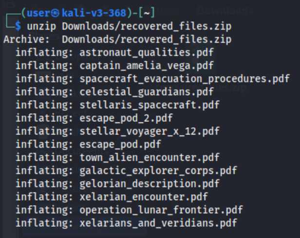

Find the username by extracting metadata from any one of these files. In this case, we'll extract from **escape_pod.pdf**. Here we can see there is a `Creator` metadata field, which is the username for the data storage site. The Creator is a one-word username followed by three numbers.

```bash
exiftool escape_pod.pdf
```

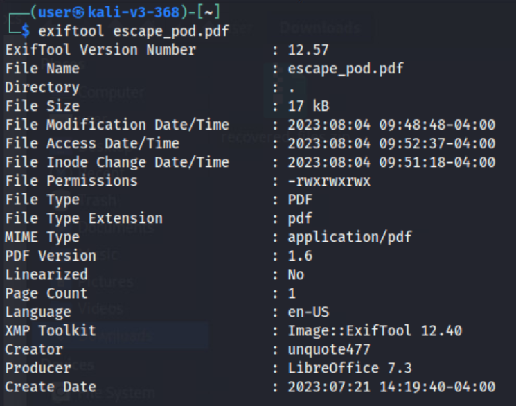

Three of the PDFs in the .zip file contain portions of redacted information. One of these PDFs, **stellaris_spacecraft.pdf**, redacts this information incorrectly using black highlighting. Reveal the password by highlighting the redacted text. The password is always a string of 16 hex characters.

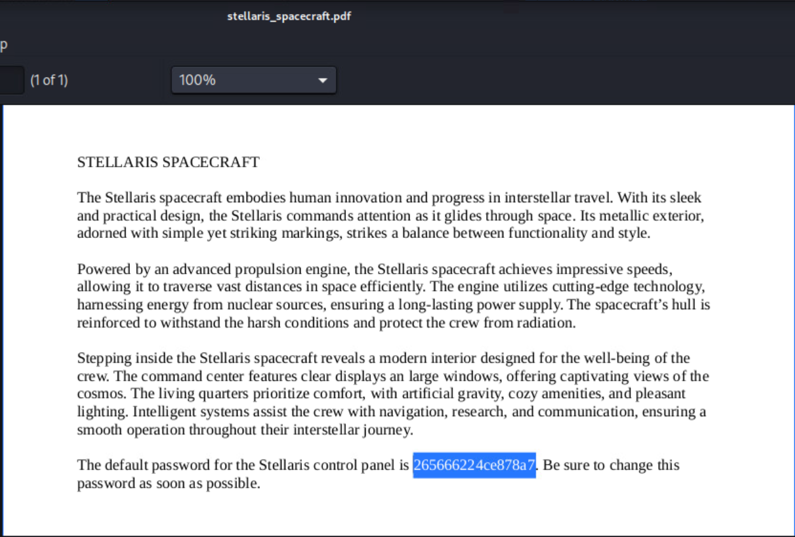

Perform an `nmap` scan of `10.2.2.0/24` to find the data storage site that requires these discovered credentials. This reveals the IP address. Find the port it is using for the site through a more targeted scan of the discovered IP. The IP is in the range of `10.2.2.50-150`, and the port is `8080`.

```bash
nmap -sn 10.2.2.0/24
nmap 10.2.2.80
```

> **Note:** There will be more IP addresses resulting from the initial `nmap` scan than shown in the screen capture below.

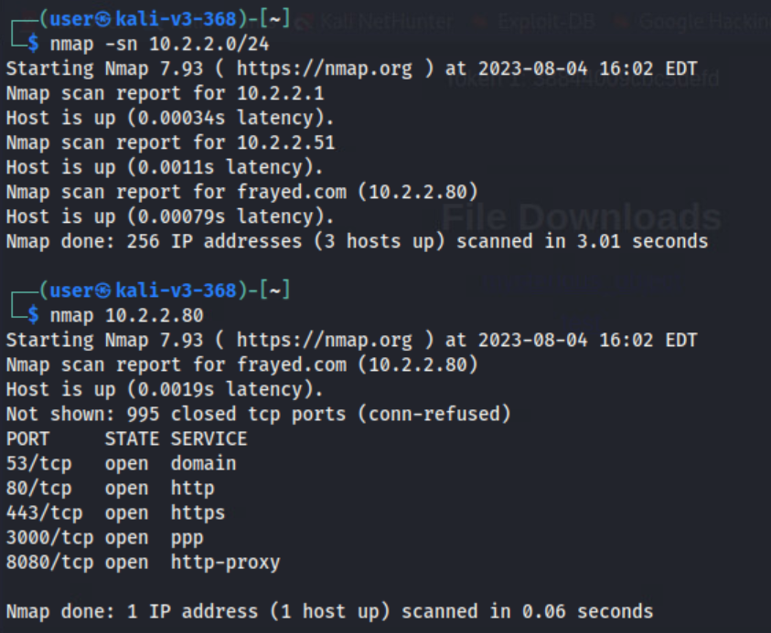

Navigate to this site in your browser using the format `10.2.2.80:8080`, replacing the IP address with the one you discovered. Use the previously discovered username (`Creator`) and password (redacted in PDF) to log into the site.

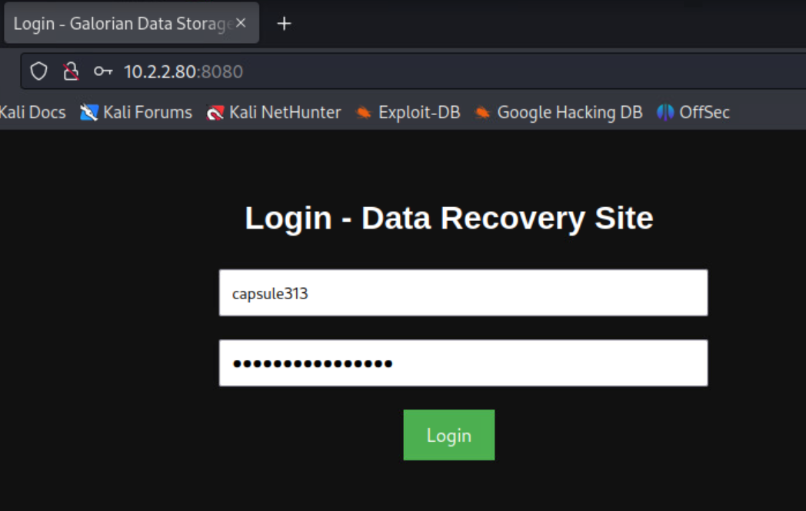

Upon successfully logging into the site, you are redirected to: `10.2.2.80:8080/storage.php`. Token 1 is displayed at the top of this site, as shown in the screen capture below.

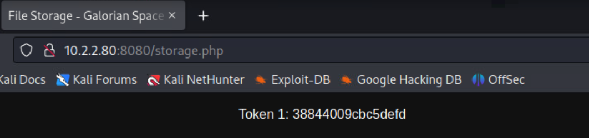

## Question 2

*What is the token found inside of mysterious_object_found.docx?*

Retrieve **mysterious_object_found.docx** from the data storage entry in Question 1. Upon download, the .docx file is encoded. In addition, it was reversed. In order to decode the .docx file, it must be reversed and then base64 decoded.

```bash
cat mysterious_object_found.docx | rev > rev.docx
base64 -d -i rev.docx > unencoded.docx
```

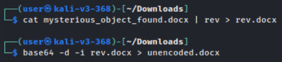

You'll know the command was successfully executed when legible text is displayed in **unencoded.docx**.

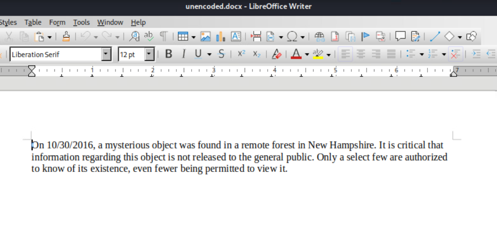

Unzip **unencoded.docx**. There is a **mysterious_object.pdf** embedded in the .docx file.

```bash
unzip unencoded.docx
```

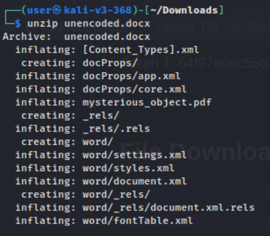

Open **mysterious_object.pdf**. There is an image inside.

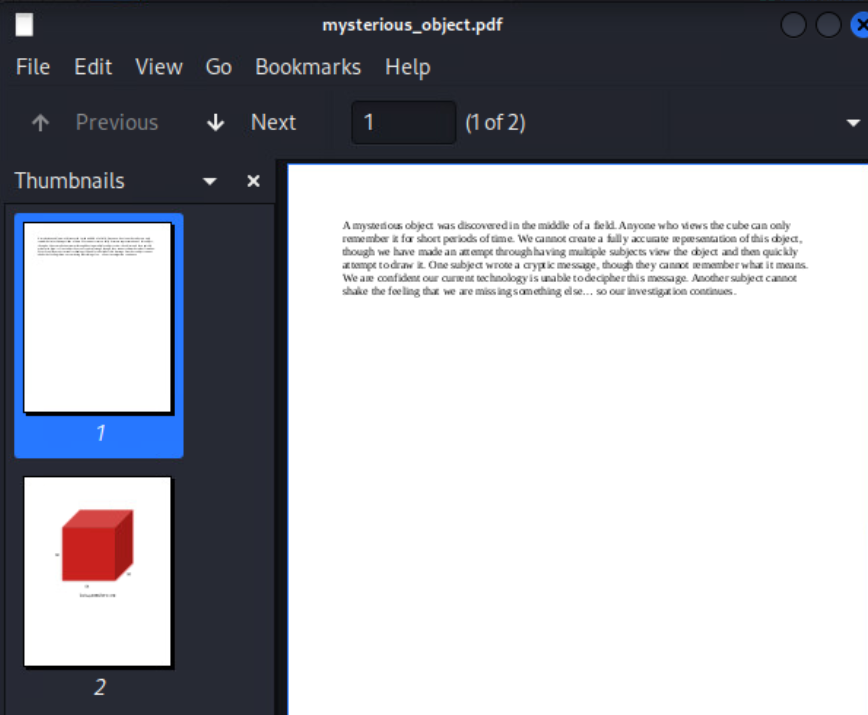

Extract the image from the document using `pdfimages` and view the metadata using `exiftool`. This reveals Token 2 in the Description field.

```bash
pdfimages -j mysterious_object.pdf image
exiftool image-000.jpg
```

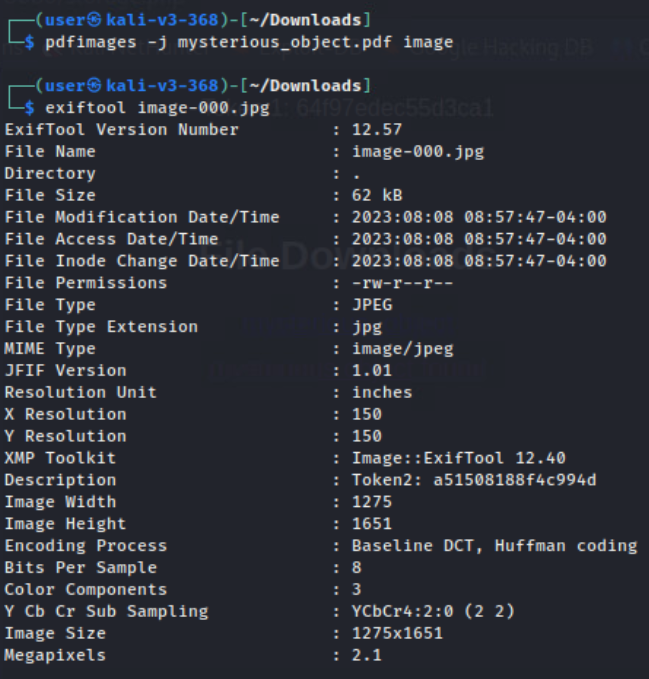

## Question 3

*What is the token found inside of delidian.zip?*

Download and unzip **delidian.zip**. You will find two files: **delidians_recovered.txt** and **delidian_machine.zip**. The archive **delidian_machine.zip** is password protected, and **delidians_recovered.txt** accessible.

Open **delidians_recovered.txt**. It shows a hex dump. However, instead of using the characters A-F, it uses characters N-S. This indicates that it has been through a *Caesar cipher*. Use this command to solve.

```bash
cat /home/user/Downloads/delidians_recovered.txt | tr '[A-Za-z]' '[N-ZA-Mn-za-m]' > caesar_shifted.txt
```

Revert the hex dump using the following command.

```bash
cat caesar_shifted.txt | xxd -r -p > solution.txt
```

Open the resulting file - the header reveals it is a PDF. Converting the file to a PDF reveals readable text. Convert the text file to a PDF by changing the file extension (rename solution.txt to solution.pdf). Within this text is the password to access **delidians_machine.zip**.

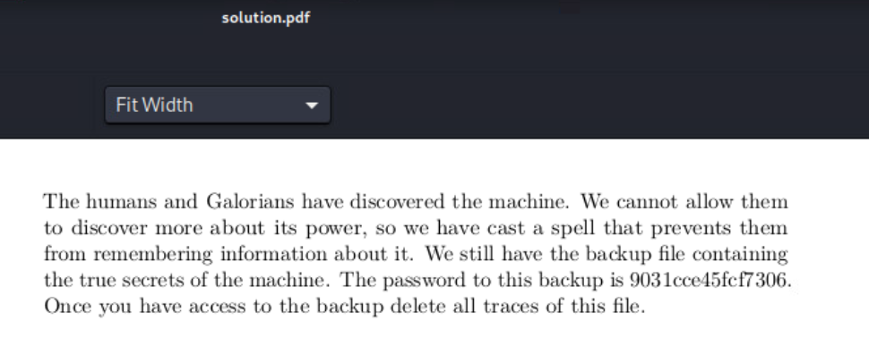

Viewing the contents of **delidians_machine.pdf** will show the token as a metadata field for the image inside.

Alternatively, you can retrieve the token from the PDF in the same way as in Question 2.
