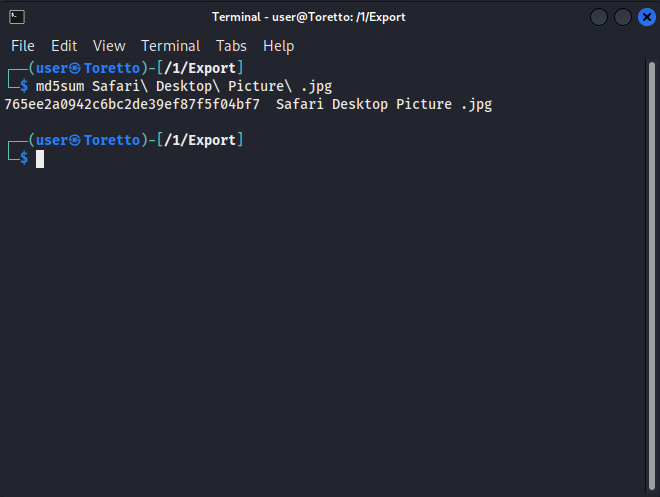

# The Fast and the APFS
_Solution Guide_

## Overview

*The Fast and the APFS* asks players to forensically examine an OSX image and answer five questions related to browser forensics and artifact location in the file system. 

There are four possible variants for this challenge. This solution guide covers the walk-through for Variant 1, organized by submission question. The steps used to solve all variants will be similar, but the answers will vary.

Since an Apple File system (APFS) image will not load in the default Autopsy installation on Kali, the Java version of Autopsy has been provided.

## Question 1

*What is the string value of the "LocalHostName" for this machine?*

1. Open the image **macimage515.dd** in Java Autopsy.
    -   Open a terminal and navigate to `/home/user/autopsy/autopsy-4.20.0/`
    -   Enter `sudo bin/autopsy`
    -   In **Autopsy**, follow the prompts to open a **New Case**, complete **Case Name**, then click **Next** and **Finish**. 
    -   In the Add Data Source wizard, click **Next**.
    -   **Select Data Source Type**: Disk Image or VM File
    -   **Select Data Source**: set **Path** to `/media/user/b02f1a38-a52b-4410-aa1e-5eb9ab08537a/macimage515.dd`
    -   Click **Next**, ignoring any ingest module errors.
    -   Click **Finish**.
2. In the Directory Tree, navigate to:
     `Data Sources/macimage515.dd_1 Host/APFS Pool/vol3/Library/Preferences/SystemConfiguration`
3. Select **preferences.plist** file, and in the lower pane, the **Text** tab.
4. Scroll to the bottom for the answer to Question 1. 


## Question 2

*An email was drafted but not sent with the subject of "Dinner?". There is an image attached to it. What is the MD5 hash of the image?*

Mail is stored in the user's library.  In the file system it's located in `/Users/username/Library/Mail/V9/` (this path could change with application updates). There will be a guid for each mailbox.  Each mail account should have its own folder in addition to the default OSX shared mailbox, junk, archive, etc local folders.

1. In Autopsy, navigate to: `/macimage515.dd/APFS Pool/vol_vol3/Users/brandonrickel/Library/Mail/V9/47AF9856-264E-4C6B-A0C2-97CE623DD17F/[Gmail].mbox/Drafts.mbox/416D768F-F411-4621-986B-B439741B8ECE/Data`. The mail account info and mailboxes are stored in `~Library/Mail/V#/`.
2. In this folder, there are two subfolders: Messages and Attachments. Look in and export **Messages**.
3. In a terminal, navigate to the export directory (it wil be a subfolder of the case folder you designated when setting up the import of the image) and grep the string you're looking for: 

```bash 
grep "Dinner?" *
```  
4. You will get a result in **171.partial.emlx**. Select this email in Autopsy and in the lower pane, select the **Text** tab. You will see the message headers, including the Subject line.
5. Open the **Attachments** folder and select the **171** subfolder, which corresponds to the email number. There is a ***"2"*** folder in the **171** folder that contains an image: 


6. Right-click the line in the upper panel to select the image and select **Extract File(s)**. Save the file.


7. In a terminal window, navigate to the exported image and run: 

```bash
md5sum IMG-4323.jpg
```
​	Use the name of your saved file if you saved it as a different name.


That is the answer to Question 2.

## Question 3 

*What is the MD5 of the user's desktop background picture?*

The location of the desktop background image is stored in `~/Library/Application Support/Dock/desktoppicture.db`.

1. Navigate to `/macimage515.dd/APFS Pool/vol_vol3/Users/brandonrickel/Library/Application Support/Dock/`.
2. Follow the same steps in Autopsy for question 2 to extract the database file: **desktoppicture.db**.
3. Navigate to the exported file, and open in **DB Browser for SQLite**.
4. Select the **Browse Data** tab and see the location of the background image:
    

5. In Autopsy, navigate to that location **(/Users/brandonrickel/Library/Safari Shared Data/)** and find the file.  Since there is no hash calculation in the *Metadata* tab, you will need to manually hash the file.  Right click, extract the image, and in the **Export** Directory run:

```bash
md5sum Safari\ Desktop\ Picture\ .jpg
```



That is the answer to Question 3.

## Question 4

*A file named p1it.pdf was downloaded from the internet.  What is the full URL of the file?*

The history for Safari is located at `~/Library/Safari/History.db`.

  1. In Autopsy, navigate to `/macimage515.dd/APFS Pool/vol_vol3/Users/brandonrickel/Library/Safari/`.
  2. Select the **History.db** file.
  3. In the lower pane, Application tab, click **Export to CSV**. Save the file.
  4. Locate the file name in the .CSV file and copy the entire URL as the answer to Question 4.

## Question 5 

*What is the MD5 hash of the user's profile picture?*

The file you are looking for is `/macimage515.dd/APFS Pool/vol0/81C6F081-f99D-401A-962E-5D8860C91F0/var/db/CryptoUserInfo.plist`.

1. Extract the file using similar procedures as in the steps above.
2. Navigate to the file and open with a text editor of your choice (we used Vim).
    
    
3. Remove everything **except** the content between `\<data>` and `\</data>` (remove the `<data>` tags too) and save the file. 
4. Next, decode the base64 with the command: 

```bash
base64 -d -i ./CryptoUserInfo.plist > file.tiff
```

5. If you browse to or open the file, you'll see it's now a default Mac profile image.


6. Calculate the hash using the built-in tool:

```bash
md5sum file.tiff
```


The hash is the answer to Question 5.

## Variant Answer Key

### Variant 1
Q1: `brandons-Macbook-Pro`  
Q2: `C9A10C60E835ECB93D9ED7FC5F27381F`  
Q3: `765ee2a0942c6bc2de39ef87f5f04bf7`  
Q4: `https://www.irs.gov/pub/irs-pdf/p1it.pdf`  
Q5: `f27e653ff0296fbabead9c67787ab480`

### Variant 2
Q1: `brandon's Macbook Pro`  
Q2: `FCDA570290712A2F8A6C944FC6D85385`  
Q3: `b73f51c88acb4effd9596306acb2f5e3b6b2e769`  
Q4: `https://pubs.usgs.gov/sir/2023/5028/sir20235028.pdf`  
Q5: `21f85b75da790525371b443675e01aa34cbe3667`

### Variant 3
Q1: `brandons-Macbook-Pro`  
Q2: `8EDF1CB97BBE1DE28B6E64AE4A817F44`  
Q3: `4cf65d372918ed8ea69e038840c501d4a481c2279e2c68ac3df552a393050c9d`  
Q4: `https://www.cisa.gov/sites/default/files/2023-04/principles_approaches_for_security-by-design-default_508_0.pdf`  
Q5: `ff4d4f4c48c1f57938585f5207a61bdccff669634a1e79176f7ca4fabcb05a7f`

### Variant 4
Q1: `brandon's Macbook Pro`  
Q2: `70F116E9E958D5A69C3E3211D470ADFE`  
Q3: `0c786e1989adff0d66ee5631f79ec43e034758353df43b267fd08f84ece23690e20d1f625566b449be5ea7167bc373d9`  
Q4: `https://www.nasa.gov/sites/default/files/atoms/files/50-years-of-solar-system-exploration_tagged.pdf`  
Q5: `c14287c83468e1edbf072db789fe871cc8ab4447312bb980d9a26dd30a6023c13d0a88bcc6c7fd1c68a3fb883272bb26`
