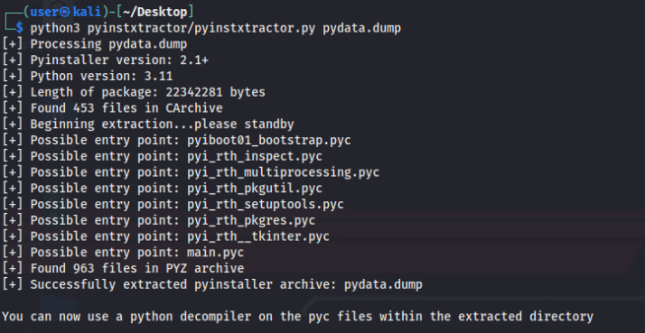
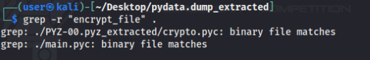
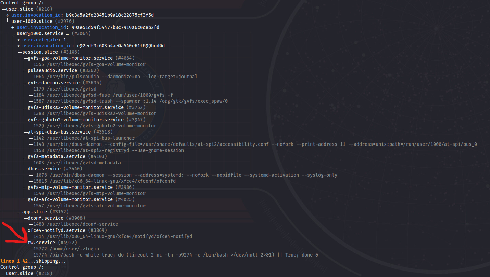

# Ransom Where?

*Solution Guide*

## Overview

To solve *Ransom Where?* players must remediate a ransomware attack by decrypting the affected files, removing all traces of the malware, and patching vulnerabilities to prevent future incidents. 

## Additional Info

**Read this first!**

If you investigate the machine where the attack originated from at any point, you can glean information helpful to answering the questions.

Log into the `website` VM and run the following command to view information on current network connections:

```bash
sudo netstat -tulpn
```

In the output, you should see port `9274` is open and running `nc` and port `8000` is open because of the program `.zlogin`.

Because these two ports are listening and the reason is not known, you should run the command `sudo wireshark` and listen on `eth0`. You will see many connections, but the requests coming from host `123.45.67.175` should stand out because they are outside the network.

Run the following `nmap` command:

```bash
nmap 123.45.67.175
```

Port `8000` is open. If you visit the URL `123.45.67.175:8000`, you will notice a webserver is running and hosting files. Select the `Documents` folder. There are two files in `Documents`:

- `build_steps`
- `pseudo_rw`

The information in these two files provides insight into how the ransomware works and are referenced throughout the solution guide.


## Question 1

*What is the key used to decrypt the ransomware?*

You can log into any machine for this part, but we'll use the the `user` VM for solution guide purposes. 

Log into the `user` VM. You will see a popup telling you: *Your files are being encrypted and you will lose them if you attempt to close the program before it finishes. Pay me 1 million dollars and I will provide the decryption key.* 

The ransomware popup can't be closed, so you may want to use a terminal to view your files. Many of your files have the string `.Locked` appended to them. If you attempt to read their contents you'll see that the contents have been encrypted and are unreadable. 

Considering *all* the machines have been attacked, see if any services or ports are open and listening--the ransomware needed a way to propagate throughout the network. 

Run the command:

```bash
sudo netstat -tulpn
```

You can gather that the file with the name `.zlogin` is running and listening on port `8000` and that an `nc` listener is running on port `9274`.

> Browse to`http://10.1.1.202:8000` to see the web server you are hosting. 

Knowing this information, you can run the following command to see how many processes are running (which, most likely, are behind the ransomware popup and the open ports). 

```bash
ps aux | grep .zlogin
```

From the output you should see multiple processes running that all state that the command `/home/user/.zlogin` is what has created them.

At this point, it is safe to assume that the file `.zlogin` is the ransomware. Knowing this, consider that you also need it to decrypt your files--you don't want to kill all the processes just yet.

For the purposes of this solution guide, transfer the ransomware to the `kali` VM Desktop and rename it `ransomware`. This can be done using the following command:

```bash
scp .zlogin user@**kali IP**:Desktop/ransomware
```

Now, you can analyze it in an unaffected environment and use the tools provided on `https://challenge.us`  (see the "Getting Started" section of the challenge guide).

The next part will take place on the Kali VM. 

You may begin analyzing and extracting information out of the ransomware. If you run the command:

```bash
file ransomware
```

...you will see it is an `ELF` executable. 

Run the command:

```bash
readelf -a ransomware
```

Now, you can see `pydata` is present. This hints that the file was compiled from Python code. 

If you examine the `build_steps` file referenced in the "Additional Info" section above, it tells you the ransomware was built with the `pyinstaller` tool. This hints that you should use the `pyinstxtractor` tool to extract information.

Go to `https://challenge.us/files`, download `pyinstxtractor.zip`, and unzip it. You'll need it soon.

Using `objcopy`, extract the Python data from the executable:

```bash
objcopy --dump-section pydata=pydata.dump ransomware
```

This creates the file `pydata.dump`, which is unreadable, but contains the Python information from the executable.

Use `pyinstxtractor` against the newly created `pydata.dump` file:

```bash
python3 pyinstrxtractor.py pydata.dump
```

A folder called `pydata.dump_extracted` is generated which contains the extracted Python byte code. The output should look similar to the image below:



`Possible entry point: main.pyc` is a hint that it is the file you should analyze first.

Move into the newly created `pydata.dump_extracted` directory and view the contents by running:

```bash
cd pydata.dump_extracted
cat main.pyc
```

(Only some of the content is human readable.)

An easier way to analyze the output is to run:

```bash
strings main.pyc
```

This way, only human readable output is printed. Focus on the function called `encrypt_file`.

Still in the same folder, perform a recursive search of *all* the files to find where else that function is mentioned. Run the following command:

```bash
grep -r "encrypt_file" .
```
The screen print below shows how this should look.



The output shows two files: `main.pyc` (which you found it in) and `crypto.pyc` (which is located in the `PYZ-00.pyz_extracted` folder).

To get any readable information from the `crypto.pyc` file, we will be using the `strings` command on the file `crypto.pyc`. 

From that output, the entry `_H3r3S___J0hNny_` should stand out from the rest because it isn't a function call, library, or variable. 

`_H3r3S___J0hNny_` is the decryption key that when entered in the ransomware pop-up that will begin the decrypting process. It is also the answer to Question 1.

## Question 2

*What is the token given from https://challenge.us grading after mitigating the vulnerabilities and preventing re-infection? (website, user, and services VM's)*

You now know how to decrypt the files. To answer Question 2, you will determine how the ransomware reinfects the system and patch any vulnerabilities. 

From the output of both the `sudo netstat -tulpn` and `ps aux | grep .zlogin` command as well as the information from the files referenced in the "Additional Info" section above, you know the following about the ransomware. You now know it is:
- Running an `HTTP Server` on port `8000` and using it to host the ransomware to allow for migrating
- Connecting to hosts via `SSH` to run multiple commands to download the ransomware, change permissions, and execute it.
- Starting a `nc` listener on port `9274`
- Starting a GUI to prompt for the key to decrypting the files
- Starting a process to encrypt files

If you review the `pseudo_rw` file referenced in the "Additional Info" section above, you will find the ransomware's functions. They are responsible for:

- Running a web server
- Starting the GUI
- Starting encryption
- Starting migration
- Creating persistence on the host

You should see that the migration has multiple checks to how it will execute. It first verifies if a flask vulnerability is present, if not then it checks for an active `nc listener` to see if it is running. If that is not present, then it attempts to connect via `SSH` with known credentials of the user, `user`.

It also creates persistence with the `create_persistence()` function; the file states it will `create user systemd service to run on reboot`.

Knowing that information, follow the procedures below for all machines (`website`, `user`, and `services`) to pass the grading check.

#### 1. Disconnect the machine from the network

Considering there are multiple methods of reinfection, it's best to mitigate everything while disconnected. Run the following command on all three hosts.

```bash
sudo nmcli networking off
```
#### 2. Decrypt the encrypted files

Enter the decryption key from Question 1 into the ransomware popup. (`_H3r3S___J0hNny_`)

#### 3. Disable systemd services made for 'user'

The `pseudo_rw` file states that the ransomware will `create user systemd service to run on reboot`. Because of this, you'll have to review any systemd service made for the `user`, not system-wide. Find and disable the service:

1. Run: `sudo netstat -tulpn`.
2. Get the `PID` of the process running the `nc listener`.
3. Run: `systemd-cgls **PID**`.

From the output, you can see the service running the ransomware is called `rw.service`. See the screen print below for reference.



4. Find the service: `sudo find / -name "rw.service"`. The output tells you it can be found at: `/home/user/.config/systemd/user/rw.service`-- indicating the service running is specific to just the user and not the system.
5. Stop and disable the service:

```bash
systemctl --user stop rw.service
systemctl --user disable rw.service
```
#### 4. Kill the running "ransomware" processes if any still remain

Run the following commands:

- `sudo ps aux | grep .zlogin`
- `sudo kill -9` (**PIDs** of the processes returned from the command above)
- `sudo ps aux | grep .zlogin` (run a second time to ensure all processes are dead and haven't been recreated)


#### 5. Verify nc listener and HTTP server on port 8000 are terminated

Run the following commands:

- `sudo netstat -tulpn`. If they are running, then:
- `sudo kill -9` (**PID** of service found in command above)

#### 6. Change 'user' account password

You're changing this because the current password is known by the ransomware. Run: `sudo passwd user`. The password can be changed to anything you like, it just can't stay the same. 

#### 7. Fix vulnerability in online shop

Lastly, fix the vulnerability present in the `online_shop` source code that was originally attacked. This step is for the `website` VM *only*.


1. Stop `website.service` if it is running: `sudo systemctl stop website.service`.
2. Review the `pseudo_rw` file again. The file `.zprofile` is created to help attack the Flask website. When you analyze that file, you can see it is using a vulnerability within the `LogSubstitutor` class. This is your hint that something with the logging or formatting in the Flask code creates the vulnerability. 
3. Go into the directory located at `/home/user/Desktop/online_shop/` to view the files that handle running the website.
4. Patch the vulnerability:
	- Delete the file `flask_formatter.py`.
	- Remove ~line 7 in `main.py` where it says `import flask_formatter`.
	- Comment or remove ~line 368 in the website `main.py` file (this prevents setting that file as the default handler for logging).
5. Restart `website.service` provided no errors are present. 
	- Run the command: `sudo systemctl restart website.service`.
6. Verify the site is running as expected.
	- This can be checked with the command: `sudo systemctl status website.service`

When all steps have been taken on each machine and reinfection can't occur, bring up the network on each using:

#### 8. Turn networking back on for all machines

```bash
sudo nmcli networking on
```


Run the grading check on `https://challenge.us`; if completed correctly, then you are presented with the second token.

## Question 3

*What is the token given from `https://challenge.us` grading after removing all traces of the ransomware after completing the mitigation step? (website, user, and services VM's)*

If you are completing the challenge in order, then this part is straightforward. There are three main files associated with the ransomware. These files are:

1. `.zlogin`
	- Located at `/home/user/` on each machine
2. `.zprofile`
	- Located at `/home/user/` on each machine
3. `rw.service`
	- Located at `/home/user/.config/systemd/user/` on each machine

Delete the files on each machine and then rerun the grading check (`challenge.us`). If done correctly you will be presented with the third and final token.
