# The Passed of Us

*Solution Guide*

## Overview

Perform credential vault recovery to gain access to a data recovery website and analyze backup data for crucial information.

## Question 1

*What is the token associated with Marcus' secret?*

Retrieve the challenge artifacts from `https://challenge.us`. There are two files: an encrypted **vault** and a **registry** of sorts in XML format.

Within the registry, search for the Application Settings hive and notably the **LostPass** registry details. *This screenshot was cropped to show just the LostPass details.* 

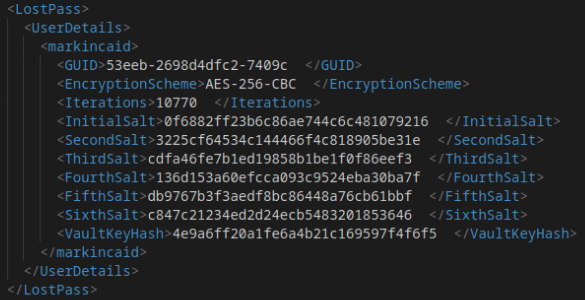

The GUID is randomized for each deployment, but will always be one of the following values:

```
7a5492b231075f65cb79
e034c719d927de401afa
18672bfa7ce02c6c27b4
53eeb2698d4dfc27409c
ab2518df0ff53cecdac7
```

Next, browse to the secrets site at `http://10.3.3.145:8080` and find the  token associated with the GUID you found in the registry. This step helps to confirm you are looking at the correct vault information and have the correct secret.

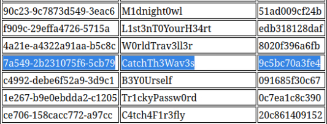

The token you find here is the answer to Question 1.

## Question 2

*What is the token found inside the vault along with the recovered credentials list?*


Recovering the contents of the encrypted vault is the main objective of the challenge. There are several steps involved. Each step must be completed carefully.

First, notice the details of the LostPass configuration in the registry file. The registry provides an encryption scheme, iteration count, several salt values, and the hash of the vault key.

You will need the secret found on the secrets site. Depending on the GUID for your challenge, the secret will be one of the following pairs:

```
7a5492b231075f65cb79 | CatchTh3Wav3s
e034c719d927de401afa | Ech03sOfL1f3
18672bfa7ce02c6c27b4 | CatchM3IfY0uCan
53eeb2698d4dfc27409c | W1nd0fChang3
ab2518df0ff53cecdac7 | C0ff33L0v3rsUn1t3
```

Then, determine the hash of the secret with:

```
echo -n "thesecret" | md5sum
```

You now have all of the necessary parts to determine the pattern of concatenation. As there are three parts, there are six distinct possibilities for the concatenation. And, we know what the second (or next) salt should become. We can test our pattern against it.

*Note: You do not need to hash the value stored in the VaultKeyHash field of the registry.xml file.*

The six possible patterns are:

- Hash of the vault key + hash of the secret + salt
- Hash of the vault key + salt + hash of the secret
- Salt + hash of the vault key + hash of the secret
- Salt + hash of the secret + hash of the vault key
- Hash of the secret + salt + hash of the vault key
- Hash of the secret + hash of the vault key + salt

You can lay these out in a table and then add a column for the MD5 hash of the overall concatenated string, which you should also calculate. In this table, we are simply taking our three pieces, making every possible combination of the three when concatenated together, and then adding the md5 hash of the entire concatenated string as the "new salt".

you can calculate the md5 hash of each concatenated string with `echo -n "the concatenated string" | md5sum`.

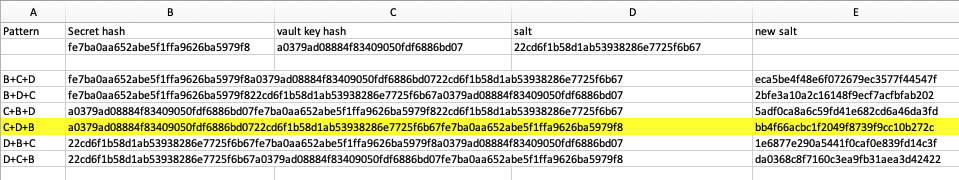

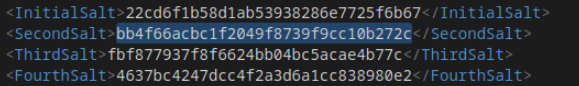

Once you find the pattern that matches the second salt in the registry, you know the pattern for iteration 1, which is the concatenation of the vault key hash + salt + secret hash, in that order. This becomes the new or second salt.

Repeat the process for the next/second iteration, this time using the *new* salt as the salt.

This lets you confirm the pattern for the second iteration and we can see that the pattern of concatenation is rotating or shifting to the left.

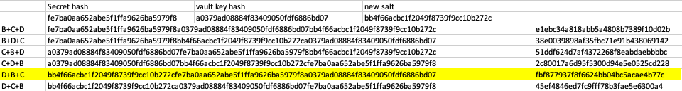

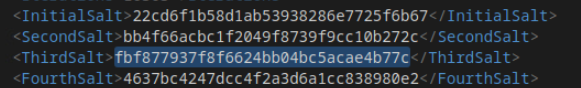

This time the concatenation is the salt + secret hash + vault key hash, in that order.

One more test of the pattern confirms that the full pattern shifts and must be repeated every three iterations by performing the process once more and finding the result matches the provided fourth salt.

The concatenation pattern of the third iteration is secret hash + vault key hash + salt.

We can see that one more pattern shift would take us back to the starting pattern of vault key hash + salt + secret hash, so we can infer that the pattern repeats every three iterations and shifts once to the left each iteration.

The additional fifth and sixth salts listed in the registry will help you confirm this if need be.

Next, we should script the process to derive the final decryption key after the provided number of iterations, as we don't want to do this by hand for ~10,000 iterations

There are several ways to write the code or script to run through the key derivation process. Listed below is a condensed version of the script used by the challenge to derive the final key when initially encrypting the vault.

```
import hashlib

def decrypt_vault_key(vaultkey_hash, secret_hash, salt, iterations,filename):
    current_salt = salt
    new_salt = None
    with open(filename, 'w') as file:
        for i in range(iterations):
            if i % 3 == 0 or i % 3 == 3:
                concatenated_string = vaultkey_hash + current_salt + secret_hash
            elif i % 3 == 1:
                concatenated_string = current_salt + secret_hash + vaultkey_hash
            else:
                concatenated_string = secret_hash + vaultkey_hash + current_salt
            new_salt = hashlib.md5(concatenated_string.encode()).hexdigest()

            line = f"Iteration: {i+1}, New Salt: {new_salt}"
            print(line)
            file.write(line + '\n')

            current_salt = new_salt

    with open(' keyfile', 'w') as key_file: #write the final salt/key to a file as well
        key_file.write(new_salt)

    return new_salt

# Example usage:

vaultkey_hash = "a0379ad08884f83409050fdf6886bd07" # your vault key hash
secret_hash = "fe7ba0aa652abe5f1ffa9626ba5979f8" # Secret hash
salt = "22cd6f1b58d1ab53938286e7725f6b67" # Initial salt
iterations = 10303 # Number of iterations
filename = " saltlist.txt" # Use this to verify the first 3 salts are as expected

result = decrypt_vault_key(vaultkey_hash, secret_hash, salt, iterations, filename)

print("Final salt:", result)
```

Remember to replace the values at the end of the script with *your* values for the vaultkey hash, secret hash, initial salt, and iteration count, as each instance of the challenge is different.

If done correctly, running the script should recover the final salt, which is the ultimate vault decryption key. You can verify the first three salts do indeed match the values found in the registry, confirming that the script is working as intended.

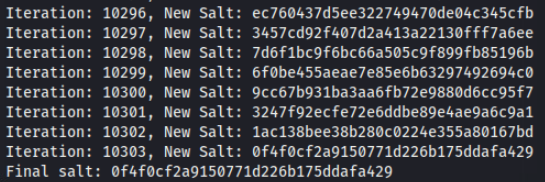

Use this final salt as the decryption key with an `openssl` command to decrypt the file:

```
openssl enc -aes-256-cbc -d -in vault -out decrypted-vault -pass
pass:"the_key_string_you_derived"
```

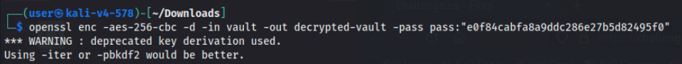

Once you have decrypted the vault, you are left with a zip container that is not password protected. The credentials file and a token file are in this zip container. The answer to Question 2 is the flag found within the token file.

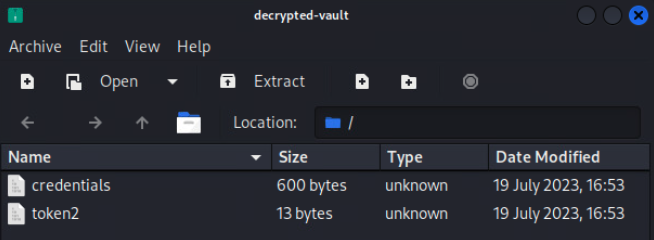

## Question 3
 *Which planet is the patient codenamed "Ness" currently residing on?*

Open the credentials file and retrieve Marcus' password to the data recovery suite at `http://recovery.merch.codes:8080`.

Browse to the site and log in. 

Retrieve the correct backup file. Because the file was deleted on February 28, you need the backup taken the day prior on February 27.

Using a tool like `scalpel` or known file header and footer information for PDF file types, extract all .pdf files from the data
blob. The header of the PDF file is `%PDF` and the footer is `EOF`.

If using `scalpel`, you need to modify the configuration file at `/etc/scalpel/scalpel.conf` to include the search for PDF's. These lines are already included, but must be commented out because `scalpel`, by default, will not look for any files unless you explicitly enable them. Add your own entry using the header and footer values provided to ensure you will be able to carve out the challenge-specific artifacts. `Scalpel` seems to have trouble using the original defaults at times.

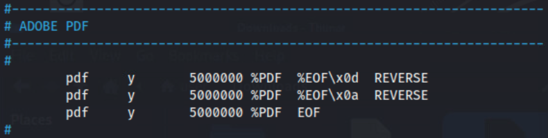

Once you have modified the config file, save it, and run `scalpel` against the backup file, replacing the `[data]` parameter with the actual filename date of your backup file.

```
scalpel backup-[date].hex
```


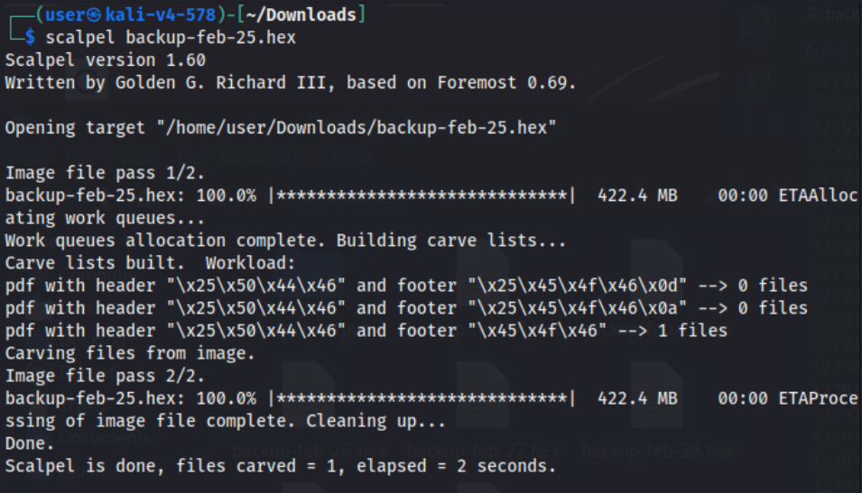

The output is placed into a folder in the directory where you ran `scalpel` called **scalpel-output**. Any files that were carved out are found inside.

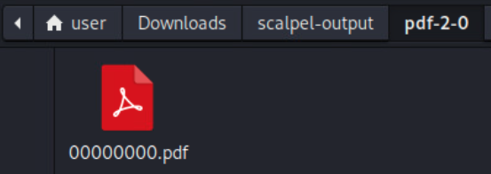

Find the PDF file that was carved, and view its contents in hex in a text editor or VS Code (remember, we have only carved out the file in its raw form, not the file itself).

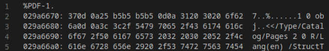

*Note - the backup files were later normalized so that each PDF's file header would begin with an offset divisible by 16. Therefore, the step immediately below should no longer be necessary, but may still be educational to anyone rebuilding files out of raw binary data.*

>You may notice that `scalpel` tends to cut off the initial bytes of the file structure. If this is the case, add the data into the first line as shown below. The amount you may have to fix can change per gamespace. Convert the ASCII to hex, add the appropriate values, and adjust the offset value so it begins with the position of the character `%`.
>
> 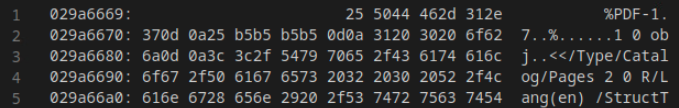
>
>You can search for and find the header and footer values in the backup hex data and then carve the data out using a tool like `xxd`. This could be more labor intensive, but it is an alternative solution to relying on scalpel, which can be finicky.
>

Once you have verified the contents of the PDF's hex form, rebuild the file with `xxd` or `od` or other tool. If using `xxd`, you may need to install it on the Kali system (`sudo apt-get install xxd`).

```
xxd -r 00000000.pdf > test.pdf
```

If you have performed all steps correctly up to this point, the resulting **test.pdf** file should be a readable PDF file.

Read the PFD mission report. The planet where Ness is located is listed at the bottom of the report in bold text. This planet or location is the answer to Question 3.

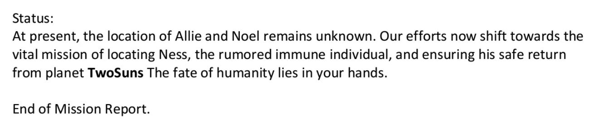

The location can differ for each gamespace, but will always be one of the following: *TwoSuns*, *Threedia*, *Scarabia*, *Dileem*, or *Magicantia*.

> **Note:** If you pulled the wrong backup data file, or thought about brute forcing all seven backup files for any and all PDF's, the wrong  backups contain a red herring PDF which does not contain the mission information necessary to solve the challenge.
