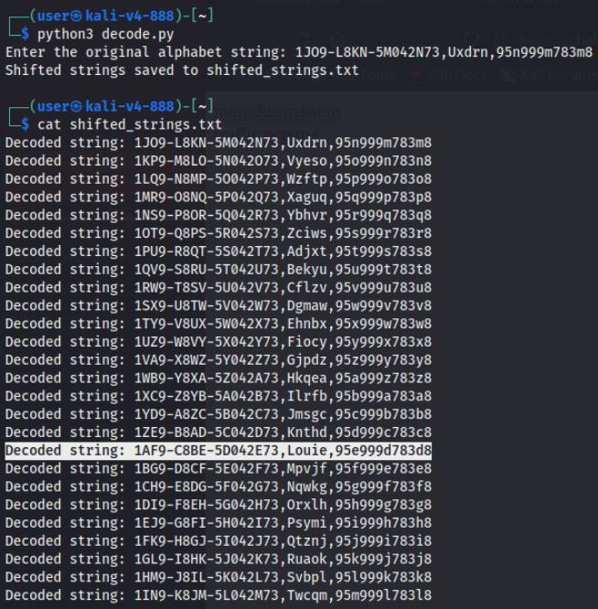
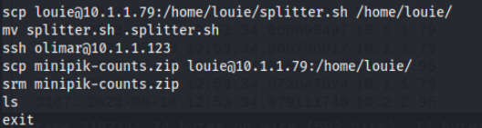

# Untangling the Web

*Solution Guide*

## Overview

In *Untangling the Web*, players will perform memory analysis on a crashed personnel device server to recover information, identify a specific user's tracking device on the network, and correlate their network time with other network activities for signs of malicious acts. Some scripting to assist in analysis is required.

To solve *Untangling the Web*, players must complete three objectives in order and answer four questions. These objectives are:

1. Recover the Locator Tag Assignment List from memory.
2. Determine when Louie's locator device came online.
3. Investigate network traffic correlated to the above time and determine the actions taken by Louie. This objective has two related questions to answer.

## Question 1

*What is the Locator Tag ID assigned to Louie?*

First, download the **memdump.mem** file from: `https://challenge.us/files`.

You have Kali to work with and no other forensic toolkits other than what comes stock with Kali. Because we know the obfuscated data was loaded into memory and we know it was obfuscated using a simple shift cipher, we can look for the data using strings.

You might get lucky finding the process using this data (**getLocationTagData.exe**) and then somehow extract the file contents from memory, that is overkill for what we need to do.

Assume the name "Louie" appears in the data and we know for sure what the csv column headers are, so let's start by searching for that data.

Using a Python script, we can determine all 26 possible shifts of a piece of the column headers, say *Locator*. Then, we print the output into a space-delimited grep-friendly manner for easier copy/paste
later on.

```python
def shift_letter(letter, shift):
  if 'a' <= letter <= 'z':
    base = ord('a')
    return chr(((ord(letter) - base + shift) % 26) + base)
  elif 'A' <= letter <= 'Z':
    base = ord('A')
    return chr(((ord(letter) - base + shift) % 26) + base)
  else:
    return letter

def shift_text(text, shift):
  shifted_text = ""
  for char in text:
    shifted_text += shift_letter(char, shift)
  return shifted_text

alphabet = 'abcdefghijklmnopqrstuvwxyz'

original_string = input("Enter the original alphabet string: ")

with open('shifted_strings.txt', 'w') as output_file:
  for shift_value in range(26):
    shifted_string = shift_text(original_string, shift_value)
    output_file.write(f"-e {shifted_string} ")

print("Shifted strings saved to shifted_strings.txt")
```


Take all of these shifted values and plug them into a `strings` command where we `grep` for each possible occurrence. We recommend *not* including the shift value of 0 because this could lead to false positives.

Type `strings memdump.mem | grep ` and then copy and paste the contents of `shifted_strings` into the command and run it.


Depending on which variation of the challenge was deployed for you, the shift will either be 4, 9, 13, 18, or 22: finding a match on the 4th, 9th, 13th, 18th, or 22nd grepped item. Each gamespace chooses this value at random, but it will always use one of the five values listed above for the shifting of the data.


In the screen print above, we hit on when the shift is 9.

Therefore, if the string "Louie" exists, it should have a value of **Psymi**, **Uxdrn**, **Ybhvr**, **Dgmaw**, or **Hkqea** in the Assignment List data, depending on the shift value.

Again, in our case above, the shift is 9 so we are searching for "**Uxdrn**".

We repeat the process again: `strings memdump.mem | grep -e Uxdrn`


The values may show up multiple times and this is OK. We are interested in converting this line of data back to its original form.

You can likely find a simple shift cipher decoder online to speed things up. But, you can also run this string back through the Python script we wrote earlier to find a decoded value.

Change this line: `output_file.write(f"-e {shifted_string} ")` to something like this to make the output more readable:

`output_file.write(f"Decoded string: {shifted_string}\n")`



Now, we have all three pieces of information. Louie's Device Tag ID is `1AF9-C8BE-5D042E73`, and his password is `95e999d783d8`.

## Question 2

*What packet (number) represents the first time the device in question checked in within the overall packet capture?*

Download the **traffic.pcapng** file from: `https://challenge.us/files`.

We have some context clues in the challenge document to help narrow down the search. We know the device manager server is in the security network, or `10.4.4.0/24`.

Start with a filter in Wireshark for any traffic to/from this network with `ip.addr == 10.4.4.0/24`.


If you view  **Statistics**, **Conversations**, you'll see there are six distinct IP's talking to a system at `10.4.4.225` that nothing else talks to in the capture. These are the likely devices that are checking in.

However, we don't know which of these devices is the one in question by looking at the traffic. Therefore, we need to decrypt and "deobfuscate" the contents of these conversations to tell which is which.

Starting with the first, `10.1.1.229`, find any conversation and follow its stream.


**Show data as** `Raw` and save the data to you system. 

Go back to Louie's Assignment List data and check his password.

The easiest method to quickly figure out which locator data is Louie's is to retrieve the data from all six locator tags and then use Louie's password against each of those.

Repeat the steps above to capture at least one conversation's raw data for each of the six locator tag IPs in the capture: `10.1.1.227`, `10.1.1.228`, `10.1.1.229`, `10.2.2.221`, `10.2.2.224`, and `10.2.2.228`. This solution guide assumes each raw output is named with the IP it came from.

Depending on which version of the challenge is deployed, the password listed for Louie will either be `539e35d9eb8a`, `2b60c2fea52d`, `e41989449863`, `95e999d783d8`, or `ef04656d37a8`. <!-- Does Untangling have variants? -->

To decrypt each file, use the following command. Substitute the password above where needed and change the filename where needed to test all six raw data dumps:

```
openssl enc -d -aes-256-cbc -in 10.1.1.227 -out 10.1.1.227.txt -pass
pass:95e999d783d8
openssl enc -d -aes-256-cbc -in 10.1.1.228 -out 10.1.1.228.txt -pass
pass:95e999d783d8
openssl enc -d -aes-256-cbc -in 10.1.1.229 -out 10.1.1.229.txt -pass
pass:95e999d783d8
openssl enc -d -aes-256-cbc -in 10.2.2.221 -out 10.2.2.221.txt -pass
pass:95e999d783d8
openssl enc -d -aes-256-cbc -in 10.2.2.224 -out 10.2.2.224.txt -pass
pass:95e999d783d8
openssl enc -d -aes-256-cbc -in 10.2.2.228 -out 10.2.2.228.txt -pass
pass:95e999d783d8
```

Only one of these attempts will *not* throw an error and will decrypt the data correctly. If you go in the IP order listed above, the target will always be the first IP address, `10.1.1.227`, even though it is the third IP to show up in the capture.


Looking at the output, the data is decrypted but in its raw binary form, so it should be converted to ASCII or text.


You can install and use a tool like `xxd` to do this, or use an online converter like: `https://www.rapidtables.com/convert/number/hix-to-ascii.html`.


We can now confirm this is the locator tag device for Louie because this ID matches what we extracted from memory. Going back to the packet capture find the first packet from this IP, `10.1.1.227`, and note the packet number for the answer to Question 1.


Depending on which version of the challenge was deployed, the packet number will correspond to Louie's tracker as follows:

| Louie's Device ID  | Packet Number |
| ------------------ | ------------- |
| 5DE29FAC-CB136078  | 320400        |
| 6B01-A83E-7D5F49C2 | 320410        |
| 3E6D-1BC5-9A78F042 | 320398        |
| 1AF9-C8BE-5D042E73 | 320410        |
| F723-6A43-9E805B1D | 320400        |

## Question 3

*What account (username) was used to access the final system?*

Based on the network traffic we see a system, `10.1.1.79`, come online just seconds after Louie's locator comes online.


This system makes an SSH connection to `10.2.2.95` at 12:53:34.

Of course we cannot see what Louie is doing in the traffic unless we interrogate the system itself. Connect to this system with `ssh
user@10.2.2.95` (password is **tartans**).

If you review the auth logs at `/var/log/auth.log.1` you will find the corresponding SSH connection by Louie with his own account, looking at logs recorded from August 18th, when the incident occurred. Look around the timestamp above to find the first log.


If we check Louie's `bash_history` with `sudo less /home/louie/.bash_history` we can see everything he did while connected,
including copying over a `splitter.sh` script and hiding it. 



Remember this script for later.

Reviewing the `bash_history` further we see that Louie made another SSH connection from this machine (`10.2.2.95`) to `10.1.1.123`. We can  confirm this in the **traffic.pcapng** file.


If we connect to this machine (in a separate terminal) with `ssh user@10.1.1.123`, we can check the same logs as above.

First, let's check `/var/log/auth.log.1`, looking at logs recorded from August 18th to see what user created this session, i.e. whose account was used to log in.


This time it appears that Louie used Olimar's account, not his own, or so we can assume. Looking at the traffic, no other SSH traffic is found after this point for any system (there is some chaff SSH traffic prior to Louie's device showing up).

Therefore, we conclude that this is the final system Louie accesses, and we know that it was Olimar's account that was used to remotely access the system. Based on command histories we conclude this is the final system Louie uses or accesses.

`Olimar` is the answer to Question 3.

## Question 4

*How many total Minipiks were on hand at the end of expedition day 24?*

Same as on the previous system, let's review the `bash_history` file for Olimar to see what Louie was doing.


We see him `scp` the hidden `.splitter.sh` file from `10.2.2.95` to this system, `10.1.1.123`. Then, he executes the script against the file `minipik-counts.zip`. He then `scp`'s the .zip file back to his middle system and securely deletes it and the hidden `.splitter.sh` script on the local system.

Checking the middle system's `bash_history` file for Louie, we see that he repeats this process to get the file back to his initial system and securely deletes it again from `10.2.2.95`.

However, we see no evidence that he ever deleted the `splitter.sh` script from the middle machine, `10.2.2.95`.

Sure enough, `.splitter.sh` still exists on `10.2.2.95` in `/home/louie/` as a hidden file.


We can view the contents to figure out what Louie did on `10.1.1.123` and (hopefully) recover that `minipik-counts.zip` file.


The script chunks the file into three equally sized pieces and copies them to unique directories: `/usr/bin/.a1234`, `/var/lib/.b5ef6`, and `/run/cups/.c789e`.

We can recover those files from the system at `10.1.1.123` and `scp` them to our Kali system for reassembly.

```
sudo scp /usr/bin/.a1234 user@[Your Kali IP]:/home/user/
sudo scp /var/lib/.b5ef6 user@[Your Kali IP]:/home/user/
sudo scp /etc/cups/.c789e user@[Your Kali IP]:/home/user/
```

> As a side note: the `auditd` logs are stored in `/var/log/audit/audit.log` and show the same commands as the `bash_history` files, including what `splitter.sh` was doing without having to recover it, though it is much more difficult to read those logs.

Once you have all three pieces on your Kali system, you can probably tell that they do, in fact, comprise a zip file and that they were chunked in **a->b->c** order.

Use `cat` to reassemble them together:

```
cat .a1234 .b5ef6 .c789e > minipik-counts.zip
```

Open the zip and view the spreadsheet file.

The spreadsheet lists the counts of minipik growth by species and location over the course of 24 days. Looking at the final tab of the spreadsheet, which represents the final days of growth before this report was stolen, add up the various individual species total to determine the overall total: **2575**.


