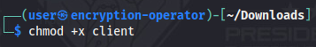
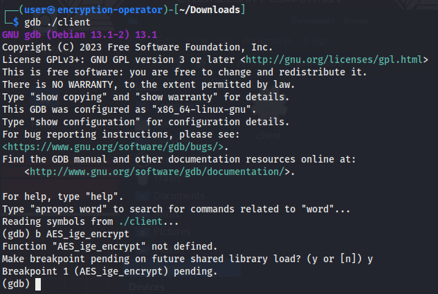
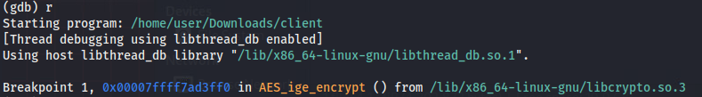
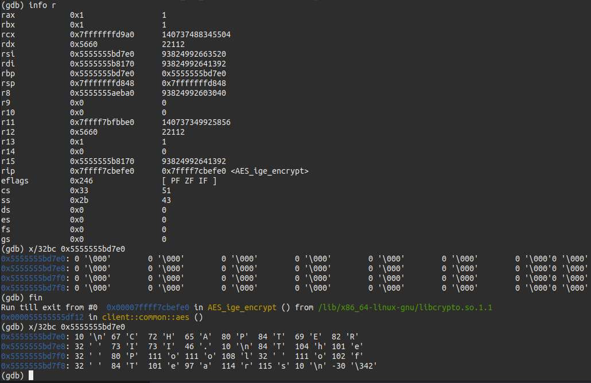

# Nice Encryption You Have There...
_Solution Guide_

## Overview

*Nice Encryption You Have There...* should be looked at in two parts. In the first part, discover what the **client** program does. Question 1 points the competitor in the direction of finding a function name. In the second part, after the function is known, write a code to intercept calls to the function to snoop the traffic coming from the server.

## Question 1

*What is the name of the function being used to decrypt messages from the server?*

1. Start by going to `https://challenge.us/files` and downloading the available `client` file. 

2. Open a terminal and navigate to the `Downloads` directory to view the downloaded `client` file. Here is the command to achieve this: 

```bash
cd /home/user/Downloads/
```

3. Analyze the `client` file to find a list of dynamically-linked symbols using this command: 

```bash
nm -D client
``` 

`AES_ige_encrypt` is the only symbol that makes sense in this context. You can confirm this by using a debugger like GNU Debugger: put a breakpoint on the imported symbol, let the program run the function, and examine the `out` buffer to see that the contents are readable. We will perform these steps below.  

>See the declaration of [AES_ige_encrypt](https://github.com/openssl/openssl/blob/master/include/openssl/aes.h#L88) in the OpenSSL source for the arguments it takes. We're looking for the second argument: `out`. See page 20 of [System V Application Binary Interface](https://refspecs.linuxfoundation.org/elf/x86_64-abi-0.99.pdf) for the specifics of the calling convention to figure out which register is the second argument. It should be `rsi`.

To confirm the use of `AES_ige_encrypt` for decryption:

1. Make the downloaded `client` file executable with the command below:



2. Run `gdb` from the directory where the `client` file was downloaded.

```bash
gdb ./client
```



3. Once `GDB` is started, we can set a breakpoint on the imported symbol with the command below (as shown in the image above): 

```bash
b AES_ige_encrypt
``` 

This will show the following prompt: 

```bash
Function "AES_ige_encrypt" not defined. 
Make breakpoint pending on future shared library load? (y or [n])
``` 

4. Ensure you type `y` to proceed. 

5. After confirming the prompt above, run the client by typing `r`. We will encounter the breakpoint set previously in `AES_ige_encrypt`.



6. Next, we'll print the registers with the `info r` command.



As mentioned above, the register holding a pointer to the `out` argument is `rsi`. 

7. Copy the value of the register (since `rsi`'s value changes after running the function and we want to see what happens to this buffer). In the previous screenshot, the value of `rsi` is `0x5555555bc7e0`. **Your values might be different**. 


8. To examine the buffer at that location, you can use the following command (also shown in the image above). Remember to use your `rsi` value instead: 

```bash
x/32bc 0x5555555bc7e0
```

This command should print out 32 bytes that are all `0`-valued. 

9. Now, we will run the program until the next return occurs. To do this, you can use the following command (as shown in the image above): 

```bash
fin
```

This command should put us at the address `0x5555555df12` (**Your address might be different**) outside of `AES_ige_encrypt` (shown in the image above).

10. Finally, run the following command again: 

```bash
x/32bc 0x5555555bc7e0
```

We see that the contents of the buffer include clear plaintext, confirming this symbol is in charge of decrypting messages from the server.

The correct submission for Question 1 is: `AES_ige_encrypt`.

## Question 2

*What is the decrypted token?*

To obtain the second token, you are told to write a code to intercept a function call that allows you to add your own code to the call. For the purpose of this solution guide, we provided the necessary code you can use to solve this part of the challenge. View the contents of [main.c](./main.c) in this directory for the commented solution code. 

We will use this code to build a shared library that allows us to intercept each call of `AES_ige_encrypt` and add our own code, which in turn allows us to dump the decrypted buffer.

1. For this part od teh challenge, create and enter a new directory using the following command: 

```bash
mkdir intercept
cd intercept
```

2. Inside this new directory, using your favorite text editor, create a file called `main.c` and copy the contents of [main.c](./main.c) into this file. It is not recommended to copy it into VS Code because tabs may not be handled correctly.

3. Next, in this same directory, using your favorite text editor, create a file called `Makefile` and copy over the contents of [Makefile](./Makefile) into this file. It is not recommended to copy it into VS Code because tabs may not be handled correctly. 

4. From the directory containing the two files created: `Makefile` and `main.c`, use the terminal to run: 

```bash
make
``` 

>Note: You will need standard build tools plus the headers for OpenSSL installed--on Ubuntu the `build-essential` and `libssl-dev` packages. 

Assuming there are no errors, it will build `preload_test.so` in this directory.

5. Finally, run the following command (Use the path that points to your previously downloaded `client` file): 

```bash
LD_PRELOAD=./preload_test.so /home/user/Downloads/client | grep token
```

Assuming there are no errors, wait around two to three minutes and you should see the decrypted token shown in the terminal.
