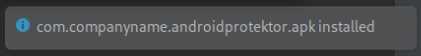

# Android Application Analysis

Analyze an Android application for potential malicious activity.

**NICE Work Roles**
- [Software Developer](https://niccs.cisa.gov/workforce-development/nice-framework)
- [Vulnerability Assessment Analyst](https://niccs.cisa.gov/workforce-development/nice-framework)

**NICE Tasks**

- [T0176](https://niccs.cisa.gov/workforce-development/nice-framework): Perform secure programming and identify potential flaws in codes to mitigate vulnerabilities.
- [T0436](https://niccs.cisa.gov/workforce-development/nice-framework): Conduct trial runs of programs and software applications to ensure that the desired information is produced and instructions and security levels are correct.
- [T0549](https://niccs.cisa.gov/workforce-development/nice-framework): Perform technical (evaluation of technology) and nontechnical (evaluation of people and operations) risk and vulnerability assessments of relevant technology focus areas (e.g., local computing environment, network and infrastructure, enclave boundary, supporting infrastructure, and applications).

## Background

Multiple users have installed an Android application on their mobile devices. Analyze the application and the partial source code to determine if this application is a potential threat.

## Getting Started

Log into the Kali VM. On the Kali Desktop, open **README.txt** for additional details. It is recommended that you start Android Studio and launch the device emulator shortly after starting the challenge because it may take a few minutes to boot. After you install the application on the emulator the following message will be briefly displayed: 
 
  
You can also verify that you successfully installed the application on the emulator by looking for the application's icon:  

## Submission Details

There are five (5) tokens to retrieve in this challenge. Here are some additional details about each token.

- **Token 1:** Use the provided partial source code and the `com.companyname.androidprotektor.apk` file to determine the list of permissions the app needs to function. Provide the list of permissions in the following format: ACCESS_WIFI_STATE|READ_SMS. Do not include the `android.permission.` prefix.
- **Token  2:** Use the provided partial source code and the `com.companyname.androidprotektor.apk` file to get access to the client key value requested by the application.
- **Token 3:** Provide the list of file extensions targeted by the `FileBackup` functionality.
- **Token 4:** Find the latitude and longitude most recently recorded by the `com.companyname.androidprotektor.apk` file and provide the name of the city represented by those coordinates.
- **Token 5:** Use the provided partial source code and the `com.companyname.androidprotektor.apk` file to figure out which image files were modified, then use them to extract the final token. Note that the files must be read in numeric order based on the file name to extract the data in the correct order.

## Challenge Questions

1. According to the AndroidProtektor.apk file, what is the list of permissions that are required?
2. What is the client key that the AndroidProtektor.apk file tries to obtain from the API?
3. Provide the list of file extensions targeted by the FileBackup functionality.
4. What is the name of the city identified by the last latitude and longitude recorded by the AndroidProtektor.apk file?
5. What is the value of the token stored in the EXIF data of the image files modified by the Android application?
