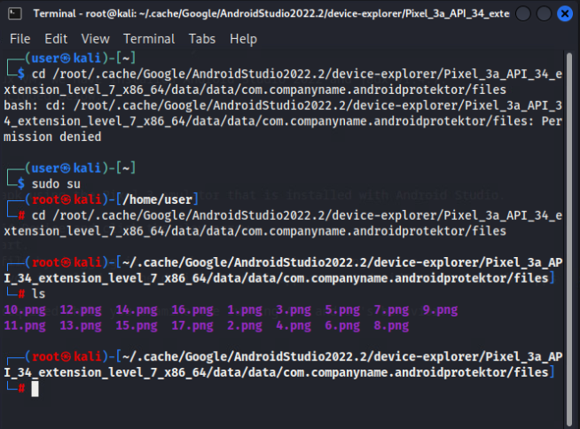

# Android Application Analysis

*Solution Guide*

## Overview

In this challenge, players analyze an Android application and the provided partial source code for potential malicious activity. 

*Android Application Analysis* consists of four variants. This solution guide provides the answers to Variant 1. The answers to Questions 2 and 5 are randomly generated and will vary for each deployed instance of the challenge.

## Question 1

*According to the AndroidProtektor.apk file, what is the list of permissions that are required?* 

1. Log into the Kali VM and run the following command from the terminal to start the Jadx GUI:

```bash
sudo Desktop/jadx-1.4.7/bin/jadx-gui
```


2. Click **Open file** and select:

`/home/user/Documents/com.companyname.androidprotektor.apk`


3. Expand **Resources**, then select the AndroidManifest.xml file.


See the image below for the four types of permissions required by the application.


The correct submission for Question 1 is: 

`INTERNET | ACCESS_COARSE_LOCATION | ACCESS_FINE_LOCATION | ACCESS_BACKGROUND_LOCATION`.

## Question 2

*What is the client key that the AndroidProtektor.apk file tries to obtain from the API?*

1. On the Kali VM, open the `MainActivity.cs` file located in `/home/user/Documents/Code/AndroidProtektor/`.
2. Go to line 63 of the `MainActivity.cs` file.


Here you will see that the application is making an HTTP call. Start by getting the `ClientId`. Notice that both the `ClientId` and `URL` appear to be stored in the `Resources` file of the application.

3. Use the Jadx GUI to navigate to the `res/value/strings.xml` file.


4. Get the **client_id** value:

```
a56ed67f10bc25c9
```

5. Next, retrieve the URL of the API value from the **api_url**: 
```
aHR0cDovL21vYmlsZWFwaS5tZXJjaC5jb2Rlcy9hcGkvcHJvdGVrdG9yLw==`
```
6. Open a terminal, and use the following command to base64 decode the api_url:

```bash
echo "aHR0cDovL21vYmlsZWFwaS5tZXJjaC5jb2Rlcy9hcGkvcHJvdGVrdG9yLw==" | base64 -d
```


7. Use the code from line 67 of `MainActivity.cs` to build the full URL.

```
http://mobileapi.merch.codes/api/protektor/getclientkey
```
Line 70 shows that you need to include the **ClientId** value as an HTTP header.

8. Run the following command from the terminal:

```bash
curl -X GET "http://mobileapi.merch.codes/api/protektor/getclientkey" -H "accept: text/plain" -H "ClientId: a56ed67f10bc25c9"
```


The correct submission for Question 2 is: `a836f2d775592852`.

## Question 3

*Provide the list of file extensions targeted by the FileBackup functionality.*

1. Open the `MainActivity.cs` file.

2. Search for the `FileBackup` string.


3. In that same directory, open the file named `FileBackup.cs`. This file is saving values to a database.


4. Locate the name of the database file by looking at the `Constants.cs` file. The name of the file is `SQLite.db3`.


5. There is no data in the database; so, you will run the application from the Android Studio emulator. Start Android Studio with the following command:

```bash
sudo ./Desktop/android-studio/bin/studio.sh
```
6. Click **Play** to start the Pixel 3 emulator.


7. Wait until the emulator starts.


8. Drag the `/home/user/Documents/com.companyname.androidprotektor.apk` file onto the emulator to install it.
9. Start the application by clicking the icon or searching for the **AndroidProtektor** app.


10. Interact with the app by clicking the navigation buttons at the bottom of the application.


11. In **Android Studio**, open the **Device File Explorer**. If it is not already visible, you can get to it by going to `View -> Tool Windows -> Device File Explorer`.


13. In the Device File Explorer, navigate to: ```/data/data/com.companyname.androidprotektor/files/SQLite.db3```


14. Save the SQLite.db3 file to your Kali VM and open it with DB Browser.


15. According to the code in `DataAccess.cs` file, the file extensions should have been saved to the `FileType` table.


16. Open the `FileType` table and copy the file extensions.


The correct submission for Question 3 is: `png | jpg | gif`. 

## Question 4

*What is the name of the city identified by the last latitude and longitude recorded by the AndroidProtektor.apk file?*

According to line 184 of `MainActivity.cs`, the `SaveLocationData` method is called when you click the **About** button of the application.

1. Look at the `SaveLocationData` method on line 254 of `MainActivity.cs`. Notice the call to the `SaveGeoLocationDateItem` method. From here, find the `SaveGeoLocationDateItem` method in the `DataAccess.cs` file. This file shows us that the data is saved to the `GeoLocationData` table. 


2. Use the steps from Question 3 to find the database file located at:
```
/data/data/com.companyname.androidprotektor/files/SQLite.db3
```

3. Open the `GeoLocationData` table and find the record with the most recent `CreationDate`.


This record will have the following coordinates: `39.099724`	`-94.578331`.

4. Search for these coordinates to find the city associated with this latitude and longitude.

The correct submission for Question 4 is: `Kansas City`.

## Question 5

*What is the value of the token stored in the EXIF data of the image files modified by the Android application?*

1. Notice a call to a method named `ProcessImages` on line 53 in the `MainActivity.cs` file. 
2. Find the `ProcessImages` method on line 305. This method loops through .png image files that start with numbers. It modifies images starting with even numbers by adding the `Artist` attribute to the EXIF data. This gives us a clue needed to find existing image data.
3. Open the **Device File Explorer**. If you right-click a file to save it, you can find the local path where the emulator files are stored on the Kali VM.
```
/root/.cache/Google/AndroidStudio2022.2/device-explorer/Pixel_3a_API_34_extension_level_7_x86_64/data/data/com.companyname.androidprotektor/files
```


4. Use the following commands to locate the image files:
```bash
sudo su 
cd /root/.cache/Google/AndroidStudio2022.2/device-explorer/Pixel_3a_API_34_extension_level_7_x86_64/data/data/com.companyname.androidprotektor/files  
ls
```


5. Open images 2, 4, 6, 8, 10, 12, 14, and 16 and retrieve the `Artist` EXIF data attribute by running the `exiftool` command for each image:
```
exiftool 2.png
exiftool 4.png
exiftool 6.png
exiftool 8.png
exiftool 10.png
exiftool 12.png
exiftool 14.png
exiftool 16.png
```


6. Put all the individual letters from the `Artist` attribute together to reveal the final token.

The correct submission for Question 5 is: `ce39ac96`.
