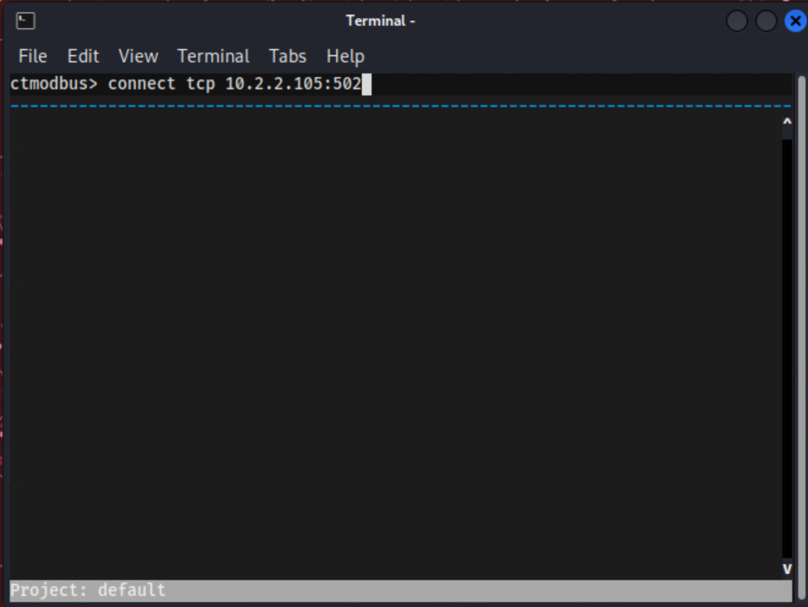

# It's Getting Hot in Here

*Solution Guide*

## Overview

In this challenge, you will use the provided Kali machine to explore and exploit various SCADA systems, gather data about the enemy network, and disable their ship using offensive tools and techniques. 

This is an infinity-style challenge so the answers you see will not necessarily match those found in the solution guide.

## Question 1

*What is the Software Version of the Scada Reactor Server software running on the reactors?*

To answer this question, players interact with and query one of the reactor SCADA servers running on `10.2.2.101:502` or `10.2.2.102:502`. 

1. From your Kali VM, open a web browser and navigate to `http://reactors.merch.codes`.
2. Log into the web site with the following credentials: 
	- Email: `tsmith@reactors.merch.codes` 
	- Password: `tartans`


3. Navigate to the **Reactors** page. Here you will notice there is information about two different reactors, including their temperature, max temperature, and min temperature. Your goal is to find the Software Version of the reactor server software. 


4. Open the browser developer tools (press `f12`; but this may differ depending upon browser) and interact with the application by increasing and decreasing the temperatures while viewing the **Network** tab. Unfortunately, this does not provide the details we are looking for.


5. On the Security Onion VM, start a packet capture and capture some network traffic. Navigate to `https://10.4.4.4` and login with the following credentials:
	- Email Address: `admin@so.org`
	- Password: `tartans@1`


6. On the left, click `PCAP`, then `+`.
7. For **Filter Begin**, enter yesterday's date. For **Filter End**, enter tomorrow's date. For **Sensor ID**, enter `securityonion`. 


8. Click **Add**.
9. When **Status** is **Completed**, click the binoculars, then **Download**.


10. Using Wireshark, open the new packet capture.
11. Use the **Statistics**, **Protocol Hierarchy** feature to get a better idea of what kind of traffic is flowing across the network.


12. Select **Modbus/TCP**. The `modbus` traffic interests us because we know this challenge involves one or more SCADA systems.
13. Close the Statistics window and filter the packet capture on `modbus` traffic. We see most of the destination addresses include the following IP addresses: `10.1.1.99`, `10.2.2.105`, `10.2.2.101` and `10.2.2.102`.


14. Try running the following `nmap` scan against these IP addresses:

```bash
nmap --script modbus-discover.nse --script-args='modbus-discover.aggressive=true' -p 502 10.2.2.101 -Pn
```

This is an infinity-style challenge so the answers you see will not necessarily match those found in the solution guide.

Our results show this is a `ScadaReactorServer` and that the `Software Version` is `6.0.3`


The correct submission for Question 1 is: `6.0.3`.


## Question 2

*Provide the token that is generated by the grading script for deactivating the Atmosphere Motor Controller.*

Examine the network traffic to see what’s happening using a PCAP file from the Security Onion device.

1. On the Kali VM, open Security Onion via the web (`https://10.4.4.4`) and download a pcap file of the traffic.
2. On the left, click **PCAP**, then **+**.
3. For **Filter Begin**, enter yesterday's date. For **Filter End**, enter tomorrow's date. For **Sensor ID**, enter `securityonion`.
4. Click **Add**.


5. When **Status** is **Completed**, click the binoculars, then **Download**.
6. Using Wireshark, open the new .pcap.
7. Filter on **modbus** traffic.  You should see traffic between `10.1.1.99` and `10.2.2.105`. Notice the calls to read holding registers and write to coils. 
8. Notice the traffic pattern between `10.1.1.99` and `10.2.2.105` where there are several holding register reads and then a single write coil command sent (*Query* then *Response*). 


9. Observe the values for the modbus traffic--notice that a read of near 2000 (it is random so will vary) is followed by writing the coil 0 value.  You should notice the holding register value rise to approximately 3000, then coil 1 is written. 

Knowing from the question and description that this controller is for a motor that controls atmosphere pressure, you can conclude that the motor speed is controlled by these coil value states and that the traffic corresponds to reading a speed value then sending a control signal at specific speeds.  Note in the following screen prints which coil indicated by reference number is being written.


Since the token will be given for deactivating the Atmosphere Motor Controller, you can either set the speed beyond safe operation to break it, or set it to 0 to stop it.

10. From the Desktop, open **ctmodbus**.
11. In the window, enter: `connect tcp 10.2.2.105:502`



12. Type `read holdingRegisters 0`. Press **Enter**, you should see the current speed.


13. To break or stop the motor, keep writing the coil values to send the commands to exceed the safe speed or stop. This command will speed up the motor by 100 rpm: `write coil 0 1` . You can use the Up or Down arrow keys to repeat commands.
14. Continue sending the "speed up" coil commands and notice that the speed returns 0, no matter how many more times you try to speed it up.  (This occurs after 4000 rpm and simulates motor failure. Likewise, you can slow the motor to 0, and it will no longer accept commands which is also a "win" condition.) 


15. Open a web browser on the Kali VM and navigate to `https://challenge.us`. Click the `Grade Challenge` button to determine if you earned a token for this part of the challenge.


This is an infinity-style challenge so the answers you see will not necessarily match those found in the solution guide.

The correct submission for Question 2 in this case is: `dc343745`.

## Question 3

*Provide the token that is generated by the grading script once the reactors have been forced to overheat.*

To answer this question, users will need to interact with and query the reactor SCADA servers running on `10.2.2.101:502` and `10.2.2.102:502`. 

1. From your Kali VM, open a web browser and navigate to `http://reactors.merch.codes`.
2. Log into the web site with the following credentials: 
	- Email: `tsmith@reactors.merch.codes` 
	- Password: `tartans`


3. Navigate to the **Reactors** page. Here you will notice there is information about two different reactors, including their temperature, max temperature and min temperature. Your goal is to send traffic to both of the reactor servers, causing them both to overheat and display a warning message about imminent failure in the ScadaWeb application. 


4. Open the browser developer tools (press F12, but this may be different for your browser) and interact with the application by increasing and decreasing the temperatures while viewing the **Network** tab. Unfortunately, this does not provide the details we are looking for.


5. Start a packet capture on the Security Onion VM to capture some network traffic. Navigate to `https://10.4.4.4` and login with the following credentials:
	- Email Address: `admin@so.org`
	- Password: `tartans@1`


6. On the left, click **PCAP**, then **+**.
7. For **Filter Begin**, enter yesterday's date. For **Filter End**, enter tomorrow's date. For **Sensor ID**, enter `securityonion`. 


8. Click **Add**.
9. When **Status** is **Completed**, click the binoculars, then **Download**.


10. Using Wireshark, open the new packet capture.
11. Use **Statistics**, **Protocol Hierarchy** feature to get a better idea of what kind of traffic is flowing across the network.


The **Modbus** traffic interests us since we know this challenge involves one or more SCADA systems.

12. Close the Statistics window and filter the packet capture on `modbus` traffic. We can see that most of destination addresses include the following IP addresses: `10.1.1.99`, `10.2.2.105`, `10.2.2.101` and `10.2.2.102`.

  

13. Select the packets that have source and destination values of `10.2.2.101` and `10.2.2.102`. These show values that look like temperature values of reactors. Run `nmap` scripts to confirm that these two IP addresses are linked to the two reactors.

```bash
nmap --script modbus-discover.nse --script-args='modbus-discover.aggressive=true' -p 502 10.2.2.101 -Pn
```

and

```bash
nmap --script modbus-discover.nse --script-args='modbus-discover.aggressive=true' -p 502 10.2.2.102 -Pn
```

Note that the values are stored in holding register `Register 0` on each server. 


14. From the Desktop, open **ctmodbus**. 
15. Enter the following command to connect to Reactor 1: 

```bash
connect tcp 10.2.2.101:502
```


16. Read the value in holding register 0 with the following command:

```bash
read holdingRegisters 0 1
```


17. Notice that the values from holding register 0 for Reactor 1 match the value of the temperature as it is adjusted in the ScadaWeb application. In this case, the value in `ctmodbus` and ScadaWeb for Reactor 1 both show as 197.


18. Update the register value using `ctmodbus` then refresh the ScadaWeb Reactors page. Set the temperature of Reactor 1 to 251 by entering the following command in `ctmodbus`: 

```bash
write register 0 251
```


19. Return to the web application and verify that the reactor temperatures show the values you wrote to the holding registers. We now know that we are on the right track.


20. Repeat the steps above for Reactor 2, which has the IP address: `10.2.2.102`.
21. Refresh the Reactors page of the ScadaWeb application when Reactor 1 has been set to a temperature above 200 and Reactor 2 to a temperature above 250. You should see that the `Temperature` for each reactor is higher than the `Max Temperature` and a red warning box with a message is displayed for each reactor.


22. Navigate to `https://challenge.us`. Click the **Grade Challenge** button to determine if you earned a token for this part of the challenge.


This is an infinity-style challenge so the answers you see will not necessarily match those found in the solution guide.

The correct submission for Question 3 is: `beb9053d`.

## Question 4

*What is the token earned for erasing the web application logs?*

Users must delete all evidence of their interactions with the reactors.

1. From your Kali VM, open a web browser and navigate to `http://reactors.merch.codes`.
2. Log into the web site with the following credentials: 
	- Email: `tsmith@reactors.merch.codes` 
	- Password: `tartans`


3. Select **Logs**.


4. Click **Search Logs**. Notice that there is evidence of your interaction with the reactors. *All* records must be deleted to receive a token for this part of the challenge.


5. Enter a single quote `'` then click **Search Logs**. The error message indicates we are dealing with a SQLite database. To attempt to delete the records using SQL injection, we need to figure out the name of the table.


6. Enter the following command into the search field:

```
hello%' UNION Select tbl_name from sqlite_schema--
```

and click the **Search Logs** button. `ScadaLogs`, which is the name of the table, has been returned.


7. Now that you have the table name, enter the following command to delete the logs: 

```
hello%'; delete from ScadaLogs;--
``` 

and click the **Search Logs** button.

8. Leave the search field empty and click **Search Logs** button. You will see that there are now no results returned. The logs have been successfully deleted. 


9. Navigate to `https://challenge.us`. Click the **Grade Challenge** button to determine if you earned a token for this part of the challenge.


This is an infinity-style challenge so the answers you see will not necessarily match those found in the solution guide.

The correct submission for Question 4 is: `66b519fe`.
