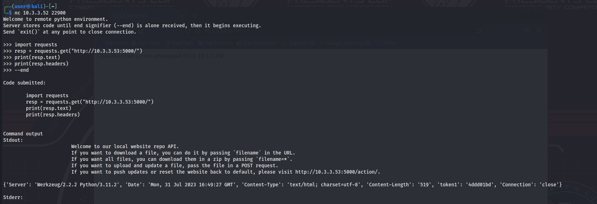
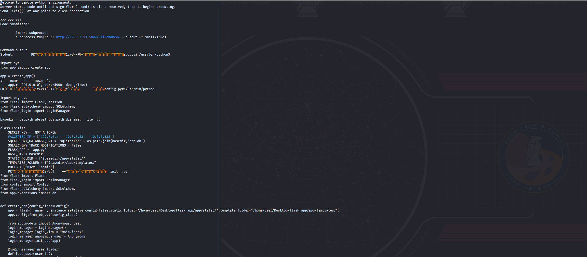
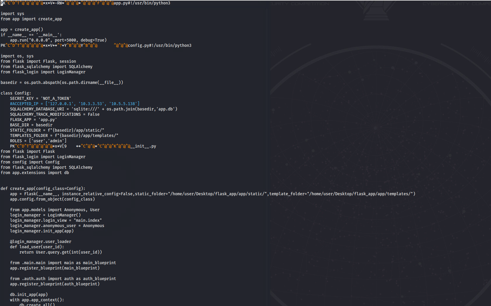
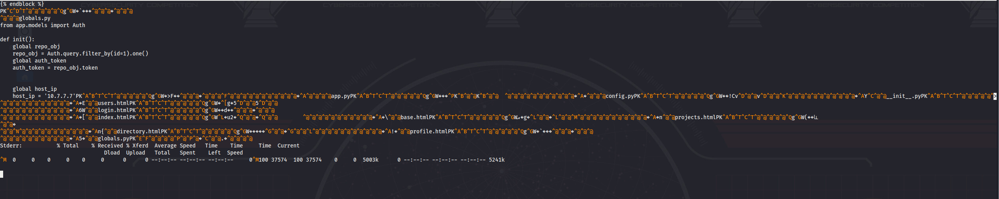
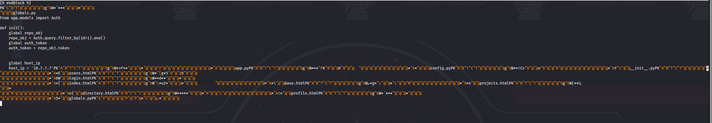
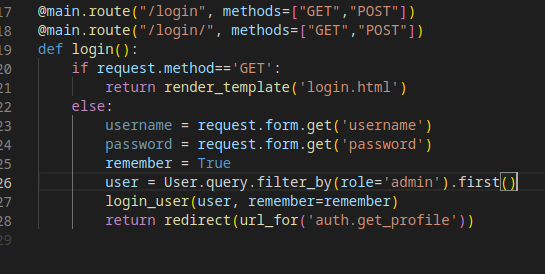
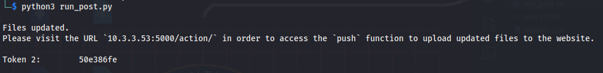

# ...The Code is Coming from Inside the Network

*Solution Guide*

## Overview

Players gain access to the website located on the `10.7.7.0/24` network.

## Question 1

*What is the token received in the response when retrieving data from the network's internal repository?*

Scan the network using Nmap:

```bash
nmap 10.7.7.0/24
```

Port `5000` is open. If you connect, you will see there is a login page but no way to create an account. What other machines are present on the network?

Start by enumerating the `10.3.3.0/24` network as directed by the challenge document under the **Getting Started** section. You will find two machines at `10.3.3.52` and `10.3.3.53`. Port scan both machines:
    
```bash
nmap -p- 10.3.3.52
nmap -p- 10.3.3.53
```

The IP `10.3.3.53` has port `5000` open. If you attempt to visit, you will be greeted with a message stating that unauthorized access has been attempted from your IP.  So for now, let's look at the other VM.

The IP `10.3.3.52` has port `22900` open. Connect to it via:
    
```bash
nc 10.3.3.52 22900
```

When connected, you get a message explaining that this is a remote Python environment used for internal development. You can send various commands, but eventually you should realize that the environment is held in a Docker container. You can't get much from attempting to send OS commands.

Try the endpoint you were denied access to from the Python environment. Test this by running the following code in the interpreter:

```python
>>> import requests
>>> resp = requests.get("http://10.3.3.53:5000/")
>>> print(resp.text)
--end
```

If done correctly, you will get a welcome message that explains this is a locally setup repo endpoint and provides some information on interacting with the website.

Question 1 of this challenge states that the token should be received when retrieving data, and in the response the token is within the headers. You can view the token by adding another command to the previous python code:

```python
>>> import requests
>>> resp = requests.get("http://10.3.3.53:5000/")
>>> print(resp.text)
>>> print(resp.headers)
--end
```

You should have the token for Question 1. See the screen print below for an example of how the output looks.



## Question 2

*What is the hex token received in the response when uploading data to the network's internal repository?*

### Step 1: Interact with repository and download website source code

Download all files hosted on the repo and transfer them from the repo to your machine. To determine the file format, view the headers from the request. 

```python
>>> import requests
>>> resp = requests.get("http://10.3.3.53:5000/?filename=*")
>>> print(resp.headers)
>>> --end
```

Within the response headers, you should see a part that says: `attachment; filename=website.zip`. You are receiving the files within a zip, so you need to read the bytes and write it to a file.

>**Please note!**How you rebuild the zip does not matter as long as you can access its contents. Below is one way. Use any other tools or methods available to you. Read the procedure below thoroughly. 

Start by running the following commands. Following is an explanation of each piece.

```bash
mkdir /home/user/Desktop/website
echo -e 'import subprocess\nsubprocess.run("curl http://10.3.3.53:5000/?filename=* --output -",shell=True)\n--end' | nc 10.3.3.52 22900 | tee /home/user/Desktop/website/website.zip
```

- `mkdir /home/user/Desktop/website`: This will create the directory `website` on the Desktop.
- `echo -e`: Echoes the following string containing Python commands, including the `n` characters, so each gets read in its own line and executed on the remote Python server.
- `import subprocess\nsubprocess.run("curl http://10.3.3.53:5000/?filename=* --output -",shell=True)\n--end`: Imports the `subprocess` module, then runs the curl command against the URL `http://10.3.3.53:5000/?filename=*` which then receives the website.zip file. But, the `--output -"` makes it so the received file is written to Stdout rather than a file.
- `| nc 10.3.3.52 22900`: Initiates the netcat connection to `10.3.3.52:22900` where the Python command string will be echoed into.
- `tee /home/user/Desktop/website/website.zip`: Takes all the output from connecting to the interpreter to receiving the output from the command and writes it to the file `website.zip` in the `website` folder created above.

Once the command has been run, the `website.zip` is nearly ready; the only thing left to do is edit the `website.zip` file to remove the extra strings written from the output of interacting with the remote server. This can be done using the text editor of choice, but this solution guide uses `pico`.

To show how the file should look, the screen prints below show the *before* and *after* when editing `website.zip` at the start and end of the file.

**Here is the start of the file:** where `PK` in the line starting with `Stdout` is the first bytes of the `website.zip` file being received.

Before editing:



After editing:



**Here is the end of the file:** where the last `^@` in the line before `Stderr` signifies the final bytes of the `website.zip` file received. Every line after this must be removed.

Before editing:



After editing:



You should have the `website.zip` file now. Unzip to show the website source code.

### Step 2: Analyze source code to access website

Begin analyzing the code and make your own malicious edits so you can gain access to the website once the updated code is pushed live. For the purposes of this solution guide, here is one way to do this.

Analyze the `login` function in the `main.py` file. See it is doing checks to verify the credentials entered match a stored user and then logs them in. Notice that the full path of the file is commented in the code; this will be useful when we run our `POST` request.

Within the `config.py` file is a setting that states: `ROLES = ['user','admin']`. This tells you what roles are accepted and now you know the role `admin` is the one you are aiming for.

Now that we know about the websites `roles` and also have access to the `main.py` script. We can begin editing the `main.py` file to alter its behavior and introduce a vulnerability. If done correctly it should allow you to login with an `admin` account.

In the screenshot below is an example of the edits I made to achieve implementing a vulnerability to the login function.



### Step 3: Format POST request to upload updated main.py script to the repo

Now that you have the `main.py` script edited, the next step will be to determine how to upload it to the repo in order to start the process of pushing it to the live website.

Look at the `functions.py` file and view the `recursive_upload` function. This function will show what format you will need to follow when uploading the file. Below is an explanation of some parts.

- `request_file_dict` object: this is a dictionary containing the files you wish to upload. Here is what the the format looks like: `request_file_dict[**Absolute path of install location of file**] = open(**Absolute file path of file to upload**, 'rb')`
- `Authorization` header: important, but at this point, we can't deduce what the `key` is that would be used.

Here is an example of that command:

```python
requests.post(f"http://10.3.3.53:5000/", files=request_file_dict, headers={"Authorization":"**auth_token**})
```

You can try and copy the POST and run it yourself. If you run it from the `python interpreter`, you will receive a message stating that the IP `does not have permissions to make POST requests.`

If you try to run the POST from your `kali` VM, you will receive a message stating that your IP `has not been authenticated. Please authenticate your machine and try again.`

You will need to continue to analyze the website code to solve how to authenticate your machine. 

### Step 4: Analyze code and authenticate your machine

For this part, look at the `run_auth()` function in the `functions.py` file. Here is a general description of how it works:

1. The first `IF` statement checks the variable `globals.repo_obj`. This variable is in the `globals.py` file and stores the hosts `auth_token`. This function checks if that token has a value; if it does, then it doesn't run this function.
2. Instantiates an empty dict named `auth_dict`.
3. Runs `GET` request to `http://10.3.3.53:5000/auth_request_string/` and saves the output to the `auth_dict` with the key `auth_string`. It also assigns the same string to the variable `tmp_auth_str` (used later).
4. Takes the `globals.host_ip` (its own IP address set in `globals.py` file) and splits it into a list  using the `.` as the separator and creates a list of four entries where each is an octet of its IP. (Example: the IP string `10.10.10.10` would be converted to the list `[10,10,10,10]`). That list is then assigned to the variable `ip_split`.
5. Runs a "for" loop iterating over two lists: `([1,5,9,13])` and `ip_split`. Within the for loop, it takes the current `octet` from the list `ip_split` and inserts it into the string `tmp_auth_str` at the index indicated by the current value from the list `[1,5,9,13]`. 
6. Once the for loop completes, it base64 encodes the resulting `tmp_auth_str` and saves it to the `auth_dict` dictionary with the key `host_auth`.
7. Adds two more entries to the `auth_dict`: `get` and `post` where both values are equal to `true`.
8. Sends a `post` to the URL `http://10.3.3.53:5000/verify_auth_request` containing the `auth_dict` data converted to JSON format.
9. Analyzes the response, and if authentication passes, then it saves the token received to its database.

When you gain an understanding of the process, you can replicate it on your `kali` machine. You can see our solution to this part in [this python script](./scripts/run_auth.py). **PLEASE NOTE:** When running this script make sure you substitute the `ip_split` variables value on  `~line 13` with YOUR machines IP.

When ran, you should see a message stating that your machine has been authenticated and presented with an `authentication token`. The token is required to run any POST from your machine to the repo.

### Step 5: POST code edits and receive token

Your host has been authenticated. It's time to upload your malicious version of the website code. The information needed to accomplish this is in your possession. That data is:
- **POST request format:** You can use the `recursive_upload()` function in `functions.py` as your base and edit as needed to work on your VM. 
- **Authentication token:** Received in previous part with successful authentication.
- **Absolute path of where file is installed on website Host VM:**  Each of the website's source code files has the path commented out within it.
- **Edited website source code file to be uploaded:** Previously downloaded, edited, and ready for upload.

[Here is an exemplar script](./scripts/run_post.py) to accomplish this. **PLEASE NOTE:** When running this script make sure you substitute the `auth_token` value on `~line 7` with the token you received in the above steps. Also make sure the variable `local_path` string points to the correct location of the `main.py` script on your machine.



## Question 3

*What is the hex token on the website associated with the project that has the highest price?*

In the response from the `POST`, it says that you should visit `10.3.3.53:5000/action/`  to access the 'push' function to upload updated files to the website.

Browse to `http://10.3.3.53:5000/action/` and you will see a message explaining `resetting` or `updating` the website's code. To push your code, you want to `update`. Browsing to the URL: `http://10.3.3.53:5000/action/?action=update`.

When the page loads, a new message saying the website is being updated and to give it a moment appears.

Browse to the website at `http://10.7.7.7:5000` and login to see if your edits have been implemented and work. If you used the edited code example from this guide, you can log in using any combination of username and password.

Once logged in, you should see several tabs; browse to the **Projects** tab.

Browse between **Past**, **Current**, and **Future** projects. For this challenge, look into **Current** projects.

You should see a project with a price that is much higher than the rest. If you look at the details, you will see the third token.
