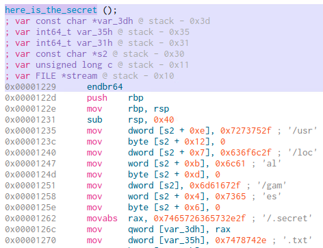

# Cosmic Code Crackers
*Solution Guide*

## Overview

Investigate systems and IDS logs in order to locate, detect, analyze, reverse engineer, and exploit various malicious or suspicious programs and related activities.

For Questions 1-4, competitors should review the **alerts.log** file on Security Onion (`securityonion`) located at `/var/ossec/logs/alerts/alerts.log`.

The log file contains four lines of alerts related to '**File added to a watched directory**' rules. The alerts will display the IP of the system, the directory where the file was added, and the name of the file.

The file on the User-A network client will look like this:
```
2023/05/03 11:48:31 ossec-agentd: ALERT: Rule: 5504 (level 7) -> 'File added to a watched directory.' | OSSEC HIDS | 10.1.1.50 | user: jason | directory: /usr/share/bug | file: 9f68b554.o
```

The files on the User-B network client will look like this:
```
2023/05/03 14:11:12 ossec-agentd: ALERT: Rule: 5504 (level 7) -> 'File added to a watched directory.' | OSSEC HIDS | 10.2.2.50 | user: jason | directory: /usr/lib/apt | file: user.exe
2023/05/03 14:11:15 ossec-agentd: ALERT: Rule: 5504 (level 7) -> 'File added to a watched directory.' | OSSEC HIDS | 10.2.2.50 | user: jason | directory: /usr/lib/apt | file: pwd-p1.exe
2023/05/03 14:11:18 ossec-agentd: ALERT: Rule: 5504 (level 7) -> 'File added to a watched directory.' | OSSEC HIDS | 10.2.2.50 | user: jason | directory: /usr/lib/apt | file: pwd-p2.exe
```

## Questions 1 and 2

*What is the return address (in little endian format) and the size of the buffer/stack that would allow you to overflow the overflow_me function and retrieve the secret information? You should provide two values as your answer with a space in between. Order does not matter.*

SSH into the host in question: `10.1.1.50`. Once you browse to the suspicious file's location (found in **alerts.log**), SCP it to the Kali system for analysis. The filename is obfuscated differently for each deployment, but always ends in the **.o** extension.


For the purposes of this solution guide, file analysis will be done with **Cutter**. Download Cutter from here: `https://challenge.us/files`. Also make the AppImage file executable with the `chmod +x` command. (You may use any other reverse engineering tool available or install OllyDbg, EDB-Debugger, etc., that you prefer.)

The steps to analyze the suspicious file are:

1. Find the `overflow_me` and `here_is_the_secret` functions.
2. Determine that one of the functions is using a vulnerable `gets` call.
3. Determine the running return address for the `here_is_the_secret` function.
4. Conduct a buffer overflow against the suspicious file to force it to provide the secret.

The `overflow_me` and `here_is_the_secret` functions are fairly obvious when looking at the disassembly of the code.


When looking at the imports that the suspicious file uses, Cutter shows that the vulnerable or unsafe functions are `gets` and `strcat`.


Further analysis of the `overflow_me` function shows that the expected size of the entered string is 32 bytes (0x20) with a stack size of 40 bytes (0x28).


To overflow the program, run it in debugger mode to see what the return address of the secret will need to be in order to print this output once we overflow the buffer.

>**Note:** When performing the following step on subsequent runs, you will notice that the return address changes each time. This is due to protections on most systems which enable Address Space Layout Randomization (ASLR). If ASLR is not disabled, you will receive a segmentation fault on the client.


You can disable this on Kali and the client Ubuntu system with the following command:
```bash
echo "0" | sudo tee /proc/sys/kernel/randomize_va_space
```

Run the program in Cutter with the green play button, ignore the initial warning, and leave the command line arguments blank.

Examine the `here_is_the_secret` function and determine the return address space: `0x555555555229`.


At this point you can answer Question 1 by providing the return address of `295255555555` (in little endian format) and the buffer/stack size of the overflow_me function of `40` for Question 2.

## Question 3

*What is the token found by analyzing the suspicious file found on the User-A network client?*

Remember that the program only provides the secret when run on the client system, as specified in the challenge guide. If you attempt the overflow on your local system, you will not receive the secret, because it is dependent on a local file on the client. 

Therefore, the remaining steps should be run while you are SSH'd into the client.

Remember to disable ASLR first, if not already done:

```bash
echo "0" | sudo tee /proc/sys/kernel/randomize_va_space
```

There are several options for performing the overflow with this information. The easiest way is to use a simple Python print statement
while passing more data than the buffer can hold.

In this statement you are sending 40 bytes of data (forty 0's) and overwriting the return address of the `overflow_me` function with the return address of the `here_is_the_secret` function to force the program to give up the secret by overflowing its buffer. You must also provide the return address in little-endian format.

```bash
python3 -c "print('0'* 40 + '\x29\x52\x55\x55\x55\x55')" |
./[name_of_file]
```


The string will be unique to your gamespace. However, this string acts as a clue to finding the final token.

Now that you know the contents of the secret file, perform a file system search for this string, including hidden files, in the `/usr/` directory.

Something like `grep -rnw '/usr/' -e 'testing123'` would work, but will take a few minutes to find the file in question. Make sure to use your specific search string. You can ignore any permission errors, as the file in question will not be blocked.


Once you have the directory (`/usr/local/games`), you will find that there are 51 **.tkn** files hidden within (use `ls -lah` to see them, or check the **show hidden files** box if using the file browser). One of the .tkn files
has the same filename as the string that you found. This file contains the valid token for submission for Question 1.

Optionally, you can shortcut the actual buffer overflow by finding the directory and hidden filename directly in the code.



Seeing this directory above also provides a clue to the location of the potential token files.

The directory and filename will match the output of the process above, though you would still need to confirm and likely test the buffer overflow process in order to get full credit for this part of the challenge.

## Question 4

*What is the token found by analyzing the suspicious files found on the User-B network client?*

SSH into the host in question: `10.2.2.50`. Once you browse to the suspicious file location (found in **alerts.log**), SCP them to your Kali system for analysis. The filenames for these three .exe files are **user.exe**, **pwd-p1.exe**, and **pwd-p2.exe**, but the directory is randomized.

This solution guide will again leverage Cutter and the use of pseudocode. It isn't necessary to run the program at all in order to solve this part of the challenge. The solution can be found by analyzing and reversing what the code does and expects.

This time looking at the code in the Decompiler view helps greatly. Use Cutter (or any other tool of your choice) to solve this problem.

Note that due to on-the-fly compiling of the program at challenge start, your decompiled code may not exactly match the examples below. However, the same basic functionality should be reversible through the use of pseudocode with some trial and error.

In Cutter, click **Windows** and select **Add Decompiler**. You can rearrange the windows so you can see the Functions, Disassembly, and Decompiler views at the same time.

You should notice two suspiciously named functions: `crack_me` and `here_is_the_secret`.


Looking at the loop in the `crack_me` function, we notice a few things.

The program is expecting a string of a certain length in order to return a value of 1. The supposed value of that length can be found at address `0x00404028`. So, let's look there.


Cutter comes with a handy hexdump view of the decompiled code which conveniently shows that the value is `5`. Therefore, our expected string length is 5 (five) characters.


Let's go back to the `crack_me` function in its decompiled form (note that your value of the string `qrdof` in the line `eax+= str.qrdof;` will vary):

```c
var_ch = 0;
var_10h = 0;
while (var_10h < eax) {
    edx = var_10h;
    eax = s;
    eax += edx;
    eax = *(eax);
    var_11h = al;
    if (var_11h > 0x60) {
        if (var_11h > 0x7a) {
            goto label_1;
        }
        eax = (int32_t) var_11h;
        eax -= 0x61;
        edx = *((eax + str.qwertyuiopasdfghjklzxcvbnm));
        eax = var_10h;
        eax += str.qrdof;
        eax = *(eax);
        al = (dl == al) ? 1 : 0;
        eax = (int32_t) al;
        var_ch += eax;
    }
    label_1:
        var_10h++;
        eax = *(0x404028);
}
```

We can simplify this by replacing the value of the string length, the`eax` value, with 5, and by replacing some of the variable names (`var_10h` with `i`). The code becomes:

```c
var_ch = 0;
i = 0;
while (i < 5) {
    edx = i;
    eax = s;
    eax += edx;
    eax = *(eax);
    var_11h = al;
    if (var_11h > 0x60) {
        if (var_11h > 0x7a) {
            goto label_1;
        }
    eax = (int32_t) var_11h;
    eax -= 0x61;
    edx = *((eax + str.qwertyuiopasdfghjklzxcvbnm));
    eax = i;
    eax += str.qrdof;
    eax = *(eax);
    al = (dl == al) ? 1 : 0;
    eax = (int32_t) al;
    var_ch += eax;
    }
    label_1:
        i++;
}
```

Next we can replace the `while` loop with a `for` loop and replace the go-to`label_1` with `continue`:

```c
var_ch = 0;
for (i = 0; i < 5; i++) {
    edx = i;
    eax = s;
    eax += edx;
    eax = *(eax);
    var_11h = al;
    if (var_11h > 0x60) {
        if (var_11h > 0x7a) {
            continue
        }
        eax = (int32_t) var_11h;
        eax -= 0x61;
        edx = *((eax + str.qwertyuiopasdfghjklzxcvbnm));
        eax = i;
        eax += str.qrdof;
        eax = *(eax);
        al = (dl == al) ? 1 : 0;
        eax = (int32_t) al;
        var_ch += eax;
    }
}
```

After that, we can simplify some intermediate representation with strings:

`edx = i; eax = s; eax += edx; eax = *(eax)` is to find out the value in `s[i];`

`al` is the last 8 bits in `eax`, that is `(char) eax;`

`edx = *((eax + str.qwertyuiopasdfghjklzxcvbnm));` means there is a constant string `s0` and `edx = s0[eax];`

`eax = i; eax += str.qrdof; eax = *(eax);` means there is a constant string `s1` and `eax = s1[i];`

Applying the above analysis, we can produce more simplified code:

```c
s0 = "qwertyuiopasdfghjklzxcvbnm";
s1 = "qrdof";
var_ch = 0;
for (i = 0; i < 5; i++) {
    var_11h = s[i];
    if (var_11h > 0x60) {
        if (var_11h > 0x7a) {
            continue
        }
        eax = (int32_t) var_11h;
        eax -= 0x61;
        edx = s0[eax];
        eax = s1[i];
        al = (dl == al) ? 1 : 0;
        eax = (int32_t) al;
        var_ch += eax;
    }
}
```

Next, we need to figure out three magic numbers in this program: `0x60`, `0x61` and `0x7a`. Since `var_11h` is of a type of char, we
can guess these magic numbers refers to the ASCII equivalent.

Therefore, "0x60" = "\`", "0x61" = "a", and "0x7a" = "z" and the statement "0x60" can be substituted with ">= 0x61". Furthermore, all `var_11h` can be replaced by `s[i]`. The code should look like this:

```c
s0 = "qwertyuiopasdfghjklzxcvbnm";
s1 = "qrdof";
var_ch = 0;
for (i = 0; i < 5; i++) {
    if (s[i] >= 'a') {
        if (s[i] > 'z') {
            continue
        }
        eax = s[i];
        eax -= 'a';
        edx = s0[eax];
        eax = s1[i];
        al = (dl == al) ? 1 : 0;
        eax = (int32_t) al;
        var_ch += eax;
    }
}
```

The program logic is much more clear now! But it can be further simplified:

Only if `s[i] >= 'a'` and `s[i] <= 'z'`, will it execute the for loop body;

`eax = s[i]; eax -= 'a'; edx = s0[eax]` equals to `edx = s0[s[i] - 'a']`;

`al`, `dl` are the last 8 bits/digits of `eax` and `edx`, respectively;

Our program's final version would be:

```c
s0 = "qwertyuiopasdfghjklzxcvbnm";
s1 = "qrdof";
var_ch = 0;
for (i = 0; i < 5; i++) {
    if (s[i] >= 'a' && s[i] <= 'z') {
        // var_ch += (s0[s[i] - 'a'] == s1[i]) ? 1 : 0;
        if (s0[s[i] - 'a'] == s1[i])
            var_ch++;
    }
}
```

You may be able to guess where this is going, but there are a few more simplifications to make based on the decompiled code of the `crack_me` function.

Let's first copy the result from the Cutter decompiler for convenience:

```c
eax = *(0x404028);
var_8h = *(0x404028);
eax = var_ch;
var_4h = var_ch;
    _printf ("%d/%d correct chars in the input string\n");
eax = *(0x404028);
al = (var_ch == eax) ? 1 : 0;
eax = (int32_t) al;
label_0:
    return eax;
```

As previous, we start by replacing and simplifying code as:

```c
eax = 5;
var_8h = 5;
eax = var_ch;
var_4h = var_ch;
_printf ("%d/%d correct chars in the input string\n");
eax = 5;
al = (var_ch == eax) ? 1 : 0;
eax = (int32_t) al;
return eax;
```

And remove the unnecessary code since we only care about when the return value is 1:

```c
eax = 5;
al = (var_ch == eax) ? 1 : 0;
eax = (int32_t) al;
return eax;
```

Finally, simplify these four lines to:

```c
// return (var_ch == 5) ? 1 : 0;
if (var_ch == 5)
    return 1;
else
    return 0;
```

Therefore we know that the `crack_me` function depends on these three constraints:

1. The length of the input string must be five (5) characters.
2. When the character provided satisfies some condition, we increment `var_ch` (i.e., `var_ch++`).
3. The `crack_me` function will return 1 only when all five characters satisfy the above constraint (i.e., you have to determine the correct string of characters, which will always be between a and z.)

With this knowledge and the above simplifications, we can boil the code down to its simplest form:

```c
if (strlen(s) != 5) return 0;
s0 = "qwertyuiopasdfghjklzxcvbnm";
s1 = "qrdof";
var_ch = 0;
for (i = 0; i < 5; i++)
    if ('a' <= s[i] && s[i] <= 'z')
        if (s0[s[i] - 'a'] == s1[i])
            var_ch++;
return var_ch == 5;
```
Based on this snippet we can now determine the expected string. The gist is that we determine the position of the character in `s1` in `s0`, and that value determines the alphabetic character required based on a=1, b=2, c=3  ... z=26.

In this example:
- `Q` is in the first position (A)
- `R` is in the fourth position (D)
- `D` is in the thirteenth position (M)
- `O` is in the ninth position (I)
- `F` is in the forteenth position (N)

Based on the alphabet, these values would correspond to **A-D-M-I-N**.

The exact string and username will differ based on your challenge deployment. The string for your gamespace will appear like below when viewing the code in the decompiled view.


The possible names will be:

amber, felix, grace, jason, kevin, tyler, zelda, eliza, kiera, lyric, rowan, aiden, chase, dylan, fiona, greta, haley, jaden, oscar, or diane

Now that you know the solution process and have a proof-of-concept that your method is sound (i.e., you retrieved a valid and recognizable name), you can apply this same solution to the strings found in **pwd-p1.exe** and **pwd-p2.exe**.

The other two program files are the same with the exception of these strings, so you only need to map the five character string into its correct output, which will be a five character alphabetic string with no repeating letters.

Once you reverse these two strings, put them together to form one single 10-character password. Hence, the "pwd-p1" and "pwd-p2" names.

Lastly, SSH back into the client system, browse to the user folder in /hom/[user], and then open the zip file using the password to recover the token.

## Question 5

*What is the name of the malware that was likely used based on the findings from the network traffic logs in Security Onion?*

First, note the network of the client is User-B, or `10.2.2.0/24`. Therefore, you can filter your search down to hosts from this network, of which there is only one: `10.2.2.215`. The alerts have also been staged so that they will show as occurring within the hour prior to starting the challenge. That way you can always look at "**The Last 24 Hours**", which is the default, to see the applicable logs.

Browse to `https://10.4.4.4` and login with `admin@so.org|tartans@1`. You may choose multiple tools to look for the traffic, but this solution guide will use Kibana to start. It may take a few minutes from boot before Kibana is fully ready for use.


Again, there are many ways to arrive at the data, but this solution guide will start by looking at "alerts" data. The alert data will allude to possible malware and data posts of images.


You can also assume that `10.2.2.215` is the client in question because it is the only IP address from our network in the logs. The client shows 17 unique alerts attributed to it as the source and also 17 alerts showing 2.56.57.108 as the destination, as well as 17 alerts involving http.

If you browse to this host's alerts you will see several `http` and `file` -based alerts. Click either heading to see the specific alerts.

Here, you have to do some digging, but there are only 17 alerts at most to look through and only six potential external hosts involved. If you start with the external source with the most alerts, this is the correct communicating host, `2.56.57.108`.


Drill down deeper into these alerts.


Click the option to "**Hunt and optionally pivot to PCAP/Cases**" for any of these alerts/logs.

On the resulting screen, click the alert or log entry and select **Actions** -> **PCAP** to download the pcap data for further analysis.


Click the download icon in the upper right. Then, open the pcap file in Wireshark.

We can assume the data was transferred via HTTP from the POST references in the guide, so filter for HTTP traffic and examine it further or simply extract HTTP objects to see what you are dealing with.


You can  save all the HTTP objects because we do not know what may or may not be malicious.


The resulting files will now exist on your workstation. Next, hash each file and store the hash values in a file for reference. A simple `sha256sum * >> hashlist` command would suffice.

Now that you have the hashlist of the exported items, you can query [VirusTotal](https://virustotal.com) for these values to see what comes back. Each of the seven seemingly duplicated image files will be linked to various **.dll** files. Note how the remaining files all have the same hash, and are irrelevant to the analysis.

List of files:

**1.jpg** (sqlite3.dll), 645,592 bytes

SHA256: 16574f51785b0e2fc29c2c61477eb47bb39f714829999511dc8952b43ab17660

> If the above file does not come back as **sqlite3.dll**, that's fine. Finding five of the remaining .dll files is enough to solve the challenge.

**2.jpg** (freebl3.dll), 334,288 bytes

SHA256: a770ecba3b08bbabd0a567fc978e50615f8b346709f8eb3cfacf3faab24090ba

**3.jpg** (mozglue.dll), 137,168 bytes

SHA256: 3fe6b1c54b8cf28f571e0c5d6636b4069a8ab00b4f11dd842cfec00691d0c9cd

**4.jpg** (msvpc140.dll), 440,120 bytes

SHA256: 334e69ac9367f708ce601a6f490ff227d6c20636da5222f148b25831d22e13d4

**5.jpg** (nss3.dll), 1,246,160 bytes

SHA256: e2935b5b28550d47dc971f456d6961f20d1633b4892998750140e0eaa9ae9d78

**6.jpg** (softokn3.dll), 144,848 bytes

SHA256: 43536adef2ddcc811c28d35fa6ce3031029a2424ad393989db36169ff2995083

**7.jpg** (vcruntime140.dll), 83,748 bytes

SHA256: c40bb03199a2054dabfc7a8e01d6098e91de7193619effbd0f142a7bf031c14d


Repeat this step for the seven image files, though you can continue to look up every hash if desired.

Lastly, check the malware list matrix (**mw-list.csv**) found on `challenge.us/files` to see which malware uses all seven **.dll** files. You will need to identify five of the **.dll** files to identify the malware type. The name of the malware has been changed from its real world counterpart.

The name found in the matrix is the answer for submission.
