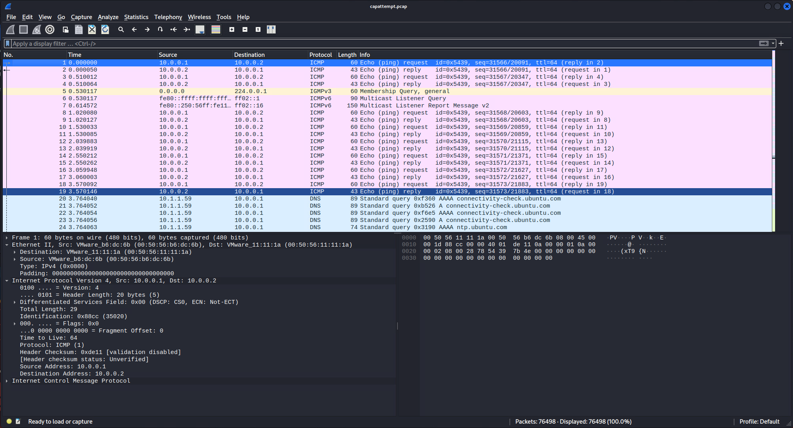

# Phishing Expedition

_Solution Guide_

## Overview

There are four possible variants for this challenge. This solution guide covers the walk-through for Variant 1, organized by submission question. The steps used to solve all variants will be similar, but the answers will vary. 

### Getting Started

1. Launch `kali-analyst`. 
2. On `kali-analyst`, on `c06-images`,  open **usermachine.dd** for Question 1 and Question 2. 
3. Open **capattempt.pcap** for Question 3.
4. Examine the webserver and exploit it using command injection.

This solution guide uses Autopsy and Wireshark to open and analyze the files, but other tools can be used to complete this challenge.

## Question 1

*What is the campaign id in the link for downloading the avcleaner software that was received via email on 04/19/2023? Note: the file name is in the link*

1. Run Autopsy from the command line ```autopsy``` (Autopsy Forensic Browser), then open browser and browse to: http://localhost:9999/autopsy.
2. Click **New Case** and complete: **Case Name**, **Description**, and **Investigator Names**.
3. Click **New Case**, then **Add Host**. In the Add a New Host screen, complete the fields (optional).
4. Click **Add Host** again, then click **Add Image File**.
   - **Location:** `/media/cdrom/usermachine.dd`
   - **Type:** Partition
   - **Import Method:** Symlink
5. Click **Next**, then **OK**.
6. Select **Calculate**, then click **Add**; all other values can use defaults.
7. Click **OK**, then **Analyze**. 
8. Select **File Analysis**. The file that contains the answer is located in `/home/user/.thunderbird/7x2sxnue.default-release/ImapMail/imap.gmail.com/INBOX-1`.
   
9. Select the file, **Export** the file, and search for "avcleaner" to find the email containing the answer. **Pay close attention to the date of the email that the question is asking about.** The answer here is **125**.
   

## Question 2

<!-- Add an example timestamp in addition to the format to make it explicitly clear -->

*According to the logs, what time was the avcleaner malware first executed?  (Answer is in MM/DD/YYYY H:MM:SS XM format)*

1. Search the file system for the avcleaner binary. It's located at `/home/user/Downloads`. There is a log file in the directory as well.

2. The value is base64 encoded; use CyberChef to decode it or use the command line: 
```bash
echo NC8yNS8yMDIzIDU6NDM6NTQgUE0= | base64 -d
```


The correct answer is **4/25/2023 5:43:54 PM**.

## Question 3

*What is the TCP stream number for transmitting sphericalpedestal.pdf from the user's machine to a remote server?*

1. On `kali-analyst`, on the CD-ROM drive, open **capattempt.pcap** in Wireshark.

2. From the **Edit** menu, select **Find Packet**. 
3. Set the search options to: **Packet bytes**, **String**, and search for filename **sphericalpedestal.pdf**.

4. Right-click the packet, select **Follow** > **TCP Stream**. The Stream number appears in the lower-right. The correct answer is **4**.


## Question 4

*Browse to the remote server that the files were exfiltrated to.  How many .pdf files are on the remote malware target server?*

We can see from the PCAP file that the files were uploaded to 10.7.7.125. Browsing to that IP shows a plain page. 


1. To find the hidden files, check the **robots.txt** file to see if there are any subdirectories the webmaster is hiding from scrapers. The following subdirectories are shown:

    
2. Check those directories. **10.7.7.125/Files** contains a list of files.
3. Count the files. An easy way to do this is to: **ctrl+f** and search for ".pdf". Then, select **Highlight All**.  You'll see five highlighted files. The correct answer is **5**.
    

## Question 5

*Enter the token from `challenge.us` that is provided once the files are deleted from the remote server.*

Note the url while browsing the **Files** subfolder; notice it's using the os command `cmd=ls` to display the files.  By manipulating this string, you can send commands to the server.

1. Try changing the url from `ls` to `rm` -- note that doesn't work.
2. You want to get the full path to the files, so change the `ls` to `pwd`.
  
3. Experiment with the `cmd=` and `args=` values. The entire file system is accessible.  
4. Use the `ls` command with the `args` of the path provided above to see the `ClientFiles` folder is a subfolder in `/var/www/MaliciousFilehost/`.
   
5. Remove the entire directory by changing the url to: `http://10.7.7.125/Files?cmd=rm&args=-R /var/www/MaliciousFileHost/ClientFiles&cid=1528482`.
6. Browse to `10.7.7.125/files` -- it's empty. 
7. Browse to `challenge.us` and select **Grade Challenge**. You will receive the token for Question 5.
